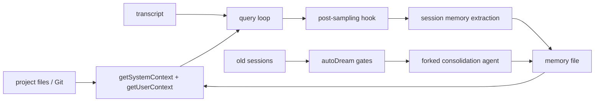

# Core Module: Context and Memory

## Role and Business Problem

Context/memory decides what durable project information enters a model turn and what can be deferred to a background consolidation. It separates current Git/project instructions from the mutable transcript, allowing prompt caching while still representing user/project state.

## Data Structures and Flow

`getSystemContext()` memoizes Git status and optional cache-breaking injection; `getUserContext()` loads CLAUDE.md files, caches the result for permission classifiers and adds the current date (`src/context.ts:22-34`, `116-189`). `AppStateStore` holds mutable session state used by tools, tasks and UI. Session memory registers a post-sampling hook and runs a restricted forked agent that can edit only the memory file (`src/services/SessionMemory/sessionMemory.ts:352-375`, `460-481`).

Git status is a snapshot and is skipped for remote mode or disabled Git instructions (`src/context.ts:36-110`, `123-148`). AutoDream uses enabled/time/session/lock gates, registers a dream task, runs a forked agent and rolls back the lock on failure (`src/services/autoDream/autoDream.ts:95-190`, `200-271`).

## Design Decisions and Trade-offs

1. **Memoized context.** Stable context improves prompt-cache reuse and avoids repeated filesystem/Git work. It can become stale within a session, so explicit cache clearing/invalidation is part of the contract.
2. **Restricted memory writer.** `createMemoryFileCanUseTool()` allows only exact-path file edits (`sessionMemory.ts:455-481`). This makes autonomous consolidation safer, but the policy is narrow and any needed memory format migration must fit that boundary.
3. **Background consolidation gates.** AutoDream avoids running on every turn by combining time, session count and lock state (`autoDream.ts:54-189`). The trade-off is eventual rather than immediate memory quality.

## Collaboration

Context feeds QueryEngine/query and permission classifiers; AppState connects context to UI/tools/tasks; memory uses the same forked-agent machinery as ordinary agents but narrows permissions. This reuse reduces new execution code while requiring strong capability boundaries.

## Coverage

| File | Lines | Read | Coverage |
|---|---:|---:|---:|
| `src/context.ts` | 189 | 189 | 100% |
| `src/state/AppStateStore.ts` | 569 | 569 | 100% |
| `src/services/SessionMemory/sessionMemory.ts` | 495 | 495 | 100% |
| `src/services/autoDream/autoDream.ts` | 324 | 324 | 100% |
| **Total** | **1,577** | **1,577** | **100% (core target 60%, pass)** |
