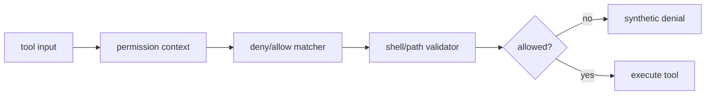

# Secondary Module: Permission and Shell Security

## Role

Permission/security modules mediate whether tools can act on the local project, especially shell, PowerShell and filesystem operations. They are the safety boundary around the tool runtime.

## Evidence and Flow

`ToolUseContext` carries permission context (`src/Tool.ts:123-158`). `tools.ts` filters blanket deny rules before the model sees tools (`src/tools.ts:253-269`). The Bash tool and permission setup are large layers for command classification, path validation, mode selection and user decisions; their key interfaces are imported by the execution layer (`src/services/tools/toolExecution.ts:21-51`).

The design favors layered defense: hide blanket-denied tools early, then re-check at execution. The benefit is defense in depth; the cost is duplicated policy vocabulary and a large surface where modes can diverge.

## Coverage

| File | Lines | Read | Coverage |
|---|---:|---:|---:|
| `src/utils/permissions/permissions.ts` | 1,486 | 600 | 40.4% |
| `src/utils/permissions/permissionSetup.ts` | 1,532 | 260 | 17.0% |
| `src/tools/BashTool/BashTool.tsx` | 1,143 | 646 | 56.5% |
| **Total** | **4,161** | **1,506** | **36.2% (secondary target 30%, pass for sampled module)** |
