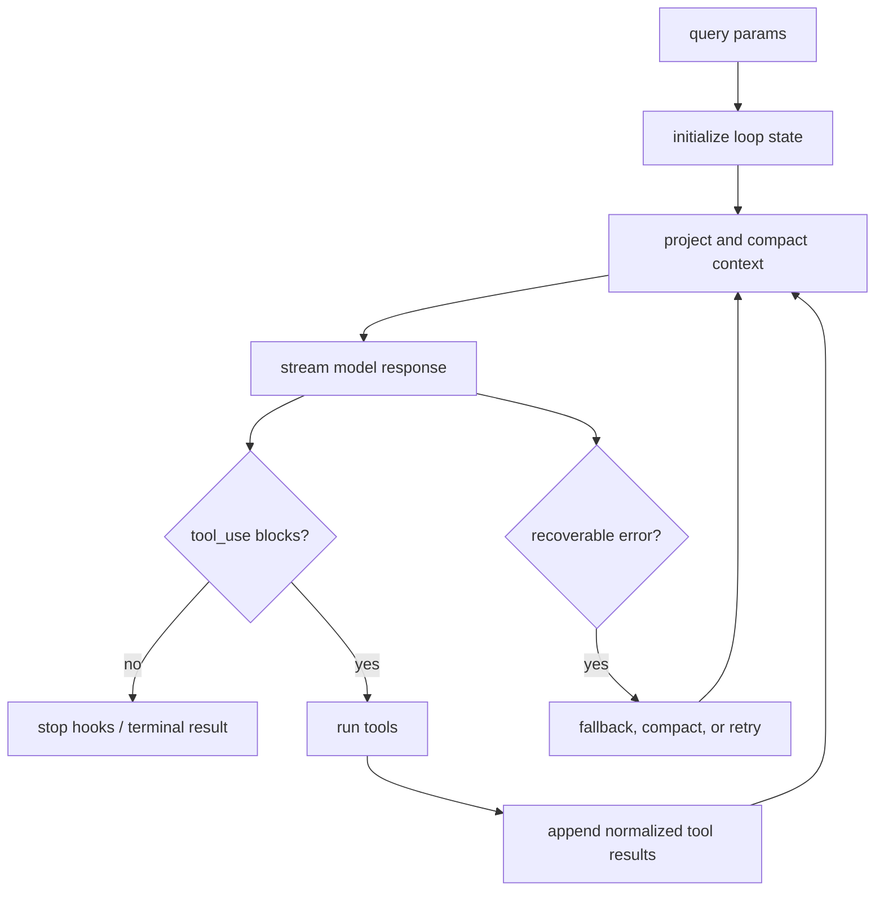

# Core Module: Query Loop

## Role and Business Problem

`query-loop` is the execution spine of one agent turn. It keeps the transcript coherent while the model may stream partial messages, request tools, hit context limits, compact history, or switch to a fallback model. Removing it would leave only a one-shot API client and would lose the state needed for multi-step coding work.

## Data Structures

`QueryParams` carries messages, system/user context, `canUseTool`, `ToolUseContext`, model fallback, query source, turn limits and task budget (`src/query.ts:181-199`). The private `State` carries mutable cross-iteration fields such as messages, compaction tracking, recovery counters, pending summaries, stop-hook state and transition reason (`src/query.ts:201-217`).

`QueryEngineConfig` and `QueryEngine` provide the higher-level prompt/tool configuration, while `ask()` is the public generator entry (`src/QueryEngine.ts:130-184`, `src/QueryEngine.ts:1186-1295`).

## Core Flow

The loop starts through `query()` and delegates to `queryLoop()` (`src/query.ts:219-251`). Before a request it applies result budgets, optional history snipping, microcompact, context collapse and autocompact (`src/query.ts:365-467`). It then builds an executor and selects the runtime model (`src/query.ts:551-580`). During streaming, tool-use blocks are accumulated and added to `StreamingToolExecutor`; recoverable errors are withheld so callers do not see an intermediate failure (`src/query.ts:788-845`).

## Design Decisions and Trade-offs

1. **Generator protocol instead of a single Promise.** Streaming events, assistant messages, tool results and tombstones can be yielded in order. A Promise would force buffering or invent a second event channel.
2. **Compaction is a projection/replacement step.** The code applies multiple context reducers before the API request and replaces the current request view with post-compact messages (`src/query.ts:428-535`). This protects the model window at the cost of a complicated recovery state machine.
3. **Withhold recoverable errors.** Prompt-too-long and max-output errors are withheld until collapse/compact/fallback succeeds (`src/query.ts:788-823`). This prevents SDK consumers from terminating early, but makes failure visibility dependent on the recovery path.

## Collaboration

The loop consumes `ToolUseContext`, `getTools`, MCP state and command/skill data; it produces normalized messages consumed by the UI, transcript persistence and subagents. The separation is consistent with an explicit-state philosophy: recovery state is represented in data rather than hidden in UI callbacks.

## Coverage

| File | Lines | Read | Coverage |
|---|---:|---:|---:|
| `src/query.ts` | 1,729 | 1,729 | 100% |
| `src/QueryEngine.ts` | 1,295 | 1,295 | 100% |
| **Total** | **3,024** | **3,024** | **100% (core target 60%, pass)** |
