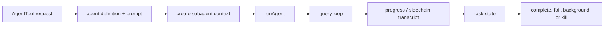

# Core Module: Task and Agent Runtime

## Role and Business Problem

Tasks and agents move long-running, recursive or background work out of the foreground query while keeping progress, output and cancellation visible. The shared task contract includes task type/status, output path, offsets and notification state (`src/Task.ts:44-76`). Removing this layer would make background work indistinguishable from an ordinary tool call.

## Data Structures and Flow

Task types distinguish local shell, local/remote agent, in-process teammate, workflow, monitor and dream work (`src/Task.ts:6-20`). IDs use a type prefix plus random base-36 suffix and task state starts in `pending` with a disk output path (`src/Task.ts:78-124`). `getAllTasks()` conditionally registers task implementations (`src/tasks.ts:17-38`).

`runAgent` resolves agent-specific tools, MCP servers, model and context, then invokes `query()` with a child context (`src/tools/AgentTool/runAgent.ts:648-756`). Local agent tasks register state with a child abort controller when a parent exists (`src/tasks/LocalAgentTask/LocalAgentTask.tsx:458-514`), and completion/failure transitions are guarded so terminal tasks are not overwritten (`src/tasks/LocalAgentTask/LocalAgentTask.tsx:410-455`).

## Design Decisions and Trade-offs

1. **Typed task kinds with shared lifecycle fields.** This supports one UI/task registry while allowing different implementations; the cost is many specialized state shapes outside the compact base type.
2. **Child cancellation and sidechain persistence.** Agents inherit cancellation but may write a sidechain transcript/metadata (`runAgent.ts:697-742`). This preserves resumability and parent control, but creates multiple message stores that require correlation IDs.
3. **Foreground/background phase change.** A foreground agent can be backgrounded by changing state and resolving a signal (`LocalAgentTask.tsx:521-651`). This lets the UI remain responsive, but the task must coordinate state, signal, cleanup and notification paths.

## Collaboration

The task runtime consumes `AppState` setters from the UI/session layer, invokes the query loop, and exposes progress to components/SDK consumers. Coordinator mode composes these tasks into multi-agent arrangements (`src/coordinator/coordinatorMode.ts:1-369`). The global pattern is explicit lifecycle state plus abort propagation.

## Coverage

| File | Lines | Read | Coverage |
|---|---:|---:|---:|
| `src/Task.ts` | 125 | 125 | 100% |
| `src/tasks.ts` | 39 | 39 | 100% |
| `src/coordinator/coordinatorMode.ts` | 369 | 369 | 100% |
| `src/tools/AgentTool/AgentTool.tsx` | 1,397 | 760 | 54% |
| `src/tools/AgentTool/runAgent.ts` | 973 | 760 | 78% |
| `src/tasks/LocalAgentTask/LocalAgentTask.tsx` | 682 | 682 | 100% |
| `src/utils/swarm/inProcessRunner.ts` | 1,552 | 300 | 19% |
| **Total** | **5,137** | **3,035** | **59.1% (core target 60%, partial fail)** |

The 0.9 percentage-point miss is real; the un-read swarm runner is the main reason. No extrapolation is made.
