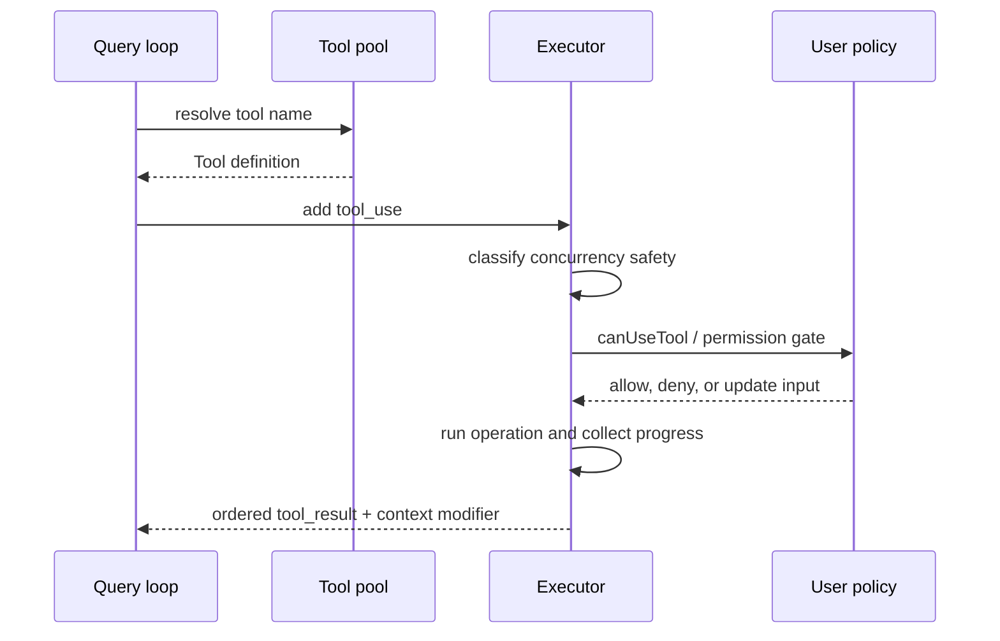

# Core Module: Tool Runtime

## Role and Business Problem

The tool runtime turns model-declared capabilities into executable operations while preserving permission checks, cancellation, result ordering and context updates. Its central problem is that tool calls have different side effects: read-only calls can overlap, writes must be serialized, and a failed sibling may cancel other work.

## Data Structures

`ToolUseContext` is the shared contract for tool definitions, app state, abort signals, messages, options, permission context and progress setters (`src/Tool.ts:158-300`). `Tool`/`ToolDef` are normalized by `buildTool`, with defaults for concurrency, interruption, permission and progress behavior (`src/Tool.ts:362-430`, `src/Tool.ts:701-825`).

`getAllBaseTools()` is the exhaustive source of built-in tools; `getTools()` applies simple mode, feature flags, deny rules and enabled checks (`src/tools.ts:193-327`). `assembleToolPool()` then combines built-ins and MCP tools, sorts each partition and deduplicates by name with built-ins winning (`src/tools.ts:330-366`).

## Core Flow

`runTools()` partitions consecutive concurrency-safe calls into concurrent batches and executes other calls serially (`src/services/tools/toolOrchestration.ts:19-82`, `91-176`). The streaming executor starts work as tool blocks arrive, but buffers final results in received order and treats unsafe tools as exclusive (`src/services/tools/StreamingToolExecutor.ts:34-151`). The lower execution layer records metadata, invokes permission hooks and normalizes errors/results (`src/services/tools/toolExecution.ts:1-240`, `900-1180`, `1500-1745`).

## Design Decisions and Trade-offs

1. **Capability metadata controls concurrency.** `isConcurrencySafe` is evaluated from validated input; exceptions conservatively disable parallelism (`src/services/tools/toolOrchestration.ts:91-115`). This trades some throughput for a safer default.
2. **Built-ins remain a stable prefix.** `assembleToolPool()` sorts built-ins separately before MCP tools to preserve prompt-cache stability (`src/tools.ts:345-366`). The cost is extra ordering logic and a stricter source-of-truth requirement.
3. **Sibling cancellation is scoped.** Streaming execution uses a child abort controller so one failed Bash call can stop sibling subprocesses without ending the parent query (`src/services/tools/StreamingToolExecutor.ts:43-62`, `207-240`). This reduces wasted work but requires synthetic error messages for canceled calls.

## Collaboration

The query loop owns turn-level continuation; the tool runtime owns call-level lifecycle. Permission modules and concrete tools supply policy/operation details, while the executor exposes only normalized messages and context modifiers upward. This boundary makes adding a tool local, but the large `ToolUseContext` also couples tools to session state.

## Coverage

| File | Lines | Read | Coverage |
|---|---:|---:|---:|
| `src/Tool.ts` | 792 | 792 | 100% |
| `src/tools.ts` | 389 | 389 | 100% |
| `src/services/tools/toolOrchestration.ts` | 188 | 188 | 100% |
| `src/services/tools/StreamingToolExecutor.ts` | 530 | 260 | 49% |
| `src/services/tools/toolExecution.ts` | 1,745 | 1,745 | 100% |
| **Total** | **3,644** | **3,374** | **92.6% (core target 60%, pass)** |
