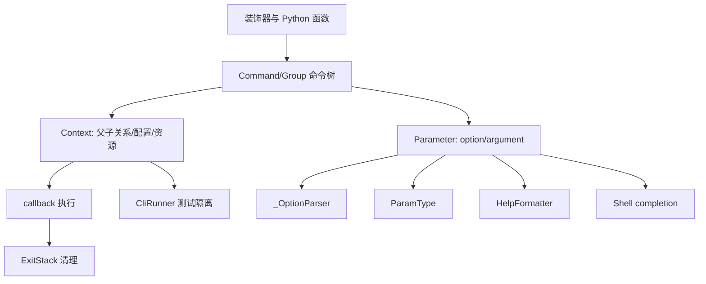

# Click：可组合命令行运行时的架构基线

## 1. 先给结论

Click 不是单纯的 argv parser，而是一个围绕 `Command`、`Parameter` 和 `Context` 构建的 CLI 运行时。它把函数声明成命令，把命令组织成树，把输入解析成类型化值，再把同一份元数据投影到 help、completion、错误处理和测试隔离。

最值得保留的设计是：显式命令树 + 父子 Context + 参数元数据复用。最明显的代价是 `core.py` 物理上很大，Context 状态面宽，且为了跨命令组合的一致性主动限制了部分定制能力。

## 2. 项目定位与问题

一个真实 CLI 往往不是“读取两个参数并调用函数”：它需要子命令、help、默认值、环境变量、prompt、文件类型、错误退出、shell completion、资源清理和可测试的输入输出。如果每个命令分别处理这些问题，组合后会出现参数归属、帮助格式和错误行为不一致。

Click 的定位是用简单声明 API 生成可组合 CLI。README 的公开 API 从 `click.command`、`click.option` 到 `click.echo`，入口模块把 Command、Group、Context、参数类型、异常、格式化、终端和测试能力聚合为顶层导出（`README.md:1-20`；`src/click/__init__.py:8-127`）。

官方文档把三项能力置于最前：任意嵌套命令、自动 help、运行时惰性加载子命令（https://click.palletsprojects.com/en/stable/，2026-07-12 读取）。

## 3. 设计主张与同类位置

Click 的 Why 文档明确表达了取舍：它自己实现解析器，不直接建立在 argparse 之上，因为需要嵌套命令、禁用参数交错和可预测的 POSIX 行为；它也限制 help 的任意定制，以保证多个 Click 实例组合后仍能正常工作（`docs/why.md:35-110`）。

| 方案 | 定位差异 |
|---|---|
| argparse | 标准库解析器；Click 认为其子命令嵌套和参数交错行为不适合作为 Click 的组合基础。 |
| optparse | Click 借鉴部分解析思想，但采用自己的 parser 和运行时模型。 |
| docopt | 从帮助文本推导规则，手写界面表达力强；Click 更强调命令对象、类型和分发元数据。 |
| Typer / Python Fire | 可作为现代类型注解驱动或自动暴露对象的对比对象；本次未固定其源码版本，内部实现差异待验证。 |

这里的对比是设计路线对比，不是功能数量排名。

## 4. 全景：一份元数据，多种表面能力

这个结构解释了 Click 的核心一致性：help 和 completion 不是重新猜测命令语法，而是读取命令和参数对象；测试 runner 也围绕同一 Context/Command 调用协议工作。

## 5. 主流程：从声明到 callback

装饰器在函数上累积参数，`command`/`group` 再创建命令对象（`src/click/decorators.py:144-378`）。`Command.main` 创建 Context，`make_context` 设置参数、环境变量前缀和解析开关（`src/click/core.py:1322-1460`）。

`Command.parse_args` 注册参数并调用 `_OptionParser`；Group 则在解析自身参数后通过 `resolve_command` 选择子命令、创建子 Context 并继续解析（`src/click/core.py:1220-1395`、`src/click/core.py:1978-2086`）。最终 `Context.invoke` 填充默认值、建立子上下文并调用 callback（`src/click/core.py:850-911`）。

这个流程的关键不是调用层数，而是参数归属和 Context 边界：组参数属于组，子命令参数属于子命令，顺序由命令树决定（`docs/commands-and-groups.md:162-204`）。

## 6. Context：运行时的深模块

Context 保存父节点、当前 Command、`params`、应用对象、默认映射、环境变量前缀、颜色/宽度配置、参数来源和 `ExitStack`（`src/click/core.py:208-514`）。`meta` 在嵌套上下文间共享，`obj` 允许应用传递业务对象；`find_object`/`ensure_object` 让子命令向父链查找共享对象（`src/click/core.py:607-632`、`src/click/core.py:733-759`）。

资源管理是 Context 的重要边界：`with_resource` 和 `call_on_close` 把文件、连接等生命周期注册到退出栈，Context 离开时统一清理（`src/click/core.py:648-712`）。这比在每个 callback 中手动清理更可靠，但也把正确性绑定到 Context 生命周期；脱离 Context 直接调用类型转换时，调用者必须承担清理责任。

## 7. 参数解析与类型系统

低层 parser 处理 token 语法：长短选项、值消费、参数顺序、未知选项和剩余参数（`src/click/parser.py:127-503`）。高层 Parameter 再处理来源优先级、默认、prompt、类型转换、callback 和错误上下文（`src/click/core.py:2470-2740`）。

`ParamType` 把转换、错误消息、metavar、环境变量拆分和 completion 统一成一个策略协议。内置类型覆盖字符串、Choice、日期、数值范围、布尔、UUID、文件、路径和 Tuple（`src/click/types.py:42-183`、`src/click/types.py:284-437`、`src/click/types.py:857-1248`）。`convert_type` 可从显式类型或默认值推断类型（`src/click/types.py:1249-1340`）。

参数来源顺序是 prompt、command line、environment、default map、default，并记录到 `ParameterSource`（`src/click/core.py:169-206`；`docs/commands-and-groups.md:370-405`）。这让程序能区分“用户明确输入了默认值”和“程序采用了默认值”，而不是只比较最终值。

## 8. Help、交互和平台体验

`HelpFormatter` 通过缩进上下文、可见字符宽度、定义列表和换行，统一生成 usage、options、commands 和 arguments（`src/click/formatting.py:31-320`；`src/click/core.py:1159-1319`）。它的限制是设计的一部分：开放所有格式细节会破坏多个命令组合后的可预测性。

`termui` 提供 prompt、confirm、pager、progressbar、style、编辑器和直接键盘输入；prompt 的输入会复用 Parameter 类型转换，隐藏输入还会遮蔽错误中的敏感值（`src/click/termui.py:132-243`）。`utils.echo` 和文件流工具将文本、二进制、ANSI 与 TTY 差异收敛到公共接口（`src/click/utils.py:245-424`）。非 TTY 的进度条只输出标签，避免 CI/管道中出现控制序列（`src/click/_termui_impl.py:241-380`）。

## 9. Completion 与测试

Shell completion 读取命令树和参数类型，`BashComplete`、`ZshComplete` 和 `FishComplete` 只处理协议差异（`src/click/shell_completion.py:216-468`）。`CompletionItem` 允许类型提供文件或目录候选；resilient parsing 防止补全过程触发正常副作用（`src/click/core.py:480-500`）。

`CliRunner` 用隔离的输入、输出、环境和临时文件系统调用命令，`Result` 保存输出、异常、退出码和返回值（`src/click/testing.py:231-316`、`src/click/testing.py:317-772`）。它适合验证 CLI 语义，但不等价于真实进程、真实 shell 或 Windows 控制台。

## 10. 评价、风险与重新设计建议

### 亮点

- Command、Parameter、Context 是跨运行、help、completion、测试的共享领域对象。
- 显式命令树让参数归属和嵌套关系可解释、可测试。
- 参数元数据一次声明，多处消费，降低各功能表面之间的漂移。
- 资源清理、错误上下文和终端降级不是应用脚本的重复劳动。

### 问题与代价

- `core.py` 同时承担多个关键职责，物理耦合使新贡献者需要较长的上下文加载过程。
- Context 的状态面宽，线程中只能谨慎读取，扩展作者容易越过生命周期边界。
- 受限的 help 定制和不做自动纠错提升兼容性，却牺牲了局部 UX 灵活性（`docs/why.md:84-110`）。
- 本地测试 runner 无法证明真实 shell、进程、pager 和 Windows 行为。

### 重新设计建议

保留公共 Command/Parameter/Context 模型，内部可拆分命令树、解析状态机、help 渲染和执行生命周期；同时稳定导出结构化命令树 schema，供 IDE、文档和 completion 使用。`Context.to_info_dict` 已体现这一方向，但其长期兼容性在本次 commit 中未找到明确承诺（`src/click/core.py:528-547`）。

## 11. 证据与边界

本报告只以固定 commit `b67832c2167e5b0ff6764a8c04a0a9087e697b5a` 的源码、项目文档和 Click 官方公开页面为依据。未使用 Git 历史推断实现。Windows、真实 Bash/Zsh/Fish、pager 和外部竞品实现级行为未在本次运行中验证，均已标记为限制或待验证。
