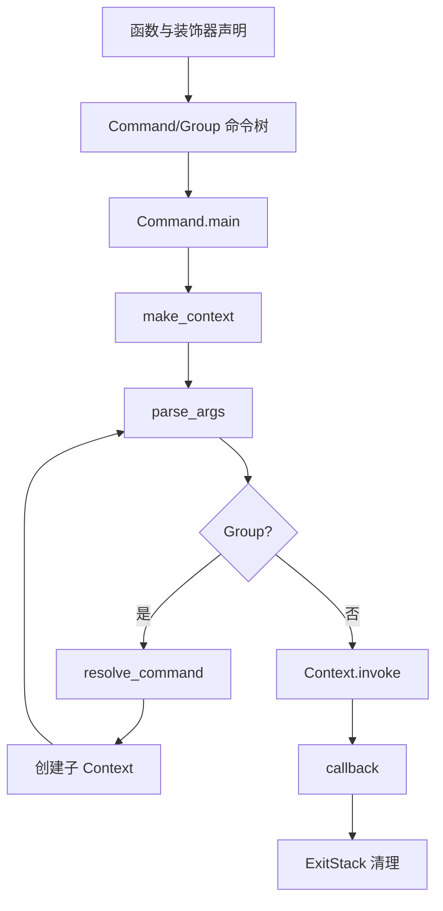

# 核心模块：命令模型与上下文执行

## 在项目中的角色

这是 Click 的骨架层。它把函数包装成 `Command`，把命令组织成 `Group` 树，并用 `Context` 表达一次调用的父子关系、运行选项、参数值和资源生命周期（`src/click/core.py:208-514`、`src/click/core.py:960-1060`）。去掉它，Click 只能是一个参数转换库，无法提供可组合 CLI。

## 解决的问题与设计思路

声明 API 的目标不是隐藏所有运行时，而是让常见 CLI 的结构可以用装饰器表达，同时保留可继承、可延迟注册和显式 `add_command` 的出口（`src/click/decorators.py:144-314`、`src/click/core.py:1775-1886`）。`Command` 保存 callback、参数和帮助元数据；`Group` 扩展它并维护命令映射；因此单命令和多命令应用共享同一调用协议。

相比“每个子命令自己解析 argv”，统一命令模型的代价是框架必须规定参数归属和执行顺序；收益是父组、子命令、help、completion 和测试可以共享相同元数据。文档明确规定组参数只属于组，子命令参数必须出现在子命令名之后（`docs/commands-and-groups.md:162-204`）。

## 核心数据结构

- `Context`：父 Context、当前 Command、`params`、`obj`、默认映射、环境变量前缀、解析开关、参数来源和 `ExitStack`（`src/click/core.py:208-514`）。
- `Command`：callback、name、params、help、`make_context`/`parse_args`/`invoke`/`main`（`src/click/core.py:960-1630`）。
- `Group`：命令注册表、命令查找、嵌套解析和链式调用（`src/click/core.py:1643-2180`）。
- 装饰器：在函数上累积参数，再生成 Command/Group，而不是把参数直接塞进 callback（`src/click/decorators.py:314-378`）。

## 核心流程

`Command.main` 创建最外层 Context 并把异常转换成 CLI 退出行为（`src/click/core.py:1459-1626`）；`Command.parse_args` 交给 option parser，再按参数声明处理结果（`src/click/core.py:1359-1395`）；`Group.parse_args` 和 `resolve_command` 把剩余 tokens 转为子命令和子 Context（`src/click/core.py:1978-2086`）；`Context.__exit__` 最终释放注册资源（`src/click/core.py:549-712`）。

## 模块间协作

该模块消费 `parser.py` 的低层解析结果和 `Parameter` 的值处理，同时调用 `formatting.py` 生成 help，并被 `shell_completion.py` 反向读取命令树。`Context.meta` 在嵌套上下文间共享，`obj` 则提供应用级对象传递；这种“框架保留结构、应用注入对象”的协作方式支持扩展而不要求全局单例（`src/click/core.py:607-632`、`docs/commands-and-groups.md:265-367`）。

## 关键设计决策与评价

1. **Context 作为运行时边界**：替代全局参数字典，支持嵌套命令和资源退出；代价是 Context 大且带有线程安全边界，文档明确只适合在线程中谨慎共享读取（`docs/commands-and-groups.md:327-367`）。
2. **Group 继承 Command**：单命令与复合命令共享 help、参数和 invoke；代价是 Group 的解析分支更复杂，链式模式和惰性加载需要额外约束（`src/click/core.py:1643-2180`）。
3. **显式注册而非自动扫描**：命令树可预测、导入副作用较少；代价是大型应用需要手动组织注册或实现惰性 `get_command`。

亮点是命令声明、执行、资源管理和文档元数据都围绕同一 Context/Command 模型展开。问题是 `core.py` 承担的职责很宽，解析、help、分发、兼容别名和生命周期聚集在一个大模块中，理解成本高；这不是推测，而是文件 3,723 行及多个子系统入口的直接结构证据。

## 覆盖率

| 文件 | 总行数 | 已读行数 | 覆盖率 | 未读原因 |
|---|---:|---:|---:|---|
| `src/click/core.py` | 3723 | 3723 | 100% | 无 |
| `src/click/decorators.py` | 627 | 627 | 100% | 无 |
| **合计** | **4350** | **4350** | **100%** | **达标 ✅** |
