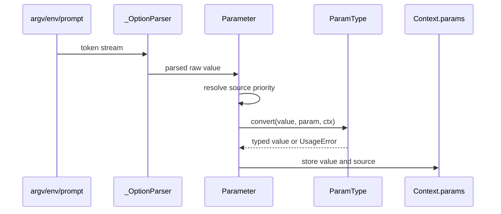

# 核心模块：参数解析与类型转换

## 在项目中的角色

该模块把 shell 提供的字符串序列变成 callback 能安全消费的 Python 值，并把同一份参数元数据提供给错误信息、help、环境变量和 completion。去掉它，命令模型只能接收未经约束的 argv。

## 设计思路

Click 把解析分成两层：`parser.py` 只处理选项/参数 token 的语法状态，`core.py` 中的 `Parameter` 再根据声明读取环境变量、默认值、prompt 并调用类型转换（`src/click/parser.py:127-503`、`src/click/core.py:2181-2823`）。这种分离避免 parser 了解每种业务类型，也让同一个 `ParamType` 能被 option、argument 和 prompt 复用。

`ParamType` 是策略对象：字符串、Choice、日期、数字范围、布尔、UUID、文件、路径和 Tuple 都实现自己的 `convert`，并可提供 metavar、错误、环境变量拆分和 shell completion 信息（`src/click/types.py:42-183`、`src/click/types.py:284-437`、`src/click/types.py:857-1174`）。类型推断集中在 `convert_type`，默认值也可参与推断（`src/click/types.py:1249-1340`）。

## 核心数据结构

- `_OptionParser`：选项、参数、剩余参数和解析状态；处理长短选项、组合短选项、值消费和未知选项策略（`src/click/parser.py:216-503`）。
- `Parameter`：名称、声明、类型、默认值、环境变量、callback、是否暴露值和参数来源（`src/click/core.py:2181-2823`）。
- `Option`/`Argument`：在共同 Parameter 合约上分别表达命名选项和位置参数（`src/click/core.py:2847-3723`）。
- `ParamType`：转换、错误、显示和 completion 的共享协议（`src/click/types.py:42-183`）。

## 核心流程

参数来源顺序由 `ParameterSource` 固化为 prompt、command line、environment、default map、default（`src/click/core.py:169-206`；`docs/commands-and-groups.md:370-405`）。`handle_parse_result`、`consume_value` 和 `process_value` 把来源、缺失值、转换和 callback 串起来（`src/click/core.py:2470-2740`）。

## 模块间协作

`Command.parse_args` 创建 `_OptionParser` 并将参数定义注册进去；parser 输出回到 Parameter；Parameter 的 `type_cast_value` 调用 types；`Command.invoke` 再将 `Context.params` 传给 callback（`src/click/core.py:1220-1395`）。`formatting.py` 从参数的 usage pieces 和 metavar 生成 help，`shell_completion.py` 调用 ParamType 的 completion；这是“声明一次，多处投影”的核心收益。

## 关键权衡

1. **自有 parser 而非直接包裹 argparse**：Click 获得禁用参数交错、嵌套和 resilient parsing；代价是维护一套复杂解析状态机，且与标准库行为不完全相同（`docs/why.md:35-82`）。
2. **类型作为对象而非散落转换函数**：统一错误、metavar、环境变量拆分和 completion；代价是类型协议面较大，扩展类型需要理解多个钩子。
3. **不做自动纠错**：避免未来新增选项改变旧脚本的含义；代价是用户少了模糊匹配便利，官方建议在更高层显式实现 alias（`docs/why.md:98-110`）。

亮点是从语法到业务值的边界清晰，且每个输入来源都能被记录。问题是 parser 和 Parameter 的行为组合很多，错误路径需要依赖 Context 才能得到完整信息；只读 parser 而不读 core/types 会严重误判其职责。

## 覆盖率

| 文件 | 总行数 | 已读行数 | 覆盖率 | 未读原因 |
|---|---:|---:|---:|---|
| `src/click/parser.py` | 533 | 533 | 100% | 无 |
| `src/click/types.py` | 1375 | 1375 | 100% | 无 |
| **合计** | **1908** | **1908** | **100%** | **达标 ✅** |
