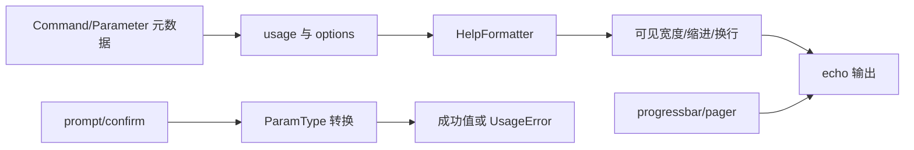

# 核心模块：终端交互与帮助输出

## 在项目中的角色

CLI 的可组合性最终必须被用户看见：帮助页要稳定可读，错误要统一，prompt/confirm 要可校验，输出要能处理 Unicode、ANSI、管道和 Windows。该模块把命令模型提供的元数据投影成终端体验。

## 设计思路

`HelpFormatter` 采用内存 buffer、缩进上下文、可见字符宽度测量和定义列表布局，Command 只负责提供 usage、options、arguments 和 epilog 内容（`src/click/formatting.py:110-320`；`src/click/core.py:1159-1319`）。这比让每个命令自行拼接文本更一致，但也意味着自定义帮助的自由度被框架收窄。

`termui.py` 将 prompt、confirm、pager、progressbar、style、edit、getchar 和 pause 集中为高层交互 API；`utils.py` 处理 `echo`、流、文件、程序名、配置目录和参数展开（`src/click/termui.py:132-929`、`src/click/utils.py:245-646`）。底层平台差异由 `_compat` 和 `_termui_impl` 接管。

## 核心流程

帮助流程从 `Command.get_help` 到 `format_help`、`format_options`，再由 Formatter 输出（`src/click/core.py:1227-1319`）；交互输入使用 `convert_type`，转换失败时原地提示并重试，隐藏输入还会遮蔽错误中的敏感值（`src/click/termui.py:132-243`）。

## 模块间协作

Formatter 依赖 `_compat.term_len` 和 parser 的选项拆分；termui 依赖 types、globals 的颜色默认值和 utils.echo；utils.echo 又根据当前 Context 推断颜色和输出流。因此它不是孤立的“UI 层”，而是把解析元数据、上下文配置和平台适配汇聚到用户界面。

## 关键权衡与评价

1. **统一格式而非完全可定制**：保证不同可组合命令的 help 具有相同布局、换行和宽度策略；代价是不能随意改变所有帮助结构。官方文档将该限制视为保持组合可靠性的主动选择（`docs/why.md:84-96`）。
2. **非 TTY 降级**：进度条在非终端环境只输出标签，避免管道和 CI 被控制字符污染（`src/click/termui.py:399-558`、`src/click/_termui_impl.py:241-380`）。这符合 CLI 同时服务人和脚本的边界。
3. **资源与输出分离**：文件类型注册 Context close callback，echo 处理文本/二进制流；便利性高，但调用者必须理解 Context 生命周期，否则直接使用类型转换可能缺少自动清理。

亮点是“可见输出”也遵循组合哲学：同一套 formatter 和 echo 被所有命令复用。问题是终端、文件、颜色、分页和平台适配横向耦合，阅读时需要同时跨越多个文件。

## 覆盖率

| 文件 | 总行数 | 已读行数 | 覆盖率 | 未读原因 |
|---|---:|---:|---:|---|
| `src/click/termui.py` | 960 | 960 | 100% | 无 |
| `src/click/formatting.py` | 320 | 320 | 100% | 无 |
| `src/click/utils.py` | 646 | 646 | 100% | 无 |
| **合计** | **1926** | **1926** | **100%** | **达标 ✅** |
