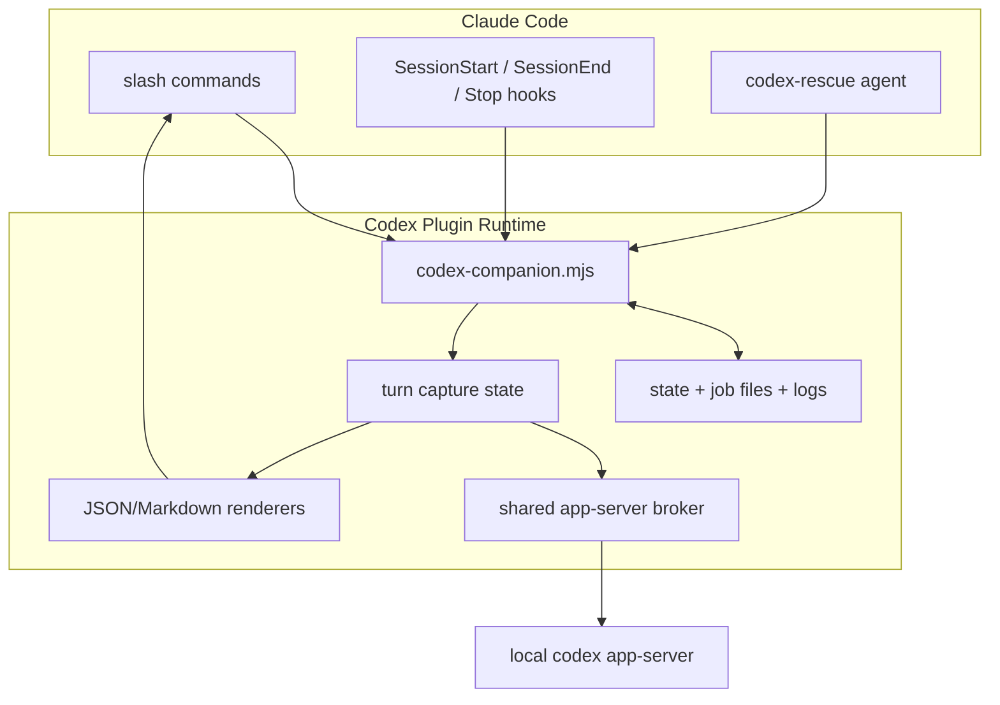
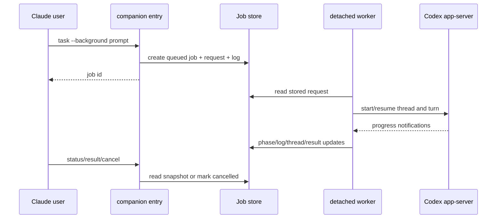
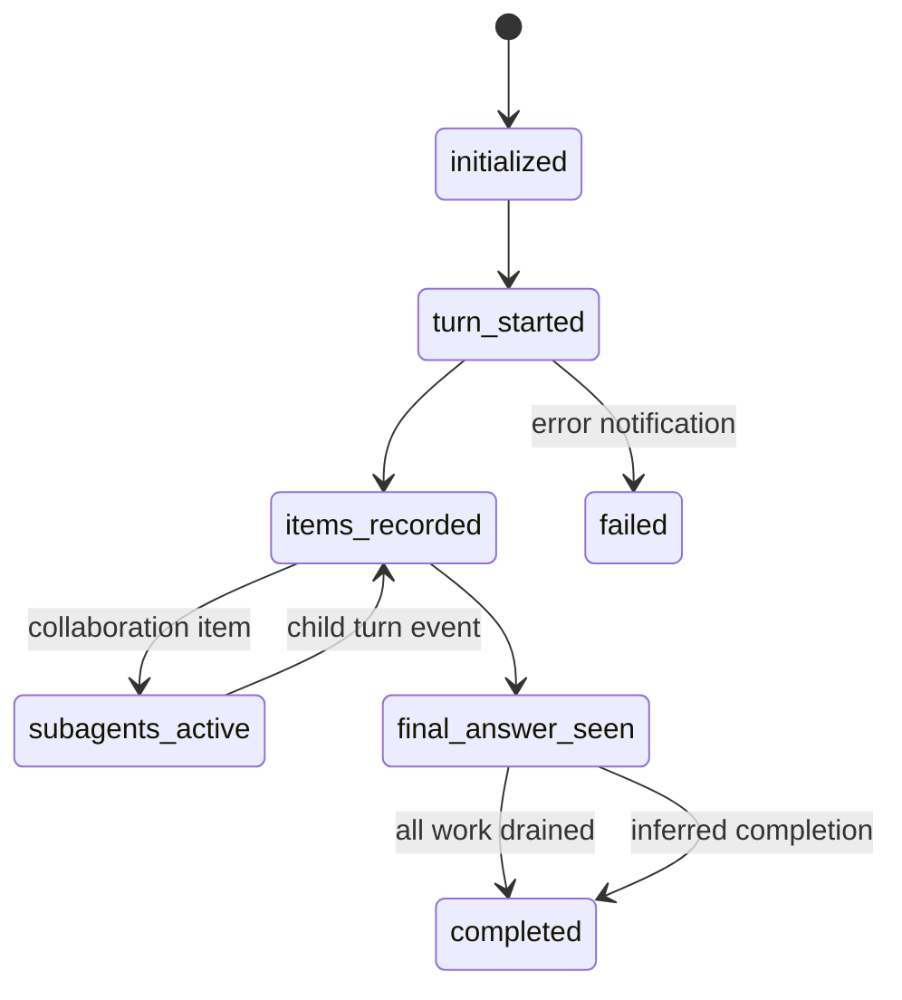
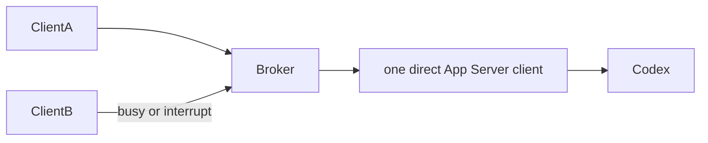
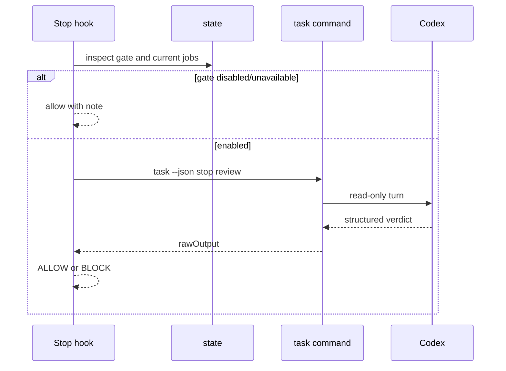

# codex-plugin-cc 架构基线报告

> 分析模式：standard  
> 源码 commit：`db52e28f4d9ded852ab3942cea316258ae4ef346`  
> 证据范围：固定 commit 源码、项目文档、记录的官方公开页面和本地测试结果  
> Git 历史：未使用

## 1. 先说结论

`codex-plugin-cc` 不是一个新的 Codex 执行引擎，而是一个把 Codex App Server 嵌入 Claude Code 工作流的适配层。它解决的核心问题是：用户已经在 Claude Code 中工作，但希望把 Codex 当作第二审查者、被委派执行者或可恢复的外部会话来使用。README 直接把定位写成“Use Codex from inside Claude Code for code reviews or to delegate tasks to Codex”（`README.md:1-6`）。

项目的核心架构可以概括为四层：

1. **Claude 插件协议层**：commands、agent、skills、hooks 和 schema，负责宿主发现与用户工作流。
2. **命令编排层**：`codex-companion.mjs`，负责参数、权限、Job 和命令生命周期。
3. **Codex 运行时层**：`codex.mjs`、`app-server.mjs` 和 Broker，负责 thread/turn、通知、review、task、resume、transfer。
4. **可恢复状态层**：state、Job 文件、日志和 session 过滤，负责后台任务的 status/result/cancel。

最值得参考的设计不是某个单独的命令，而是把跨 agent 调用建模成“可追踪 Job + 可复用 runtime + Claude 生命周期 hook”。最大的演进风险是 Job 索引和详情双写、以及把过多业务编排集中在 1,073 行的单一入口文件中。

## 2. 项目问题与定位

### 2.1 使用场景

- 用户在 Claude Code 中审查当前工作树，希望获得 Codex 的只读 review（`README.md:75-99`）。
- 用户希望用 adversarial review 挑战现有实现，而不是只寻找普通缺陷（`README.md:101-124`）。
- 任务耗时较长，需要后台运行后用 status/result 查询，必要时 cancel（`README.md:180-218`）。
- 用户希望把任务交给 Codex，或将 Claude session 导入 Codex 继续（`README.md:126-178`、`288-292`）。

这些场景共同要求：命令立即返回、任务不丢失、输出可恢复、取消可见、运行时能够跨命令复用。

### 2.2 为什么不是直接调用 CLI

README 明确说明插件复用本机 Codex CLI、认证状态、仓库 checkout 和环境（`README.md:302-310`）。实现也没有重新实现模型调用，而是连接 `codex app-server`：direct client 负责 spawn，Broker client 负责共享 socket/pipe（`plugins/codex/scripts/lib/app-server.mjs:183-353`）。

直接启动一次 CLI 更简单，但无法自然承载持久 thread、subagent 通知、后台任务和跨 Claude session 的 resume。当前方案把复杂度从“调用命令”转移到事件状态机和 Job 生命周期，这正是该插件的产品价值。

## 3. 全景架构

命令和 hooks 都进入同一入口，但不是所有场景都经过同一路径：普通 review 使用 native `review/start`，adversarial review 使用带 schema 的 `turn/start`；task 根据 `--write` 选择 read-only 或 workspace-write（`codex-companion.mjs:358-520`、`codex.mjs:1002-1159`）。

## 4. 一次后台任务如何完成

后台路径由 `enqueueBackgroundTask` 创建 detached `task-worker`，Job 中保存 request（`codex-companion.mjs:671-709`）。worker 再通过 `runTrackedJob` 执行同一个 `executeTaskRun`，因此前台和后台共享业务行为（`838-881`）。

## 5. 核心模块分析

### 5.1 命令与任务编排

入口统一解析模型、reasoning effort、cwd 和 raw argument，并将 `review`/`adversarial-review` 共用 handler，将 `task` 分为 foreground/background（`codex-companion.mjs:103-157`、`712-823`）。

它选择“统一编排而不是每命令独立脚本”，因为 setup、Job、日志、render 和 cancel 需要一致语义。替代方案是把每个 command 写成独立 Node 入口，短期更直观，长期会产生多个 Job 协议和错误格式。代价是当前入口很大，未来新增能力会继续加重 `codex-companion.mjs`。

关键边界是 `write`：它从命令选项变成 App Server 的 sandbox 选择，而不是混入 prompt（`codex-companion.mjs:762-787`、`codex.mjs:485-495`）。`--resume`/`--fresh` 也作为路由控制处理，不泄漏给 Codex prompt。

### 5.2 App Server 会话运行时

`app-server.mjs` 的基类将 JSON-RPC request id 绑定到 pending Promise，逐行解析 JSONL，并区分 response、notification 和 server request（`app-server.mjs:57-181`）。`codex.mjs` 的 `TurnCaptureState` 进一步跟踪 root thread、子 thread、turn、collaboration、最终答复、reasoning、文件变更和命令执行（`codex.mjs:302-336`）。

这不是简单等待最终字符串：通知可能先于 turn response 到达，因此先缓存，再按 turn id 回放（`codex.mjs:559-610`）；主线程给出 final answer 后仍可能有 subagent，因此要等待协作状态排空，或经过 250ms 推断完成（`373-394`）。这是 App Server 长连接的必要复杂度，也是本项目最有技术价值的部分。

### 5.3 共享 Broker

Broker 使用临时目录生成 Unix socket 或 Windows named pipe，并保存 endpoint、pid、log 和 session metadata（`broker-endpoint.mjs:10-40`、`broker-lifecycle.mjs:131-170`）。服务器将一个请求流绑定到 active socket，其他请求得到 `-32001` busy；interrupt 在特定条件下可从另一个 socket 进入（`app-server-broker.mjs:170-221`）。

这里选择显式 busy，而不是在 Broker 内无界排队。显式 busy 让调用方知道共享 runtime 正在被占用，并允许 `withAppServer` 在 busy、ENOENT、ECONNREFUSED 时回退到 direct（`codex.mjs:613-641`）。代价是并发时可能启动额外 app-server，牺牲复用换可用性。

### 5.4 Job 状态与后台生命周期

state 目录按 workspace 根目录的 basename + SHA-256 片段隔离，默认使用临时目录，也可使用 `CLAUDE_PLUGIN_DATA`（`state.mjs:29-44`）。状态保留最多 50 个 jobs，并在 prune 时删除旧的详情文件和日志（`state.mjs:80-115`）。

`job-control.mjs` 不是简单的 JSON 读取器：它根据 progress 日志推断 phase，区分 running/latestFinished/recent，并默认按当前 Claude session 过滤（`job-control.mjs:161-239`）。这使 `/codex:status` 适合当前交互，同时显式 job id 仍可定位其他 session 的 active job（`281-308`）。

主要问题是 state index 和单 Job detail 分开写，没有原子事务。当前代码和测试没有证明会发生损坏，所以这是可复现设计边界而非已确认 bug；未来可加恢复扫描或原子替换。

### 5.5 Claude 生命周期与 Stop gate

Hook manifest 注册 SessionStart、SessionEnd、Stop（`hooks.json:1-38`）。SessionStart 将 Claude session 信息放入环境，SessionEnd 清理该 session 的 Job；Stop gate 只有在配置打开时才执行。

默认 gate 为 false（`state.mjs:19-26`），README 明确警告启用后可能造成长循环和 usage 消耗（`README.md:220-237`）。这是“默认不增加交互成本，启用后提高质量门槛”的合理权衡。格式异常、超时和 Codex 不可用都有显式错误提示，不会伪装成成功（`stop-review-gate-hook.mjs:69-137`）。

## 6. 支撑模块

- `lib/git.mjs` 将 working tree、branch 和 untracked 文件转换成 review context，并对大 diff 使用轻量上下文，避免无界 prompt（`git.mjs:135-347`）。
- `lib/render.mjs` 校验结构化 finding、按 severity 排序，并同时支持 JSON 和 Markdown 输出（`render.mjs:24-465`）。
- `lib/args.mjs` 支持短别名、布尔/值选项、引号和 `--` passthrough（`args.mjs:1-127`）。
- `lib/process.mjs` 统一 binary 探测、命令失败和跨平台进程树终止（`process.mjs:4-135`）。
- `commands/*.md`、`agents/codex-rescue.md`、skills 和 schema 将宿主权限、调用方式和输出契约声明在配置层，而不是散落在运行时。

## 7. 评价与启发

### 亮点

1. **跨 agent 边界清楚**：Claude 是宿主，Codex 是执行/审查 runtime，插件处理协议适配和可恢复性。
2. **异步事件被显式建模**：子 agent、reasoning、file change、command execution 和 final answer 都有独立状态，不只依赖 stdout。
3. **可用性有兜底**：共享 Broker 优先，但 busy/连接失败可以 direct fallback；默认 gate 关闭，避免普通用户被长审查阻塞。
4. **测试覆盖真实工作流**：91 个测试覆盖 setup、review、task、resume、background、cancel、hooks 和 Broker，而不是只测纯函数。

### 问题与重新设计建议

1. 将 Job index/detail 写入抽象为可恢复的 `JobStore`，增加启动扫描和原子写，降低崩溃窗口。
2. 将 `codex-companion.mjs` 拆成 command family handlers，但保持现有 CLI 和 JSON payload 不变。
3. 为 Stop gate 输出协议增加版本或 schema 兼容层，减少 Codex 输出格式演进造成的人工 bypass。
4. 保持 `CodexTransport` 抽象，将 direct/Broker 选择隐藏在 transport 内，进一步减少业务模块对连接策略的感知。

## 8. 验证结果与限制

- `npm test`：91 通过，0 失败，0 取消。
- `codex-companion.mjs --help`：正常输出全部命令。
- `setup --json`：当前环境检测到 Node 24.18.0、npm 11.16.0、Codex CLI 0.144.1 和已登录 app-server，但这是本机环境事实，不是项目所有用户的保证。
- 代码覆盖率、质量检查、执行日志和外部资料边界分别见 `drafts/08-coverage.md`、`checks.md`、`execution-log.md`、`drafts/03-research.md`。
- 参考 skill 要求并行 Agent，但当前 runtime 没有 Agent 工具；本基线采用单执行者完整读取和交叉验证，已在检查表中标记该项未通过。
- 未运行真实 review/task/transfer，避免创建外部 Codex 会话或修改用户环境；相关行为由项目自带 fake Codex fixture 的测试覆盖。
