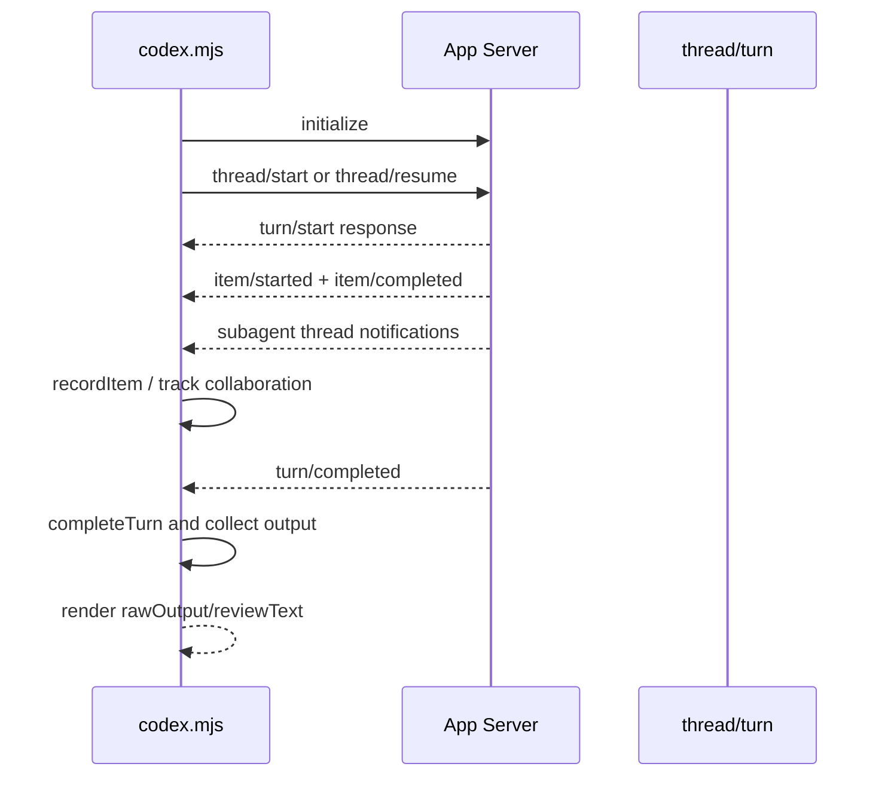

# 核心模块：Codex App Server 会话运行时

## 在项目中的角色

该模块把插件的业务命令变成 Codex 的 thread/turn，并将异步通知收敛为可渲染的最终结果。`app-server.mjs` 提供 JSON-RPC 客户端，`codex.mjs` 提供 review/task/transfer 的业务适配；两层分开使上层不需要知道 stdin/stdout、socket 和 pending request 的细节（`lib/app-server.mjs:57-181`、`lib/codex.mjs:1002-1219`）。

## 设计思路

客户端基类用 `pending: Map` 将 request id 与 Promise 绑定，逐行解析 JSONL，并区分 response、notification 和 server request（`app-server.mjs:86-160`）。直接子进程实现通过 `codex app-server` 启动并发送 initialize/initialized；Broker 客户端使用 Unix socket 或 Windows pipe（`183-353`）。选择 JSON-RPC 长连接而不是每次启动一次 CLI，核心收益是保留 thread、子 agent 和增量通知；代价是必须管理关闭、异常、未完成 pending 请求和通知归属。

## Turn 捕获状态机

`createTurnCaptureState` 保存 root thread、相关 thread 集合、thread/turn 映射、pending collaborations、active subagent turns、finalAnswerSeen、reviewText、reasoning、fileChanges 和 commandExecutions（`codex.mjs:302-336`）。`captureTurn` 在请求发出前挂通知处理器，先缓存没有 turnId 的通知，收到 response 后回放，再按 `belongsToTurn` 过滤跨 thread 事件（`559-610`）。

一个重要选择是“主 turn 完成”与“子 agent 工作排空”分离：如果主线程已给出 final answer，且仍有 collaboration/active subagent，`scheduleInferredCompletion` 等待它们排空后再推断完成（`346-394`、`541-553`）。这避免过早返回，但也依赖通知顺序和 250ms 推断窗口；当前测试验证了主 turn 缺少 completed event 时仍可结束，但协议异常边界仍有待长期验证。

## Review、Task 与 Transfer

- Review 先启动 ephemeral thread，再调用 `review/start`，可返回 review thread id，并保留 reviewText/reasoning（`1002-1055`）。
- Task 既支持新 thread 也支持 persisted thread resume；写任务使用 `workspace-write`，默认使用 `read-only`（`1095-1159`）。这是权限边界的关键：`--write` 不是 prompt 文本，而是传给 App Server 的 sandbox 选择。
- Transfer 使用 migration payload 导入 Claude session，并用 source 内容 SHA-256 在 Codex ledger 中查找 imported thread（`653-730`、`1058-1092`）。内容 hash 防止同一路径但内容改变时误复用旧 thread，代价是依赖 Codex 外部 ledger 的可见性。

## 失败恢复与评价

`withAppServer` 在 Broker busy、ENOENT 或 ECONNREFUSED 等条件下关闭当前 client 并回退到 direct client（`613-651`）。这是“共享运行时优先、直接运行兜底”的明确策略，保留了单命令可用性；但只有少数错误触发回退，其他协议错误会直接向上抛出，符合不掩盖真实失败的原则。

亮点是把异步事件流建模成显式状态，而不是只等待一个 final string。主要风险是协议类型来自 `.d.ts` 与运行时通知联合推断，`tsconfig` 将 `strict` 关闭（`tsconfig.app-server.json:1-22`），因此部分消息形状只能依赖测试和运行时保护。

## 覆盖率

| 文件 | 总行数 | 已读行数 | 覆盖率 | 未读原因 |
|---|---:|---:|---:|---|
| `plugins/codex/scripts/lib/codex.mjs` | 1219 | 1219 | 100% | 无 |
| `plugins/codex/scripts/lib/app-server.mjs` | 354 | 354 | 100% | 无 |
| `plugins/codex/scripts/lib/app-server-protocol.d.ts` | 75 | 75 | 100% | 类型契约，非运行时代码 |
| **合计（核心模块）** | **1648** | **1648** | **100%** | **达标 ✅** |
