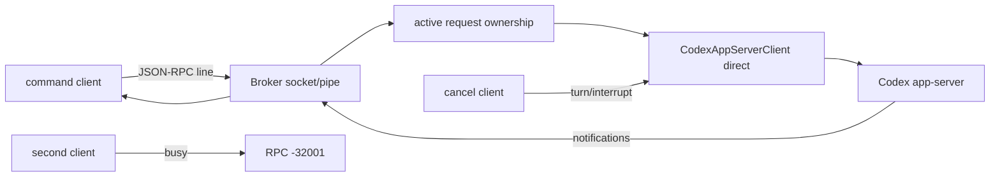

# 核心模块：共享 App Server Broker

## 在项目中的角色

Broker 让多个命令复用一个本地 Codex app-server，避免每次 review/task 都创建独立进程。`ensureBrokerSession` 负责发现、启动、等待、保存和清理 Broker；`CodexAppServerClient.connect` 决定连接已有 Broker、创建 Broker，或直接 spawn（`lib/broker-lifecycle.mjs:113-170`、`lib/app-server.mjs:335-353`）。

## 设计与边界

Broker 使用临时 session dir 保存 endpoint、pid、log 和 `broker.json`；非 Windows 使用 Unix socket，Windows 使用命名 pipe（`lib/broker-endpoint.mjs:4-40`）。这种选择不依赖固定端口，减少本机多项目冲突，也把生命周期文件集中到临时目录。代价是跨进程清理复杂，旧状态、残留 socket 和僵尸进程必须被 `ensureBrokerSession` 和 `teardownBrokerSession` 处理。

Broker 主循环为每个 socket 解析换行 JSON，initialize/initialized 是握手特例，`broker/shutdown` 触发清理；请求按 `activeRequestSocket` 和 `activeStreamSocket` 进行所有权控制（`app-server-broker.mjs:118-234`）。流式请求结束后按 thread id 清除所有权（`84-100`）。普通并发请求得到 `Shared Codex broker is busy`，但来自另一个 socket 的 interrupt 在没有 active request 时被允许（`170-195`）。

## 设计决策与评价

这里选择“单活跃流 + 显式 busy”而不是把所有请求排队。排队能提高吞吐，但会隐藏用户对同一 Codex runtime 的竞争和取消语义；busy 错误让上层 `withAppServer` 能快速回退 direct，减少等待。代价是并发 task 可能启动额外 app-server，牺牲一部分复用换取可用性。

亮点是通知路由与请求所有权都在 Broker 内集中处理，客户端无需知道其他客户端；问题是跨进程状态依靠文件和 socket readiness，启动竞争仍主要靠测试覆盖而非显式锁。当前 91 个测试包含共享 Broker、多 subagent、取消和懒启动场景，但不能证明所有 OS 文件系统行为。

## 覆盖率

| 文件 | 总行数 | 已读行数 | 覆盖率 | 未读原因 |
|---|---:|---:|---:|---|
| `plugins/codex/scripts/app-server-broker.mjs` | 252 | 252 | 100% | 无 |
| `plugins/codex/scripts/lib/broker-lifecycle.mjs` | 209 | 209 | 100% | 无 |
| `plugins/codex/scripts/lib/broker-endpoint.mjs` | 41 | 41 | 100% | 无 |
| **合计（核心模块）** | **502** | **502** | **100%** | **达标 ✅** |
