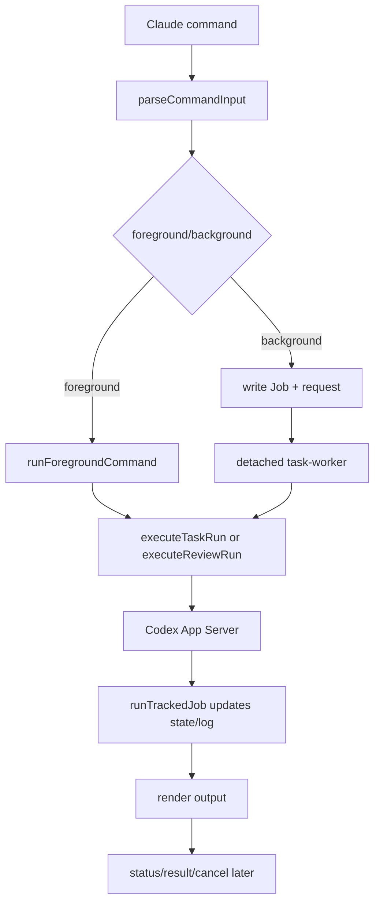

# 核心模块：命令与任务编排

## 在项目中的角色

`codex-companion.mjs` 是插件的业务编排入口。它把 Claude command 文档中的稳定命令映射到统一 runtime，并把用户可见输出、Job 记录和后台 worker 连接起来（`plugins/codex/scripts/codex-companion.mjs:75-87`、`1024-1073`）。去掉它，commands 只能分别调用底层脚本，无法共享 setup、review、task、status、result 和 cancel 的状态契约。

整体设计哲学是“宿主交互薄、运行时复用强”：命令入口负责解析和编排，Codex 运行时负责会话，state/tracked-jobs 负责可恢复性。

## 解决的问题与设计

入口先规范化 argv、模型别名、reasoning effort 和 cwd（`codex-companion.mjs:103-157`），再按子命令分派。`review` 与 `adversarial-review` 共用 `handleReviewCommand`，但前者转到 native review，后者将上下文插入 prompt 并要求结构化 JSON（`358-458`）。这避免复制 Job 和进度处理，但保留了“普通 review 不接受 focus text”的产品边界（`271-284`）。

`task` 分为前台和后台两条路径：前台用 `runForegroundCommand` 直接执行并输出；后台先创建 Job，写入 request，再 detached spawn `task-worker`（`658-709`、`762-823`）。这里选择持久 request + worker，而不是让 Claude 进程持有 Promise，原因是 Claude 交互必须能立即返回，同时 `status/result/cancel` 可以在之后独立访问。代价是需要处理进程退出、状态落盘和 worker 找不到 Job 的失败路径（`838-881`）。

## 核心数据与流程

Job 的最小语义由 `createCompanionJob` 组装：id、kind、title、workspaceRoot、jobClass、summary 和 write 标记（`567-601`）。task request 明确把 cwd/model/effort/prompt/write/resumeLast/jobId 传递给 worker（`604-613`），从而把用户参数和运行时参数分开。

一次后台任务的写入顺序是“创建日志 -> append queued -> spawn worker -> 写 Job file -> upsert state”（`684-709`）。这个顺序让 status 尽早看到 queued 状态，但 spawn 成功和状态落盘之间存在极短窗口；若进程立刻失败，日志和 Job file 仍提供诊断材料。

## 模块协作与权衡

- `lib/codex.mjs` 提供真正的 Codex turn/review，入口只消费结果和进度；边界清晰，便于替换 transport。
- `lib/tracked-jobs.mjs` 将 runner 包装成统一生命周期，使 review 和 task 共享日志和错误处理。
- `lib/job-control.mjs` 通过 Job id 前缀匹配、session 过滤和状态分类向 status/result/cancel 提供读模型。

如果每个命令直接调用 `codex app-server`，短期代码更少，但后台任务、session 隔离和取消会分散在多个脚本，演进时容易出现语义漂移。当前抽象的风险是主入口仍很大（1,073 行）：新增命令会继续扩大编排文件，未来可按领域拆成 command handlers，但目前共享的错误和 Job 语义使集中入口仍然可解释。

## 亮点与问题

亮点是 `task --resume`/`--fresh` 被当作路由控制而不泄漏进用户 prompt（`762-787`），并且后台 worker 复用同一条 execute 路径，减少前后台行为差异。问题是命令层、Job 建模和渲染仍由一个文件同时协调，边界靠函数约定而非独立类型；从当前 commit 无法证明这会在未来造成故障，标记为演进风险而非已发生缺陷。

## 覆盖率

| 文件 | 总行数 | 已读行数 | 覆盖率 | 未读原因 |
|---|---:|---:|---:|---|
| `plugins/codex/scripts/codex-companion.mjs` | 1073 | 1073 | 100% | 无 |
| **合计（核心模块）** | **1073** | **1073** | **100%** | **达标 ✅** |
