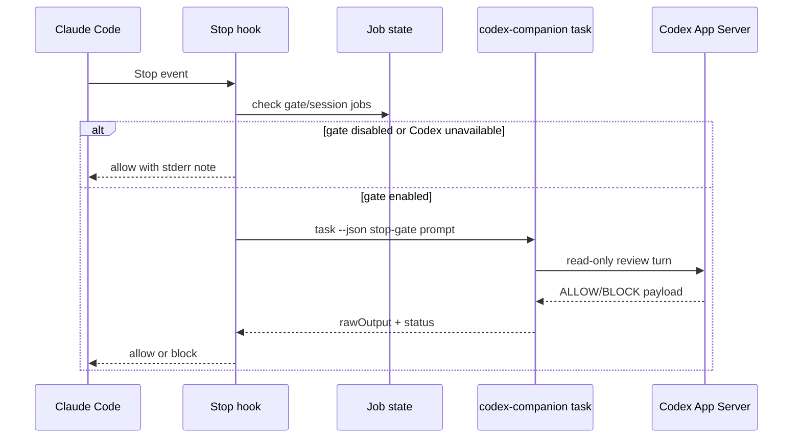

# 核心模块：Claude 生命周期与 Stop review gate

## 在项目中的角色

Hooks 把插件从“被命令调用的工具”提升为 Claude 会话生命周期的一部分。`hooks.json` 注册 SessionStart、SessionEnd 和 Stop 三类事件（`plugins/codex/hooks/hooks.json:1-38`）；SessionStart 注入 session id、transcript path 和 plugin data 相关环境，SessionEnd 清理该 session 的 jobs（`session-lifecycle-hook.mjs:42-129`）。

## Stop gate 流程

Stop hook 读取 Claude hook 输入，先判断插件配置和当前 session 是否已有运行任务，再调用 `codex-companion.mjs task --json` 执行 stop-time review（`stop-review-gate-hook.mjs:40-132`）。输出解析要求第一行符合 `ALLOW:` 或 `BLOCK:` 语义；无输出、超时、无效 JSON 和失败都有可操作提示（`69-137`）。

## 设计权衡

这是“默认关闭、显式启用”的安全门：state 默认 `stopReviewGate: false`（`lib/state.mjs:19-26`），setup 才能打开（`codex-companion.mjs:215-238`）。默认关闭避免每次停止都启动长任务；开启后可把 review 作为提交前质量门。README 警告它可能形成长循环并消耗 usage limits（`README.md:220-237`），这是对成本和交互风险的诚实边界。

SessionEnd 会清理当前 session 的 jobs，但不会把全部 workspace jobs 删除；结合 job-control 的 session 过滤，设计意图是生命周期清理与跨 session 追踪之间取平衡。当前测试覆盖 session end、gate disabled、Codex unavailable、clean review 和 findings block。

## 问题

Stop gate 将“审查失败/格式异常”转成阻止或提示，这是合理的 fail-visible 策略；但它依赖 prompt 中的输出格式和 JSON payload。若 Codex 返回语义正确但格式偏离，用户会得到 bypass/manual review 提示而非自动恢复。这个边界由当前代码明确处理，但未在源码中找到更高层的配置文档或可插拔判定协议。

## 覆盖率

| 文件 | 总行数 | 已读行数 | 覆盖率 | 未读原因 |
|---|---:|---:|---:|---|
| `plugins/codex/hooks/hooks.json` | 38 | 38 | 100% | 无 |
| `plugins/codex/scripts/session-lifecycle-hook.mjs` | 133 | 133 | 100% | 无 |
| `plugins/codex/scripts/stop-review-gate-hook.mjs` | 184 | 184 | 100% | 无 |
| **合计（核心模块）** | **355** | **355** | **100%** | **达标 ✅** |
