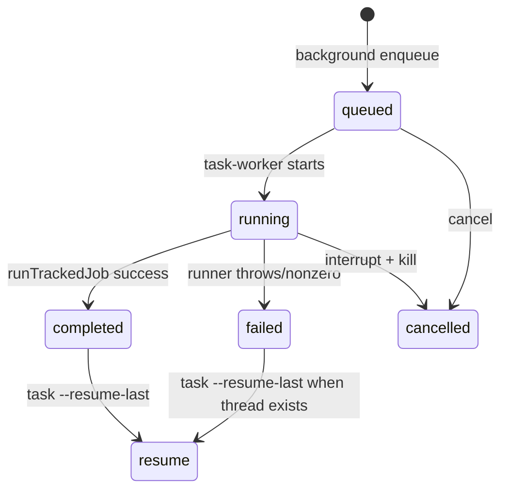

# 核心模块：Job 状态、日志与后台生命周期

## 在项目中的角色

Job 层把一次短命令变成可查询、可恢复、可取消的工作单元。`state.mjs` 持久化 per-workspace state 和 Job 文件，`tracked-jobs.mjs` 记录进度与完成状态，`job-control.mjs` 为 status/result/cancel 构造读模型。

## 状态设计

状态目录使用 workspace basename 加真实路径 SHA-256 前缀，默认落在临时目录，也可由 `CLAUDE_PLUGIN_DATA` 指定（`lib/state.mjs:29-44`）。这种命名避免同名目录冲突，也不把任务数据写回仓库。state 有版本、stopReviewGate 配置和最多 50 个 jobs；保存时会 prune 老 Job，并删除被淘汰的 job JSON 和 log（`58-115`）。

每个 Job 同时有 state 摘要和详细 job file。前者便于快速列举，后者承载 request、threadId、turnId 和最终 payload。这是“索引 + 详情”的实用分层，但两次写入不是事务性的；在进程崩溃窗口中可能出现索引和详情短暂不一致。

`runTrackedJob` 统一设置 started/running/completed 或 failed，进度 reporter 同时写 stderr、日志和 state patch（`lib/tracked-jobs.mjs:117-206`）。`job-control.mjs` 通过当前 Claude session 过滤默认 status/result，显式 job id 仍可跨 session 取消；这种默认隔离降低误操作风险，而显式 id 保留运维能力（`job-control.mjs:15-25`、`281-308`）。

## 为什么这样设计

相比只把结果写入 stdout，持久化 Job 支持后台工作、`status --wait`、prefix id、最近任务 resume 和 Stop hook 的“当前 session 是否已有运行任务”判断。代价是需要维护 phase 推断、日志预览和旧状态兼容：`enrichJob` 在没有 phase 时从日志反推 starting/reviewing/investigating/editing/verifying/finalizing（`109-180`）。这让状态兼容旧记录，但也意味着日志文本变更可能影响显示 phase。

## 亮点与问题

亮点是把 session id 作为过滤维度，而不是把“最近任务”简单定义为全仓库最近任务；测试明确覆盖其他 Claude session 不被 resume/status/cancel 默认选中。问题是 state JSON 和 job JSON 的双写缺少崩溃一致性保证；当前 commit 没有证据表明这已经导致数据损坏，因此列为中低优先级演进风险。

## 覆盖率

| 文件 | 总行数 | 已读行数 | 覆盖率 | 未读原因 |
|---|---:|---:|---:|---|
| `plugins/codex/scripts/lib/state.mjs` | 191 | 191 | 100% | 无 |
| `plugins/codex/scripts/lib/tracked-jobs.mjs` | 204 | 204 | 100% | 无 |
| `plugins/codex/scripts/lib/job-control.mjs` | 308 | 308 | 100% | 无 |
| **合计（核心模块）** | **703** | **703** | **100%** | **达标 ✅** |
