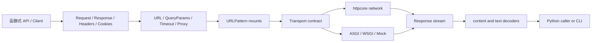
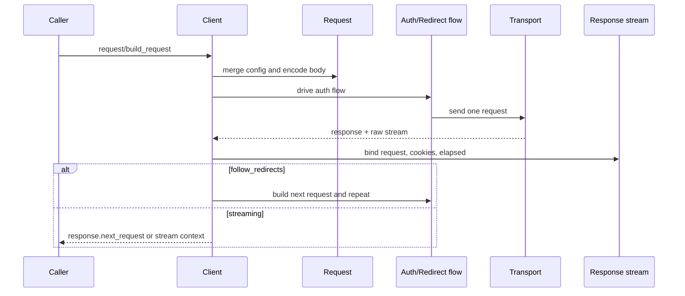
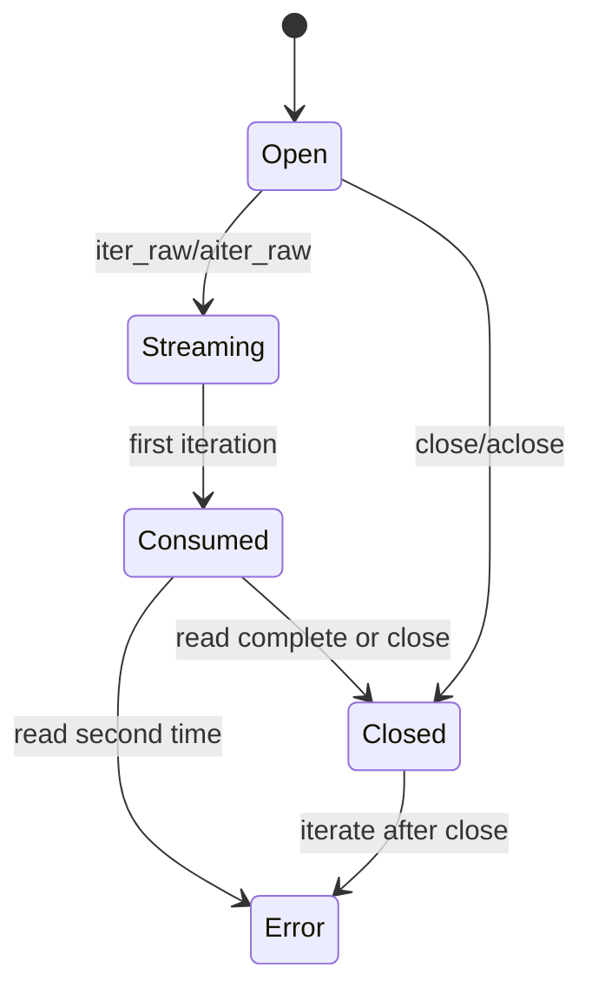

# HTTPX 架构分析基线

> 分析模式：`standard`  
> 固定源码：`/Users/chuzu/projests/stark-repo-analyzer-reference-sources/httpx`  
> 固定 HEAD：`b5addb64f0161ff6bfe94c124ef76f6a1fba5254`  
> 版本：`0.28.1`（`httpx/__version__.py:1-3`）

## 1. 场景与定位

当 Python 应用需要调用 HTTP 服务时，最简单的需求是发出一个同步请求；真实工程很快会加入连接复用、cookie、认证、代理、超时、流式响应、异步运行时以及进程内 ASGI/WSGI 调用。如果每个能力由不同库提供，调用方就要自行拼接请求模型、资源释放和错误处理。

HTTPX 把这些能力收敛为一个高层 HTTP client：README 明确列出 sync/async API、HTTP/1.1/2、WSGI/ASGI transport、严格 timeout 和类型标注（`README.md:5-16`, `59-70`）。它不是协议栈本身，而是把 `httpcore==1.*` 作为底层依赖，并在 transport adapter 中转换请求（`pyproject.toml:30-35`; `httpx/_transports/default.py:230-249`）。

它借鉴 Requests 的 API 形状，但不追求无条件兼容。固定源码和公开 compatibility 文档都显示出主动差异：默认不自动跟随重定向、timeout 更严格、streaming 有显式上下文、cookie 更倾向设置在 client 上。官网当前页面未绑定本 commit，因此只作为定位背景，不作为实现证据。

## 2. 项目全景

主设计哲学是“消息协议与执行环境分离”：Client 负责编排，Request/Response 负责消息和生命周期，transport 负责执行，auth/decoder/exception flow 负责将协议过程翻译为高层结果。

## 3. 一次请求如何完成

函数式入口 `httpx.request()` 只创建 Client、调用 client request 并关闭；`get/post/...` 是参数受限的薄包装（`httpx/_api.py:39-120`, `174-438`）。长期使用时，`BaseClient` 保存 headers、cookies、params、timeout、auth、base URL、hooks 和状态（`httpx/_client.py:188-221`）。

`build_request()` 合并 client/request 配置，生成 `Request` 并把 timeout 写入 extensions（`httpx/_client.py:340-389`）。`send()` 随后驱动认证 flow、重定向 flow，按 URL pattern 选择 transport，最后将 transport 返回的 stream 绑定到 Response（`httpx/_client.py:879-1034`）。

同步和异步路径共享 `BaseClient` 的语义，但在 flow 驱动、transport 调用、read/close 上分别实现（`_client.py:930-1034`, `1645-1749`）。`UseClientDefault` 额外区分“继承 client 默认值”和显式 `None`；这是 API 形状背后的重要语义（`_client.py:94-114`）。

## 4. 消息模型与流生命周期

`Headers` 不是普通 dict，而是保留 raw bytes、大小写规范化键和重复字段的多字典（`httpx/_models.py:139-379`）。`Request` 在构造时完成 URL、cookie、body encoding 及 Host/Content-Length 自动头（`_models.py:382-460`）。`Response` 保存 status、request、history、next_request、extensions 和 stream；非 streaming body 可以立即读入，外部 stream 则延迟处理（`_models.py:515-569`）。

`Response.iter_bytes()` 先做内容解码，再通过 `ByteChunker` 输出；`iter_text()` 继续做字符解码和分块（`_models.py:884-924`）。这保留了大响应的流式能力，但要求调用者理解 `StreamConsumed`、`StreamClosed` 等状态错误（`_exceptions.py:297-361`）。

请求 body 也采用统一 stream：bytes/str、同步/异步迭代器、urlencoded、multipart 和 JSON 都由 `_content.py` 转成 headers + stream（`_content.py:107-218`）。Multipart 文件按块读取，并拒绝文本文件输入以避免隐式编码问题（`_multipart.py:158-165`, `224-300`）。

## 5. URL、配置与路由

`urlparse()` 将字符串拆分为 scheme、authority、path、query、fragment，再进行 host 编码、端口归一化、路径校验和 percent-encoding（`httpx/_urlparse.py:213-345`）。IDNA、IPv4、IPv6 和默认端口都有独立处理（`_urlparse.py:348-419`）。所有 URL 属性从 canonical `ParseResult` 派生，减少字符串形式与传输形式不一致。

`QueryParams` 以不可变风格提供多值参数的 set/add/remove/merge（`_urls.py:420-641`）。`Timeout`、`Limits` 和 `Proxy` 负责运行时配置（`_config.py:72-248`）；环境代理通过 `get_environment_proxies()` 与 `URLPattern` 匹配（`_utils.py:30-237`）。Client 将 proxy 和 mounts 统一成排序后的 URLPattern 路由表（`_client.py:685-769`）。

这里的取舍是：规范化和路由成本更高，但调用者不必在每个请求点处理等价 URL、代理优先级和 base URL 拼接。代价是自定义 URL parser 的正确性负担较大，且代理行为依赖运行环境。

## 6. Transport 边界

`BaseTransport`/`AsyncBaseTransport` 只定义 request/close contract（`httpx/_transports/base.py:1-86`）。默认 `HTTPTransport` 将 HTTPX Request 转成 httpcore Request，设置 SSL、连接池、HTTP/1.1/2、代理等，再把 httpcore response 包回 HTTPX Response（`_transports/default.py:135-249`, `279-406`）。

ASGI transport 构造 ASGI scope 并通过 receive/send 协议收集响应；WSGI transport 构造 environ 并消费 WSGI iterable；Mock transport 直接调用 handler（`_transports/asgi.py:99-187`, `wsgi.py:91-149`, `mock.py:15-43`）。

这个边界的价值在于：上层的 cookie、redirect、auth、stream 和错误语义不需要为测试或进程内应用重新实现。它的边界也很清楚：连接池和协议细节属于外部 `httpcore`，本报告没有把外部代码虚构成已分析内容。

## 7. 认证、解码和错误

认证是 generator flow：先给出 request，收到 response 后可以继续产生下一 request。Basic、NetRC、Digest 和函数式认证共享这个接口（`httpx/_auth.py:22-111`, `113-348`）。Client 在 auth flow 外层处理 response 读取、history 和异常关闭（`_client.py:930-962`）。

解码器把 gzip、deflate、Brotli、zstd、identity 和多重编码组合成 `ContentDecoder`；Response 再把它们接入 byte/text/line streaming（`httpx/_decoders.py:1-393`; `_models.py:699-722`）。

异常树区分 HTTPError、RequestError、TransportError、Timeout、Network、Protocol、Decoding、Redirect 和 HTTPStatusError；`request_context()` 将 request 附着到 RequestError（`httpx/_exceptions.py:74-120`, `243-377`）。这让调用者可以按网络阶段处理错误，而不依赖 httpcore 类型。

## 8. CLI 与公共契约

CLI 使用 Click 解析参数，复用 `Client.stream()`，再根据 Content-Type 通过 Rich/Pygments 输出或下载文件（`httpx/_main.py:313-506`）。因此 CLI 是核心路径的消费者，而不是第二个 HTTP 实现。

`__init__.py` 集中导出 public names，并为没有 CLI optional dependency 的情况提供失败提示（`httpx/__init__.py:1-26`, `29-106`）。`codes` 通过 IntEnum 提供 reason phrase 和 1xx-5xx 分类，并生成小写别名以支持 Requests 兼容（`httpx/_status_codes.py:8-162`）。

## 9. 评价与改进建议

### 亮点

- sync/async API 共享配置和生命周期语义；
- Request/Response 将消息格式与 stream 状态集中建模；
- transport contract 统一网络、代理、ASGI、WSGI 和 mock；
- 兼容 Requests 的熟悉入口，同时对 timeout、redirect、stream 和文件编码做出明确取舍；
- CLI 直接复用核心 Client，不产生逻辑分叉。

### 问题与代价

- `_client.py` 同时承载配置、route、redirect、auth、stream 和 verb wrappers，达到 2,019 行，聚合度高；
- URL 规范化代码复杂，RFC/WHATWG 边界需要持续回归测试；
- httpcore 是关键外部依赖，本 commit 本身不能证明连接池或协议内部行为；
- optional extras 让基础安装与 CLI/HTTP2/SOCKS/decoder 能力之间存在额外安装分支；
- 流式 API 的资源控制更正确，但比一次性 response 更需要用户理解生命周期。

### 如果重新设计

保持 public API 不变，在内部拆出 `ConfigMerger`、`RedirectPolicy` 和 `TransportRouter` 三个策略边界，降低 `_client.py` 的聚合度。认证和解码继续使用 flow/stream contract，因为它们是跨同步、异步和 transport 的稳定抽象。

## 10. 证据与限制

- 本地源码、README、pyproject、mkdocs、贡献指南和 production Python 均针对固定 HEAD 分析。
- Git 历史未使用；浅克隆只影响历史可用性，不影响固定工作树读取。
- 外部 GitHub/Jina 资料用于定位和兼容性上下文；官网未锁定 commit，已标记为 unpinned。
- Exa 未配置，未完成参考流程建议的 3-5 次语义 WebSearch。
- 未运行完整测试、真实网络、HTTP/2、SOCKS、Brotli、Zstandard 或 httpcore 内部验证；这些不是本报告的源码读取覆盖率。
- 生产 Python 源码读取覆盖率为 8,827/8,827 = 100%；这不等于测试行为覆盖率。
