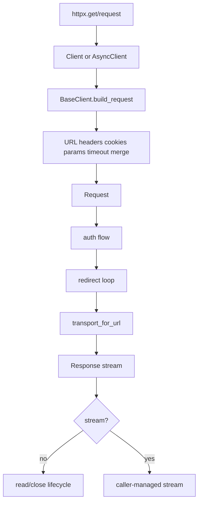

# 06 Module: Request Entry and Client Orchestration

## 读者问题

公共入口如何把“一个方法调用”变成可配置、可认证、可重定向、可关闭的完整请求生命周期？

## 结构

`httpx/_api.py` 提供短生命周期的函数式入口：`request()` 创建 `Client`，在上下文中调用 client，再自动关闭（`_api.py:39-120`）。`get/post/...` 只是把方法和允许的参数集合映射到 `request()`（`_api.py:174-438`）。因此真正的策略不散落在每个 verb 函数中，而是集中到 `BaseClient`/`Client`。

`BaseClient` 初始化并持有 headers、cookies、params、timeout、auth、base URL、event hooks 和状态（`_client.py:188-221`）。`build_request()` 合并 client-level 与 request-level 配置，并把 timeout 写入 request extensions（`_client.py:340-389`）。这解决了“短入口方便调用”和“长生命周期 client 复用配置”的冲突。

## 主流程

`Client.send()`先检查 closed 状态，再设置 timeout、构建 auth flow，进入 `_send_handling_auth()`；认证 flow 可以产生二次请求，重定向 flow 可以产生下一跳，最后 `_send_single_request()` 选择 transport 并绑定 response stream（`_client.py:879-1034`）。不跟随重定向时，下一请求保存在 `response.next_request`；跟随时才读取旧响应并追加到 history（`_client.py:964-995`）。

## Why > What

- `UseClientDefault` 把“未设置”与显式 `None` 分离（`_client.py:94-114`）。如果只有 `None`，就无法表达“继承 client timeout”和“关闭 timeout”的区别。
- `BaseClient` 负责公共语义，`Client` 与 `AsyncClient` 只在 I/O 方向上分叉。两条路径分别调用 `sync_auth_flow`/`async_auth_flow` 和 `handle_request`/`handle_async_request`，保留相同的配置与重定向结构（`_client.py:930-1034`, `1645-1749`）。
- `BoundSyncStream`/`BoundAsyncStream` 在 stream 关闭时记录 elapsed，并把资源释放与计时绑定（`_client.py:139-182`）。这比在收到 headers 时立即记时更符合“完整请求/响应周期”的语义。

## 代价与边界

- 同步和异步代码存在明显镜像，维护成本高，但这换来了调用方不需要理解一个“统一 awaitable”抽象。
- redirect/auth flow 可能需要重放 request body；不可重放的 generator 在二次请求时会触发 `StreamConsumed`，这是显式生命周期设计的自然边界（`_exceptions.py:309-324`）。
- 连接池、HTTP/1.1 和 HTTP/2 协议实现不在本仓库，而在 `httpcore`；本模块只能验证 adapter contract。

## 亮点与问题

亮点是策略集中、入口薄、同步/异步语义对齐。问题是 `_client.py` 达 2,019 行，承载配置、redirect、auth、transport 选择和 verb wrappers，文件级可导航性较弱；如果重新设计，可保留 `BaseClient` contract，同时把 redirect policy、config merge 和 transport lifecycle 分成内部策略对象。

## 覆盖率明细

| 文件 | 有效代码行 | 已读行数 | 覆盖率 |
|---|---:|---:|---:|
| `httpx/_api.py` | 438 | 438 | 100% |
| `httpx/_client.py` | 2,019 | 2,019 | 100% |
| **合计** | **2,457** | **2,457** | **100% / 达标** |
