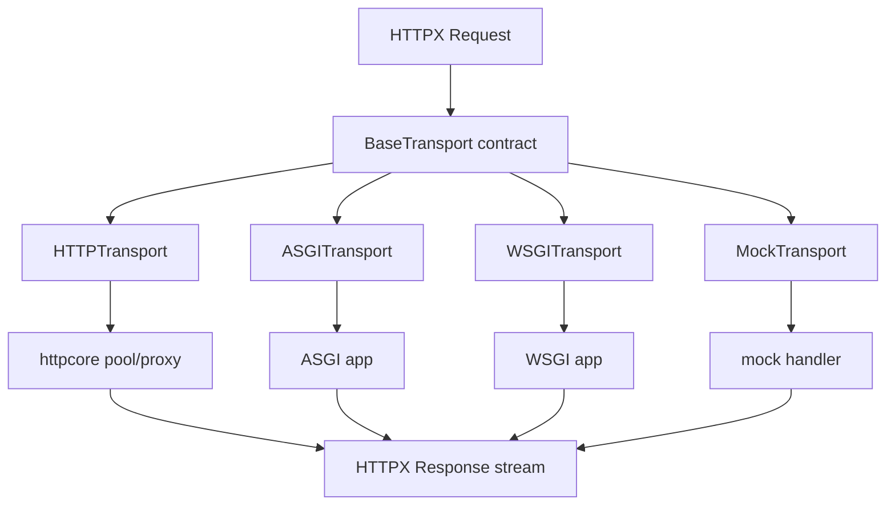

# 06 Module: Transport Contract and Execution Adapters

## 读者问题

同一个 `Request` 如何被发送到真实网络、代理、ASGI、WSGI 或 mock，而上层 client 不复制请求流程？

## Contract

`BaseTransport.handle_request()` 和 `AsyncBaseTransport.handle_async_request()` 是最小的同步/异步边界；默认实现要求子类提供方法并提供 context-manager close 生命周期（`httpx/_transports/base.py:1-86`）。`Client` 只依赖这个 contract，在发送前按 URL pattern 选 transport（`httpx/_client.py:760-769`, `1001-1023`）。

## 适配器

- `HTTPTransport`/`AsyncHTTPTransport` 将 HTTPX Request 转换为 httpcore Request，设置 SSL、HTTP/1.1/2、连接池、代理、UDS、local address 和 retries，再把 httpcore response stream 包回 HTTPX Response（`_transports/default.py:96-249`, `279-406`）。
- `ASGITransport` 把 request 映射成 ASGI scope，使用 receive/send 协议收集 response start/body，并通过 asyncio 或 Trio event 等待应用完成（`_transports/asgi.py:29-187`）。
- `WSGITransport` 把 request 映射成 WSGI environ，收集 status、headers 和可关闭 body iterator，再转换为 Response（`_transports/wsgi.py:22-149`）。
- `MockTransport` 直接调用用户 handler，仍然要求 Request/Response 经过同一 contract（`_transports/mock.py:15-43`）。

## Why > What

- transport contract 把“如何执行”从“如何构造/管理请求”中分离，允许测试和进程内应用复用完整 client 语义。
- httpcore 异常通过 `map_httpcore_exceptions()` 映射为 HTTPX 的 TransportError 层级（`_transports/default.py:96-120`），避免高层 API 暴露底层库类型。
- ASGI/WSGI transport 的价值不只是测试便利：它让 HTTP 客户端可以对应用内协议边界做端到端验证，而不强制绑定 socket。

## 代价与边界

- HTTPX 依赖 httpcore 的具体 transport 能力；本仓库只能验证转换和异常映射，不能验证连接池内部行为。
- ASGI transport 将响应 body 聚合为列表后再提供 stream（`_transports/asgi.py:125-187`），并非真实的逐块网络回压模型；适合应用调用/测试，但不能代表 socket transport 的吞吐特征。
- WSGI 是同步协议，不能直接作为 AsyncClient transport；用户必须选择匹配的 client/transport。

## 覆盖率明细

| 文件 | 有效代码行 | 已读行数 | 覆盖率 |
|---|---:|---:|---:|
| `httpx/_transports/__init__.py` | 15 | 15 | 100% |
| `httpx/_transports/base.py` | 86 | 86 | 100% |
| `httpx/_transports/default.py` | 406 | 406 | 100% |
| `httpx/_transports/asgi.py` | 187 | 187 | 100% |
| `httpx/_transports/wsgi.py` | 149 | 149 | 100% |
| `httpx/_transports/mock.py` | 43 | 43 | 100% |
| **合计** | **886** | **886** | **100% / 达标** |
