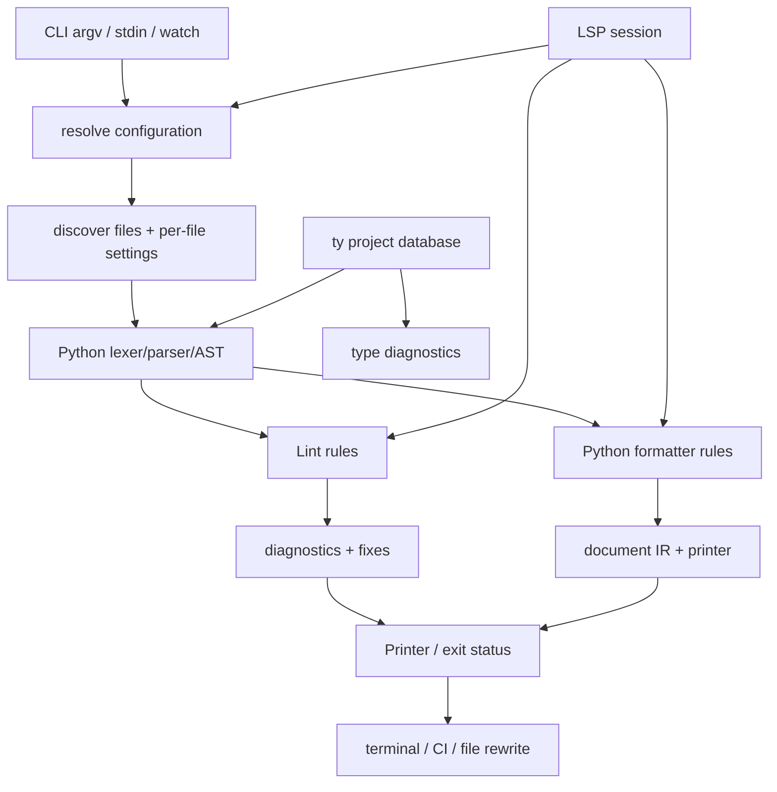

# Ruff 架构分析基线

> 分析模式：standard。源码 commit：`c588a3f7f57461692652d339936222b4496c5953`。本报告只对当前本地源码和注明的公开文档负责。

## 1. 先给结论

Ruff 不是“把很多 lint rule 翻译成 Rust”的单点项目，而是一条以统一 CLI 为入口、以配置/文件发现和 Python frontend 为共享基础、分别服务 linter 与 formatter 的 Python 质量工具链。它的主要架构价值在于把原来多个工具的配置、解析、诊断、修复和输出边界收敛到一套 workspace 契约中。

本轮验证了 CLI、配置控制面、lint pipeline 和 formatter document core 的核心切片；完整 parser、Python formatter 节点、规则全集、semantic model、LSP 和 ty 未达到 standard 覆盖门槛，见 `drafts/08-coverage.md`。这份报告是可比较的基线，不是全仓库逐行审计。

## 2. 项目问题与定位

工程团队通常要同时运行 Flake8/插件、isort、Black、pyupgrade 等工具，承受多份配置和多次解析。Ruff 的 README 明确将目标描述为极快的 Python linter/formatter，并强调统一接口、缓存、修复、生态兼容和层级配置（`README.md:28-47`）。公开文档还把 `ruff check` 和 `ruff format` 作为两个主要入口，定位是降低迁移成本而不是重新发明 Python 风格。

同类工具的差异在路线：Flake8 偏插件生态，isort/pyupgrade 偏单一变换，Black 偏格式化稳定性，Pylint 偏更广的静态检查；Ruff 选择原生 Rust 执行、规则兼容和共同 CLI。代价是维护约 199k 行 linter 源码、复杂的配置 schema 和兼容行为。本 commit 不足以证明所有性能宣传，未运行 benchmark。

## 3. 全景架构

`crates/ruff/src/lib.rs:102-241` 是命令分流；`lib.rs:243-533` 是 check 的输入、fix、watch、输出和退出策略。配置与文件发现的实现见 `ruff_workspace/src/resolver.rs:315-580,730-960`。parser 的公共产物见 `ruff_python_parser/src/lib.rs:281-387`。

## 4. 从 CLI 到输入集合

入口先展开 `@argument-file`、解析 clap 参数，并把顶层错误与 lint failure 分开（`crates/ruff/src/main.rs:30-54`; `lib.rs:20-40`）。`check` 和 `format` 都先调用 `resolve::resolve`；check 再决定 stdin、默认目录、show-settings/show-files、fix mode 和 printer flags（`lib.rs:214-319`）。

这个顺序的 Why 是把用户意图、配置快照和执行策略拆开：默认 fix 只生成，`--fix` 才应用，`--diff` 只输出差异；用户不会因为普通检查意外修改文件（`lib.rs:296-319`）。watch 分支监听 TOML 与 Python 文件，TOML 变化才重新解析配置（`lib.rs:385-442`）。

## 5. 配置与文件发现

`pyproject.rs` 识别 pyproject、ruff.toml、fallback target version 和配置优先级；`resolver.rs` 把 root/scoped settings、package roots、显式路径和递归发现集中起来。它不是一个简单的 `walkdir`：`ResolvedFile::Root/Nested` 和 exclusion matcher 保留了“用户直接指定”与“被项目发现”的语义差异（`resolver.rs:730-960`）。

这样设计的代价是 resolver 变成所有消费者都必须理解的边界，配置 schema 也非常大；好处是 linter、formatter、watch 和未来 server 不必各自实现 monorepo 规则。

## 6. Python frontend

lexer 保存 source offset、indentation、括号嵌套、字符串模式和错误状态（`ruff_python_parser/src/lexer.rs:36-145`），parser 将 token 组织成 `Parsed<Mod>`，同时保留 parse errors（`lib.rs:281-387`）。统一 source ranges 让诊断、fix、formatter comment placement 共享位置语义。

这里的边界很重要：parser 允许错误结果继续流向工具，提升编辑器/容错体验，但下游必须处理不完整 AST。完整 grammar 与 AST 生成实现未达 standard 覆盖，因此不能对所有 Python 语法作保证。

## 7. Lint pipeline

`ruff_linter/src/linter.rs:119-238` 以文件为并行单位，拿到每文件 settings 后执行 `lint_path`，最后聚合、排序 diagnostics；`lint_only`/`lint_fix` 分离报告与写回流程（`linter.rs:443-650`）。`fix/mod.rs:54-165` 负责 edits 的安全性、排序和重叠处理。

文件级并行比每条规则独立调度更适合共享 AST/source locator，代价是 cache、排序和 settings 必须保证并发结果稳定。规则全集未逐一读，不能把 pipeline 的存在误写成每条规则正确。

## 8. Formatter document pipeline

Python formatter 负责节点到格式元素的转换；通用 formatter 定义 `FormatElement`、context/options、`Format` traits 和最终 write/format API（`ruff_formatter/src/lib.rs:596-705,859-940`; `format_element.rs:21-459`）。其核心选择是先构造 document IR，再由 printer 根据 line width 和 group mode 选择布局。

这比 AST visitor 直接拼字符串多一层模型，却将换行决策集中到 printer，避免每个语法节点重复处理宽度；同时 Python 语法后端与语言无关打印器解耦。公开 formatter 文档把 Black 兼容和性能放在统一工具链目标下，但本轮没有验证全部 deviation。

## 9. LSP、semantic 与 ty 边界

semantic model 用 scopes/bindings/reference 将语法提升为“名称指向什么”的查询；LSP server 把 lint/format 变成长生命周期 session；ty 使用 Salsa `ProjectDatabase` 管理项目、文件系统和增量查询（`ty_project/src/db.rs:40-170`）。这些能力证明 workspace 已有平台化方向，但不是 Ruff linter pipeline 的简单子函数。

本轮只验证入口和少量核心类型，覆盖率分别约 6.8%、7.5% 和 0.4%。后续实现对比时，应将它们作为独立能力包，不要把 ty 的类型推理或 LSP 调度假设成已实现。

## 10. 评价与重设计建议

亮点是契约分层：CLI 管策略，resolver 管输入事实，parser 管共享结构，linter/formatter 管不同消费逻辑，Printer 管外部表现。问题是规模本身会让行为边界难以复现，尤其规则全集、配置 schema 和增量状态。

更实际的改进不是拆散 crate，而是增加跨模块架构测试：settings snapshot、parser range 到 diagnostic/fix 的 round-trip、formatter IR 的宽度决策、watch/LSP 事件序列和 ty 数据库失效。它们能把“架构叙事”变成新实现可执行的行为契约。

## 11. 基线限制

- Exa 不可用；外部研究使用 Jina 与 GitHub API，并已在 `03-research.md` 记录。
- 无可用 Agent/subagent 工具，改为单 agent 顺序分析。
- 未运行完整构建、测试和性能 benchmark。
- standard 覆盖部分达标；完整 parser、semantic、server、ty 和规则全集未达门槛，详细数据见 `drafts/08-coverage.md`。
