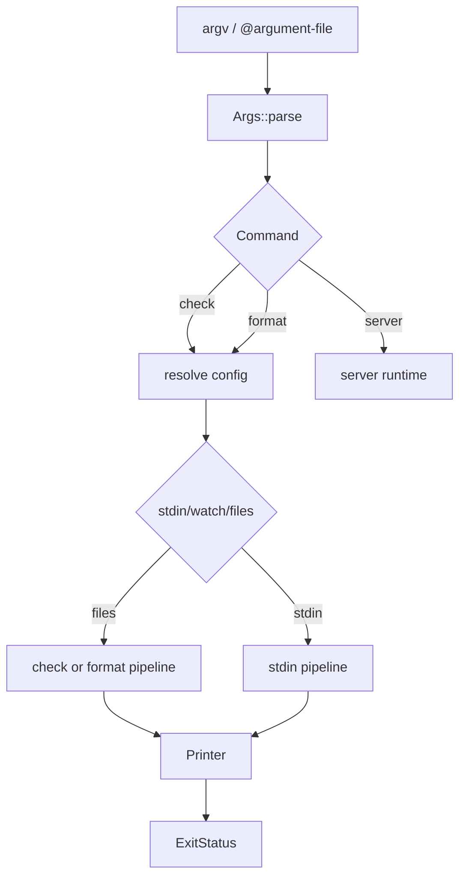

# 模块：CLI 与执行控制

## 叙事衔接

报告从用户命令进入系统。CLI 的职责不是实现每条规则，而是把命令、配置解析、输入来源、输出和退出状态串成稳定边界；后续配置模块接管它传入的 `ConfigArguments`。

## 在项目中的角色

`crates/ruff/src/main.rs:30-54` 负责参数文件展开、clap 解析和顶层错误分类；`crates/ruff/src/lib.rs:102-211` 把子命令映射到执行器。去掉这层，crate 仍可能有库能力，但用户无法得到统一的 `ruff check`/`ruff format` 产品入口。

## 核心流程

`lib.rs:102-211` 体现 command dispatch；`lib.rs:214-241` 将 format、graph、server 分流；`lib.rs:243-294` 为 check 解析配置、输出 writer 和默认文件；`lib.rs:296-319` 把 `--fix`、`--diff`、`--fix-only` 映射成 `FixMode` 和 Printer flags。

## Why > What

- `stdin`、文件和 watch 共用一套命令层，而不是各自做一份参数解析，代价是 CLI 主流程需要显式处理输入来源和输出流；这换来了行为一致性。
- `FixMode::Generate/Apply/Diff` 把“生成修复”和“写回文件”分离。这样默认运行可以展示可修复问题但不意外修改工作树，安全边界比直接在 rule 中写文件更清晰。
- watch 模式在 `lib.rs:385-442` 监听源文件和 TOML；配置变化触发重新 resolve，源文件变化只重新检查。这个区分避免每次编辑都重复配置扫描，但仍保留配置变更的正确性。
- `ExitStatus` 在 `lib.rs:20-40` 区分成功、发现问题和自身错误。CI 可以把 lint violation 与配置/运行故障分开处理。

## 跨模块协作

CLI 调用 `resolve::resolve`，把 `PyprojectConfig` 交给 `commands::check::check` 或 format command；下游返回 `Diagnostics`，再由 `Printer` 决定格式，最终由 CLI 依据 severity/fix 状态决定退出码（`lib.rs:443-533`）。这是“前置解析 + 纯执行结果 + 最后输出”的协作方式。

## 问题与边界

`args.rs` 约 1,524 行，命令选项定义非常大，本轮未逐行覆盖；因此不能声称所有 flag 的冲突关系均已验证。watch 循环是长生命周期分支，错误恢复和 watcher 行为未运行验证。

## 覆盖率

| 文件 | 总行数 | 已读行数 | 覆盖率 | 未读原因 |
|---|---:|---:|---:|---|
| `crates/ruff/src/main.rs` | 78 | 78 | 100% | 无 |
| `crates/ruff/src/lib.rs` | 693 | 693 | 100% | 无 |
| `crates/ruff/src/commands/check.rs` | 302 | 220 | 72.8% | 测试尾部和少量错误分支 |
| `crates/ruff/src/resolve.rs` | 145 | 145 | 100% | 无 |
| **合计** | **1218** | **1136** | **93.3%** | **核心门槛 60%，达标 ✅** |
