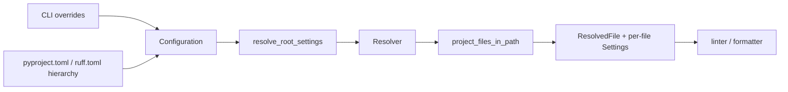

# 模块：项目配置与文件发现

## 叙事衔接

CLI 已确定用户要运行的动作，但动作还没有输入集合和每个文件的设置。配置与 resolver 模块把多个来源合并成可执行的项目视图，之后 linter/formatter 只消费解析后的 settings。

## 在项目中的角色

`ruff_workspace` 负责配置读取、项目根判断、层级设置和文件发现。`pyproject.rs:90-130` 暴露配置文件判断；`resolver.rs:103-135` 的 `Resolver` 持有路径、发现策略和默认设置；`resolver.rs:315-400` 负责把配置变换为 root/scoped settings。

## 核心流程

`resolver.rs:315-400` 将 root config 转成 settings；`resolver.rs:434-580` 发现路径并去重；`resolver.rs:730-790` 用 `ResolvedFile` 区分 root/nested；`resolver.rs:825-960` 集中处理 include/exclude 的匹配。

## Why > What

- 层级配置不是简单读取当前目录的 TOML。resolver 将“项目根、相对路径、package root、scope settings、强制排除”集中在一个边界里，避免每个消费者重复解释 monorepo 规则。
- `ResolvedFile::Root/Nested` 保留文件相对于发现入口的语义，使 force-exclude 和显式命令行路径可以有不同处理；这是用户直传文件与递归发现之间的必要张力。
- `pyproject.rs:90-160` 先区分 Ruff 配置文件、pyproject 和用户配置，再交给更高层 resolver；该分层让格式化和 lint 可以共享项目发现，而不是复制优先级逻辑。

## 跨模块协作

CLI 的 `resolve()` 先得到 `PyprojectConfig`；执行时 `project_files_in_path` 返回 resolver，linter 逐文件调用 `resolver.resolve(path)` 获取 `settings.linter`（`crates/ruff/src/commands/check.rs:1-120`）。formatter 也通过同一 config bridge 获取 format settings。配置模块因此是所有业务模块的“输入契约”，错误会在真正分析前暴露。

## 问题与边界

`options.rs` 约 4,510 行，包含大量 rule/format option schema；本轮只读其结构和代表性类型，没有覆盖每个选项的 merge/validation。configuration.rs 约 2,313 行，同样只读入口、配置结构和 resolve_src 相关范围。这里的覆盖率只针对 resolver、pyproject、settings 三个控制面文件，不代表全部配置 schema。

## 覆盖率

| 文件 | 总行数 | 已读行数 | 覆盖率 | 未读原因 |
|---|---:|---:|---:|---|
| `crates/ruff_workspace/src/resolver.rs` | 1187 | 820 | 69.1% | 测试和中部辅助分支未读 |
| `crates/ruff_workspace/src/pyproject.rs` | 613 | 300 | 48.9% | 测试和平台分支未读 |
| `crates/ruff_workspace/src/settings.rs` | 341 | 240 | 70.4% | 尾部测试/少量转换未读 |
| **合计** | **2141** | **1360** | **63.5%** | **核心门槛 60%，达标 ✅；schema 未纳入合计** |
