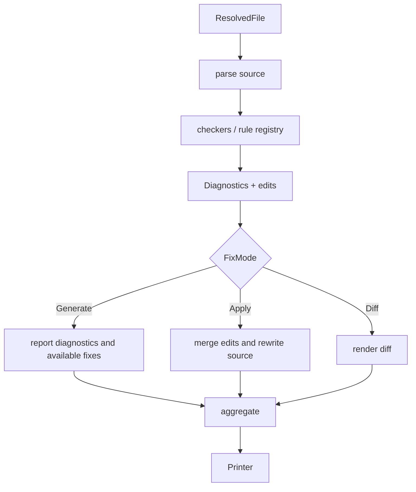

# 模块：Lint pipeline 与规则/修复

## 叙事衔接

配置模块已经给出文件集合和每文件设置。Lint pipeline 负责把这些输入并行送入解析、规则检查和修复逻辑，并将局部结果收敛为 CLI 可打印的诊断集合。

## 在项目中的角色

`ruff_linter::linter` 是规则执行的业务编排层，不是单条规则的集合。`linter.rs:119-373` 负责路径级检查；`linter.rs:443-650` 负责仅 lint、fix 和诊断转换；`fix/mod.rs:54-165` 再把多个 edit 按位置和安全级别合并。

## 核心流程

`linter.rs:119-238` 逐文件调用 settings、cache、noqa 和 `lint_path`，并在 Rayon 上聚合；`linter.rs:443-510` 区分 `lint_only`、修复模式和失败收敛；`fix/mod.rs:54-127` 处理 edit 的排序/重叠，避免多个规则对同一 source range 产生不可预测写入。

## Why > What

- 并行粒度是“文件”，而不是每条规则。这样规则可以共享一个文件级 source/AST/locator 上下文，且跨文件诊断最后才聚合；代价是需要保证 settings、cache 和诊断排序在并行下可复现。
- fix 默认先生成不落盘，`Apply` 才写入；安全等级在 `linter.rs:543-650` 和 fix 数据结构中传递，解决自动修复的“方便 vs 语义风险”问题。
- 规则注册表和 selector 将生态兼容码映射为本地实现；本轮没有逐条阅读近 200k 行规则，因此只分析其消费契约，不对每条规则的正确性下结论。

## 跨模块协作

上游 resolver 提供 `LinterSettings`；pipeline 调 parser/AST 与 rule checkers；下游 `Diagnostics` 被 CLI Printer 消费。cache 只在路径、package root 和 resolver 都确定后初始化，这说明缓存键依赖项目边界，而非单纯文件内容（`crates/ruff/src/commands/check.rs:1-120`）。

## 问题与边界

`ruff_linter/src/rules` 是最大未读面，规则元数据、跨规则修复冲突和各插件兼容性不能从本轮入口抽样推出。`checkers` 的 filesystem/imports/tokens 只做结构扫描；因此本草稿是 pipeline 基线，不是规则全集评测。

## 覆盖率

| 文件 | 总行数 | 已读行数 | 覆盖率 | 未读原因 |
|---|---:|---:|---:|---|
| `crates/ruff_linter/src/linter.rs` | 1261 | 820 | 65.0% | 测试及尾部辅助分支 |
| `crates/ruff_linter/src/fix/mod.rs` | 416 | 416 | 100% | 无 |
| `crates/ruff_linter/src/checkers/logical_lines.rs` | 189 | 189 | 100% | 无 |
| **合计** | **1866** | **1425** | **76.4%** | **核心门槛 60%，达标 ✅；规则实现未纳入合计** |
