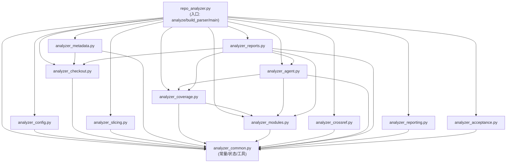
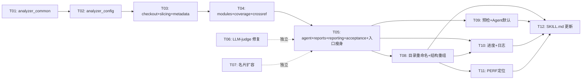

# 架构设计：stark-repo-analyzer 增量重构（2026-07-08）

> 架构师：Bob（software-architect）
> 输入：PM 增量 PRD `docs/goals/refactor-prd-2026-07-08.md`
> 约束：增量重构、stdlib-only、245+ 验收做安全网、不改既有 ADR/PLAN/repo-types.yaml/templates
> 所有 file:line 已通过代码核实。

---

## A. 逐项根因分析

### REQ-01：输出目录重命名 `analysis` → `.stark-repo-analyzer`

**根因**：
- `build_parser()` 的 `--output` 默认值为 `"analysis"`（`repo_analyzer.py:2716`）。
- `IGNORE_DIRS` 集合（`repo_analyzer.py:37-62`）写死了 `analysis`、`analysis-final`、`analysis-judge`、`analysis-judge-final`、`analysis-novice-final` 等旧名，用于 `iter_files()` 过滤（`repo_analyzer.py:248-255`）和 `repomix_ignore_glob()`（`repo_analyzer.py:497-503`）。
- `main()` 完成后只输出 `print(f"分析完成: {output}")`（`repo_analyzer.py:2741`），无 gitignore 提醒。

**为什么现有设计会这样**：历史命名 `analysis` 简单直观，且 `IGNORE_DIRS` 需要排除自身产物目录避免递归扫描。多个 `analysis-*` 变体是 UAT 调试期间产生的遗留名。

**解决方案**：
1. `build_parser()` 的 `--output` default 改为 `".stark-repo-analyzer"`。
2. `IGNORE_DIRS` 移除 `analysis`/`analysis-final`/`analysis-judge`/`analysis-judge-final`/`analysis-novice-final`，新增 `".stark-repo-analyzer"`。
3. `prepare_output()` 的 `generated_files` 集合（`repo_analyzer.py:190-213`）同步更新文件名（随 REQ-06 路径变更一起改）。
4. `main()` 在 `print(f"分析完成: {output}")` 之后追加 gitignore 提醒逻辑：
   - 若 `output` 的父目录有 `.gitignore`，检查是否已包含 `.stark-repo-analyzer/`，未包含则追加。
   - stdout 输出 `提示：建议将 .stark-repo-analyzer/ 加入 .gitignore`。
5. 测试中硬编码 `analysis` 的地方（如 `test_repo_analyzer_cli.py:208` `output = Path(out_tmp) / "analysis"`、line 463 `(repo / "analysis").mkdir()`）更新为新目录名。

**风险与回滚**：
- 风险：`IGNORE_DIRS` 变更影响 `iter_files()` 和 `repomix_ignore_glob()`，若遗漏旧名会导致递归扫描。回滚：恢复 IGNORE_DIRS 即可。
- 兜底：245+ 验收的 `slices present` 断言会捕获递归扫描问题；测试中 IGNORE_DIRS 测试用例验证排除行为。

---

### REQ-02：运行时预检

**根因**：
- `analyze()`（`repo_analyzer.py:2624-2710`）在 `apply_config(args)` 后直接进入 `with timed_stage(performance, "checkout-target"): checkout_target(args.target)`（line 2629-2630），无任何环境依赖检查。
- `run_repomix_slice()`（`repo_analyzer.py:524-547`）在调用时才检查 `shutil.which(REPOMIX_BINARY)`，若 npx 缺失直接 `raise SystemExit`（line 525-526）。
- agent 模式的 `agent_base_command()`（`repo_analyzer.py:920-942`）构造 codex 命令时不检查 codex 是否可用，直到 `subprocess.run()` 才失败。

**为什么现有设计会这样**：底料先行原则下优先保证确定性产物的生成路径，环境检查被分散在各调用点（fail-fast at use site），而非集中预检。这在开发阶段合理（快速反馈），但在用户使用时体验差（跑到一半才报错）。

**解决方案**：
- 新增 `preflight_check(args)` 函数，插入点在 `analyze()` 的 `apply_config(args)` 之后、第一个 `timed_stage` 之前。
- 检查项清单：

| # | 名称 | 检查方式 | 必需/可选 | 失败处理 | 修复建议文案 |
|---|------|---------|----------|---------|-------------|
| 1 | Python ≥ 3.10 | `sys.version_info >= (3, 10)` | 必需 | FAIL → exit(1) | "升级 Python 到 3.10+" |
| 2 | git | `shutil.which("git")` | 必需 | FAIL → exit(1) | "安装 git: https://git-scm.com/downloads" |
| 3 | npx (repomix) | `shutil.which("npx")` | 必需 | FAIL → exit(1) | "安装 Node.js: https://nodejs.org/" |
| 4 | tree-sitter | `shutil.which("tree-sitter")` | 可选 | WARN 继续 | "安装 tree-sitter CLI 以获得更精确的符号提取" |
| 5 | codex | `shutil.which("codex")` | agent 模式必需；deterministic 模式可选 | agent 模式 FAIL → 降级 deterministic（REQ-05 协同）；deterministic 模式 WARN | "安装 Codex CLI 以启用 agent 模式" |

- 预检结果以表格形式输出到 stdout（✅/❌/⚠️），并写入任务运行日志（REQ-07）的第一条记录。
- 与 REQ-05 协同：当 `args.agent_mode != "deterministic"` 且 codex 不可用时，输出 WARN 并降级：`args.agent_mode = "deterministic"`，设置 `args._agent_mode_degraded = True`（供 `write_config_effective()` 记录 `agent_mode_degraded: true`）。

**风险与回滚**：
- 风险：预检误判（如 npx 存在但 repomix 包未安装）——但现有代码也是在调用时才报错，预检不会更差。
- 兜底：预检只检查 CLI 可用性（`shutil.which`），不检查包完整性，保持轻量。245+ 验收不受影响（预检是新增阶段，不改变产物内容）。

---

### REQ-03：LLM-judge 默认模型修复

**根因**：
- `llm_judge.py:22`：`DEFAULT_MODEL = os.environ.get("REPO_ANALYZER_LLM_JUDGE_MODEL", "haiku-4.5")` —— 硬编码 `haiku-4.5` 作为默认值，但该模型在当前环境不可用（返回 404）。
- `llm_judge.py:81`：`["codex", "exec", "--model", model, "-", "--skip-git-repo-check"]` —— 始终传 `--model`，即使用户未显式指定也传了 `haiku-4.5`。
- `llm_judge.py:92`：`_emit("WARN" if not strict else "FAIL", "llm-judge:执行", f"codex 退出码 {proc.returncode}")` —— 失败时只输出退出码，无模型名、无 stderr 摘要，用户无法定位是模型问题还是其他问题。

**为什么现有设计会这样**：ADR-0011 Open Questions 中提到"LLM-judge 用 haiku-4.5 还是 sonnet-4.6"，当时选择了 haiku-4.5 作为低成本选项，但未考虑模型可用性随环境变化的问题。错误信息简洁是为了 acceptance 输出整洁，但牺牲了可诊断性。

**解决方案**：
1. `DEFAULT_MODEL` 改为 `os.environ.get("REPO_ANALYZER_LLM_JUDGE_MODEL", "")` —— 空字符串表示"不传 --model，使用 codex 默认模型"。
2. `judge()` 中构建命令时，仅当 `model` 非空才追加 `["--model", model]`：
   ```python
   cmd = ["codex", "exec"]
   if model:
       cmd += ["--model", model]
   cmd += ["-", "--skip-git-repo-check"]
   ```
3. 失败诊断信息格式改为包含模型名 + stderr 关键摘要：
   ```python
   stderr_summary = _extract_error_summary(proc.stderr)
   model_label = model or "(codex 默认模型)"
   _emit("WARN" if not strict else "FAIL", "llm-judge:执行",
         f"codex 退出码 {proc.returncode}，模型: {model_label}，错误: {stderr_summary}")
   ```
4. 新增 `_extract_error_summary(stderr: str) -> str` 辅助函数：提取 stderr 中包含 "not supported"/"error"/"not found" 的行，截取前 200 字符。
5. `main()` 的 argparse `--model` help 改为 `"codex 模型（留空则使用 codex 默认模型）"`。
6. `acceptance/llm-judge.sh` 无需改动（它只调用 `llm_judge.py "$ROOT"`，不传 `--model`）。
7. SKILL.md line 97 的"默认 `haiku-4.5`"更新为"默认使用 codex 默认模型"。

**风险与回滚**：
- 风险：不传 `--model` 时 codex 的默认模型可能因环境而异，评分结果不可复现。但比硬编码不可用模型更好。
- 兜底：用户可通过 `REPO_ANALYZER_LLM_JUDGE_MODEL=gpt-5.5` 显式指定。复跑验证命令（PRD 验收标准 4）验证两种场景。

---

### REQ-04：执行进度实时反馈

**根因**：
- `timed_stage()`（`repo_analyzer.py:157-176`）是一个 `@contextmanager`，仅在 `finally` 块中将 `{name, elapsed_seconds, status, error}` 追加到 `performance["stages"]` 列表（line 169-176），**不向 stdout 输出任何内容**。
- `analyze()` 中所有 stage 都用 `with timed_stage(performance, "name"):` 包裹（line 2629-2707），但用户只看到最终的 `print(f"分析完成: {output}")`（line 2741）。
- agent 子任务在 `run_agent_task()`（`repo_analyzer.py:945-1016`）中也无进度输出，只写 `attempt_dir/metadata.json`。

**为什么现有设计会这样**：`timed_stage` 设计目标是"静默计时+记录"，供 `PERFORMANCE_REPORT` 使用。进度输出是可观测性需求，在原始设计中未考虑——底料先行原则下优先保证产物正确性，可观测性是后加的。

**解决方案**：
- **方案：改造 `timed_stage` 为 `ProgressReporter` 类**，同时承担计时（写 performance dict）和进度输出（stdout + log）职责。

- `ProgressReporter` 设计（放在 `analyzer_common.py`）：

```python
class ProgressReporter:
    """统一进度输出 + 计时 + 日志记录。"""
    def __init__(self, total: int, log_writer=None):
        self.total = total
        self.index = 0
        self.log_writer = log_writer  # REQ-07 的 LogWriter 实例

    @contextmanager
    def stage(self, performance: dict, name: str):
        self.index += 1
        idx = self.index
        print(f"[{idx}/{self.total}] 正在执行：{name} ...", flush=True)
        if self.log_writer:
            self.log_writer.step_start(name, idx, self.total)
        started = time.monotonic()
        status = "PASS"
        error = ""
        try:
            yield
        except Exception as exc:
            status = "FAIL"
            error = str(exc)
            raise
        finally:
            elapsed = time.monotonic() - started
            performance.setdefault("stages", []).append({
                "name": name,
                "elapsed_seconds": round(elapsed, 3),
                "status": status,
                "error": error[:500],
            })
            print(f"[{idx}/{self.total}] {name} 完成 ({elapsed:.1f}s)", flush=True)
            if self.log_writer:
                self.log_writer.step_end(name, idx, self.total, elapsed, status)

    def agent_progress(self, run_id: str, event: str, **kwargs):
        """agent 子任务进度。event: 'start'/'finish'。"""
        if event == "start":
            print(f"  → agent: {run_id} 开始 ...", flush=True)
        else:
            elapsed = kwargs.get("elapsed", 0)
            print(f"  ← agent: {run_id} 完成 ({elapsed:.1f}s)", flush=True)
        if self.log_writer:
            self.log_writer.agent_event(run_id, event, **kwargs)

    def summary(self):
        """最终汇总行。"""
        # 从 performance dict 读取
        stages = []  # 由 analyze 传入
        total_elapsed = sum(s.get("elapsed_seconds", 0) for s in stages)
        passed = sum(1 for s in stages if s["status"] == "PASS")
        failed = sum(1 for s in stages if s["status"] == "FAIL")
        print(f"汇总：共 {len(stages)} 步，成功 {passed}，失败 {failed}，总耗时 {total_elapsed:.1f}s")
```

- **进度行格式规范**（纯文本，Q7 决议）：
  - 开始：`[3/15] 正在执行：repomix-slices ...`
  - 完成：`[3/15] repomix-slices 完成 (12.3s)`
  - agent 子任务开始：`  → agent: modules-batch 开始 ...`
  - agent 子任务完成：`  ← agent: modules-batch 完成 (30.2s)`
  - 汇总：`汇总：共 15 步，成功 15，失败 0，总耗时 45.3s`
  - 格式稳定可解析：方括号内为 `当前序号/总数`，`正在执行`/`完成` 为固定关键词。

- **总数预计算**：在 `analyze()` 开头根据 `args` 预计算 stage 总数。基础 deterministic 模式约 15 步；agent 模式根据条件分支最多 22 步。预计算逻辑：

```python
def count_stages(args) -> int:
    n = 13  # 基础阶段（checkout ~ acceptance-script，不含 agent 相关）
    if args.agent_mode != "deterministic":
        n += 1  # agent-modules-batch
        n += 1  # agent-cross-ref-review
        n += 1  # agent-cross-ref-repair (可能不执行但先计入)
        n += 2  # cross-ref-after + coverage-after-cross-ref-repair
        n += 1  # agent-cross-ref-review-final
    if args.research:
        n += 1
    if args.save_pref:
        n += 1
    return n
```

  > 注：条件分支的 stage 如果最终不执行，总数会略大于实际。可接受——用户看到 `[14/22]` 知道还有 8 步，比没有进度好。或者用动态调整：不执行时 `total` 不变但 `index` 不增，最后汇总时用实际 `index`。

- **与 REQ-07 的复用**：`ProgressReporter` 的 `log_writer` 参数是 `LogWriter` 实例（见 REQ-07 设计）。每次 `stage()` 的 start/end 同时调用 `log_writer.step_start/step_end`，实现 stdout 和日志同步写入。

- **在 `run_agent_task()` 中接入**：在 `run_agent_task()`（`repo_analyzer.py:945`）的 attempt 循环前后调用 `progress.agent_progress(run_id, "start")` / `progress.agent_progress(run_id, "finish", elapsed=..., returncode=...)`。需要将 `progress` 作为参数传入 `run_agent_task()`。

**风险与回滚**：
- 风险：进度输出可能干扰 acceptance check.sh 的 stdout 解析（check.sh 解析 `PASS|name|detail` 格式行）。但 check.sh 是独立子进程，其 stdout 与 repo_analyzer 的 stdout 不混。
- 兜底：进度行格式与 acceptance 输出格式完全不同（`[N/M]` vs `PASS|name|detail`），不会混淆。245+ 验收不检查 repo_analyzer 的 stdout。

---

### REQ-05：Agent 模式默认开启

**根因**：
- `build_parser()` 的 `--agent-mode` default 为 `"deterministic"`（`repo_analyzer.py:2727`）。
- `set_if_default()` 的 defaults 字典中 `"agent_mode": "deterministic"`（`repo_analyzer.py:408`）——用于配置文件/环境变量覆盖判断。
- SKILL.md 的默认命令不含 `--agent-mode codex`（line 46），完整智能闭环命令才加 `--agent-mode codex`（line 52）。

**为什么现有设计会这样**：agent 模式需要 codex CLI，不是所有环境都有。默认 deterministic 保证最大兼容性。但现在用户反馈希望默认获得 agent 深度分析效果。

**解决方案**：
1. `build_parser()` 的 `--agent-mode` default 改为 `"codex"`（`repo_analyzer.py:2727`）。
2. `set_if_default()` 的 defaults 字典中 `"agent_mode"` 改为 `"codex"`（`repo_analyzer.py:408`）。
3. `apply_config()` 中 `args.agent_model = "5.4"`（line 478）保持不变——这是 agent 模式的 codex 模型，与 llm_judge 的模型无关。
4. 与 REQ-02 协同：预检发现 codex 不可用时自动降级（见 REQ-02 设计）。
5. `write_config_effective()`（`repo_analyzer.py:2208-2236`）新增 `agent_mode_degraded` 字段：
   ```python
   "agent_mode_degraded": getattr(args, "_agent_mode_degraded", False),
   ```
6. SKILL.md 更新：默认命令从不含 `--agent-mode` 变为不含（因为默认就是 codex）；完整智能闭环命令不再需要显式 `--agent-mode codex`；用户想关闭时传 `--agent-mode deterministic`。
7. 测试更新：默认 agent-mode 的断言从 `"deterministic"` 改为 `"codex"`；确定性模式测试显式传 `--agent-mode deterministic`。

**风险与回滚**：
- 风险：默认 agent 模式下，没有 codex 的环境会降级到 deterministic，用户可能不期望降级。但 WARN 提示 + CONFIG_EFFECTIVE 记录使降级透明。
- 兜底：测试覆盖三种场景（codex 可用→正常 agent / codex 不可用→降级 / 显式 deterministic）。245+ 验收的 AGENT_SUMMARY 断言验证 agent 模式记录正确。

---

### REQ-06：产物目录结构重组

**根因**：
- 所有 `write_*` 函数都直接写到 `output` 根目录（平铺），无子目录分层。具体映射见下方"旧路径→新路径映射表"。
- `write_readme()`（`repo_analyzer.py:2174-2205`）用 `output.glob("ANALYSIS_REPORT*.md")` 查找报告文件，假设它们在根目录。
- `render_report.py:28` 读取 `data_dir / "REPORT_DATA.json"`，`render_report.py:38/42/44` 写 `ANALYSIS_REPORT*.md` 到 `data_dir`——假设数据和报告在同一目录。
- `llm_judge.py:29-34` 的 `_read_reports()` 从 `root` 读取 `ANALYSIS_REPORT*.md`——假设报告在根目录。
- 生成的 `check.sh`（`repo_analyzer.py:2399-2418`）的 `required` 列表用根目录相对路径；`root.glob("*.md")`（line 2492）只找根目录 .md 文件；`claim_files` 用 `root.rglob("*")`（line 2495）但过滤条件用 `path.name`（文件名），不依赖目录层级。

**为什么现有设计会这样**：项目从单文件脚本演化而来，所有产物放一个目录最简单。随着产物数量增长到 26 个，平铺结构变得混乱，但一直没有重构——因为 245+ 验收的硬断言绑定了这些路径，改动成本高。

**解决方案**：见 Part C 的完整目录结构设计。

**风险与回滚**：
- 风险：路径变更面广（~15 个 write_* 函数 + check.sh + render_report.py + llm_judge.py + SKILL.md + 测试）。遗漏一个路径引用就会导致验收失败。
- 兜底：245+ 验收是安全网——任何遗漏的路径变更都会导致 `required:xxx` 断言失败，立即暴露。测试也覆盖核心路径存在性。

---

### REQ-07：任务运行日志

**根因**：
- 只有最终产物文件，无过程记录目录。`timed_stage()` 记录的 `performance["stages"]` 仅在 `write_performance_report()` 时落盘为 `PERFORMANCE_REPORT.{md,json}`，是性能诊断视角，不是"执行过程日志"视角。
- agent 子任务的证据在 `agent-runs/*/attempt-*/metadata.json`，但分散在各子目录，无统一的按时间线排列的日志。

**为什么现有设计会这样**：底料先行原则下，产物优先于过程记录。日志是运维需求，在原始设计中未规划。

**解决方案**：见 Part F 的日志设计。

**风险与回滚**：风险低——新增 `logs/` 目录和日志写入逻辑，不改变现有产物。回滚：删除日志写入代码即可。

---

### REQ-08：PERFORMANCE_REPORT 定位澄清

**根因**：
- `write_performance_report()`（`repo_analyzer.py:2270-2348`）生成的 `PERFORMANCE_REPORT.md` 标题为"性能诊断报告"（line 2313），内容是阶段耗时 Top20、agent attempt 耗时 Top20、慢因结论——确实是性能诊断，不是分析结论。
- 但文件放在根目录，与 `ANALYSIS_REPORT.md`、`STATE_REPORT.md` 等平级，用户不清楚它的定位。
- SKILL.md line 156 将它与 SLA_REPORT 并列描述为"SLA、阶段耗时、agent attempt 耗时、慢因诊断与生效配置记录"，未明确强调"不是分析结论"。

**为什么现有设计会这样**：报告生成时按功能命名，未考虑用户的阅读路径分类。所有报告都放根目录是平铺结构的通病。

**解决方案**：
1. `PERFORMANCE_REPORT.md` 顶部新增定位说明段落（在 `# 性能诊断报告` 之后）：
   ```
   > **本报告用途**：记录各阶段耗时、慢因诊断和 token 用量，用于排查执行性能问题。
   > **不是仓库分析结论**。分析结论请读 `reports/ANALYSIS_REPORT*.md`。
   ```
2. 移入 `diagnostics/` 子目录（随 REQ-06）。
3. 新增"如何阅读本报告"小节：说明 stage 排名（最慢阶段在哪）、agent attempt 排名（哪个 agent 子任务最慢）、token 状态（绿/黄/红）的含义。
4. README 索引页标注为"🔧 诊断报告"。
5. SKILL.md Reference 更新。

**风险与回滚**：风险低——仅新增文本内容和移动文件位置。245+ 验收的 `performance diagnostic present` 断言检查"慢因结论"和"阶段耗时 Top20"关键词，新增内容不影响。

---

### REQ-09：项目名片扩容至 10KB

**根因**：
- `write_manifest_card()`（`repo_analyzer.py:1369-1389`）末尾 `card[:5_000]` 硬截断（line 1389）。
- 标题为 `"# 5KB 项目名片"`（line 1373）。
- 内容仅含：项目名、目标、Repo 类型、主要语言、文件数、顶层文件快照（60 个）、README 前 30 行。
- `manifest_snippets()`（`repo_analyzer.py:621-629`）已能读取 package.json/pyproject.toml/go.mod/Cargo.toml 等，但未被 `write_manifest_card` 调用——它被 `report_data()` 用于报告渲染。

**为什么现有设计会这样**：ADR-0008 将名片硬约束设为 5KB（`analysis/02a-manifest-card.md` 文件级常量），当时信息量需求较小。5KB 限制是为了控制 agent 上下文窗口占用。

**解决方案**：见 Part G 的 10KB 名片设计。

**风险与回滚**：
- 风险：名片变大可能影响依赖名片作为上下文的 agent prompt（如 modules_batch_agent_prompt）。但 10KB 仍在合理范围内。
- 兜底：245+ 验收的名片断言更新为 `> 5KB`（PRD 验收标准 5）。测试验证名片存在。

---

### REQ-10：`repo_analyzer.py` 模块拆分

**根因**：
- 单文件 2746 行（`wc -l` 确认），含 `analyze()` 主编排 + ~60 个函数，覆盖配置加载、仓库检出、切片生成、元数据提取、覆盖率计算、模块分析、cross-ref 校验、agent 调度、报告渲染、验收脚本生成等全部职责。
- 已有 5 个独立模块（`repo_types_loader.py`、`ask_user_adapters.py`、`token_reporter.py`、`render_report.py`、`llm_judge.py`），但主文件仍含 ~60 个函数。
- 全局状态 `_LOADER`（`repo_analyzer.py:31`）和 `_TOKEN_COLLECTOR`（`repo_analyzer.py:34`）在模块级初始化，被多个函数引用。

**为什么现有设计会这样**：项目从单文件脚本起步，随着功能增长不断追加函数。部分逻辑已提取为独立模块（5 个），但主文件中的函数因相互依赖紧密，一直未拆分。

**解决方案**：见 Part B 的模块拆分方案。

**风险与回滚**：
- 风险：拆分过程中遗漏函数间的隐式依赖（如全局常量引用），导致 import 错误。
- 兜底：每抽一个模块后立即跑 `python -m pytest tests/` + 245+ 验收，确保行为不变。拆分是纯搬迁，不改逻辑。

---

## B. 模块拆分方案（REQ-10）

### B.1 拆分后文件列表

所有新模块放在 `scripts/` 目录下，与 `repo_analyzer.py` 同级（保持现有 import 机制，无需 `__init__.py`）。

| 文件 | 职责 | 包含的函数/常量 |
|------|------|----------------|
| `analyzer_common.py` | 常量、共享状态、通用工具 | 常量：`IGNORE_DIRS`、`BINARY_SUFFIXES`、`GENERATED_DIRS`、`REPOMIX_BINARY`、`RENDERER`、`SOURCE_SYMBOL_LIMIT`、`API_SURFACE_LIMIT`、`TREE_SITTER_CHUNK_BYTES`、`SYMBOL_SUFFIXES`、`TREE_SITTER_QUERIES`、`CONFIG_HOME_ENV`；共享状态：`_LOADER`、`_TOKEN_COLLECTOR`；工具函数：`run`、`markdown_snippet`、`rel`、`read_text`、`init_performance`、`timed_stage`/`ProgressReporter`、`clean_output`、`prepare_output`、`is_url`、`command_kind` |
| `analyzer_config.py` | 配置加载与合并 | `config_home`、`parse_scalar`、`parse_simple_yaml`、`merge_config`、`flatten_config`、`load_config_file`、`load_config`、`env_config`、`bool_config`、`set_if_default`、`apply_config_values`、`save_last_session`、`apply_config`、`last_session_path`、`load_last_session` |
| `analyzer_checkout.py` | 仓库检出与文件枚举 | `checkout_target`、`iter_files`、`parse_project_name`、`first_existing`、`language_counts`、`readme_summary`、`detect_repo_type` |
| `analyzer_slicing.py` | repomix 切片生成 | `repomix_ignore_glob`、`repomix_include_glob`、`run_repomix_slice`、`write_slice`、`write_history`、`write_slices` |
| `analyzer_metadata.py` | 仓库元数据与项目名片 | `manifest_snippets`、`command_hints`、`top_tree`、`write_meta`、`write_repo_type`、`write_manifest_card`、`write_question_answers`、`write_research` |
| `analyzer_coverage.py` | 符号提取与覆盖率门控 | `source_symbols`、`tree_sitter_query_symbols`、`tree_sitter_scan`、`mcp_tool_names`、`module_file_paths`、`module_ids_from_plan`、`symbol_coverage`、`write_coverage`、`failed_module_records` |
| `analyzer_modules.py` | 模块计划与草稿 | `module_rows`、`write_module_plan`、`write_module_drafts`、`draft_outline`、`risk_lines` |
| `analyzer_crossref.py` | Cross-ref 校验 | `write_cross_ref`、`write_cross_ref_review_packet` |
| `analyzer_agent.py` | Agent 执行与调度 | `agent_base_command`、`run_agent_task`、`module_agent_prompt`、`modules_batch_agent_prompt`、`module_result_blocks`、`append_agent_module_analysis`、`coverage_repair_prompt`、`append_agent_coverage_repair`、`cross_ref_repair_modules`、`cross_ref_repair_prompt`、`append_agent_cross_ref_repair`、`repair_cross_ref_modules`、`repair_failed_coverage_modules`、`agent_summary_has_failure`、`write_agent_summary`、`codex_cross_ref_skip_reason`、`init_agent_summary`、`run_module_agent_loop`、`run_cross_ref_agent`、`cross_ref_agent_prompt`、`agent_insights` |
| `analyzer_reports.py` | 报告渲染与索引 | `audience_section`、`failed_modules_section`、`extract_section`、`bullet_excerpt`、`table_cell`、`report_body`、`overview_report_body`、`report_data`、`write_reports`、`write_readme` |
| `analyzer_reporting.py` | SLA/性能/状态/配置报告 | `write_state_report`、`write_sla_report`、`write_performance_report`、`write_config_effective`、`write_mcp_tools` |
| `analyzer_acceptance.py` | 验收脚本生成 | `write_acceptance`（含内嵌 check.sh Python 代码） |
| `repo_analyzer.py`（入口） | 主编排 | `analyze`、`build_parser`、`main`、`preflight_check`（REQ-02 新增）、`count_stages`（REQ-04 新增） |

### B.2 依赖图（无循环依赖）



**关键依赖说明**：
- `analyzer_common.py` 是所有模块的基础依赖，不含对其他 analyzer_* 模块的引用。
- `analyzer_modules.py` 的 `module_rows()` 被 `analyzer_coverage.py`、`analyzer_agent.py`、`analyzer_reports.py` 引用——这些模块 import `analyzer_modules`，不构成循环（modules 不反向 import 它们）。
- `analyzer_agent.py` 依赖 `analyzer_coverage`（`failed_module_records`）和 `analyzer_modules`（`module_rows`、`module_ids_from_plan`），但 coverage 和 modules 不依赖 agent。
- `analyzer_reports.py` 依赖 `analyzer_agent`（`agent_insights`），但 agent 不依赖 reports。

### B.3 全局状态处理

| 全局状态 | 当前位置 | 拆分后位置 | 传递方式 |
|---------|---------|----------|---------|
| `_LOADER` | `repo_analyzer.py:31` | `analyzer_common.py` 模块级 | 各模块 `from analyzer_common import _LOADER` 直接引用。保持单例语义。 |
| `_TOKEN_COLLECTOR` | `repo_analyzer.py:34` | `analyzer_common.py` 模块级 | 同上。`analyzer_agent.py`（`run_agent_task`）和 `analyzer_reporting.py`（`write_config_effective`/`write_sla_report`/`write_performance_report`）引用。 |
| `performance` dict | `analyze()` 局部变量 | 保持局部变量 | 已通过参数传递给 `timed_stage`/`ProgressReporter.stage()` 和 `run_agent_task()`，无需改变。 |
| `args` | `analyze()` 参数 | 保持参数 | 已通过参数传递给各 `write_*` 和 agent 函数，无需改变。 |

**设计决策**：`_LOADER` 和 `_TOKEN_COLLECTOR` 保持为 `analyzer_common.py` 的模块级单例，而非改为参数传递。理由：
1. 它们是全局唯一的资源管理器（配置加载器、token 计数器），天然适合单例模式。
2. 改为参数传递需要修改所有使用它们的函数签名（~15 个函数），改动面过大，违背"纯重构、行为不变"原则。
3. 放在 `analyzer_common.py` 中比放在 2746 行单文件中更好——至少位置明确、职责清晰。

### B.4 入口文件骨架

```python
#!/usr/bin/env python3
"""Deterministic repo-analyzer entrypoint."""

import argparse
import sys
from pathlib import Path
from typing import Sequence

from analyzer_common import _TOKEN_COLLECTOR, ProgressReporter, init_performance
from analyzer_config import apply_config
from analyzer_checkout import checkout_target
from analyzer_slicing import write_slices
from analyzer_metadata import write_meta, write_repo_type, write_manifest_card, write_question_answers, write_research
from analyzer_coverage import write_coverage
from analyzer_modules import write_module_plan, write_module_drafts
from analyzer_crossref import write_cross_ref
from analyzer_agent import init_agent_summary, run_module_agent_loop, run_cross_ref_agent, repair_failed_coverage_modules, repair_cross_ref_modules, write_agent_summary
from analyzer_reports import write_reports, write_readme
from analyzer_reporting import write_config_effective, write_mcp_tools, write_sla_report, write_performance_report, write_state_report
from analyzer_acceptance import write_acceptance
# ... 其他 import


def preflight_check(args):
    """REQ-02: 运行时预检。"""
    ...


def count_stages(args) -> int:
    """REQ-04: 预计算 stage 总数。"""
    ...


def analyze(args: argparse.Namespace) -> Path:
    args = apply_config(args)
    preflight_check(args)  # REQ-02
    started_at = time.monotonic()
    performance = init_performance()
    _TOKEN_COLLECTOR.reset()
    progress = ProgressReporter(total=count_stages(args))  # REQ-04

    with progress.stage(performance, "checkout-target"):
        repo, source, temp = checkout_target(args.target)
    try:
        output = Path(args.output).expanduser().resolve()
        with progress.stage(performance, "prepare-output"):
            prepare_output(output, args.resume)
        # ... 其余 stage，将 timed_stage 替换为 progress.stage ...
        return output
    finally:
        temp.cleanup()


def build_parser() -> argparse.ArgumentParser:
    ...


def main(argv: Sequence[str] = None) -> int:
    args = build_parser().parse_args(argv)
    output = analyze(args)
    print(f"分析完成: {output}")
    # REQ-01: gitignore 提醒
    ...
    return 0


if __name__ == "__main__":
    raise SystemExit(main())
```

### B.5 拆分顺序（先抽哪个最安全）

原则：从依赖最少的模块开始，每抽一个模块后立即跑测试 + 验收。

| 步骤 | 抽取模块 | 理由 | 验证 |
|------|---------|------|------|
| 1 | `analyzer_common.py` | 常量和工具函数无业务逻辑依赖，是所有其他模块的基础 | `pytest tests/` + `acceptance/check.sh` |
| 2 | `analyzer_config.py` | 自包含的配置逻辑，仅依赖 common | 同上 |
| 3 | `analyzer_checkout.py` | 检出和文件枚举，依赖 common | 同上 |
| 4 | `analyzer_slicing.py` | repomix 切片，依赖 common | 同上 |
| 5 | `analyzer_metadata.py` | 元数据和名片，依赖 common + checkout | 同上 |
| 6 | `analyzer_modules.py` | 模块计划和草稿，依赖 common | 同上 |
| 7 | `analyzer_coverage.py` | 覆盖率，依赖 common + modules | 同上 |
| 8 | `analyzer_crossref.py` | Cross-ref，依赖 common | 同上 |
| 9 | `analyzer_agent.py` | Agent 调度，依赖 common + modules + coverage | 同上 |
| 10 | `analyzer_reports.py` | 报告渲染，依赖 common + checkout + modules + agent | 同上 |
| 11 | `analyzer_reporting.py` | SLA/性能/状态报告，依赖 common | 同上 |
| 12 | `analyzer_acceptance.py` | 验收脚本生成，依赖 common | 同上 |

每步操作：
1. 将目标函数从 `repo_analyzer.py` 剪切到新模块文件。
2. 在新模块文件顶部添加必要的 import（从 `analyzer_common` 等）。
3. 在 `repo_analyzer.py` 中添加 `from analyzer_xxx import ...`。
4. 运行 `python -m pytest tests/ -x` 确保测试全 PASS。
5. 运行 `python scripts/repo_analyzer.py <test-repo> --output /tmp/test-out --no-question && /tmp/test-out/acceptance/check.sh` 确保验收全 PASS。

---

## C. 输出目录结构最终方案（REQ-06/01/07/08）

### C.1 最终目录树

```
.stark-repo-analyzer/
├── README.md                        # 📖 顶层索引页（人类入口，含目录说明表）
├── reports/                         # 📖 人类阅读
│   ├── ANALYSIS_REPORT.md           #   总览报告
│   ├── ANALYSIS_REPORT.tech-lead.md #   技术负责人视角
│   ├── ANALYSIS_REPORT.business.md  #   业务负责人视角
│   ├── ANALYSIS_REPORT.learning.md  #   学习路径视角
│   ├── manifest-card.md             #   10KB 项目名片
│   ├── coverage.md                  #   覆盖率门控报告
│   ├── coverage-failure.md          #   覆盖率失败明细（仅失败时生成）
│   ├── sla-report.md                #   SLA 报告
│   └── state-report.md              #   状态报告
├── data/                            # 🤖 AI agent 消费
│   ├── AGENT_SUMMARY.json           #   agent 模式状态汇总
│   ├── REPORT_DATA.json             #   报告渲染数据
│   ├── CONFIG_EFFECTIVE.json        #   生效配置
│   ├── repo-type.yaml               #   仓库类型与切片维度
│   ├── module-ids.yaml              #   模块候选清单
│   ├── coverage-symbols.json        #   覆盖率符号数据
│   ├── expected-symbols.json        #   期望符号数据
│   ├── mcp-tools.json               #   MCP 工具/API 表面
│   ├── question-answers.md          #   自适应问题答案
│   └── research.md                  #   外部调研（仅 --research 时生成）
├── slices/                          # 🤖 原料切片（保持现有文件名）
├── drafts/                          # 🤖 模块草稿（保持现有文件名）
├── agent-runs/                      # 🤖 agent 执行证据（保持现有结构）
├── diagnostics/                     # 🔧 诊断/过程
│   ├── meta.txt                     #   git 与文件元数据
│   ├── PERFORMANCE_REPORT.md        #   性能诊断报告
│   └── PERFORMANCE_REPORT.json      #   性能诊断数据
├── logs/                            # 📋 任务运行日志
│   └── run-YYYYMMDD-HHMMSS.md       #   单次运行日志
└── acceptance/                      # ✅ 验收
    ├── check.sh
    ├── 04-link.sh
    ├── 05-mermaid-judge.sh
    └── llm-judge.sh
```

### C.2 `write_*` 函数新输出路径映射表

| 旧路径（根目录） | 新路径 | write 函数 | 说明 |
|-----------------|--------|-----------|------|
| `00-meta.txt` | `diagnostics/meta.txt` | `write_meta` | 去编号前缀 |
| `02a-repo-type.yaml` | `data/repo-type.yaml` | `write_repo_type` | 去编号前缀 |
| `02a-manifest-card.md` | `reports/manifest-card.md` | `write_manifest_card` | 去编号前缀 |
| `03-question-answers.md` | `data/question-answers.md` | `write_question_answers` | 去编号前缀 |
| `03-research.md` | `data/research.md` | `write_research` | 去编号前缀 |
| `05-module-ids.yaml` | `data/module-ids.yaml` | `write_module_plan` | 去编号前缀 |
| `08-coverage.md` | `reports/coverage.md` | `write_coverage` | 去编号前缀 |
| `08-coverage-failure.md` | `reports/coverage-failure.md` | `write_coverage` | 去编号前缀 |
| `expected-symbols.json` | `data/expected-symbols.json` | `write_coverage` | 仅移目录 |
| `coverage-symbols.json` | `data/coverage-symbols.json` | `write_coverage` | 仅移目录 |
| `mcp-tools.json` | `data/mcp-tools.json` | `write_mcp_tools` | 仅移目录 |
| `STATE_REPORT.md` | `reports/state-report.md` | `write_state_report` | 仅移目录 |
| `SLA_REPORT.md` | `reports/sla-report.md` | `write_sla_report` | 仅移目录 |
| `PERFORMANCE_REPORT.md` | `diagnostics/PERFORMANCE_REPORT.md` | `write_performance_report` | 仅移目录 |
| `PERFORMANCE_REPORT.json` | `diagnostics/PERFORMANCE_REPORT.json` | `write_performance_report` | 仅移目录 |
| `CONFIG_EFFECTIVE.json` | `data/CONFIG_EFFECTIVE.json` | `write_config_effective` | 仅移目录 |
| `REPORT_DATA.json` | `data/REPORT_DATA.json` | `write_reports` | 仅移目录 |
| `AGENT_SUMMARY.json` | `data/AGENT_SUMMARY.json` | `write_agent_summary`/`init_agent_summary` | 仅移目录 |
| `ANALYSIS_REPORT.md` | `reports/ANALYSIS_REPORT.md` | `render_report.py` 输出 | 仅移目录 |
| `ANALYSIS_REPORT.tech-lead.md` | `reports/ANALYSIS_REPORT.tech-lead.md` | 同上 | 仅移目录 |
| `ANALYSIS_REPORT.business.md` | `reports/ANALYSIS_REPORT.business.md` | 同上 | 仅移目录 |
| `ANALYSIS_REPORT.learning.md` | `reports/ANALYSIS_REPORT.learning.md` | 同上 | 仅移目录 |
| `README.md` | `README.md`（顶层） | `write_readme` | 位置不变 |
| `drafts/` | `drafts/` | `write_module_drafts`/`write_cross_ref` | 不变 |
| `slices/` | `slices/` | `write_slices` | 不变 |
| `agent-runs/` | `agent-runs/` | `run_agent_task` | 不变 |
| `acceptance/` | `acceptance/` | `write_acceptance` | 不变 |
| —（新增） | `logs/run-YYYYMMDD-HHMMSS.md` | `LogWriter`（REQ-07 新增） | 新增 |

### C.3 文件名去编号前缀决策（Q5）

**决策：去除编号前缀。**

理由：
1. **无外部消费者依赖原文件名**。已核实：
   - `graphify` 已解耦（ADR-0013），不读取 analysis 产物。
   - `check.sh` 由 `write_acceptance()` 生成，路径完全可控。
   - `SKILL.md` 引用的路径在本轮同步更新。
   - `render_report.py` 的 `REPORT_DATA.json` 路径在本轮同步更新。
   - `llm_judge.py` 的 `ANALYSIS_REPORT*.md` 路径在本轮同步更新。
   - `benchmark_treesitter.py` 不在范围。
   - 测试文件路径在本轮同步更新。
2. **子目录已提供组织上下文**。编号前缀在平铺结构中有排序价值，但在分层结构中冗余——`reports/manifest-card.md` 比 `reports/02a-manifest-card.md` 更清晰。
3. **一次性变更**。路径变更在 REQ-06 一次性完成，不增加额外 review 负担。
4. **`ANALYSIS_REPORT*` 前缀保留**——它是语义前缀（标识报告系列），不是排序前缀。

### C.4 `render_report.py` 和 `llm_judge.py` 的路径适配

**`render_report.py`**：当前读取 `data_dir / "REPORT_DATA.json"` 并写入 `data_dir / "ANALYSIS_REPORT*.md"`。变更方案：
- `write_reports()` 将 `REPORT_DATA.json` 写入 `data/`，然后调用 `render_report.py --data <output>/data --output-dir <output>/reports --template <mode>`。
- `render_report.py` 新增 `--output-dir` 参数（default = `--data` 值，向后兼容），渲染结果写入 `--output-dir`。

**`llm_judge.py`**：`_read_reports()`（line 27-38）从 `root` 读取 `ANALYSIS_REPORT*.md`。变更方案：
- `_read_reports()` 改为从 `root / "reports"` 读取：
  ```python
  for name in (...):
      path = root / "reports" / name
  ```
- 或者 `llm-judge.sh` 传 `"$ROOT/reports"` 作为参数——但 `_read_reports` 还读取其他文件，不灵活。直接改 `_read_reports` 的路径更简单。

### C.5 IGNORE_DIRS 更新方案

```python
IGNORE_DIRS = {
    ".git", ".hg", ".svn",
    "node_modules", "dist", "build", "out", "target",
    "__pycache__", ".pytest_cache", ".mypy_cache", ".ruff_cache",
    ".venv", "venv", "env",
    "vendor", "coverage",
    # REQ-01: 旧名移除，新名加入
    ".stark-repo-analyzer",
    "graphify-out",
    "uat-evidence",
}
```

移除：`analysis`、`analysis-final`、`analysis-judge`、`analysis-judge-final`、`analysis-novice-final`。
新增：`.stark-repo-analyzer`。

`GENERATED_DIRS` 更新：
```python
GENERATED_DIRS = {"slices", "drafts", "acceptance", "agent-runs", "reports", "data", "diagnostics", "logs"}
```

`prepare_output()` 的 `generated_files` 集合同步更新为新路径。

### C.6 README.md 索引页结构设计

```markdown
# {project_name} 分析索引

- Repo 类型: {repo_type}
- 报告模式: {mode}
- 生成时间: {timestamp}

## 目录说明

| 目录 | 用途 | 读者 |
|------|------|------|
| `reports/` | 分析报告（总览 + 三受众 + 名片 + 覆盖率 + SLA + 状态） | 📖 人类 |
| `data/` | 结构化数据（agent 汇总 + 报告数据 + 配置 + 符号 + 工具） | 🤖 AI agent |
| `slices/` | 原料切片（XML/TXT） | 🤖 AI agent |
| `drafts/` | 模块草稿与 cross-ref 校验 | 🤖 AI agent |
| `agent-runs/` | agent 执行证据（prompt/result/metadata） | 🤖 AI agent |
| `diagnostics/` | 性能诊断与元数据 | 🔧 诊断 |
| `logs/` | 任务运行日志 | 📋 过程记录 |
| `acceptance/` | 验收脚本 | ✅ 验收 |

## 报告

- [ANALYSIS_REPORT.md](reports/ANALYSIS_REPORT.md)
- [ANALYSIS_REPORT.tech-lead.md](reports/ANALYSIS_REPORT.tech-lead.md)
- ...

## 快速入口

- 📖 人类入口：`reports/ANALYSIS_REPORT.md` + `reports/manifest-card.md`
- 🤖 Agent 入口：`data/AGENT_SUMMARY.json` + `data/REPORT_DATA.json`
- 🔧 性能排查：`diagnostics/PERFORMANCE_REPORT.md`
```

---

## D. 运行时预检设计（REQ-02）

### D.1 `preflight_check()` 实现设计

```python
def preflight_check(args: argparse.Namespace) -> dict:
    """在 checkout_target 之前执行运行时预检。

    必需项 FAIL → 输出修复建议 + sys.exit(1)。
    可选项缺失 → WARN 继续。
    codex 不可用且 agent 模式 → 降级 deterministic（REQ-05）。
    返回预检结果 dict，供日志首条记录使用。
    """
    import shutil, sys

    checks = []

    # 1. Python >= 3.10（必需）
    py_ok = sys.version_info >= (3, 10)
    checks.append(("Python >= 3.10", True, py_ok,
                   f"当前 {sys.version.split()[0]}",
                   "升级 Python 到 3.10+"))

    # 2. git（必需）
    git_ok = bool(shutil.which("git"))
    checks.append(("git", True, git_ok,
                   "可用" if git_ok else "未找到",
                   "安装 git: https://git-scm.com/downloads"))

    # 3. npx / repomix（必需）
    npx_ok = bool(shutil.which("npx"))
    checks.append(("npx (repomix)", True, npx_ok,
                   "可用" if npx_ok else "未找到",
                   "安装 Node.js: https://nodejs.org/"))

    # 4. tree-sitter（可选）
    ts_ok = bool(shutil.which("tree-sitter"))
    checks.append(("tree-sitter", False, ts_ok,
                   "可用（grammar query）" if ts_ok else "未找到，退回 regex 引擎",
                   "安装 tree-sitter CLI 以获得更精确的符号提取"))

    # 5. codex（agent 模式必需，deterministic 可选）
    codex_ok = bool(shutil.which("codex"))
    codex_required = args.agent_mode != "deterministic"
    checks.append(("codex", codex_required, codex_ok,
                   "可用" if codex_ok else "未找到",
                   "安装 Codex CLI 或使用 --agent-mode deterministic"))

    # 输出结果表
    print("预检结果：")
    for name, required, ok, detail, fix in checks:
        if ok:
            icon = "✅"
        elif required:
            icon = "❌"
        else:
            icon = "⚠️"
        print(f"  {icon} {name}: {detail}")
        if not ok and required:
            print(f"     修复建议: {fix}")

    # 必需项 FAIL → exit
    failed_required = [c for c in checks if c[1] and not c[2]]
    if failed_required:
        print(f"\n预检失败：{len(failed_required)} 项必需依赖缺失，无法继续。")
        sys.exit(1)

    # codex 不可用 → 降级（REQ-05）
    degraded = False
    if args.agent_mode != "deterministic" and not codex_ok:
        print(f"\n⚠️ codex 不可用，已自动降级到 deterministic 模式。")
        args.agent_mode = "deterministic"
        args._agent_mode_degraded = True
        degraded = True

    return {"checks": checks, "degraded": degraded}
```

### D.2 插入点

在 `analyze()` 中，`apply_config(args)` 之后、第一个 `timed_stage`/`progress.stage` 之前：

```python
def analyze(args):
    args = apply_config(args)
    preflight_result = preflight_check(args)  # ← 插入点
    started_at = time.monotonic()
    performance = init_performance()
    _TOKEN_COLLECTOR.reset()
    ...
    with progress.stage(performance, "checkout-target"):
        ...
```

### D.3 与 REQ-05 降级的协同

- 预检在 `apply_config` 之后执行，此时 `args.agent_mode` 已经过配置合并，反映最终意图。
- 若 `args.agent_mode == "codex"`（新的默认值）且 codex 不可用 → 预检直接修改 `args.agent_mode = "deterministic"` 并设置 `args._agent_mode_degraded = True`。
- `write_config_effective()` 读取 `getattr(args, "_agent_mode_degraded", False)` 写入 `CONFIG_EFFECTIVE.json`。
- 后续 agent 相关 stage 因 `args.agent_mode == "deterministic"` 自动跳过（现有逻辑已处理）。

---

## E. 进度输出设计（REQ-04）

### E.1 方案：改造 `timed_stage` 为 `ProgressReporter` 类

**不保留旧 `timed_stage`**——直接用 `ProgressReporter.stage()` 替换所有 `timed_stage(performance, name)` 调用。`ProgressReporter` 同时承担计时（写 performance dict）和进度输出（stdout + log）。

理由：
- `timed_stage` 和进度输出关注同一事件（stage 开始/结束），合并为一个类避免双重 context manager。
- `ProgressReporter` 持有 `index` 和 `total`，能输出 `[N/M]` 格式。
- `timed_stage` 的计时逻辑（写 performance dict）完全保留，只是搬进了 `ProgressReporter.stage()`。

### E.2 进度行格式规范

| 事件 | 格式 | 示例 |
|------|------|------|
| stage 开始 | `[{idx}/{total}] 正在执行：{name} ...` | `[3/15] 正在执行：repomix-slices ...` |
| stage 完成 | `[{idx}/{total}] {name} 完成 ({elapsed:.1f}s)` | `[3/15] repomix-slices 完成 (12.3s)` |
| agent 子任务开始 | `  → agent: {run_id} 开始 ...` | `  → agent: modules-batch 开始 ...` |
| agent 子任务完成 | `  ← agent: {run_id} 完成 ({elapsed:.1f}s)` | `  ← agent: modules-batch 完成 (30.2s)` |
| 汇总 | `汇总：共 {n} 步，成功 {p}，失败 {f}，总耗时 {t:.1f}s` | `汇总：共 15 步，成功 15，失败 0，总耗时 45.3s` |

- 纯文本（Q7 决议），不含 ANSI 颜色码。
- `flush=True` 确保实时输出。
- 格式稳定可解析：方括号 `[N/M]` + 关键词 `正在执行`/`完成` 是固定模式。

### E.3 如何同时写 stdout 和 logs（REQ-07）

`ProgressReporter` 持有 `log_writer`（`LogWriter` 实例）。每次 `stage()` 的 start/end 同时：
1. `print(...)` 到 stdout
2. `self.log_writer.step_start/step_end(...)` 写入日志

`run_agent_task()` 接受 `progress` 参数，在 attempt 循环前后调用 `progress.agent_progress()`。

---

## F. 任务运行日志设计（REQ-07）

### F.1 文件命名与结构

- 目录：`<output>/logs/`
- 文件名：`run-YYYYMMDD-HHMMSS.md`（单文件，Q8 决议）
- 生成时机：`analyze()` 开始时创建 `LogWriter`，结束时关闭。

### F.2 `LogWriter` 设计

```python
class LogWriter:
    """任务运行日志写入器。"""

    def __init__(self, output: Path, target: str):
        timestamp = datetime.now().strftime("%Y%m%d-%H%M%S")
        self.path = output / "logs" / f"run-{timestamp}.md"
        self.path.parent.mkdir(parents=True, exist_ok=True)
        self._fh = self.path.open("w", encoding="utf-8")
        self._write_header(target)

    def _write_header(self, target):
        self._fh.write(f"# 分析运行日志\n\n")
        self._fh.write(f"- 目标: {target}\n")
        self._fh.write(f"- 开始时间: {datetime.now().isoformat()}\n\n")

    def log_preflight(self, result: dict):
        """预检结果作为日志第一条。"""
        self._fh.write("## 预检\n\n")
        self._fh.write("| 检查项 | 必需 | 状态 | 详情 |\n|--------|------|------|------|\n")
        for name, required, ok, detail, fix in result["checks"]:
            status = "✅" if ok else ("❌" if required else "⚠️")
            self._fh.write(f"| {name} | {'是' if required else '否'} | {status} | {detail} |\n")
        if result.get("degraded"):
            self._fh.write("\n> ⚠️ codex 不可用，已降级到 deterministic 模式。\n")
        self._fh.write("\n")

    def step_start(self, name: str, idx: int, total: int):
        self._fh.write(f"### [{idx}/{total}] {name}\n\n")
        self._fh.write(f"- 开始: {datetime.now().strftime('%H:%M:%S')}\n")

    def step_end(self, name: str, idx: int, total: int, elapsed: float, status: str):
        self._fh.write(f"- 结束: {datetime.now().strftime('%H:%M:%S')}\n")
        self._fh.write(f"- 耗时: {elapsed:.1f}s\n")
        self._fh.write(f"- 状态: {status}\n\n")

    def agent_event(self, run_id: str, event: str, **kwargs):
        if event == "start":
            self._fh.write(f"#### Agent 子任务: {run_id}\n\n- 状态: 开始\n")
        else:
            self._fh.write(f"- 状态: 完成\n")
            self._fh.write(f"- 耗时: {kwargs.get('elapsed', 0):.1f}s\n")
            self._fh.write(f"- 退出码: {kwargs.get('returncode', 'n/a')}\n")
            prompt_summary = kwargs.get("prompt_summary", "")
            if prompt_summary:
                self._fh.write(f"- prompt 摘要: {prompt_summary[:200]}\n")
            self._fh.write("\n")

    def close(self, summary: dict):
        self._fh.write("## 汇总\n\n")
        for k, v in summary.items():
            self._fh.write(f"- {k}: {v}\n")
        self._fh.close()
```

### F.3 每个 step 记录的字段

- 步骤序号/总数：`[idx/total]`
- 步骤名
- 开始时间（`HH:MM:SS`）
- 结束时间（`HH:MM:SS`）
- 耗时（秒）
- 状态（PASS/FAIL）

### F.4 agent 子任务记录的字段

- run_id
- 状态（开始/完成）
- 耗时
- 退出码
- prompt 摘要（前 200 字符）

### F.5 与进度输出（REQ-04）的复用关系

`ProgressReporter` 持有 `LogWriter` 实例。`ProgressReporter.stage()` 在 `print()` 的同时调用 `log_writer.step_start/step_end()`。`ProgressReporter.agent_progress()` 调用 `log_writer.agent_event()`。实现一处触发、两处写入。

---

## G. 10KB 名片设计（REQ-09）

### G.1 新增字段清单 + 提取方式

| # | 新增字段 | 数据源 | 提取函数 | 优先级 |
|---|---------|--------|---------|--------|
| 1 | 包管理文件摘要 | `package.json` / `pyproject.toml` / `go.mod` / `Cargo.toml` | 复用 `manifest_snippets()`（`repo_analyzer.py:621-629`），提取 name/version/description/license | 高 |
| 2 | 依赖数量统计 | 同上文件 | 新增 `count_dependencies(repo)`：解析 dependencies/devDependencies/requirements.txt 行数 | 高 |
| 3 | 入口点识别 | `package.json:main` / `__init__.py` / `main.go` / `index.ts` 等 | 新增 `identify_entry_points(repo, files)`：检查约定文件存在性 | 高 |
| 4 | CI/CD 配置存在性 | `.github/workflows/` / `Makefile` / `Dockerfile` | 新增 `detect_cicd(repo)`：检查路径存在性 | 中 |
| 5 | 测试框架识别 | `pytest`/`jest`/`go test` 等 | 新增 `detect_test_framework(repo, files)`：基于配置文件或目录约定 | 中 |
| 6 | 最近一次提交 | `git log -1 --pretty=format:%h %ad %s` | 复用 `run(["git","log","-1",...], repo)` | 中 |
| 7 | 贡献者数量 | `git shortlog -sn --all` | 新增 `contributor_count(repo)`：`run(["git","shortlog","-sn","--all"], repo)` 计行数 | 低 |
| 8 | 目录树深度（2 层） | `files` 列表 | 新增 `directory_tree_2level(repo, files)`：按路径前两级分组 | 中 |

### G.2 截断策略

**10KB 硬截断**。名片内容按优先级顺序构建，低优先级字段排在后面。截断时高优先级字段（项目基本信息 + 包管理 + 入口点 + CI/CD）保留，低优先级字段（贡献者 + README 前 30 行）可能被截断。

```python
card = "\n".join(sections)
(output_path).write_text(card[:10_000] + "\n", encoding="utf-8")
```

### G.3 名片内容结构（按优先级排序）

```markdown
# 10KB 项目名片

- 项目名: {project_name}
- 目标: {source}
- Repo 类型: {repo_type}
- 主要语言: {languages}
- 文件数: {len(files)}

## 包管理
{pkg_summary}

## 依赖统计
- 依赖数: {dep_count}
- 开发依赖数: {dev_dep_count}

## 入口点
{entry_points}

## CI/CD 配置
{cicd_status}

## 测试框架
{test_framework}

## 最近提交
- {commit_hash} | {commit_date} | {commit_message}

## 贡献者
- 人数: {contributor_count}

## 目录结构（2 层）
{dir_tree_2level}

## 顶层文件快照
{top_tree_60}

## README 前 30 行
```text
{readme_head[:3000]}
```
```

---

## H. llm-judge 修复设计（REQ-03）

### H.1 DEFAULT_MODEL 改法

**方案：不传 `--model` 让 codex 用默认模型。**

```python
# 旧
DEFAULT_MODEL = os.environ.get("REPO_ANALYZER_LLM_JUDGE_MODEL", "haiku-4.5")

# 新
DEFAULT_MODEL = os.environ.get("REPO_ANALYZER_LLM_JUDGE_MODEL", "")
```

`judge()` 中构建命令：
```python
cmd = ["codex", "exec"]
if model:  # 仅当用户显式指定时才传 --model
    cmd += ["--model", model]
cmd += ["-", "--skip-git-repo-check"]
```

`main()` argparse：
```python
parser.add_argument("--model", default=DEFAULT_MODEL,
                    help="codex 模型（留空则使用 codex 默认模型）")
```

### H.2 失败诊断信息格式

```python
def _extract_error_summary(stderr: str) -> str:
    """从 codex stderr 提取关键错误信息。"""
    if not stderr:
        return "(无 stderr 输出)"
    for line in stderr.strip().splitlines():
        lower = line.lower()
        if any(kw in lower for kw in ("not supported", "error", "not found", "invalid", "unauthorized")):
            return line.strip()[:200]
    for line in stderr.strip().splitlines():
        if line.strip():
            return line.strip()[:200]
    return stderr.strip()[:200]
```

失败输出格式：
```python
model_label = model or "(codex 默认模型)"
stderr_summary = _extract_error_summary(proc.stderr)
_emit("WARN" if not strict else "FAIL", "llm-judge:执行",
      f"codex 退出码 {proc.returncode}，模型: {model_label}，错误: {stderr_summary}")
```

### H.3 与 acceptance/llm-judge.sh 的协同

`llm-judge.sh`（`acceptance/llm-judge.sh:29`）调用 `python3 "$SKILL_ROOT/scripts/llm_judge.py" "$ROOT"`，不传 `--model`。因此 `model` 使用 `DEFAULT_MODEL`：
- 未设环境变量 → `model = ""` → 不传 `--model` → codex 用默认模型。
- 设了 `REPO_ANALYZER_LLM_JUDGE_MODEL=haiku-4.5` → `model = "haiku-4.5"` → 传 `--model haiku-4.5` → 失败时输出 `模型: haiku-4.5，错误: Model "haiku-4.5" is not supported...`。

无需修改 `llm-judge.sh`。

### H.4 `_read_reports()` 路径适配（REQ-06 协同）

`_read_reports()`（`llm_judge.py:27-38`）当前从 `root` 读取 `ANALYSIS_REPORT*.md`。REQ-06 将报告移到 `reports/` 后：

```python
def _read_reports(root: Path) -> str:
    chunks = []
    reports_dir = root / "reports"
    for name in (...):
        path = reports_dir / name
        if path.exists():
            chunks.append(path.read_text(encoding="utf-8", errors="replace"))
    return "\n\n".join(chunks)[:12000]
```

---

## I. 待确认问题的架构师决议

### Q1：`.stark-repo-analyzer` 放在 CWD 还是仓库根目录？

**建议：保持相对 CWD**（与现有行为一致）。理由：
- 远程仓库克隆到 `/tmp`，产物放 CWD 避免随 /tmp 清理丢失。
- 本地仓库分析时，用户可通过 `--output <repo>/.stark-repo-analyzer` 显式指定。
- 仅改目录名，不改放置逻辑，最小变更。

### Q2：codex 不可用时如何降级？

**决议：自动降级 + WARN**。已在 REQ-02/REQ-05 设计中详述。预检发现 codex 不可用 → `args.agent_mode = "deterministic"` + `args._agent_mode_degraded = True` → CONFIG_EFFECTIVE 记录 `agent_mode_degraded: true`。

### Q3：10KB 名片增加哪些字段？

**决议：全部采纳 PM 建议的 8 项**。已在 Part G 详述。优先保证"入口点 + 依赖数 + CI/CD + 测试框架"四项。

### Q4：PERFORMANCE_REPORT 保留还是并入？

**决议：保留 + 加定位说明**。已在 REQ-08 详述。移入 `diagnostics/`，顶部加定位说明段落。

### Q5：文件名是否去掉编号前缀？

**决议：去掉编号前缀**。已在 Part C.3 详述。无外部消费者依赖原文件名；子目录已提供组织上下文；`ANALYSIS_REPORT*` 语义前缀保留。

### Q6：模块拆分的边界怎么划？

**决议：11 个模块 + 入口文件**。已在 Part B 详述。按职责分组，`analyzer_common.py` 承载常量/状态/工具，其他模块按功能域划分。

### Q7：进度输出格式是纯文本还是 JSON lines？

**决议：纯文本**。已在 Part E 详述。主要读者是 SKILL.md 主会话中转述给用户。格式稳定可解析（`[N/M]` 模式）。

### Q8：任务运行日志是单文件还是按 step 拆分？

**决议：单 Markdown 文件**。已在 Part F 详述。`logs/run-YYYYMMDD-HHMMSS.md`，内按 step 分节。

### Q9：SKILL.md 是否本轮改？

**决议：必须改，作为最后一道工序**。代码改完、路径稳定后再改 SKILL.md。更新内容：Step 2 默认命令、Step 3 产物路径、Reference 产物清单、PERFORMANCE_REPORT 用途说明。

### Q10：是否支持自定义目录名？

**决议：通过 `--output` 参数支持**（已有能力）。默认值改为 `.stark-repo-analyzer`，用户可传 `--output my-dir` 自定义。

---

## J. 有序任务列表

按 Phase0 → Phase1 → Phase2 → Phase3 组织。

### Phase 0：基础重构（先行，纯搬迁、行为不变）

| 任务 ID | 标题 | 涉及文件 | 依赖 | 验收方式 |
|---------|------|---------|------|---------|
| T01 | 模块拆分：抽取 analyzer_common.py | `scripts/analyzer_common.py`（新建）、`scripts/repo_analyzer.py`（删函数+加import） | 无 | `pytest tests/ -x` 全 PASS + 对测试仓库跑完整分析 + `acceptance/check.sh` 全 PASS |
| T02 | 模块拆分：抽取 analyzer_config.py | `scripts/analyzer_config.py`（新建）、`scripts/repo_analyzer.py` | T01 | 同上 |
| T03 | 模块拆分：抽取 analyzer_checkout + analyzer_slicing + analyzer_metadata | `scripts/analyzer_checkout.py`、`scripts/analyzer_slicing.py`、`scripts/analyzer_metadata.py`（新建）、`scripts/repo_analyzer.py` | T02 | 同上 |
| T04 | 模块拆分：抽取 analyzer_modules + analyzer_coverage + analyzer_crossref | `scripts/analyzer_modules.py`、`scripts/analyzer_coverage.py`、`scripts/analyzer_crossref.py`（新建）、`scripts/repo_analyzer.py` | T03 | 同上 |
| T05 | 模块拆分：抽取 analyzer_agent + analyzer_reports + analyzer_reporting + analyzer_acceptance + 入口瘦身 | `scripts/analyzer_agent.py`、`scripts/analyzer_reports.py`、`scripts/analyzer_reporting.py`、`scripts/analyzer_acceptance.py`（新建）、`scripts/repo_analyzer.py`（瘦身至 <200行） | T04 | 同上 + 确认 `wc -l repo_analyzer.py` < 200 |

### Phase 1：独立小项（可与 Phase 0 并行）

| 任务 ID | 标题 | 涉及文件 | 依赖 | 验收方式 |
|---------|------|---------|------|---------|
| T06 | LLM-judge 修复 | `scripts/llm_judge.py`、`SKILL.md`（line 97 更新） | 无 | `REPO_ANALYZER_LLM_JUDGE_MODEL=haiku-4.5 sh acceptance/llm-judge.sh` 输出含模型名+错误摘要；`REPO_ANALYZER_LLM_JUDGE_MODEL=gpt-5.5 sh acceptance/llm-judge.sh` PASS |
| T07 | 名片扩容至 10KB | `scripts/analyzer_metadata.py`（若 T05 完成）或 `scripts/repo_analyzer.py`（`write_manifest_card` + 新增辅助函数） | 无（若 Phase 0 未完成则改原文件；若已完成则改 `analyzer_metadata.py`） | 名片文件大小 > 5KB；245+ 验收名片断言更新后 PASS |

### Phase 2：核心体验（Phase 0 完成后并行推进）

| 任务 ID | 标题 | 涉及文件 | 依赖 | 验收方式 |
|---------|------|---------|------|---------|
| T08 | 输出目录重命名 + 产物结构重组 + IGNORE_DIRS 更新 + check.sh 断言更新 | `scripts/repo_analyzer.py`（或拆分后各 `analyzer_*.py`）、`scripts/render_report.py`（新增 `--output-dir`）、`scripts/llm_judge.py`（`_read_reports` 路径）、`scripts/repo_analyzer.py`（`prepare_output`/`GENERATED_DIRS`/`write_readme`）、`tests/test_repo_analyzer_cli.py`（路径断言） | T05（REQ-10 先于 REQ-06） | 245+ 验收全 PASS（断言路径更新）；测试全 PASS；目录结构符合 Part C.1 |
| T09 | 运行时预检 + Agent 默认开启 + 降级逻辑 | `scripts/repo_analyzer.py`（`preflight_check` + `build_parser` default + `set_if_default` + `write_config_effective`）、`tests/`（预检3场景测试 + 默认 agent-mode 断言更新） | T05（拆分后修改入口更简单） | 预检3场景测试 PASS；CONFIG_EFFECTIVE 含 `agent_mode_degraded` 字段；245+ 验收 PASS |
| T10 | 进度输出 + 任务运行日志 | `scripts/analyzer_common.py`（`ProgressReporter` + `LogWriter`）、`scripts/repo_analyzer.py`（`analyze` 接入 progress + log）、`scripts/analyzer_agent.py`（`run_agent_task` 接入 progress）、`tests/`（进度格式断言） | T05、T08（日志目录路径依赖最终结构） | stdout 含 `[N/M]` 进度行；`logs/run-*.md` 存在且含预检/阶段/汇总；245+ 验收 PASS |

### Phase 3：收尾增强

| 任务 ID | 标题 | 涉及文件 | 依赖 | 验收方式 |
|---------|------|---------|------|---------|
| T11 | PERFORMANCE_REPORT 定位澄清 | `scripts/analyzer_reporting.py`（或 `repo_analyzer.py` 的 `write_performance_report`）、`SKILL.md`（Reference 更新） | T08（已移入 diagnostics/） | PERFORMANCE_REPORT.md 顶部含定位说明；含"如何阅读本报告"小节；245+ 验收 PASS |
| T12 | SKILL.md 全面更新 | `SKILL.md`（Step 2 默认命令、Step 3 产物路径、Reference 产物清单、PERFORMANCE_REPORT 用途、目录说明） | T08、T09、T10、T11（所有代码变更完成后） | SKILL.md 路径引用与新目录结构一致；无残留旧路径 |

### 任务依赖图



---

## K. 待新增 ADR 草案

### ADR-0016：输出目录从 `analysis` 改为 `.stark-repo-analyzer`

- **决策**：`--output` 默认值从 `analysis` 改为 `.stark-repo-analyzer`；`IGNORE_DIRS` 同步更新。
- **理由**：点前缀目录避免污染 `ls` 输出；名称更具辨识度；与 gitignore 提醒配合防止意外提交。

### ADR-0017：Agent 模式默认开启，不可用时自动降级

- **决策**：`--agent-mode` 默认值从 `deterministic` 改为 `codex`；预检发现 codex 不可用时自动降级到 `deterministic` 并记录 `agent_mode_degraded: true`。
- **理由**：用户期望默认获得 agent 深度分析效果；自动降级保证无 codex 环境不中断。

### ADR-0018：产物目录从平铺改为分层结构

- **决策**：产物按 `reports/`（人类）、`data/`（agent）、`diagnostics/`（诊断）、`logs/`（日志）分层；文件名去除编号前缀。
- **理由**：26 文件平铺导致人机混杂、无从下手；分层后人类和 agent 各有清晰入口；无外部消费者依赖原文件名。

### ADR-0019：`repo_analyzer.py` 模块拆分方案

- **决策**：2746 行单文件拆为 11 个 `analyzer_*.py` 模块 + 入口文件（< 200 行）；`_LOADER`/`_TOKEN_COLLECTOR` 作为 `analyzer_common.py` 模块级单例。
- **理由**：单文件难以维护；按职责拆分后每个模块聚焦单一功能；全局状态集中管理位置明确。

---

## 附录：file:line 核实清单

| PRD 声称 | 代码核实结果 | 状态 |
|---------|-------------|------|
| `--output default="analysis"` | `repo_analyzer.py:2716` | ✅ 确认 |
| `IGNORE_DIRS` 含 analysis 等 | `repo_analyzer.py:37-62`（含 analysis/analysis-final/analysis-judge/analysis-judge-final/analysis-novice-final） | ✅ 确认 |
| `DEFAULT_MODEL = "haiku-4.5"` | `llm_judge.py:22` | ✅ 确认 |
| codex 命令含 `--model model` | `llm_judge.py:81` | ✅ 确认 |
| 失败只输出退出码 | `llm_judge.py:92` `f"codex 退出码 {proc.returncode}"` | ✅ 确认 |
| `--agent-mode default="deterministic"` | `repo_analyzer.py:2727` | ✅ 确认 |
| 名片 `card[:5_000]` 截断 | `repo_analyzer.py:1389` | ✅ 确认 |
| 名片标题 "5KB 项目名片" | `repo_analyzer.py:1373` | ✅ 确认 |
| `timed_stage` 不向 stdout 输出 | `repo_analyzer.py:157-176`（只写 performance dict） | ✅ 确认 |
| 最终只 `print(f"分析完成: {output}")` | `repo_analyzer.py:2741` | ✅ 确认 |
| 无预检，直接 `checkout_target` | `repo_analyzer.py:2629-2630` | ✅ 确认 |
| 产物平铺 26 文件 | 各 `write_*` 函数均写 `output / "filename"` | ✅ 确认 |
| `write_performance_report` 是性能诊断 | `repo_analyzer.py:2270-2348`（stage 耗时+慢因+token） | ✅ 确认 |
| 单文件 2746 行 | `wc -l` 确认 2746 行 | ✅ 确认 |
| `_LOADER` 全局状态 | `repo_analyzer.py:31` | ✅ 确认 |
| `_TOKEN_COLLECTOR` 全局状态 | `repo_analyzer.py:34` | ✅ 确认 |
| `set_if_default` defaults 含 `"agent_mode": "deterministic"` | `repo_analyzer.py:408` | ✅ 确认 |
| check.sh required 列表用根目录路径 | `repo_analyzer.py:2399-2418` | ✅ 确认 |
| `render_report.py` 读写同一目录 | `render_report.py:28,38,42,44` | ✅ 确认 |
| `llm_judge.py` 从 root 读 ANALYSIS_REPORT | `llm_judge.py:29-34` | ✅ 确认 |
| `write_readme` 用 `output.glob("ANALYSIS_REPORT*.md")` | `repo_analyzer.py:2175` | ✅ 确认 |
| `prepare_output` generated_files 集合 | `repo_analyzer.py:190-213` | ✅ 确认 |
| `GENERATED_DIRS` 不含新子目录 | `repo_analyzer.py:87` `{"slices","drafts","acceptance","agent-runs"}` | ✅ 确认 |
