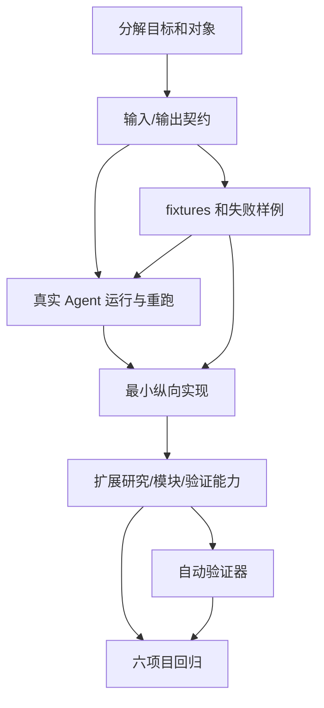

# stark-repo-analyzer-skill 保真移植与 Graphify 增强任务分解

## 1. 目标

把当前仓库保真移植成一个可安装、可触发、可验证的仓库架构分析 skill：参考 `repo-analyzer` 的流程、设计和逻辑保持不变，只在必要位置加入 Graphify 结构证据增强。

用户最终应当能够给它一个本地仓库或公开仓库地址，skill 能够：

1. 获取并固定目标源码版本；
2. 在原分析流程开始前由 Agent 完成 Graphify Bootstrap 与 doctor preflight；通过 Graphify headless CLI 构建图谱后，由 doctor post-graph 验证，并生成作为侧车上下文的图谱地图；
3. 判断项目规模并选择分析模式；
4. 根据项目特征提出必要问题；
5. 按业务模块分析架构和设计权衡；
6. 生成带源码证据、Mermaid 图、覆盖率和限制说明的报告；
7. 用机器检查和人工抽查证明这次运行确实完成、哪些地方没有完成。

## 2. 不在当前目标内

- 不是先把 6 个项目全部重新分析一遍；它们是回归样本。
- 不是新建独立分析应用、任务调度服务或新的用户工作流；保留参考 skill 的 Agent-native 形态。
- 不是把参考报告原文复制成固定模板；必须保留按项目特征变化的分析。
- 不是把文档写得完整当成运行通过；必须有真实入口、退出码、日志和可重跑证据。
- 产品级 `deep` 不进入 V1，不能提前实现为硬要求；Graphify `--mode deep` 是 V1 强制的建图参数，不等同于产品分析档位。

## 3. 需要处理的对象

| 对象 | 要回答的问题 | 主要证据 | 后续产物 |
|---|---|---|---|
| 参考 skill 契约 | 输入、触发、阶段、输出和限制是什么？ | 参考 `SKILL.md`、README、references | 输入/输出契约 |
| 参考文件保真复制 | 哪些参考文件原样进入 V1，哪些位置允许 Graphify 差异？ | ADR-0012、参考目录 | 受限文件 diff |
| 目标 skill 包 | 用户如何安装和触发？ | 插件 metadata、skill frontmatter | `plugin.json`、`SKILL.md` |
| 源码获取 | 如何处理本地路径、URL、owner/repo 和固定 commit？ | 6 个本地源码 manifest | source adapter、metadata |
| 规模与模式 | 如何统计规模、排除内容、选择 standard？ | 6 份 baseline plan/coverage | sizing/mode contract |
| 上下文收集 | 如何读取 README、配置、开发文档和外部来源？ | research drafts、source logs | context/research flow |
| 自适应问题 | 如何从项目特征生成问题并等待决策？ | reference skill 阶段 4 | question protocol |
| 模块分析 | 如何划分模块、分配任务、读取源码和记录覆盖率？ | module drafts、coverage | analysis task contract |
| 报告融合 | 如何从草稿生成单一最终报告？ | 6 份最终报告 | report/output contract |
| 验证与重跑 | 如何判断通过、失败和两次运行差异？ | physical baseline gap | validators、run manifest |
| 环境预检 | Graphify、LLM、路径和输出隔离是否满足执行条件？ | ADR-0014、Graphify CLI | `acceptance/doctor.sh`、JSON 诊断 |
| Agent 编排 | 如何隔离写入、重试、监控和人工接管？ | reference module guide | orchestration contract |

## 4. 阶段分解

### D0 分解（当前阶段）

输出目标、对象表、任务依赖、第一批试验任务和通过条件。

通过条件：每个后续任务都有单一责任、固定输入、输出文件和验证方法；没有“实现整个 skill”这种不可验证的大任务。

### D1 契约标准化

把参考 skill 的行为拆成输入、输出、状态、失败和证据契约。此阶段不写分析实现，只写可检查的规格和 fixtures。

通过条件：能用契约解释 6 个 baseline 的共同结构和项目差异；冲突项被标为待决策。

### D2 最小物理运行

固定一个真实 Agent runtime、一个固定输入和 `click` 项目，跑出真实退出码、事件日志、metadata 和报告；再用同样输入重复一次。

通过条件：P2 真实调用和 P4 重复运行通过。失败时保留失败产物，不进入大规模实现。

### D3 最小纵向实现

只实现从输入到最终报告的一条最小链路：只读本地项目输入、doctor preflight、Graphify headless CLI 自动探测到的可用 LLM 引擎、隔离在 `$WORK_DIR/graphify-out/` 的有效图谱、doctor post-graph、图谱地图、原有规模扫描、一个核心模块的源码分析、报告输出和验证。doctor 是所有程序化检测的唯一入口；原 skill 的流程与判断责任不变。有效图谱必须同时具有可解析的 `graph.json`、`GRAPH_REPORT.md`、非空节点和完整来源；`click` 还必须证明一条可定位的 `EXTRACTED` 边。源码裁决一切图谱冲突，`INFERRED` 和 `AMBIGUOUS` 不得直接写成结论。doctor 非零时必须中止，只有其归类为网络超时、429 和 5xx 的错误可退避重试，最多两次。

通过条件：使用 `click` 和 `codex-plugin-cc` 两个项目完成，验证器能发现人为制造的缺失文件和错误 commit。

### D4 扩展能力

按独立对象扩展研究、动态提问、模块并行、交叉验证、覆盖率门控和 bounded scope。

通过条件：每新增一条能力都有独立 fixtures、失败案例和回归结果。

### D5 六项目回归

使用固定的 6 个本地源码仓库运行完整 `standard`，与参考输出基线比较结构、证据、主线、限制和覆盖率记录。

通过条件：差异可解释，未达标项有修正任务，不能用平均分隐藏单个项目失败。

## 5. 依赖关系

## 6. 第一批原子任务候选

| 编号 | 原子任务 | 输入 | 输出 | 验证 | 状态 |
|---|---|---|---|---|---|
| D01 | 固定最终目标和不做事项 | 用户目标、参考 skill、现有 baseline | 本文第 1/2 节 | 目标能用一句话说明；不做事项没有混入必需能力 | 完成 |
| D02 | 建立对象清单 | 参考文件、6 份报告、物理基线缺口 | 本文第 3 节 | 每个对象有证据和产物 | 完成 |
| D03 | 拆出 D0-D5 阶段 | 对象依赖 | 本文第 4/5 节 | 无循环依赖；每阶段有通过条件 | 完成 |
| D04 | 选择第一条最小纵向链路 | 用户确认、D1 契约草案 | `click` 输入 -> 有效 Graphify 图谱 -> 规模扫描 -> 核心模块源码验证 -> 最小报告 | 图谱为空时中止；范围已记录于 ADR-0003 | 完成 |
| D05 | 试做一个最小任务 | D04 | 一个可运行、可验证的 Graphify 闸门任务 | 无可用 LLM 或空图稳定失败；有效图谱任务连续两次成功，否则拆分任务 | 待确认 |

## 7. 分解阶段完成判定

分解阶段只有在以下条件满足时结束：

- 用户确认最终目标和不做事项；
- D1-D5 阶段边界被确认；
- 第一条最小纵向链路被选定；
- D04/D05 的输入、输出和验证规则明确；
- 未经确认不启动标准化验证器、真实 Agent 运行或正式重实现。
