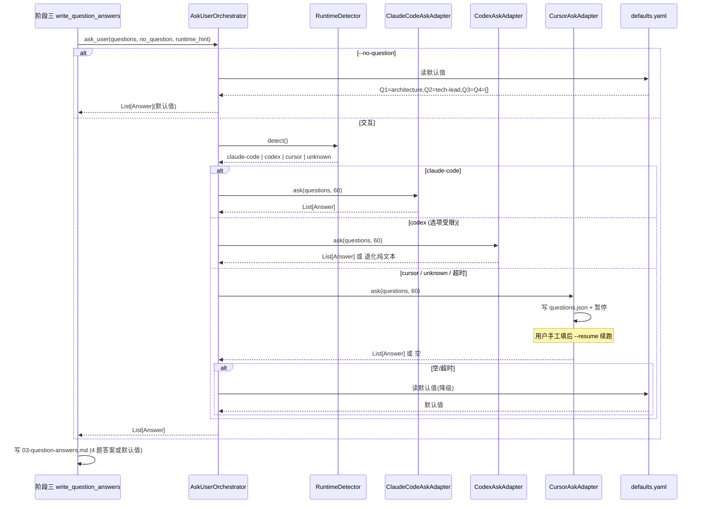
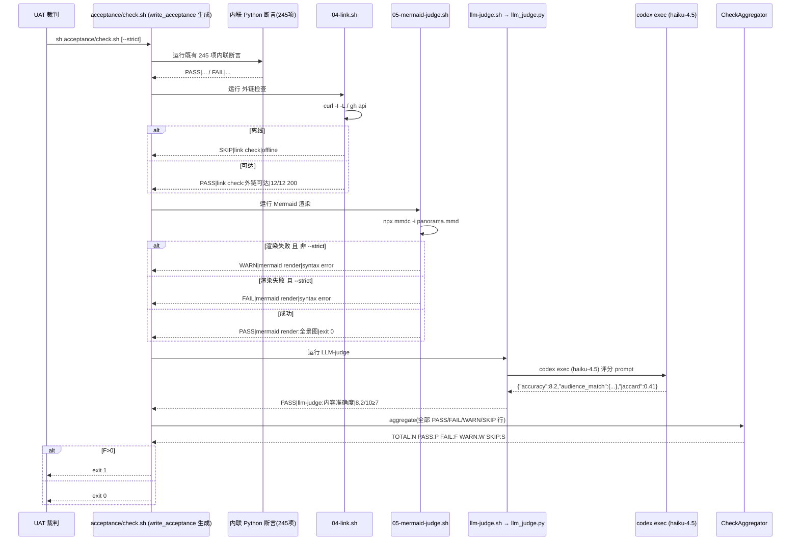
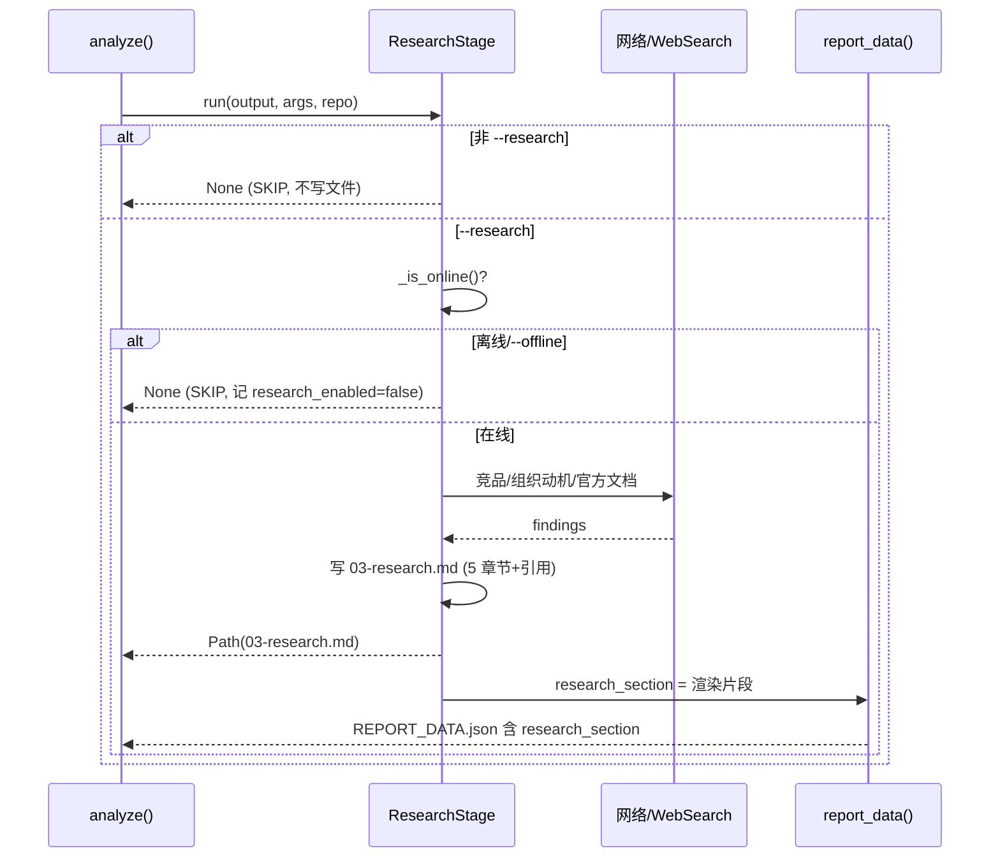
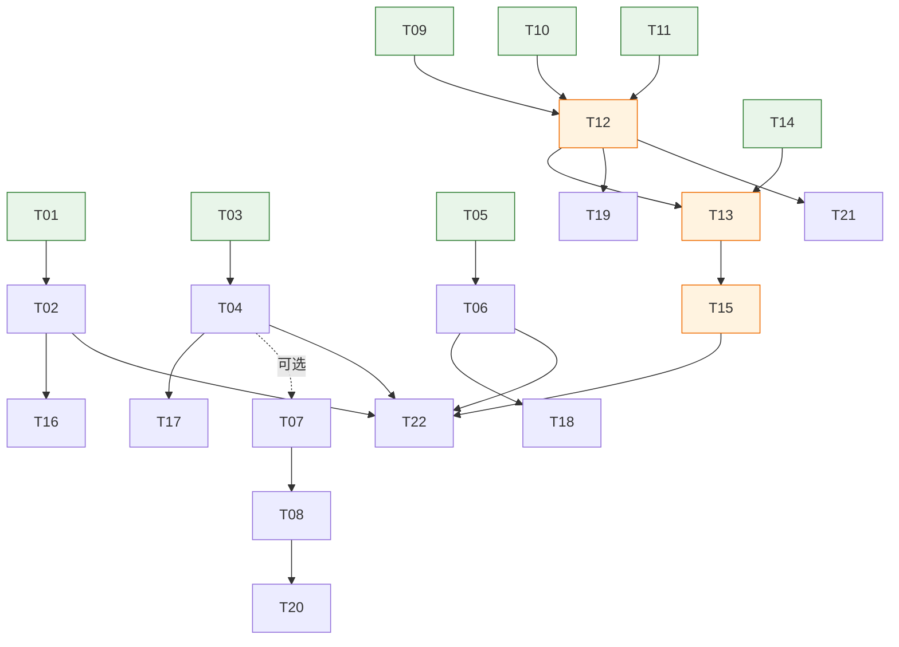

# 增量架构设计 + 任务分解：stark-repo-analyzer 未实现功能补齐

> 文档定位：本文件是对 `references/PRD_UNFINISHED_FEATURES.md` 的**增量架构设计 + 任务分解**，只做规划、不写实现代码。
> 基线现状：现有 skill 已通过完整智能闭环 UAT（run-005，`acceptance/check.sh` 245/245 PASS），`full PLAN 合规 = PARTIAL`。
> 本次是对**现有可用 skill 的增强（增量修改，非重写）**，7 项能力分属 A/B/C/D/E 五组。
>
> 本设计**全部基于实际代码事实**，关键事实已在各节标注；与 PRD/ADR 描述不符处以实际代码为准并说明理由。

---

## 1. 实现方案 + 框架选型

### 1.1 技术栈确认

- **沿用现有 Python 标准库栈**：`scripts/repo_analyzer.py` 是纯 stdlib（json / argparse / re / subprocess / pathlib / tempfile / os），**无任何第三方 Python 依赖**。
- **硬约束（来自 `SKILL.md` 边界「不安装额外依赖」）**：新增 Python 代码必须保持 stdlib-only。这是后续每项选型的最高优先级约束。

### 1.2 逐项依赖选型（含与 PRD/ADR 的偏差）

| 项 | 选型 | 是否必需 | 理由 / 偏差说明 |
|---|---|---|---|
| #2 `repo-types.yaml` 解析 | **新增 `RepoTypeLoader` + 受限 YAML 子集解析器**（stdlib） | 必需 | ⚠️ **关键偏差**：现有 `parse_simple_yaml()`（`repo_analyzer.py:312`）只支持「顶层 `k:v` + 单层嵌套 + `extends:` 列表」，**无法解析** PRD §5.1 的「list-of-dict + 内联列表 `patterns: [...]`」。且 `SKILL.md` 明确「不安装额外依赖」，故**不能用 PyYAML**。方案：写一个**专用的、受限 YAML 子集**加载器（见 §3 接口契约），仅支持本文件用到的结构。 |
| #1 `ask_user()` 适配器 | 纯 Python（stdlib），新增 `scripts/ask_user_adapters.py` | 必需 | 三个适配器用 Python 实现（ADR-0003 Open Q「用 Python 还是 Node」→ 以 skill 主语言 Python 为准，与现有代码一致）。ClaudeCode 适配器调用 `AskUserQuestion`（由 runtime 注入的 hook，Python 侧只负责构造 questions 并读回答案）；Codex/Cursor 适配器退化为 `questions.json` 写入 + `--resume`。 |
| #3 token 采集 | stdlib，复用现有 `agent-runs/*/attempt-*/metadata.json` 机制 | 必需 | ⚠️ **关键事实**：当前 `metadata.json`（`repo_analyzer.py:1007-1020`）**无 token 字段**。方案：在 agent 调用 prompt 中要求模型输出 `<!-- TOKENS: in,out -->` 标记（与现有 `<!-- MODULE_RESULT -->` 标记约定一致），`run_agent_task` 解析后写入 metadata，再经 `TokenCollector` 汇总。command 模式（fake-agent）无 token → 记 0。 |
| #4 外部调研 | stdlib，`--research` 开关（默认 OFF），离线时 SKIP | 必需（默认 OFF） | 复用现有 `--offline` 标志语义（`repo_analyzer.py:2615` 已存在、当前仅占位）。新增 `--research` 启用网络调研；`--offline` 或网络不可达时优雅 SKIP，不报错。不引入 Web 客户端库（沿用 runtime 的 WebSearch 能力或由文档固定来源列表决定）。 |
| #5 acceptance 执行器 | `mermaid-cli`（`npx mmdc`，可选 CLI）+ `codex`（`codex exec`，复用现有 agent 机制） | 部分可选 | ⚠️ **关键偏差**：ADR-0011 设想 5 个独立 `.sh`（01-grep…05-mermaid-judge），但**实际 `acceptance/check.sh` 是 `write_acceptance()`（`repo_analyzer.py:2317`）生成的一段内联 Python heredoc（245 项断言）**，并非 5 文件。方案：保留 check.sh 为编排入口，新增 3 个独立执行器脚本（`04-link.sh` / `05-mermaid-judge.sh` / `llm-judge.sh`），由 check.sh 调用并汇总（见 §4.2）。完全匹配 PRD 文件清单。 |
| #5 LLM-judge | 复用 `codex exec`（haiku-4.5），解析 JSON 评分 | 必需（agent 模式内） | 不新增模型客户端库；LLM-judge 即一次 `codex exec`，prompt 要求输出 `{"accuracy":n,"audience_match":{...},"jaccard":n}` 后解析。 |
| #6 tree-sitter benchmark | 复用现有 `tree_sitter_scan()`（`repo_analyzer.py:736`，串行 + 5MB chunked） | 必需 | tree-sitter CLI 已是现有 skill 的隐含依赖（ADR-0014）。benchmark = 用现有扫描函数跑 3 个真实仓库，记录基线写 `docs/benchmarks/tree-sitter-baseline.md`。新增 `scripts/benchmark_treesitter.py` 仅为可复跑的测量脚本（stdlib）。 |
| #7 `JUDGE.md` | 纯 Markdown，人工裁判撰写 | 必需 | 主 agent 仅生成证据索引，人工裁判签字（见待明确 Q8）。 |

### 1.3 架构原则

- **增量修改而非重写**：所有改动以「不破坏现有 245 项确定性验收」为前提；新增执行器以 WARN/SKIP 而非 FAIL 兜底。
- **行为不变契约（#2）**：`RepoTypeLoader.load(repo_type)` 必须返回与现有 `SLICES[repo_type]` **逐字节一致**的 `List[Tuple[str,str,Sequence[str]]]`，保证 `write_slices` / `write_repo_type` / `report_body` / `overview_report_body` / `report_data` 产出不变。
- **零新硬依赖**：所有新增 Python 均为 stdlib；`mermaid-cli` / `codex` 为可选 CLI，缺失时降级而非崩溃。

---

## 2. 文件列表及相对路径

> 路径相对项目根 `/Users/chuzu/projests/stark-repo-analyzer-skill`。标注 **[New]** / **[Modify]**。

### A 组（运行时适配 + 配置外置）

| 文件 | 状态 | 说明 |
|---|---|---|
| `config/repo-types.yaml` | **[New]** | 外置切片模板（6 类 repo + fallback），受限 YAML 子集，含 `version` 字段绑定 skill 版本 |
| `config/defaults.example.yaml` | **[New]** | `ask_user` 默认答案模板（Q1-Q4），首次运行自动生成 `~/.config/repo-analyzer/defaults.yaml` |
| `scripts/repo_types_loader.py` | **[New]** | `RepoTypeLoader` 类 + 受限 YAML 子集解析器（stdlib，无 PyYAML） |
| `scripts/ask_user_adapters.py` | **[New]** | `AskUserAPI` 抽象 + 3 适配器 + `detect_runtime()` + 降级链编排 |
| `scripts/repo_analyzer.py` | **[Modify]** | ① 删除 `SLICES` 常量；② 5 处 `SLICES[repo_type]` 改为 `RepoTypeLoader.load()`；③ `write_question_answers` 改为调用 ask_user 适配器；④ 接入 `--research` 与 research 阶段；⑤ `metadata.json` 增加 token 字段；⑥ `write_sla_report` / `write_performance_report` / `write_config_effective` 增加 token/research/repo_types 字段；⑦ `write_acceptance` 调用新执行器；⑧ `build_parser` 增加 `--research` 与 `--repo-types` |

### B 组（可观测性 / token）

| 文件 | 状态 | 说明 |
|---|---|---|
| `scripts/repo_analyzer.py` | **[Modify]** | `TokenCollector` 内聚（或独立 `scripts/token_collector.py`）；`run_agent_task` 解析 `<!-- TOKENS -->` 标记写入 metadata；SLA/PERFORMANCE 报告增加 token 字段 |

### C 组（可选外部调研）

| 文件 | 状态 | 说明 |
|---|---|---|
| `scripts/repo_analyzer.py` | **[Modify]** | 新增 `write_research()`：默认 OFF，启用且在线时产出 `03-research.md`，记入 `CONFIG_EFFECTIVE.json` 与 `report_data` 的 `research_section` |
| `templates/ANALYSIS_REPORT.overview.tmpl.md` | **[Modify]** | 增加 `{{ research_section }}` 占位（OFF 时为空，报告不出现调研段） |
| `templates/ANALYSIS_REPORT.tech-lead.tmpl.md` `business.tmpl.md` `learning.tmpl.md` | **[Modify]** | 同上（§0/§5 引用调研段） |

> 注：`scripts/render_report.py` **无需修改**——它已是通用 `{{ key }}` 替换（`render_report.py:16-24`），只要 `report_data()` 注入 `research_section` key 即可。

### D 组（验收强度 + 真实冲突验证）

| 文件 | 状态 | 说明 |
|---|---|---|
| `acceptance/04-link.sh` | **[New]** | 外链(http/https)检查：`curl -I -L` + `gh api` 校验 commit；离线 → SKIP |
| `acceptance/05-mermaid-judge.sh` | **[New]** | `npx mmdc` 渲染全景 Mermaid；缺失/失败 → WARN（除非 `--strict` → FAIL） |
| `acceptance/llm-judge.sh` | **[New]** | 调 `scripts/llm_judge.py`，输出 accuracy / audience_match / jaccard 评分断言 |
| `scripts/llm_judge.py` | **[New]** | LLM-judge 执行体：封装 `codex exec`（haiku-4.5）并解析 JSON 评分 |
| `acceptance/check.sh` | **[Modify]** | ⚠️ 实为 `write_acceptance()` 生成的 heredoc；需同步修改**生成函数**与**仓库内已提交的副本**。改为：调用 3 个执行器脚本 + 汇总 `PASS/FAIL/WARN/SKIP` 并打印 `TOTAL:` 行 |
| `tests/fixtures/conflict-repo/` | **[New]** | 真实 cross-ref 冲突 fixture 仓库（最小，可触发 `07-cross-ref-agent-review.md` 建议回退） |
| `tests/test_real_conflict_repair.py` | **[New]** | 真实冲突验证关卡：断言回退修复后 `[[module_x]]` 无断裂、报告达标 |

### E 组（benchmark + UAT 证据闭环）

| 文件 | 状态 | 说明 |
|---|---|---|
| `scripts/benchmark_treesitter.py` | **[New]** | 复用 `tree_sitter_scan()` 跑 3 仓库，生成基线文档 |
| `docs/benchmarks/tree-sitter-baseline.md` | **[New]** | Python / JS-TS / Go-Rust 三语言 parse/query 基线（耗时/内存峰值/chunked 跳过数） |
| `uat-evidence/run-005/JUDGE.md` | **[New]** | run-005 六维 5/5 评分表，引用 run-005 证据 |

### 跨切测试 / 文档

| 文件 | 状态 | 说明 |
|---|---|---|
| `tests/test_repo_types_loader.py` | **[New]** | 断言 6 类 repo 加载结果与 `SLICES` 逐字节一致；version 校验；fallback |
| `tests/test_ask_user_adapters.py` | **[New]** | 默认/单选/多选/超时/skip 五分支；3 运行时检测 |
| `tests/test_token_reporter.py` | **[New]** | metadata token 解析 + `TokenCollector.summary()` 汇总 |
| `tests/test_acceptance_executors.py` | **[New]** | 用 fake `mmdc` / fake `codex` 测 3 执行器输出格式与 SKIP/WARN/FAIL 行为 |
| `SKILL.md` | **[Modify]** | 注明三 runtime 调用方式（Q1）、`--research` 开关、3 个 acceptance 执行器与 `--strict` |
| `references/PLAN_COMPLIANCE.md` | **[Modify]** | 更新「延后实现」表，将对应项标记推进 |

---

## 3. 数据结构和接口（类图 + 接口表）

### 3.1 Mermaid 类图

```mermaid
classDiagram
    %% ===== A 组：配置外置 =====
    class RepoTypeLoader {
        +VERSION_BIND: str  %% 绑定 SKILL.md version (0.1.0)
        +load(repo_type: str) List~Tuple[str,str,Sequence[str]]~
        +load_all() Dict
        +fallback() List~Tuple[str,str,Sequence[str]]~
        +version() int
        -_parse(text: str) Dict
        -_validate(data: Dict)
    }

    %% ===== A 组：ask_user 适配器 =====
    class AskUserAPI {
        <<interface>>
        +ask(questions: List~Question~, timeout_sec: int = 60) List~Answer~
    }
    class Question {
        +key: str
        +header: str
        +prompt: str
        +options: List~Option~
        +multi_select: bool
    }
    class Option {
        +label: str
        +description: str
    }
    class Answer {
        +key: str
        +selected: List~str~
        +notes: str
    }
    class ClaudeCodeAskAdapter {
        +ask(questions, timeout_sec) List~Answer~
    }
    class CodexAskAdapter {
        +ask(questions, timeout_sec) List~Answer~
    }
    class CursorAskAdapter {
        +ask(questions, timeout_sec) List~Answer~
    }
    class RuntimeDetector {
        +detect() str  %% claude-code | codex | cursor | unknown
    }
    class AskUserOrchestrator {
        +ask_user(questions, no_question: bool, runtime_hint: str) List~Answer~
        -_degrade_to_defaults() List~Answer~
        -_read_defaults_yaml() Dict
    }

    AskUserAPI <|.. ClaudeCodeAskAdapter
    AskUserAPI <|.. CodexAskAdapter
    AskUserAPI <|.. CursorAskAdapter
    AskUserOrchestrator ..> AskUserAPI : uses
    AskUserOrchestrator ..> RuntimeDetector : detect
    AskUserOrchestrator ..> Answer : produces
    Question *-- Option
    AskUserAPI ..> Question : consumes
    AskUserAPI ..> Answer : returns

    %% ===== B 组：token 采集 =====
    class TokenCollector {
        +record(run_id: str, tokens_in: int, tokens_out: int)
        +record_attempt(metadata: Dict)
        +summary() Dict  %% {total_in,total_out,total,budget,per_attempt:[]}
    }

    %% ===== C 组：研究阶段 =====
    class ResearchStage {
        +run(output: Path, args, repo: Path) Optional~Path~
        -_is_online() bool
        -_write_report(output, findings) Path
    }

    %% ===== D 组：acceptance 执行器契约 =====
    class AcceptanceExecutor {
        <<interface>>
        +run(root: Path, strict: bool) List~str~  %% 返回 PASS|.../FAIL|.../WARN|.../SKIP|... 行
    }
    class LinkChecker {
        +run(root, strict) List~str~
    }
    class MermaidJudge {
        +run(root, strict) List~str~
    }
    class LLMJudge {
        +run(root, strict) List~str~
    }
    class CheckAggregator {
        +aggregate(lines: List~str~) Dict  %% {total,pass,fail,warn,skip}
        +emit_summary()
    }
    AcceptanceExecutor <|.. LinkChecker
    AcceptanceExecutor <|.. MermaidJudge
    AcceptanceExecutor <|.. LLMJudge
    CheckAggregator ..> AcceptanceExecutor : invokes

    %% ===== 既有被改动类（标注 Modify） =====
    class RepoAnalyzer {
        +SLICES: Dict  %% 【删除】
        +write_question_answers(output, no_question, mode)  %% 【改为调 ask_user】
        +write_slices(repo, output, repo_type, files)  %% 【SLICES -> loader】
        +write_research(output, args, repo)  %% 【新增】
        +write_acceptance(output)  %% 【调 3 执行器 + 汇总】
        +write_sla_report(...)  %% 【+token】
        +write_performance_report(...)  %% 【+token】
        +run_agent_task(...)  %% 【+TOKENS 标记解析】
    }
    RepoAnalyzer ..> RepoTypeLoader : load()
    RepoAnalyzer ..> AskUserOrchestrator : ask_user()
    RepoAnalyzer ..> TokenCollector : record()
    RepoAnalyzer ..> ResearchStage : run()
    RepoAnalyzer ..> CheckAggregator : aggregate()
```

### 3.2 关键接口契约表

| 模块 | 接口 / 签名 | 行为约定 |
|---|---|---|
| `RepoTypeLoader` | `load(repo_type: str) -> List[Tuple[str, str, Sequence[str]]]` | 返回 `(filename, label, patterns)` 三元组列表，顺序与现有 `SLICES[repo_type]` **逐字节一致**；未知类型回退 `fallback()`。 |
| `RepoTypeLoader` | `version() -> int` / `fallback() -> List[...]` | `version` 与 `SKILL.md version: 0.1.0` 绑定校验，不匹配 → `SystemExit`（清晰报错）。 |
| `AskUserAPI.ask` | `ask(questions: List[Question], timeout_sec: int = 60) -> List[Answer]` | 返回与 `questions` 同序的 `Answer` 列表；超时/不支持 → 抛 `AskTimeout` 或返回空，交编排器降级。 |
| `ClaudeCodeAskAdapter.ask` | 同上 | 调用 runtime 注入的 `AskUserQuestion`（2-4 选项 + multiSelect）。 |
| `CodexAskAdapter.ask` | 同上 | 选项受限时退化为纯文本 prompt；不支持结构化则降级。 |
| `CursorAskAdapter.ask` | 同上 | 写入 `questions.json` 并暂停，等待 `--resume` 续跑。 |
| `detect_runtime()` | `-> str`（`claude-code`/`codex`/`cursor`/`unknown`） | 检测顺序：环境变量 `REPO_ANALYZER_RUNTIME` → 进程特征（`CLAUDECODE`/`CODEX`/`CURSOR` 等）→ `unknown`。 |
| `ask_user()` | `(questions, no_question: bool, runtime_hint: str) -> List[Answer]` | 降级链：原生交互 → 写 `questions.json`+暂停 → 读 `defaults.yaml`；`--no-question` 直接读默认值（Q1=architecture, Q2=tech-lead, Q3=Q4=[]）。 |
| `TokenCollector.record` | `(run_id, tokens_in, tokens_out)` / `record_attempt(metadata)` | 累加 per-attempt token；`summary()` 返回 `{total_in,total_out,total,budget:500000,per_attempt:[]}`。 |
| `ResearchStage.run` | `(output, args, repo) -> Optional[Path]` | `--research` 且在线 → 写 `03-research.md` 返回路径；否则返回 `None`（SKIP）。 |
| `AcceptanceExecutor.run` | `(root: Path, strict: bool) -> List[str]` | 每个执行器输出若干行，格式 `STATUS|name|detail`，`STATUS ∈ {PASS,FAIL,WARN,SKIP}`。 |
| `LinkChecker.run` | 同上 | `curl -I -L --max-time 10` 查 http(s) 200/非5xx；`gh api` 查 commit；离线 → `SKIP`。 |
| `MermaidJudge.run` | 同上 | `npx mmdc -i <panorama.mmd> -o <out.svg>`；缺失/失败 → `WARN`（非 `--strict`）；`--strict` → `FAIL`。 |
| `LLMJudge.run` | 同上 | 调 `scripts/llm_judge.py`（`codex exec` haiku-4.5），解析 `accuracy≥7` / `audience_match` / `jaccard≥0.30`。 |
| `CheckAggregator.aggregate` | `(lines) -> {total,pass,fail,warn,skip}` | 汇总所有执行器输出；`FAIL>0` → `sys.exit(1)`（保持现有行为）；`WARN/SKIP` 不致命。 |

### 3.3 artifact 文件名约定（跨模块）

| artifact | 触发 | 消费者 |
|---|---|---|
| `03-question-answers.md` | 阶段三（必产） | 阶段四模板映射 |
| `03-research.md` | `--research` 且在线 | `report_data.research_section` → 报告 §0/§5 |
| `02a-repo-type.yaml` | 阶段二a | 阶段四模板选择 |
| `agent-runs/*/attempt-*/metadata.json` | 每次 agent 调用 | `TokenCollector`（token 字段）+ PERFORMANCE 报告 |
| `acceptance/check.sh` | 阶段末 | UAT 裁判 `sh acceptance/check.sh` |
| `docs/benchmarks/tree-sitter-baseline.md` | benchmark 任务 | 回归阈值参考 |

---

## 4. 程序调用流程（时序图）

### 4.1 `ask_user` 三运行时交互 + 降级链



### 4.2 acceptance 流水线：新增执行器挂接



### 4.3 外部调研阶段（可选）



---

## 5. 任务列表（核心：有序 + 依赖 + 验收点）

> 规则：P1 三项（#1 #2 #3）= T01-T06，**全程并行**；关键路径（PRD 最小补齐）：**T14(benchmark) → T13(真实冲突) → T12(acceptance) → T15(JUDGE.md)**。
> 列：任务ID | 功能组 | 动作 | 依赖 | 验收点(可测) | 涉及文件。

| 任务ID | 功能组 | 动作 | 依赖 | 验收点(可测) | 涉及文件 |
|---|---|---|---|---|---|
| **T01** | A·#2 | 新建 `RepoTypeLoader` + 受限 YAML 子集解析器；写 `config/repo-types.yaml`（6 类 + fallback + version）。 | — | `RepoTypeLoader.load(t)` 对 6 类返回与 `SLICES[t]` 顺序/内容一致的三元组；`version()`==1；未知类型返回 fallback；version 不匹配 `SystemExit`。 | `scripts/repo_types_loader.py`(New), `config/repo-types.yaml`(New) |
| **T02** | A·#2 | 删除 `SLICES` 常量；将 5 处 `SLICES[repo_type]`（`write_slices:1446`、`report_body:1861`、`overview_report_body:2029`、`report_data:2098`、`classify-repo:2540`）改为 `RepoTypeLoader.load(repo_type)`。 | T01 | 对 6 类 repo 跑 `analyze`，`slices/*.xml`、`02a-repo-type.yaml`、三份报告与改前**逐字节一致**（diff 为空）；245 项验收仍 PASS。 | `scripts/repo_analyzer.py`(Modify) |
| **T03** | A·#1 | 新建 `ask_user_adapters.py`：`AskUserAPI` 抽象 + `ClaudeCodeAskAdapter`/`CodexAskAdapter`/`CursorAskAdapter` + `detect_runtime()` + `ask_user()` 编排（降级链）。 | — | 单测：3 运行时检测正确；降级链在超时/unknown 时落到 `defaults.yaml`。 | `scripts/ask_user_adapters.py`(New) |
| **T04** | A·#1 | 新建 `config/defaults.example.yaml`（Q1-Q4 默认值）；首次运行自动生成 `~/.config/repo-analyzer/defaults.yaml`；改 `write_question_answers` 调 `ask_user()`。 | T03 | `--no-question` 下 `03-question-answers.md` 含 4 题默认值；交互路径（fake adapter）写入答案；首次运行生成 defaults.yaml。 | `scripts/repo_analyzer.py`(Modify), `config/defaults.example.yaml`(New) |
| **T05** | B·#3 | 新增 `TokenCollector`；`run_agent_task` 解析 `<!-- TOKENS: in,out -->` 标记写入 `metadata.json`（新增 `tokens_in/tokens_out`）。 | — | codex 模式 agent attempt 的 `metadata.json` 含 `tokens_in/tokens_out`；command 模式为 0；`TokenCollector.summary()` 汇总正确。 | `scripts/repo_analyzer.py`(Modify) |
| **T06** | B·#3 | `write_sla_report`/`write_performance_report`/`write_config_effective` 增加 token 字段（used/budget=500K，红黄绿）；确定性模式 token=0 不报错。 | T05 | `PERFORMANCE_REPORT.json` 的 `agent_attempts[]` 含 `tokens_in/out/total`；`SLA_REPORT.md` 含 `token_used/token_budget(500K)` 与越界红/黄/绿；确定性模式 token=0。 | `scripts/repo_analyzer.py`(Modify) |
| **T07** | C·#4 | 新增 `ResearchStage.run()` + `--research` 标志（默认 OFF）；`--offline` 或离线时 SKIP；写入 `03-research.md` 与 `report_data.research_section`。 | T04(可选) | 默认 OFF 无 `03-research.md` 且报告无调研段；`--research` 且在线时 `03-research.md` 含 5 章节且被报告引用；`CONFIG_EFFECTIVE.json` 记 `research_enabled`。 | `scripts/repo_analyzer.py`(Modify) |
| **T08** | C·#4 | 4 个报告模板增加 `{{ research_section }}` 占位（OFF 时为空）。 | T07 | 模板渲染后 OFF 不含调研段；ON 含调研段；`render_report.py` **不改**。 | `templates/*.tmpl.md`(Modify) |
| **T09** | D·#5 | 新建 `acceptance/04-link.sh`：外链 `curl -I -L` + `gh api` commit 校验；离线 → SKIP。 | — | 脚本对含 http(s) 链接的产物输出 `PASS|link check:...`；离线输出 `SKIP|...`；格式 `STATUS|name|detail`。 | `acceptance/04-link.sh`(New) |
| **T10** | D·#5 | 新建 `acceptance/05-mermaid-judge.sh`：`npx mmdc` 渲染全景图；缺失/失败 → WARN（非 `--strict`）。 | — | 有合法 mermaid 时输出 `PASS|mermaid render:全景图`；无 mmdc 时输出 `WARN|...`；`--strict` 时 FAIL。 | `acceptance/05-mermaid-judge.sh`(New) |
| **T11** | D·#5 | 新建 `scripts/llm_judge.py` + `acceptance/llm-judge.sh`：调 `codex exec`(haiku-4.5) 解析 accuracy/audience_match/jaccard；阈值 accuracy≥7、jaccard≥0.30。 | — | 用 fake codex 返回 JSON 时输出 `PASS|llm-judge:内容准确度|8.2/10≥7` 等；阈值不达标 → FAIL。 | `scripts/llm_judge.py`(New), `acceptance/llm-judge.sh`(New) |
| **T12** | D·#5 | 改 `write_acceptance()`：调用 T09/T10/T11 三个执行器 + 汇总 `PASS/FAIL/WARN/SKIP` + 打印 `TOTAL:` 行；同步更新**仓库内已提交**的 `acceptance/check.sh` 副本。 | T09,T10,T11 | `sh acceptance/check.sh` 出口含 `TOTAL:N PASS:P FAIL:F WARN:W SKIP:S`；项总数 = 245 + 新增；`FAIL>0` 仍 exit 1；WARN/SKIP 不致命。 | `scripts/repo_analyzer.py`(Modify), `acceptance/check.sh`(Modify) |
| **T13** | D·真实冲突(补齐②) | 新建 `tests/fixtures/conflict-repo/`（最小真实 cross-ref 冲突）+ `tests/test_real_conflict_repair.py`：断言回退修复后 `07-cross-ref-agent-review.md` 建议回退且 `[[module_x]]` 无断裂。 | T12,T14 | fixture 跑 `analyze` 后 review 建议回退指定模块；REPAIR 后 wikilink 无断裂；该测试作为 #5 前置验证关卡通过。 | `tests/fixtures/conflict-repo/`(New), `tests/test_real_conflict_repair.py`(New) |
| **T14** | E·#6 | 新建 `scripts/benchmark_treesitter.py`：复用 `tree_sitter_scan()` 跑 pydantic(Py)/kubernetes(Go)/turborepo(TS-JS) 三仓库，记录耗时/内存峰值/chunked 跳过数，生成基线文档。 | — | 产出 `docs/benchmarks/tree-sitter-baseline.md`，≥3 仓库各含总耗时/内存峰值/chunked 跳过文件数；benchmark 脚本可复跑。 | `scripts/benchmark_treesitter.py`(New), `docs/benchmarks/tree-sitter-baseline.md`(New) |
| **T15** | E·#7 | 补 `uat-evidence/run-005/JUDGE.md`：六维 5/5 评分表，引用 run-005 的 prompt/会话日志/退出码/产物/重跑日志。 | T13 | 文件含 6 维评分表且每维 5/5 + 理由；引用 run-005 证据；结论判定 6 维全 5/5 通过。 | `uat-evidence/run-005/JUDGE.md`(New) |
| **T16** | A·#2 测试 | `tests/test_repo_types_loader.py`：6 类加载结果与 `SLICES` 逐字节一致；version 校验；fallback。 | T02 | 单测覆盖 6 类对比 + 未知类型 fallback + version 不匹配报错。 | `tests/test_repo_types_loader.py`(New) |
| **T17** | A·#1 测试 | `tests/test_ask_user_adapters.py`：默认/单选/多选/超时/skip 五分支 + 3 运行时检测。 | T04 | 五分支 + 检测单测 PASS；符合 ADR-0003 验收分支。 | `tests/test_ask_user_adapters.py`(New) |
| **T18** | B·#3 测试 | `tests/test_token_reporter.py`：`<!-- TOKENS -->` 解析 + `TokenCollector.summary()` + 报告字段。 | T06 | metadata token 解析正确；summary 汇总正确；SLA/PERFORMANCE 含 token 字段。 | `tests/test_token_reporter.py`(New) |
| **T19** | D·#5 测试 | `tests/test_acceptance_executors.py`：用 fake `mmdc`/fake `codex` 测 3 执行器输出格式与 SKIP/WARN/FAIL 行为（沿用现有 `install_fake_*` 约定）。 | T12 | 3 执行器在 fake 环境下输出符合 `STATUS|name|detail`；离线→SKIP、无 mmdc→WARN、阈值不达标→FAIL。 | `tests/test_acceptance_executors.py`(New) |
| **T20** | C·#4 测试 | `tests/` 中 research 单测：OFF 无文件/无调研段；ON 且在线有文件并被引用（用 fake web fetcher 或本地 fixtures）。 | T08 | OFF 断言无 `03-research.md` 且报告无调研段；ON 断言文件存在且报告含 `research_section`。 | `tests/test_repo_analyzer_cli.py`(Modify) 或新文件 |
| **T21** | 文档 | `SKILL.md` 注明三 runtime 调用方式（Q1）、`--research` 开关、3 个 acceptance 执行器与 `--strict`。 | T12,T07 | SKILL.md 含 runtime 用法段落、`--research` 说明、acceptance 执行器清单。 | `SKILL.md`(Modify) |
| **T22** | 收尾 | `references/PLAN_COMPLIANCE.md` 更新「延后实现」表，将 #1-#7 标记推进。 | T15,T12,T06,T02,T04 | PLAN_COMPLIANCE 对应项更新，`full PLAN 合规` 结论推进。 | `references/PLAN_COMPLIANCE.md`(Modify) |

**并行度说明**：
- `T01,T03,T05,T09,T10,T11,T14` 互不依赖，可并行起步。
- `T02←T01`、`T04←T03`、`T06←T05`、`T08←T07`、`T12←{T09,T10,T11}`、`T13←{T12,T14}`、`T15←T13` 为关键路径链。
- P1（#1 #2 #3）对应 T01-T06，全部可在关键路径之外并行推进。

---

## 6. 依赖包列表

| 包 | 类型 | 必需/可选 | 安装方式 | 说明 |
|---|---|---|---|---|
| Python 标准库（json/argparse/re/subprocess/pathlib…） | Python | 必需 | 随 Python 3.10+ | 全部新增 Python 代码仅用 stdlib；**不使用 PyYAML**。 |
| `mermaid-cli`（`@mermaid-js/mermaid-cli`，提供 `mmdc`） | npm CLI | **可选** | `npx @mermaid-js/mermaid-cli`（无需预装） | 仅 `05-mermaid-judge.sh` 用；缺失 → WARN（非 `--strict`）。 |
| `tree-sitter` CLI | 系统 CLI | 必需（现有 skill 已依赖，ADR-0014） | 各平台包管理器 | benchmark 与覆盖率门控共用；已存在。 |
| `codex` CLI | 系统 CLI | 必需（agent 模式已依赖） | 官方安装 | LLM-judge 与现有 module agent 共用；已存在。 |
| `gh` CLI | 系统 CLI | 可选 | GitHub CLI | 仅 `04-link.sh` 校验 commit 引用；缺失 → 该项 SKIP。 |
| `curl` | 系统 CLI | 必需（通常自带） | OS | `04-link.sh` 外链检查。 |
| PyYAML | Python | **不引入** | — | ⚠️ 因 `SKILL.md`「不安装额外依赖」硬约束，明确**不采用**；`repo-types.yaml` 由专用 `RepoTypeLoader` 解析。 |

---

## 7. 共享知识（跨文件约定）

1. **`CONFIG_EFFECTIVE.json` 字段扩展约定**（沿用现有扁平结构，`write_config_effective`）：
   - 新增 `research_enabled: bool`
   - 新增 `tokens_in: int` / `tokens_out: int` / `tokens_total: int` / `token_budget: 500000`
   - 新增 `repo_types_version: int` / `repo_types_source: "file"|"fallback"`
   - 保持既有 `mode/no_question/agent_*/sla_*` 字段不变。

2. **env 覆盖命名约定（延续 `env_config()`）**：统一 `REPO_ANALYZER_*` 前缀。新增映射：
   - `REPO_ANALYZER_RESEARCH` → `research` (bool)
   - `REPO_ANALYZER_RUNTIME` → `runtime_hint` (str，覆盖 `detect_runtime()`)
   - 既有 `REPO_ANALYZER_NO_QUESTION` / `REPO_ANALYZER_OFFLINE` / `REPO_ANALYZER_AGENT_*` 已存在，不变。

3. **artifact 文件名约定**（见 §3.3）：`03-question-answers.md`（必产）、`03-research.md`（可选）、`02a-repo-type.yaml`、`agent-runs/*/attempt-*/metadata.json`、`acceptance/check.sh`。

4. **`version` 字段与 skill 版本绑定**：`config/repo-types.yaml` 的 `version` 须等于 `SKILL.md` 的 `version: 0.1.0`（数字 1）。`RepoTypeLoader` 加载时校验，不匹配 → `SystemExit` 并提示「repo-types.yaml version 与 skill 0.1.0 不一致，请同步升级」。

5. **降级默认值统一来源**：`~/.config/repo-analyzer/defaults.yaml`（首次运行由 `config/defaults.example.yaml` 自动生成，`extends:` 继承语法沿用现有 `parse_simple_yaml` 的 `extends` 列表能力）。默认值：Q1=architecture、Q2=tech-lead、Q3=[]、Q4=[]。

6. **acceptance 项注册约定（让新执行器能被 check.sh 汇总）**：
   - 每个执行器是独立脚本，向 stdout 输出若干行，格式严格为 `STATUS|name|detail`，`STATUS ∈ {PASS, FAIL, WARN, SKIP}`。
   - `check.sh`（生成函数 `write_acceptance`）在既有的 245 项内联断言之后，**依次调用** `04-link.sh` / `05-mermaid-judge.sh` / `llm-judge.sh`，把所有输出行收集后交给 `CheckAggregator.aggregate()`。
   - 汇总后打印 `TOTAL:N PASS:P FAIL:F WARN:W SKIP:S`；`FAIL>0` → `sys.exit(1)`（保持现有失败即非零退出）；`WARN`/`SKIP` 不计入失败。
   - 注：当前 `acceptance/check.sh` 是**生成产物**（`write_acceptance` 的 heredoc），仓库内另有一份**已提交副本**需手动保持同步（T12 两者同改）。

7. **token 标记约定**：agent prompt 中要求模型在末尾输出 `<!-- TOKENS: <in>,<out> -->`（与现有 `<!-- MODULE_RESULT -->` 标记体系一致）；`run_agent_task` 用正则提取写入 `metadata.json`。command 模式无标记 → tokens=0。

8. **Mermaid 依赖与 fallback 约定**：`05-mermaid-judge.sh` 通过 `command -v mmdc || npx @mermaid-js/mermaid-cli` 调用；命令不存在或渲染非零退出 → 默认 `WARN`（不阻断 245+ 验收）；仅当 `check.sh` 带 `--strict` 时才 `FAIL`。

9. **外链检查网络策略约定**：`04-link.sh` 先探测网络（如 `curl -I --max-time 5 https://github.com`）；不可达 → 整段 `SKIP`（离线友好），不 FAIL；`--strict` 下不可达才 FAIL。

---

## 8. 待明确事项（Open Questions 架构层建议）

| # | 问题 | 架构层建议 / 需拍板方 |
|---|---|---|
| **Q1** 三运行时清单 | ADR-0003 写 Claude Code / Codex CLI / Cursor；team-lead 提示 codex/command/? | **建议以 ADR-0003 三运行时为准**（claude-code / codex / cursor），`detect_runtime()` 检测顺序见 §3.2。注意现有 `--agent-mode` 有 `codex`/`command` 两种（command 是用户自定义命令），与「运行时」正交；运行时决定**提问方式**，agent-mode 决定**判断执行方式**，二者解耦。需用户在 SKILL.md 确认三 runtime 调用示例。 |
| **Q2** token 数据源 | `metadata.json` 当前无 token 字段 | **建议**：复用现有 agent 机制——在 prompt 中要求模型输出 `<!-- TOKENS: in,out -->` 标记（与 `<!-- MODULE_RESULT -->` 一致），`run_agent_task` 解析写入 `metadata.json`；command 模式（无 LLM）记 0。备选：解析 `codex` JSON 输出。标记方案为主、JSON 解析为辅。**无需改 agent 协议**。 |
| **Q3** benchmark 仓库 | ADR-0014 提 pydantic/kubernetes/turborepo（Py/Go/TS-JS） | **建议沿用 ADR-0014 三仓库**（已覆盖 Python/Go/JS-TS），Rust 作为可选第 4 个（不在最小补齐强制项）。`benchmark_treesitter.py` 接受仓库列表参数，便于扩展。 |
| **Q4** LLM-judge 模型与预算 | ADR-0011 提 haiku-4.5 vs sonnet-4.6 | **建议 haiku-4.5**（控成本），单次约 8 调用 ≈ 20 万 token，从 SLA 500K 预留 4%（ADR-0007 已约定）。阈值：accuracy≥7、jaccard≥0.30（沿用 ADR-0011）。预算由 `TokenCollector` 统一计入。 |
| **Q5** 外链检查网络策略 | CI/离线是否允许出网 | **建议默认 SKIP（离线友好）**，仅 `--strict` 或显式 `--check-links` 才 FAIL（见 §7.9）。CI 默认不带网络时不污染验收。 |
| **Q6** repo-types version 绑定与迁移 | 去 SLICES 后 fallback 与 version 联动 | **建议保留 `fallback_dimensions` 12 维硬套**作为未知类型回退并打 warning；`version` 字段绑定 `SKILL.md 0.1.0`，不匹配 `SystemExit`（见 §7.4）。因 stdlib-only 约束，用专用 `RepoTypeLoader` 而非 PyYAML（见 §1.2）。 |
| **Q7** Mermaid 依赖与 fallback | mmdc 是否可选、失败是否致命 | **建议可选依赖 + 默认 WARN**，仅 `--strict` 致命（见 §7.8）。与现有「不把可选依赖变硬失败」原则（SKILL.md 边界）一致。 |
| **Q8** JUDGE.md 作者 | run-005 由谁撰写 | **建议人工裁判撰写并签字**，主 agent 仅提供证据索引（prompt/日志/退出码/产物/重跑日志）。架构上 `uat-evidence/run-005/JUDGE.md` 为人工产出，不在自动化流水线内生成。 |
| **Q9** 真实冲突 fixture 来源 | claude-video 真实捕获 vs 构造最小 fixture | **建议双轨**：先用 claude-video（run-005 真实产物）做端到端验证，同时新增 `tests/fixtures/conflict-repo/`（最小真实 cross-ref 冲突仓库）做可回归单元测试（T13）。fixture 不依赖网络/外部仓库，保证 CI 可跑。 |

---

## 9. 任务依赖图



> 图例：绿色 = 可并行起步的任务；橙色 = 关键路径链（benchmark → 真实冲突 → acceptance → JUDGE.md）。P1（#1 #2 #3）= T01-T06 独立于关键路径之外并行。
