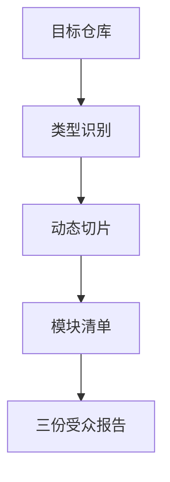

# {{ project_name }} 分析总览

> 元信息：目标 `{{ source }}`；Repo 类型 `{{ repo_type }}`；报告由 repo-analyzer 模板渲染器生成。

## 0. 读者导航
- 技术负责人：读 `ANALYSIS_REPORT.tech-lead.md`
- 业务负责人：读 `ANALYSIS_REPORT.business.md`
- 学习者：读 `ANALYSIS_REPORT.learning.md`
- 复查证据：读 `02a-manifest-card.md`、`05-module-ids.yaml`、`08-coverage.md`、`STATE_REPORT.md`

## 1. 总览摘要
- 项目识别名：{{ readme_title }}
- 主要语言：{{ language_line }}
- 文件总数：{{ file_count }}

README 摘要：
{{ readme_points }}

## 2. 架构地图


## 3. 核心模块
| 模块 ID | 路径/分组 | 文件数 |
|---|---|---:|
{{ module_table }}

## 4. API 与运行入口
### 对外工具/API 表面
{{ tool_lines }}

### 运行命令候选
{{ commands }}

## 5. 证据切片
{{ slice_links }}

## 6. 复现方法
```bash
python3 scripts/repo_analyzer.py {{ source }} --output analysis --mode all --no-question
```
{{ failed_section }}
