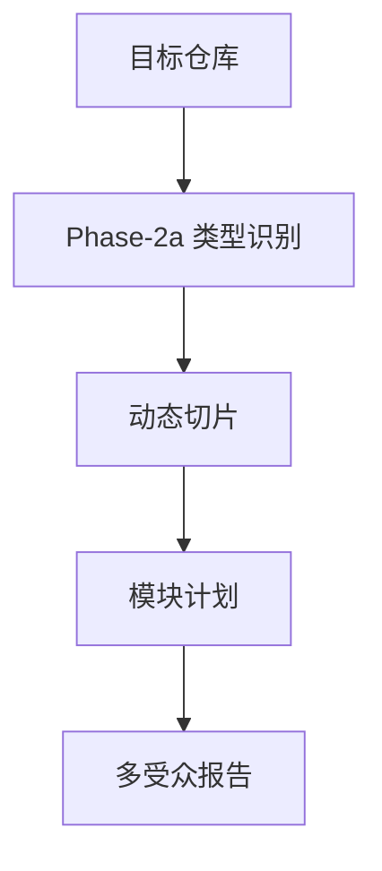

# {{ project_name }} 架构分析报告（tech-lead）

> 元信息：目标 `{{ source }}`；Repo 类型 `{{ repo_type }}`；报告由 repo-analyzer 模板渲染器生成。

## 0. TL;DR
- 项目识别名：{{ readme_title }}
- 主要语言：{{ language_line }}
- 当前报告已完成确定性扫描、动态切片、模块候选、对外工具/API 表面和复现入口；需要主观评价的部分可交给后续 subagent 深化。

## 1. 场景化问题引入
该仓库被识别为 `{{ repo_type }}`。本 skill 先用本地文件、manifest、git 历史和切片产物建立分析底料，再让 agent 做业务模块判断，避免把确定性步骤交给 LLM 猜。

README 摘要：
{{ readme_points }}

## 2. 架构全景


## 3. 核心模块清单
| 模块 ID | 路径/分组 | 文件数 |
|---|---|---:|
{{ module_table }}

### 关键符号入口
{{ symbol_lines }}

### 对外工具/API 表面
{{ tool_lines }}

## 4. 第三方依赖与版本基线
依赖线索见 `slices/09-dependencies.xml`。当前扫描未引入外部依赖解析库，只保留原始 manifest 作为后续判断证据。

{{ manifest_section }}

## 5. 工程成熟度
- 文件总数：{{ file_count }}

### 已生成切片
{{ slice_links }}

### 运行命令候选
{{ commands }}

### 文件结构快照
{{ tree }}

{{ audience_section }}

## 7. 架构评价
当前版本完成了不依赖 LLM 的确定性分析：类型识别、文件切片、模块候选、对外工具/API 表面、依赖基线、运行命令候选和报告索引。设计优点是可重放、低依赖、证据可追到文件与行号；限制是业务价值排序和架构优劣判断仍属于主观分析，建议由后续 subagent 基于这些底料继续深化。

## 8. 复现方法
```bash
python3 scripts/repo_analyzer.py {{ source }} --output analysis --no-question
```

## 9. 附录
- 类型识别：`02a-repo-type.yaml`
- 项目名片：`02a-manifest-card.md`
- 覆盖率门控：`08-coverage.md`
- 状态报告：`STATE_REPORT.md`
{{ failed_section }}
