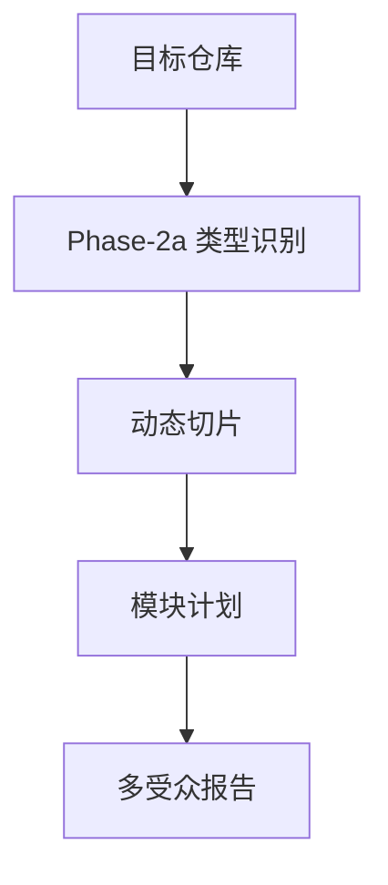

# /watch 架构分析报告（tech-lead）

> 元信息：目标 `https://github.com/bradautomates/claude-video`；Repo 类型 `multi-agent-config`；报告由确定性 repo-analyzer CLI 生成。

## 0. TL;DR
- 项目识别名：/watch
- 主要语言：Python(17)
- 当前报告已完成确定性扫描、动态切片、模块候选、对外工具/API 表面和复现入口；需要主观评价的部分可交给后续 subagent 深化。

## 1. 场景化问题引入
该仓库被识别为 `multi-agent-config`。本 skill 先用本地文件、manifest、git 历史和切片产物建立分析底料，再让 agent 做业务模块判断，避免把确定性步骤交给 LLM 猜。

README 摘要：
- **Give Claude the ability to watch any video.**
- Claude Code (recommended — auto-updates via marketplace):
- '''
- /plugin marketplace add bradautomates/claude-video
- /plugin install watch@claude-video

## 2. 架构全景


## 3. 核心模块清单
| 模块 ID | 路径/分组 | 文件数 |
|---|---|---:|
| module_001 | skills | 10 |
| module_002 | tests | 10 |
| module_003 | [root] | 9 |
| module_004 | .claude-plugin | 2 |
| module_005 | hooks | 2 |
| module_006 | .agents | 1 |
| module_007 | .codex-plugin | 1 |
| module_008 | .github | 1 |

### 关键符号入口
- `read_env_file` (`skills/watch/scripts/config.py:15`)
- `get_config` (`skills/watch/scripts/config.py:46`)
- `frame_cap` (`skills/watch/scripts/config.py:63`)
- `is_url` (`skills/watch/scripts/download.py:18`)
- `resolve_local` (`skills/watch/scripts/download.py:25`)
- `_pick_subtitle` (`skills/watch/scripts/download.py:42`)
- `_pick_video` (`skills/watch/scripts/download.py:53`)
- `fetch_captions` (`skills/watch/scripts/download.py:63`)
- `_read_info` (`skills/watch/scripts/download.py:96`)
- `download_url` (`skills/watch/scripts/download.py:113`)
- `download` (`skills/watch/scripts/download.py:163`)
- `_scale_filter` (`skills/watch/scripts/frames.py:40`)
- `_clamp_fps` (`skills/watch/scripts/frames.py:47`)
- `parse_time` (`skills/watch/scripts/frames.py:53`)
- `format_time` (`skills/watch/scripts/frames.py:75`)
- `get_metadata` (`skills/watch/scripts/frames.py:84`)
- `auto_fps` (`skills/watch/scripts/frames.py:120`)
- `auto_fps_focus` (`skills/watch/scripts/frames.py:139`)
- `extract` (`skills/watch/scripts/frames.py:160`)
- `extract_scene_candidates` (`skills/watch/scripts/frames.py:215`)
- `_even_indices` (`skills/watch/scripts/frames.py:281`)
- `parse_timestamps` (`skills/watch/scripts/frames.py:293`)
- `merge_frames` (`skills/watch/scripts/frames.py:310`)
- `extract_at_timestamps` (`skills/watch/scripts/frames.py:322`)
- `_even_sample` (`skills/watch/scripts/frames.py:391`)
- `_frame_delta` (`skills/watch/scripts/frames.py:413`)
- `_thumb_frames` (`skills/watch/scripts/frames.py:422`)
- `dedupe_perceptual` (`skills/watch/scripts/frames.py:461`)
- `_dedupe_by_deltas` (`skills/watch/scripts/frames.py:477`)
- `extract_scene_or_uniform` (`skills/watch/scripts/frames.py:508`)

### 对外工具/API 表面
- 未识别到 MCP 工具/API 名称

## 4. 第三方依赖与版本基线
依赖线索见 `slices/09-dependencies.xml`。当前扫描未引入外部依赖解析库，只保留原始 manifest 作为后续判断证据。

未发现常见依赖 manifest。

## 5. 工程成熟度
- 文件总数：36

### 已生成切片
- `slices/04-docs.xml`
- `slices/05-agent-config.xml`
- `slices/06-tests.xml`
- `slices/07-config-scripts.xml`
- `slices/09-dependencies.xml`
- `slices/12-history-hotspot.txt`

### 运行命令候选
- `未从常见入口识别到运行命令`

### 文件结构快照
- `.agents/plugins/marketplace.json`
- `.claude-plugin/marketplace.json`
- `.claude-plugin/plugin.json`
- `.codex-plugin/plugin.json`
- `.gitattributes`
- `.github/workflows/release.yml`
- `.gitignore`
- `.skillignore`
- `AGENTS.md`
- `CHANGELOG.md`
- `CLAUDE.md`
- `LICENSE`
- `README.md`
- `dev-sync.sh`
- `hooks/hooks.json`
- `hooks/scripts/check-setup.sh`
- `skills/watch/.skillignore`
- `skills/watch/SKILL.md`
- `skills/watch/scripts/build-skill.sh`
- `skills/watch/scripts/config.py`
- `skills/watch/scripts/download.py`
- `skills/watch/scripts/frames.py`
- `skills/watch/scripts/setup.py`
- `skills/watch/scripts/transcribe.py`
- `skills/watch/scripts/watch.py`
- `skills/watch/scripts/whisper.py`
- `tests/conftest.py`
- `tests/test_config.py`
- `tests/test_dedup.py`
- `tests/test_download.py`
- `tests/test_fixtures.py`
- `tests/test_frames.py`
- `tests/test_setup.py`
- `tests/test_timestamps.py`
- `tests/test_watch.py`
- `tests/test_whisper.py`

## 6. 技术负责人关注
- 架构形态：`multi-agent-config`，当前实现把类型识别、切片、模块计划、覆盖门控和报告生成放在一条可复现 CLI 中。
- 维护焦点：最大文件组 `skills` 有 10 个文件，优先审查该组的边界和测试覆盖。
- API 表面：识别到 0 个对外工具/API，报告已把名称回链到文件和行号。
- 验收入口：`acceptance/check.sh` 会检查产物完整性、报告差异、引用链、API 名称和门控状态。

### 技术复核动作
- `未从常见入口识别到运行命令`


## 7. 架构评价
当前版本完成了不依赖 LLM 的确定性分析：类型识别、文件切片、模块候选、对外工具/API 表面、依赖基线、运行命令候选和报告索引。设计优点是可重放、低依赖、证据可追到文件与行号；限制是业务价值排序和架构优劣判断仍属于主观分析，建议由后续 subagent 基于这些底料继续深化。

## 8. 复现方法
```bash
python3 scripts/repo_analyzer.py https://github.com/bradautomates/claude-video --output analysis --no-question
```

## 9. 附录
- 类型识别：`02a-repo-type.yaml`
- 项目名片：`02a-manifest-card.md`
- 覆盖率门控：`08-coverage.md`
- 状态报告：`STATE_REPORT.md`
