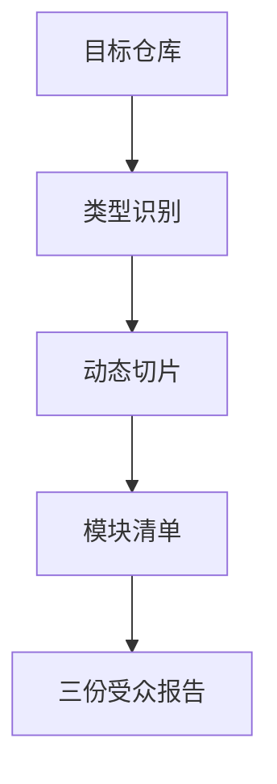

# /watch 分析总览

> 元信息：目标 `https://github.com/bradautomates/claude-video`；Repo 类型 `multi-agent-config`；报告由确定性 repo-analyzer CLI 生成。

## 0. 读者导航
- 技术负责人：读 `ANALYSIS_REPORT.tech-lead.md`
- 业务负责人：读 `ANALYSIS_REPORT.business.md`
- 学习者：读 `ANALYSIS_REPORT.learning.md`
- 复查证据：读 `02a-manifest-card.md`、`05-module-ids.yaml`、`08-coverage.md`、`STATE_REPORT.md`

## 1. 总览摘要
- 项目识别名：/watch
- 主要语言：Python(17)
- 文件总数：36

README 摘要：
- **Give Claude the ability to watch any video.**
- Claude Code (recommended — auto-updates via marketplace):
- '''
- /plugin marketplace add bradautomates/claude-video
- /plugin install watch@claude-video

## 2. 架构地图


## 3. 核心模块
| 模块 ID | 路径/分组 | 文件数 |
|---|---|---:|
| module_001 | skills | 10 |
| module_002 | tests | 10 |
| module_003 | [root] | 9 |
| module_004 | .claude-plugin | 2 |
| module_005 | hooks | 2 |
| module_006 | .agents | 1 |
| module_007 | .codex-plugin | 1 |
| module_008 | .github | 1 |

## 4. API 与运行入口
### 对外工具/API 表面
- 未识别到 MCP 工具/API 名称

### 运行命令候选
- `未从常见入口识别到运行命令`

## 5. 证据切片
- `slices/04-docs.xml`
- `slices/05-agent-config.xml`
- `slices/06-tests.xml`
- `slices/07-config-scripts.xml`
- `slices/09-dependencies.xml`
- `slices/12-history-hotspot.txt`

## 6. 复现方法
```bash
python3 scripts/repo_analyzer.py https://github.com/bradautomates/claude-video --output analysis --mode all --no-question
```
