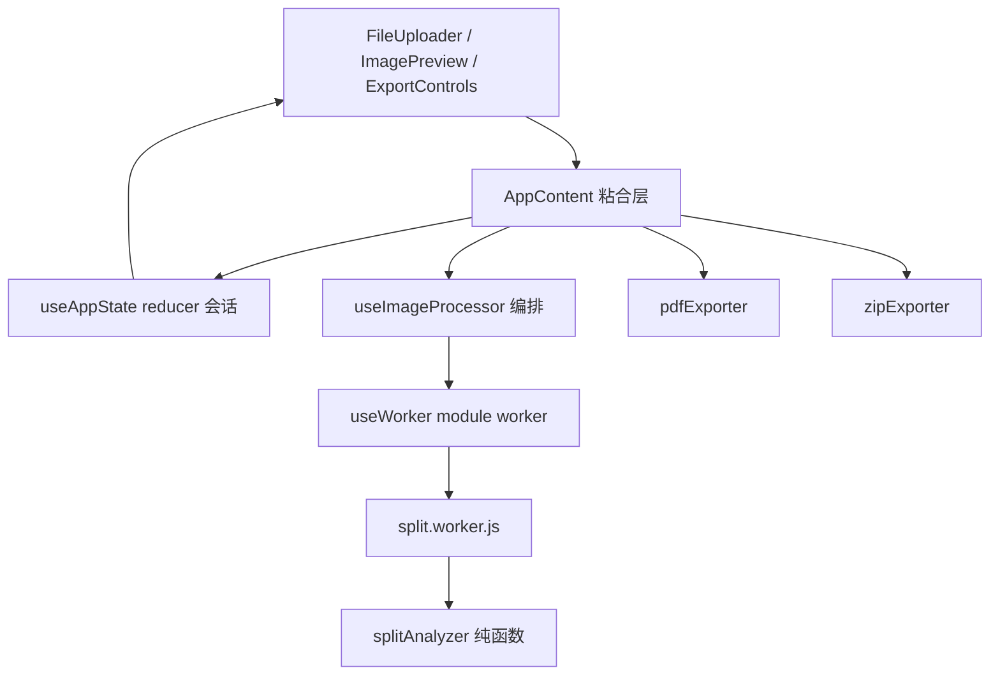

# 长截图分割器架构分析报告（deep · 质量门前草稿）

> 目标仓：`/tmp/Long_screenshot_splitting_tool` · commit `bdee20b8c4e4985c690a255ed09f64a3e335fd20`  
> 模式：deep · tooling：enhanced（graphify + universal-ctags + baseline）  
> 本文件为 Phase 8 叙事草稿；最终 `ANALYSIS_REPORT.md` 仅在质量门 `allowed_to_synthesize:true` 后生成。

## 1. 问题场景

移动端与桌面端产生的**长截图**难以直接分享到限制高度的渠道，也难以分页打印或归档。用户需要的不是通用图像编辑器，而是：

1. 快速导入一张很长的图；
2. 按「接近页高」的方式切开，尽量落在内容空白处而不是切断文字；
3. 预览、多选后导出 PDF 或 ZIP。

本项目以浏览器内 React 应用回应该场景，运行时依赖 `jspdf` / `jszip`，切图计算下沉到 Web Worker。

## 2. 项目全景

- **定位**：扁平化单仓的前端工具应用（README 自述「扁平化单仓库架构」）。
- **技术栈**：React 19 + TypeScript + Vite；测试 Vitest；样式 Tailwind。
- **规模候选**（repo-map）：约 110 个 TS 源文件 / 2.9 万行量级 + JS；`src` 是绝对核心。
- **模块分层（分析分级）**：
  - **core：`src`** — 会话、Worker 切图、导出、UI 编排
  - **secondary：`config` / `shared-components` / `tools` / `scripts`** — 配置、共享 UI、工程脚本
  - **excluded：`test-setup` / `.`** — 测试夹具与根杂项

## 3. 核心设计哲学

1. **状态集中**：切割会话（worker、blobs、objectUrls、imageSlices、选中集）进入 `useAppState`，UI 只消费 actions。  
2. **计算下沉 + 算法/I/O 分离**：像素级工作在 Worker；`splitAnalyzer` 全是纯函数，可单测、可替换。  
3. **失败不劣化**：内容感知失败或无合格空白带时，回退固定高度等分（`computeSliceBounds`）。  
4. **导出旁路**：PDF/ZIP 读取「已选切片」，不反向污染切割管线。  
5. **同仓扩展**：SEO、移动优化、调试面板、工程脚本与主链并存——交付快，边界靠约定。

## 4. 主链深读：从上传到切片

### 4.1 入口与粘合

- `src/main.tsx:5` 仅 `createRoot` 挂载 `App`。  
- `src/App.tsx:28-36` 的 `AppContent` 组装 `useAppState` 与 `useImageProcessor`，并挂上 i18n/router/viewport/SEO/移动优化。  
- `src/App.tsx:196` `handleFileSelect` 调用 `processImage`；导航跳转刻意等切片到达，避免守卫过早踢回。

### 4.2 会话状态

- `createInitialState`（`src/hooks/useAppState.ts:14`）从 persistence 恢复 `splitHeight`/`fileName`，大对象不回放。  
- `appStateReducer` 在 `ADD_IMAGE_SLICE`（`:47`）**按 index 写入**，注释明确修复 `img.onload` 乱序。  
- `CLEANUP_SESSION`（`:89`）revoke ObjectURL + terminate worker，同时保留用户偏好。  
- `useAppState`（`:122`）对可持久化字段 `debouncedSave`（500ms）。

**权衡**：集中式 reducer 让资源生命周期可控，但 App 成为「上帝粘合点」，调试面板/导航错误/SEO 同文件并存，认知负荷高。

### 4.3 编排与 Worker

- `useImageProcessor`（`src/hooks/useImageProcessor.ts:19`）把 Worker 回调翻译成状态动作：`handleChunk`（`:30`）创建 ObjectURL，onload 后 `addImageSlice`。  
- `processImage`（`:92`）序列：cleanup → setProcessing → 读原图 → `createWorker` → 等待 200ms → `startProcessing(file, splitHeight)`。  
- `useWorker`（`src/hooks/useWorker.ts:23`）强制 `type: 'module'`（`:42`），因为 worker 顶层 `import { analyzeSplitPoints }`；`startProcessing`（`:133`）只 `postMessage`。

**权衡**：module worker + Vite `import.meta.url` 解决打包，但增加浏览器/构建约束；固定 200ms 等待是脆弱的就绪同步。

### 4.4 内容感知切割

Worker 主流程 `processImage`（`src/workers/split.worker.js:75`）：

1. `createImageBitmap` 解码；  
2. 全图画到 `OffscreenCanvas`；  
3. `getImageData` 后 `analyzeSplitPoints`（`:117`）；分析异常 catch 后 `splitPoints=[]`（`:125-128`）；  
4. `computeSliceBounds`（`:228`）有点按点、无点等分；  
5. 切片 JPEG 0.92 回流 `chunk`，最后 `done`。

`splitAnalyzer`（`src/utils/splitAnalyzer.ts`）：

- 设计注释（文件头）规定：行信号 → 去噪 → 空白带 → 页高选点 → 间距保护 → 安全回退。  
- `computeVariationProfile`（`:88`）用灰度水平差，不依赖背景色。  
- `chooseSplitPoints`（`:194`）窗口搜索 + merge/minPage 防碎页。  
- `DEFAULT_SPLIT_OPTIONS`（`:50`）明确**起始经验值待校准**。

Graphify（deep）：`split.worker.js --imports_from--> splitAnalyzer.ts`，analyzer 节点包含 `analyzeSplitPoints` 等 EXTRACTED 边，支持「算法与 I/O 分离」的结构主张。

## 5. 导出与 UI 边界

- `handleExport`（`src/App.tsx:224`）要求 `selectedSlices` 非空。  
- `PDFExporter.exportToPDF`（`src/utils/pdfExporter.ts:51`）过滤排序后 jsPDF 一页一图。  
- `ZIPExporter.exportToZIP`（`src/utils/zipExporter.ts:44`）JSZip 打包，可配压缩与命名。  
- 核心契约 `ImageSlice`（`src/types/index.ts:3`）贯穿状态/预览/导出。

**权衡**：导出与会话解耦清晰；但错误多用 `alert`/`console`，生产级反馈不足。导出与 cleanup 并发策略未在类型层锁定。

## 6. 次要模块

- **config**（`config/index.ts:77`）：聚合 app/routing/deployment/environment/constants，服务构建与运行参数。  
- **shared-components**：`CopyrightInfo`/`Button` 与通信/共享状态管理器；App 引用版权组件，不持有切割会话。  
- **tools / scripts**：构建缓存、CDN、代码分割优化、SEO 文件生成、测试分组——交付链关键，热路径无关。

deep 覆盖：secondary 模块关键单元回填 ≥60%，但叙事上保持「支撑而非主链」。

## 7. 设计权衡与业界对照

| 维度 | 本项目选择 | 替代方案 | 代价 |
|---|---|---|---|
| 切点策略 | 内容感知 + 等分回退 | 纯固定高度 / 服务端 CV | 参数敏感；双路径 |
| 计算位置 | Browser Worker | 主线程 canvas / 云函数 | 大图内存；兼容性 |
| 状态 | 单 reducer 会话 | 多 store / xstate | 文件膨胀 |
| 导出 | 客户端 jspdf/jszip | 服务端渲染 PDF | 包体与主线程压力 |
| 仓库形态 | 扁平单仓 | monorepo 多包 | SEO/工程噪声进主仓 |

与「在线切图网站」常见路线相比：本项目更强调**可测试的纯函数分析器**与**失败回退不劣化**，而不是最大化 CV 复杂度。

## 8. 批判性评价

**优点**

- 主链职责切分清楚：状态 / 编排 / Worker / 纯算法 / 导出。  
- 乱序切片、资源清理、module worker 约束都有源码级注释与对应实现。  
- 文档与代码中的 spec 引用（§4）提升可追溯性。

**缺陷与成熟度缺口**

1. **可观测性**：分析回退静默，用户不知切点模式。  
2. **大图性能**：全图 `getImageData` 未分块（worker 自陈未来项）。  
3. **参数治理**：默认阈值未绑定校准数据或 A/B。  
4. **同仓噪声**：SEO/调试/导航错误处理显著增加 `src` 体积，稀释核心域。  
5. **引用完整性（工具层）**：deep 分母由 Universal Ctags 枚举且 parse_rate=100%，但 TS/JS **无 complete reference roles**；core 单元 `refs_status` 全为 partial/missing。Graphify 提供 EXTRACTED 边，**不能**把 coverage 的 partial 文本引用写成「引用边已完全验证」。

## 9. 未决范围与后续问题

本章汇总未充分覆盖范围与仍待验证事项；详细风险清单见后文「风险或限制」。

### Unsupported Area

- **coverage 引用完整性**：core 单元 incomplete reference rate = 100%（工具限制，非漏读）。本报告对「跨文件调用图」以 Graphify EXTRACTED + 人工锚点为准，**不**声称 ctags complete reference 覆盖充分。  
- **SEO 子系统大体量类型与组件**（如 `src/types/seo.types.ts` 及大量 SEO 组件）：已纳入分母覆盖抽样，但不对 SEO 排序策略与站点运营效果做充分架构结论。  
- **tools 内构建优化器实现细节**：secondary 抽样覆盖，不展开与业务等价的深度。

### 开放问题

- 默认 `thresholdRatio=0.3` 等是否已有真实语料校准记录？  
- `imageSlices` 稀疏数组在所有 UI 路径是否过滤？  
- 导出中是否应禁止 `CLEANUP_SESSION` / 路由切换？  
- 200ms worker 就绪等待是否应改为显式 ready 握手？

## 10. 可借鉴经验

1. **算法纯函数化**：把可变 I/O 留在 Worker，分析器可单测——小团队提升回归速度。  
2. **显式失败回退策略**：content-aware 不是赌赢，而是「绝不差于基线」。  
3. **按 index 写入**修复异步乱序：简单、局部、可注释。  
4. **导出旁路**：避免把文件格式细节泄漏进切割状态机。

## 11. 预算与并行执行摘要

- mode: **deep**  
- parallelism: **active**（3 子代理：pipeline / export-ui / secondary-deep）  
- 覆盖回填：src core ≈90.0%；secondary 模块 ≥60%；excluded 填 skip_reason  
- Semantic Source Review：3 条（useAppState / analyzeSplitPoints / worker processImage）  
- Graphify：AST rebuild 用于 query/explain；未把 LLM 语义边当作硬证据  
- 外部调研：README + docs/ARCHITECTURE + 源码设计注释；竞品路线对照为设计哲学级  
- 已知门禁风险：`reference-quality`（deep max incomplete 80%）在当前工具输出下预期失败  

## 12. 风险抽样结果（进入评价）

| 类别 | 锚点 | 发现 | 对评价的影响 |
|---|---|---|---|
| error-handling | split.worker.js:125 | 分析失败静默等分 | 正确性体验被夸大 |
| concurrency | useAppState.ts:47 | index 写入 vs 稀疏数组 | 边缘一致性风险 |
| performance | split.worker.js:112 | 全图像素 | 大图可行性上限 |
| resource-lifecycle | useAppState.ts:89 | cleanup 与导出并发 | 稳定性 |
| parameter-risk | splitAnalyzer.ts:50 | 经验阈值 | 开箱质量方差 |
| reference-integrity | coverage refs | 无 complete | deep gate 机械失败点 |

---

**诚实声明**：本草稿完成了 deep 工作流的证据与叙事构建；是否允许合成为 `ANALYSIS_REPORT.md` 完全取决于 `repo-analyzer gate --mode deep` 的机械结果。不得在 gate 未放行时宣称产品分析完整通过。

## 核心流程

上传到切片的关键流程如下（均有源码锚点）：

1. `src/main.tsx:5` 挂载应用；`src/App.tsx:28` 组装会话与处理器。  
2. `src/App.tsx:196` 选择文件后进入 `src/hooks/useImageProcessor.ts:92` 的 `processImage`。  
3. `src/hooks/useWorker.ts:42` 创建 module worker，`src/hooks/useWorker.ts:133` 发送 `{file, splitHeight}`。  
4. `src/workers/split.worker.js:75` 解码并在 `src/workers/split.worker.js:117` 调用内容感知分析。  
5. `src/utils/splitAnalyzer.ts:250` 产出切割点；`src/workers/split.worker.js:228` 计算边界并回流 chunk。  
6. `src/hooks/useAppState.ts:47` 按 index 写入切片，供预览与导出。

## 模块协作

跨模块协作与边界：

- Worker 与算法：`src/workers/split.worker.js:12` 依赖 `src/utils/splitAnalyzer.ts:250`。  
- UI 与会话：`src/App.tsx:29` 使用 `src/hooks/useAppState.ts:122`，上传组件经 `src/App.tsx:196` 进入编排。  
- 导出处在旁路：`src/App.tsx:224` 调用 `src/utils/pdfExporter.ts:51` / `src/utils/zipExporter.ts:44`，共享 `src/types/index.ts:3`。  
- 共享组件：`src/App.tsx:21` 引用 `shared-components` 版权信息，不共享切割会话。  
- 配置与工程：`config/index.ts:77`、tools/scripts 服务构建与常量，不拥有运行时切片状态。

## 风险或限制

主要风险与限制：

- 分析失败静默回退等分：`src/workers/split.worker.js:125`。  
- 大图全量 `getImageData` 内存风险：`src/workers/split.worker.js:112`。  
- 默认切割参数待校准：`src/utils/splitAnalyzer.ts:50`。  
- 资源清理与导出并发：`src/hooks/useAppState.ts:89`。  
- deep 引用完整性工具限制：core 单元 refs 均为 partial/missing，不能把启发式引用当作 complete（开放问题见 Unsupported Area）。  
- Unsupported Area：SEO 大体量类型与 tools 构建细节不作为业务主链充分结论。

## 具体改进建议

1. 在 UI 标明 content-aware / equal-split 模式（依据 `src/workers/split.worker.js:125`）。  
2. 对超高图像实现分块像素读取（`src/workers/split.worker.js:112`）。  
3. 建立 `DEFAULT_SPLIT_OPTIONS` 校准流水线（`src/utils/splitAnalyzer.ts:50`）。  
4. 用 ready 握手替换 200ms 等待（`src/hooks/useImageProcessor.ts:125`）。  
5. 导出事务期间锁定 cleanup（`src/App.tsx:224`，`src/hooks/useAppState.ts:89`）。  
6. 拆分 App 中 SEO/调试旁路，降低 core 粘合复杂度（`src/App.tsx:28`）。  
7. 若需 deep reference-quality 放行，应接入能写回 complete reference edges 的提供方，禁止伪造 `refs_status`。

