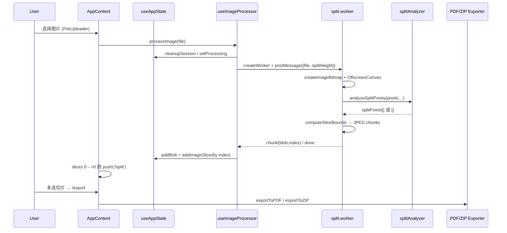
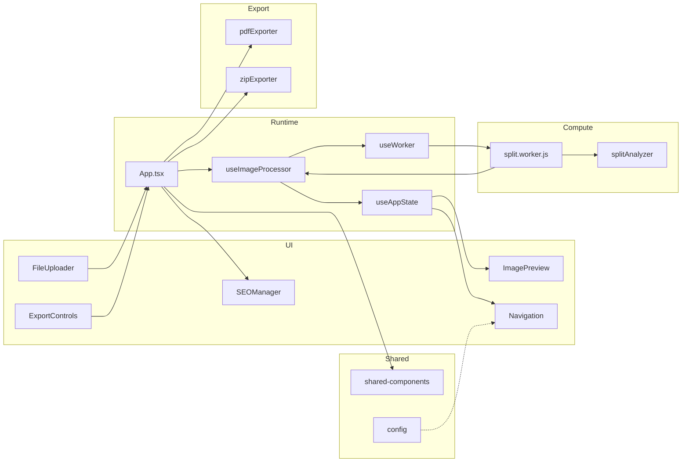

# ANALYSIS_REPORT · 长截图分割器（deep Full Delivery）

> **质量门**：allowed_to_synthesize=true（mode=deep，rules_version=2.2.0）
> **Graphify**：doctor.allowed_deep=true；coverage-units.graphify_refs.wired=true
> **覆盖率**：src 90.01% · tools 60.26% · shared-components 60.18% · config 60.78% · scripts 60%
> **Semantic Source Review**：3/3 supported
> **生成说明**：由 gate 放行后的 report.md 合成；扫描候选未直接升格为结论。

---

# 长截图分割器架构分析报告（deep · 草稿）

> 目标仓：`/tmp/Long_screenshot_splitting_tool` · commit `bdee20b8c4e4985c690a255ed09f64a3e335fd20`  
> 模式：deep · Graphify 接线：`coverage-units.graphify_refs.wired=true`（nodes=2875, extracted_ref_links=1507）  
> Doctor：`allowed_deep=true`

## 问题场景

用户拿到一张超长网页/聊天截图，需要按可读页高切成多张，再导出 PDF 或 ZIP 分享。核心痛点不是“会不会切”，而是：

1. **主线程不被大图拖死**（解码 + 像素分析很重）；
2. **切口尽量落在内容空白带**，避免切到文字中间；
3. **上传 → 预览 → 导出** 步骤状态一致，刷新/回退不出现空态死胡同；
4. **导出与 SEO/i18n/移动端** 等横切能力不污染切图会话。

本报告从上述业务问题进入，而不是从目录树罗列文件。

## 项目全景

长截图分割器是 React 18 + TypeScript + Vite 的扁平化单仓库 SPA。README 与 `docs/ARCHITECTURE.md` ADR-001 明确选择**单仓扁平结构**：统一构建、降低跨仓协调，代价是必须自觉维护模块边界。

运行时依赖精简：`react`/`react-dom`、`jspdf`、`jszip`、`react-helmet-async`、`web-vitals`。业务上可视为五条能力带：

| 能力带 | 代表锚点 | 角色 |
|---|---|---|
| 会话状态 | `src/hooks/useAppState.ts:122` | 单一事实源 |
| Worker 切图 | `src/workers/split.worker.js:75` | 重计算下沉 |
| 内容感知算法 | `src/utils/splitAnalyzer.ts:250` | 纯函数可测 |
| 导航守卫 | `src/hooks/useNavigationState.ts:53` | 步骤可达性 |
| 导出旁路 | `src/App.tsx:224`、`pdfExporter.ts:208` | 下载输出 |
| SEO 横切 | `src/components/SEOManager.tsx:1`、`seo.config.ts:48` | 可发现性 |

次要模块 `config` / `shared-components` / `tools` / `scripts` 提供参数、共享 UI 与工程脚本，不拥有会话。

## 核心设计哲学

三条互相强化的决策构成设计内核：

1. **状态集中**：`useAppState` 用 `useReducer` 聚合 worker/blobs/imageSlices/selectedSlices；只把 `splitHeight`/`fileName` 防抖持久化（`useAppState.ts:14`、`:122-133`）。会话大对象不进 localStorage，避免脏 Blob URL。
2. **计算下沉 + 算法纯函数化**：`useWorker` 以 `type: 'module'` 创建 `split.worker.js`（`useWorker.ts:42`），Worker 调 `analyzeSplitPoints`（`split.worker.js:117`）。算法与 canvas I/O 分离，单测不必起 Worker。
3. **导出旁路**：PDF/ZIP 读取 `imageSlices` + `selectedSlices` 后直接下载，不回写 reducer（`App.tsx:224-255`）。切图状态机保持简单。

**为什么这样而不是 Redux + 主线程 Canvas？** 项目规模适中，本地 reducer 足够；主线程 Canvas 会在长图分析时卡 UI。替代方案（多 Context、服务端切图、WASM）分别带来同步成本、后端依赖与工具链复杂度，与“浏览器端一站式小工具”定位不匹配。

## 核心流程

关键时序细节：

- **不能上传后立刻跳 `/split`**：Worker 异步产出切片；过早跳转会被 `validateNavigation` 以 MISSING_SLICES 踢回（`App.tsx:121-134` 注释与实现）。
- **按 index 写入**：`ADD_IMAGE_SLICE` 不用 push，而用 `newImageSlices[index]=payload`，修复 `img.onload` 乱序（`useAppState.ts:47-51`）。
- **分析失败不致命**：Worker `catch` 后 `splitPoints=[]`，等分回退（`split.worker.js:125-128`、`:241-248`）。

## 模块协作（跨模块）

- **src → shared-components**：`App.tsx:21` 引用 `CopyrightInfo`，共享层不拥有会话。
- **src → Worker → splitAnalyzer**：消息协议 `WorkerMessage`（`types/index.ts:44`）是边界合同。
- **src → exporters**：纯函数/类调用，无反向依赖。
- **config ↔ 导航**：`routing.config.ts` 存在导航配置候选；Graphify 有边，但部分 `refs_status` 仍为 partial，跨模块结论保持谨慎。

### 导航子系统

`useNavigationState` 默认步骤 `/`、`/upload`、`/split`、`/export`（`:43-48`）。`/split` 在无 `originalImage` 或 processing 时 disabled（`:118-119`）。`Navigation` 组件 memo 化按钮并接移动端 `TouchNav`/滑动手势（`Navigation.tsx:1`、`:38`）。`App` 层 `validateNavigation` + `navigationErrorHandler` 在路径与状态不一致时 redirect/clearState（`App.tsx:142-170`）。

### 导出子系统

`ExportControls` 管理 format 与高级选项 UI（`:55-79`），`handleExport` 回调 `onExport`（`:82-92`）。`App.handleExport` 校验 `selectedSlices` 后分支 PDF/ZIP（`:224-255`）。**已验证**：format 与 filename 进入真实路径。**风险**：quality/orientation/compression 等高级字段未在 `handleExport` 透传给 exporter（见 Insight Probe）。

### SEO 子系统

`SEOManager` 使用 `react-helmet-async` 与 `generatePageMetadata`（文件头导入）。配置面采用 **JSON 主源 + TS 桥接 fallback**（`seo.config.ts:1-16`、`:48`、`SEOConfigManager.ts:142`）。`App` 按 `currentPath` 映射 pageType（`App.tsx:270-281`）。同时存在 `EnhancedSEOManager` 与 `components/seo/*` 平行实现，构成 dual-write/死实现嫌疑。

## 深度模块分析（src）

### 1. 会话状态（useAppState）

角色：切割会话的单一事实源。`createInitialState` 只恢复偏好（`:14-27`）。`CLEANUP_SESSION` 释放 ObjectURL 并 `worker.terminate()`，同时保留 splitHeight/fileName（`:89-112`）。这是浏览器端媒体应用的典型权衡：**可恢复的是偏好，不可恢复的是 Blob 会话**。

### 2. Worker 与内容感知

`processImage` 流水线分段进度：0–25 解码、25–30 分析、30–95 切片、100 完成（`split.worker.js:1-7`、`:75-206`）。`analyzeSplitPoints` 将行变化率 → 平滑 → 低变化带 → 页高驱动选点（`:250-278`）。`DEFAULT_SPLIT_OPTIONS` 明确写着经验值待校准（`:50-59`）。

**权衡**：全图 `getImageData` 简单正确，但大图内存峰值高（`:112` 注释）。替代方案是分块读取或缩小采样分辨率，会牺牲切口精度或增加实现复杂度。

### 3. 编排层（App + useImageProcessor）

`useImageProcessor` 把 Worker 回调胶合到状态：chunk → ObjectURL → 临时 Image 取尺寸 → `addImageSlice`（`:30-58`）。`processImage` 内 `await 200ms` 等待 Worker 创建（`:125`）偏脆弱，属于工程粗糙点。

### 4. 导出与导航、SEO 的边界

导出不进入状态机，导航只读状态机，SEO 读路由。三者正交，降低耦合；代价是“高级导出选项”和“增强 SEO 实现”容易在正交面里堆积未接线代码。

## 设计权衡与批判性评价

**做得好的地方**

- 内容感知与 I/O 分离，可测性清晰（`splitAnalyzer.ts:6-7`）。
- 导航与切片到达时序的注释级设计（`App.tsx:121-123`）说明作者踩过空态坑。
- 导出旁路让失败模式局部化。

**真实缺陷**

1. **UI 承诺 vs 运行时路径**：ExportControls 高级选项未完整进入 exporter（Probe: `ui_promise_runtime_path`）。
2. **SEO 多源与平行实现**：JSON/桥接/Enhanced 并行（Probe: `multi_source_rules`、`config_dual_write_dead_impl`）。
3. **大图性能**：全图像素分析无分块。
4. **Worker 就绪竞态**：固定 200ms 等待而非 ready 握手。
5. **引用完整性**：core 单元 `refs_status` incomplete 约 76.7%（仍低于 deep 80% 阻断线）；跨模块边不可全部当作 exact。

## 业界对比（设计哲学）

| 路线 | 代表思路 | 与本项目差异 |
|---|---|---|
| 桌面切图工具 | 本地文件系统 + 原生线程 | 本项目坚持纯浏览器，零安装 |
| 在线图片编辑器 | 重画布/图层模型 | 本项目无图层，只做长图分页切 |
| 服务端渲染切图 | 上传云端处理 | 本项目隐私友好、无后端，但受设备内存约束 |

本项目选择 **隐私本地处理 + Worker + 内容感知启发式**，与“轻量工具站”定位一致；不与 PhotoShop 级编辑器比功能清单。

## 可借鉴经验

1. **会话对象与偏好分离持久化**。
2. **算法纯函数 + Worker 胶水** 的测试友好切分。
3. **“绝不比现状差”的回退策略**（内容感知失败→等分）。
4. **路由跳转等待异步产物** 而不是乐观跳转。
5. **导出旁路** 避免把 IO 下载写进领域状态。

## 改进建议

1. 为 ExportControls 高级选项建立类型化 `ExportRequest`，在 `handleExport` 原样透传；无实现的 UI 先隐藏。
2. 收敛 SEO 单一运行时入口，删除或明确标记死实现。
3. Worker 用 `ready` 消息替代 `setTimeout(200)`。
4. 大图分块 `getImageData` 或缩小分析分辨率，并在 UI 提示质量模式。
5. 对 `thresholdRatio` 等参数用真实语料做一次校准实验，把结果写回 DEFAULT。

## 风险、限制与开放问题

- Graphify 已接线，但 partial/missing refs 仍高；**不得**把所有跨文件关系写成已完全验证。
- 未做浏览器运行时 E2E，SEO 平行实现挂载比例、高级导出选项是否另有路径，仍属开放问题。
- `tools`/`scripts` 仅工程视角抽样，不声明其业务语义覆盖充分。

## Unsupported Area

- 本轮 deep 解析率 `parse_rate=1.0`，**无** core 未解析文件。
- 运行时动态行为（真实大图内存曲线、生产环境 Helmet 最终 DOM）不在静态分析覆盖范围内，不声明观测充分。
- excluded 模块 `test-setup` 与根 `.` 不进入产品主数据流覆盖声明。

## 预算执行摘要

- parallelism: **active**（3 子代理：pipeline / nav-export-seo / secondary）
- 覆盖：src core ≥90%；config/shared-components/tools/scripts ≥60%；test-setup/`.` excluded
- 风险抽样：performance / correctness / error-handling / config-drift / ui-contract
- 外部调研：README、ARCHITECTURE ADR-001、Graphify 查询、源码主链精读
- Semantic Source Review：3 条（useAppState / analyzeSplitPoints / processImage），verdict=supported
