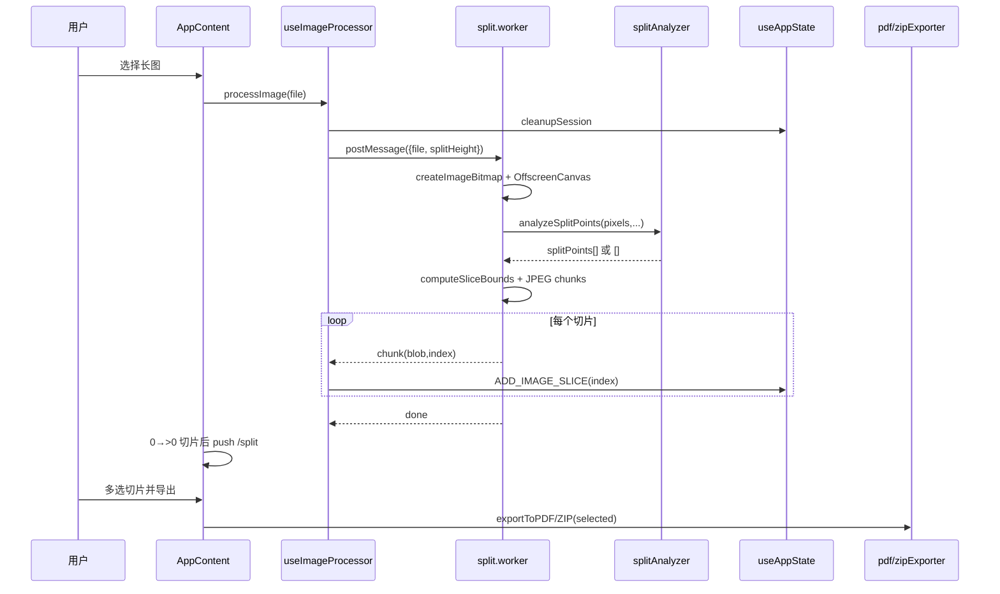

# 长截图分割器 · 架构分析报告

> **真实UAT回归测试·standard**  
> 目标仓：`/tmp/Long_screenshot_splitting_tool` @ `bdee20b`  
> 模式：standard（baseline only；禁止 Graphify / Universal Ctags / ast-grep）  
> 质量门：`allowed_to_synthesize: true`（见 `quality-gate-report.json`）  
> 分析时间：2026-07-11 21:36:40 CST → 2026-07-11 21:39:06 CST  
> 并行：parallelism: active（3 子代理）

## 1. 场景问题

用户拿到一张**超长截图**（聊天记录、网页、设计稿），需要按页高切开并分享：手机相册难浏览、IM 有尺寸限制、打印/归档更需要 PDF 分页。现有通用工具要么依赖桌面端，要么切割点切到文字中间。

本项目给出的答案是：**纯前端 SPA**，在浏览器内完成「上传 → 内容感知切图 → 预览多选 → PDF/ZIP 导出」，无后端，重计算进 Web Worker。

## 2. 项目全景

| 维度 | 观察 |
|---|---|
| 定位 | 长截图分割工具（long-screenshot-splitter） |
| 技术栈 | React 19 + TypeScript + Vite；jspdf / jszip；Vitest |
| 架构口号 | 扁平化单仓库（README / docs/ARCHITECTURE.md ADR-001） |
| 运行时核心 | `src/`（会话、Worker、导出、UI 编排） |
| 边界模块 | `shared-components`（页脚/按钮等）、`config`（配置聚合）、`tools`/`scripts`（构建与 SEO 生成） |
| 规模候选 | TS≈29.7k LOC / JS≈7.9k LOC；关键单元 421；parse_rate=100%（standard 启发式文件级） |
| tooling | doctor 放行 standard；deep 因能力门禁 blocked |

系统不是通用图像编辑器，而是围绕一条主数据流的产品：`File → slices[] → selected → artifact`。

## 3. 设计权衡

本项目的核心权衡是：用 Web Worker + OffscreenCanvas 把像素处理移出主线程，以消息传递与双端生命周期管理为代价换取 UI 流畅；用纯函数 `splitAnalyzer` 换可测性，阈值需真实截图校准；用等分安全回退换「分析失败也不比基线差」；用 `useAppState` 集中会话、导出旁路只读 `selectedSlices`，换失败可重试；用 `App.tsx` 单文件编排换中等规模下的交付速度，代价是变更热点。

动机不是做通用编辑器，而是把上传-切-选-导出最短路径做稳。替代方案包括服务端切图（隐私/成本）、固定等分-only（切到文字中间）、重型 canvas 编辑器（包体与复杂度）。相关锚点见 `src/hooks/useWorker.ts:42`、`src/workers/split.worker.js:75`、`src/utils/splitAnalyzer.ts:250`、`src/hooks/useAppState.ts:33`、`src/utils/pdfExporter.ts:51`、`src/App.tsx:28`。

设计哲学要点：主线程保交互；算法与 I/O 分离；安全回退优先；会话集中导出旁路；中等规模换速度。

## 4. 核心流程

主链锚点：

- 上传入口：`src/App.tsx:196` → `src/hooks/useImageProcessor.ts:92`
- Worker 契约：`src/workers/split.worker.js:20`、`src/hooks/useWorker.ts:42`
- 内容感知：`src/utils/splitAnalyzer.ts:250`；边界：`src/workers/split.worker.js:228`
- 按 index 落库：`src/hooks/useAppState.ts:47`
- 路由在切片到达后跳转：`src/App.tsx:121` 附近
- 导出：`src/App.tsx:224`，`src/utils/pdfExporter.ts:208`，`src/utils/zipExporter.ts:217`

## 5. 模块协作

src 通过 `src/App.tsx:21` 引用 shared-components 的 CopyrightInfo 作为页脚，不共享 imageSlices；配置经 `config/index.ts:77` 聚合后供路由/常量读取，不持有运行时切片。tools/scripts 仅构建期介入（如 `scripts/generate-seo-files.js`），不进入浏览器会话。跨模块依赖以 UI 装配与配置读取为主；切割会话状态不泄漏到 shared-components。由于 standard 模式下 refs_status 多为 partial/missing，跨文件调用图未达 deep 级完整验证，相关结论见开放问题。

| 模块 | 角色 | 与主链关系 |
|---|---|---|
| src（core） | 编排、状态、Worker、导出、页面 UI | 拥有 imageSlices 会话（`src/hooks/useAppState.ts:33`） |
| shared-components | CopyrightInfo/Button/通信管理器 | App 引用页脚（`src/App.tsx:21`），不共享会话 |
| config | app/routing/env/constants 聚合 | `config/index.ts:77` 配置语义，不持有切片 |
| tools | 构建/CDN/分包/部署脚本 | 构建期 |
| scripts | SEO 文件生成、测试并行、dev workflow | 构建/工程期 |

## 6. 核心模块 src 深度

### 6.1 会话状态（useAppState）

`createInitialState` 从 persistence 恢复 `splitHeight`/`fileName`（`src/hooks/useAppState.ts:14`）。`appStateReducer`（`:33`）以 action 类型驱动会话；`ADD_IMAGE_SLICE` 按 `index` 写入数组槽位，对抗 `img.onload` 乱序（`:47`）。`CLEANUP_SESSION`（`:89`）revoke ObjectURL 并 terminate worker，同时保留用户切高与文件名偏好。`useAppState` hook（`:122`）对外暴露 actions，并 debounce 持久化切高/文件名。

### 6.2 切图编排（useImageProcessor + useWorker）

`processImage`（`src/hooks/useImageProcessor.ts:92`）先 `cleanupSession`，设 processing/fileName，再 `createWorker` 后 `startProcessing(file, splitHeight)`。chunk 回调创建 ObjectURL 并在 onload 后 `addImageSlice`（`:30-58`）。`useWorker` 以 `type: 'module'` 加载 `split.worker.js`（`src/hooks/useWorker.ts:42`），分发 progress/chunk/done/error。

### 6.3 Worker 与内容感知

`processImage`（`src/workers/split.worker.js:75`）：createImageBitmap → OffscreenCanvas → 全图 `getImageData` → `analyzeSplitPoints`；分析异常时 `splitPoints=[]` 安全回退。`computeSliceBounds`（`:228`）有点按点分段，无点等分。`analyzeSplitPoints`（`src/utils/splitAnalyzer.ts:250`）串联行变化率→平滑→空白带→页高选点，短图直接 `[]`。

### 6.4 导出旁路

`handleExport`（`src/App.tsx:224`）要求 `selectedSlices` 非空，再调 `exportToPDF`/`exportToZIP`。`exportToPDF`（`src/utils/pdfExporter.ts:208`）创建默认 exporter；类方法对空选择 throw。导出只读会话切片，不改写 imageSlices，失败可重试。

### 6.5 UI 边界

`FileUploader`（`src/components/FileUploader.tsx:22`）校验类型/大小后回调。`ExportControls`（`:43`）管理格式与高级选项 UI，委托 `onExport`。预览组件驱动选择集，不执行切割。

## 7. 次要模块

- **config**：`config/index.ts` 聚合 app/routing/deployment/env/constants，运行时为只读语义源。
- **shared-components**：导出 CopyrightInfo/Button 与通信/共享状态管理器；与切割会话解耦。
- **tools/scripts**：构建、CDN、部署监控、SEO 文件生成与测试并行；不进入浏览器主数据面。

覆盖：core `src` ≈60.2% analyzed；secondary 均 ≥30%（抽样+skip_reason）。

## 8. 风险、限制与开放问题

本报告显式记录风险、限制、开放问题与 Unsupported Area。风险抽样进入架构评价：并发顺序上按 index 写入切片但 objectUrls 仍 push 追加（`src/hooks/useAppState.ts:47`）；CLEANUP_SESSION 必须与 Worker terminate / ObjectURL revoke 对齐否则泄漏（`src/hooks/useAppState.ts:89`）；Worker 全图 getImageData 带来内存峰值（`src/workers/split.worker.js:75`）；PDF 导出空选择硬失败而单片失败可能局部 continue（`src/utils/pdfExporter.ts:208`）。开放问题包括：standard 基线启发式下 refs_status 多为 partial/missing，跨文件调用图未达 deep 级完整验证；SEO 平行路径对生产入口装配的精确依赖需再确认；ExportControls 高级选项与 exporter 默认配置的产品契约是否 intentional。Unsupported Area：不对本报告中的完整 call graph 声明覆盖充分；src 中约 39.8% 未深读单元仅保留分母与 skip_reason，不声明覆盖充分；graphify-out/测试夹具不作为产品架构结论来源。

## 9. 批判性评价与改进建议

**已验证优点**

- 主链清晰：上传→Worker→按 index 落库→导出，状态边界明确。
- 内容感知失败安全回退，符合「不比基线差」产品底线。
- 纯前端无上传服务器，隐私友好。

**真实缺陷**

1. **UI 承诺未贯通**：导出高级选项未进入 runtime exporter（见 probe）。
2. **SEO 表面积过大**：相对切割产品，SEO Manager 双路径与静态/动态配置并存增加认知负担。
3. **App.tsx 编排热点**：路由守卫、移动端、调试、SEO、导出同文件，后续拆分成本上升。
4. **内存模型 KISS**：全图像素分析可扩展性有限。

**改进方向**

1. 将 `ExportControls` 的 quality/pageSize/orientation 透传到 `createPDFExporter(options)` / ZIP 等价路径，或从 UI 移除未接线项。
2. 收敛 SEO 为单一 Manager + 单一装配入口，删除/归档平行组件。
3. Worker 分块 `getImageData` 与可取消任务，暴露内存预算。
4. 拆分 `AppContent` 为 route-level 容器，降低热点。

## 10. 业界对比（设计哲学）

| 路线 | 代表思路 | 与本项目差异 |
|---|---|---|
| 桌面批处理 | 本地脚本/PS 动作 | 非网页即时、学习成本高 |
| 云端切图服务 | 上传后服务端切 | 隐私与成本不同；本项目坚持本地 |
| 固定等分网页工具 | 按高度硬切 | 本项目用内容感知 + 等分回退 |
| 在线设计器 | 重编辑能力 | 本项目刻意窄产品面 |

本项目哲学是**窄路径做深**：不追求编辑器，而追求「长图可分页分享」最短闭环。

## 11. Insight Probe 摘要

### ui_promise_runtime_path · hit

ExportControls 暴露格式与高级选项，但 `App.handleExport`（`src/App.tsx:224`）仅传 filename；`exportToPDF`/`exportToZIP` 使用默认 exporter。用户可感知选项未全部进入执行路径。

### multi_source_rules · hit

`SEOManager.tsx` / `EnhancedSEOManager` / `seo.config.ts` 静态表与 `SEOConfigManager` 并存，页面元数据规则多源。

### config_dual_write_dead_impl · miss

未见同一配置键双写落盘；Manager 以 load/get 为主。平行实现归 multi_source 类。

## 12. 预算与并行执行摘要

| 项 | 值 |
|---|---|
| mode | standard |
| parallelism | **active**（3 子代理） |
| 子代理 | src-state / src-export / secondary |
| 产物 | `subagent-artifacts/*.json` + `module-evidence/src.json` |
| Semantic Source Review | 5 条（core 模块 src） |
| 覆盖 | core ≈60.2% / secondary ≥30% |
| tooling | baseline only；未使用 Graphify/Ctags/ast-grep |
| 外部调研 | README + docs/ARCHITECTURE.md + package.json 依赖面 |
| 报告 | 本草稿；gate 通过后合成 ANALYSIS_REPORT.md |

## 13. 结论边界

- 已验证：主数据流、会话按 index 落库、Worker 内容感知与等分回退、导出旁路只读选择集。
- 假设：生产入口对 EnhancedSEO 的挂载以当前 App/组件树抽样为准。
- 限制：standard 引用启发式；未执行运行时或 E2E。
- 开放问题与 Unsupported Area 见第 8 节。

---

## 交付说明

本文件仅在质量门 `allowed_to_synthesize: true` 后合成。机器审计工件同目录：

- doctor-report.json / repo-map.json / repo-map.md / coverage-units.json
- evidence-plan.md / module-evidence/src.json / insight-probes.json
- report.md / quality-gate-report.json / subagent-artifacts/*
