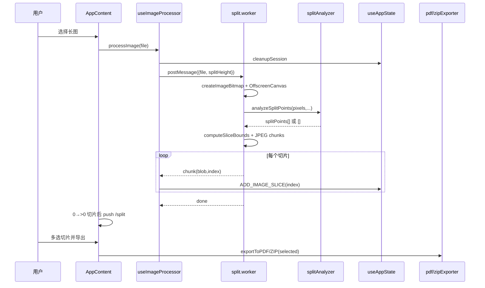

# 长截图分割器 · 架构分析报告（standard · gate 已放行）

> 目标仓：`/tmp/Long_screenshot_splitting_tool` @ `bdee20b`  
> 模式：standard（baseline only；忽略 Graphify/Ctags/ast-grep）  
> 分析类型：真实UAT回归测试·standard  
> 并行：parallelism: active（3 子代理）

## 1. 场景问题

用户拿到一张**超长截图**（聊天记录、网页、设计稿），需要按页高切开并分享：手机相册难浏览、IM 有尺寸限制、打印/归档更需要 PDF 分页。现有通用工具要么依赖桌面端，要么切割点切到文字中间。

本项目给出的答案是：**纯前端 SPA**，在浏览器内完成「上传 → 内容感知切图 → 预览多选 → PDF/ZIP 导出」，无后端，重计算进 Web Worker。

## 2. 项目全景

| 维度 | 观察 |
|---|---|
| 定位 | 长截图分割工具（long-screenshot-splitter） |
| 技术栈 | React 19 + TypeScript + Vite；jspdf / jszip；Vitest |
| 架构口号 | 扁平化单仓库（README / docs/ARCHITECTURE.md ADR-001） |
| 运行时核心 | `src/`（会话、Worker、导出、UI 编排） |
| 边界模块 | `shared-components`（页脚/按钮等）、`config`（配置聚合）、`tools`/`scripts`（构建与 SEO 生成） |
| 规模候选 | TS≈29.7k LOC / JS≈7.9k LOC；关键单元 421；parse_rate=100%（standard 启发式文件级） |

系统不是通用图像编辑器，而是围绕一条主数据流的产品：`File → slices[] → selected → artifact`。

## 3. 设计权衡

本项目的核心权衡是：用 Web Worker + OffscreenCanvas 把像素处理移出主线程，以消息传递与双端生命周期管理为代价换取 UI 流畅；用纯函数 splitAnalyzer 换可测性，阈值需真实截图校准；用等分安全回退换「分析失败也不比基线差」；用 useAppState 集中会话、导出旁路只读 selectedSlices，换失败可重试；用 App.tsx 单文件编排换中等规模下的交付速度，代价是变更热点。动机不是做通用编辑器，而是把上传-切-选-导出最短路径做稳。替代方案包括服务端切图（隐私/成本）、固定等分-only（切到文字中间）、重型 canvas 编辑器（包体与复杂度）。相关锚点见 src/hooks/useWorker.ts:42、src/workers/split.worker.js:75、src/utils/splitAnalyzer.ts:250、src/hooks/useAppState.ts:33、src/utils/pdfExporter.ts:51、src/App.tsx:28。

设计哲学要点：主线程保交互；算法与 I/O 分离；安全回退优先；会话集中导出旁路；中等规模换速度。

## 4. 核心流程

主链锚点：

- 上传入口：`src/App.tsx:196` → `src/hooks/useImageProcessor.ts:92`  
- Worker 契约：`src/workers/split.worker.js:1-10`，`:20`  
- 内容感知：`src/utils/splitAnalyzer.ts:250`；边界：`src/workers/split.worker.js:228`  
- 按 index 落库：`src/hooks/useAppState.ts:47-60`  
- 路由在切片到达后跳转：`src/App.tsx:122-136`  
- 导出：`src/App.tsx:224-248`，`src/utils/pdfExporter.ts:51`，`src/utils/zipExporter.ts:44`

## 5. 模块协作

| 模块 | 角色 | 与主链关系 |
|---|---|---|
| **src（core）** | 编排、状态、Worker、导出、页面 UI | 拥有 imageSlices 会话 |
| **shared-components** | CopyrightInfo/Button/通信管理器 | App 引用页脚（`src/App.tsx:21`），不共享会话 |
| **config** | app/routing/env/constants 聚合 | 配置语义支撑路由与常量，不持有运行时切片 |
| **tools** | 构建/CDN/分包/部署脚本 | 构建期 |
| **scripts** | SEO 文件生成、测试并行、dev workflow | 构建/工程期 |

跨模块依赖必须带着「两端」理解：运行时数据面几乎全在 `src`；`shared-components` 是展示/可复用 UI；`config/tools/scripts` 是配置与工程边界。standard 模式下引用边为启发式 partial/missing，**不得**把调用图写成已完全验证的静态分析结论（见开放问题）。

## 6. src 深度：状态 / Worker / 内容感知 / 导出

### 6.1 会话状态（subagent-src-state）

`createInitialState` 只从持久化恢复 `splitHeight`/`fileName`（`src/hooks/useAppState.ts:14-28`），blobs 与 ObjectURL 每次会话重建——正确，因为二进制不可也不应塞 localStorage。

`ADD_IMAGE_SLICE` **按 index 写入**而非 push（`src/hooks/useAppState.ts:47-60`），直接回应 `img.onload` 乱序风险；注释点名 spec §5。`CLEANUP_SESSION` 统一 `revokeObjectURL` + `worker.terminate`（`:89-112`），保留用户偏好字段。

权衡：objectUrls 仍是 push 追加，与按 index 的 imageSlices 不完全同构；UI 必须以 `slice.index` 为准并容忍稀疏槽。

### 6.2 Worker 与内容感知（subagent-src-state）

`useWorker` 强制 `type: 'module'` 以支持 worker 内 ESM import analyzer（`src/hooks/useWorker.ts:40-44`）。`processImage` 分段进度：0–25 解码、25–30 分析、30–95 切片、100 完成（`src/workers/split.worker.js:75-207`）。

`analyzeSplitPoints` 流水线：行变化率 → 平滑 → 低变化带 → 页高驱动选点（`src/utils/splitAnalyzer.ts:250-279`）。设计选择「灰度水平差」而非背景色检测，对多背景截图更稳（`:88` 注释）。失败回退等分是产品级承诺。

权衡：全图 `getImageData`（`src/workers/split.worker.js:116`）简单但峰值内存高；注释已承认 >4000px 分块是未来项。

### 6.3 上传与导出（subagent-src-export）

`FileUploader` 做类型/大小校验后回调（`src/components/FileUploader.tsx:22`）。`ExportControls` 只负责格式/选项与触发（`src/components/ExportControls.tsx:43`）。真正导出：

- PDF：过滤 selected → 排序 → jsPDF 分页嵌入；空选择 throw（`src/utils/pdfExporter.ts:58-65`）  
- ZIP：JSZip + 下载链接（`src/utils/zipExporter.ts:44-100`）

App 层先 `selectedSlices.size===0` alert（`src/App.tsx:224-228`），形成 UI 与库双闸。导出不改 reducer，失败可重试——旁路设计清晰。

## 7. 次要模块（subagent-secondary）

- **config**：`config/index.ts:77` 聚合 app/routing/deployment/environment/constants，是「配置门面」而非业务引擎。  
- **shared-components**：`SharedStateManager` 等提供通用组件通信；与 `useAppState` 会话分离，避免两套真相。  
- **tools/scripts**：build-manager、cdn-config、generate-seo-files、test-parallel 支撑交付与 SEO，不在浏览器切割路径上。

这些模块进入 secondary 30% 抽样覆盖，防止把构建脚本误判为核心业务。

## 8. 风险或限制

已识别的主要风险与限制如下，均影响架构评价而非仅清单罗列。异步切片虽按 index 写入，objectUrls 仍 push，UI 必须按 slice.index 处理稀疏槽（src/hooks/useAppState.ts:47）。资源清理集中在 CLEANUP_SESSION，但 processImage 用 200ms 等待 worker 就绪属于脆弱时序（src/hooks/useAppState.ts:89，src/hooks/useImageProcessor.ts:124）。全图 getImageData 导致大图内存峰值，分块策略尚未落地（src/workers/split.worker.js:116）。导出路径在单片失败时 continue，可能静默缺页（src/utils/pdfExporter.ts:125）。standard 基线引用均为 partial/missing，跨模块调用图不能当作已完全验证。开放问题包括阈值校准状态、App 拆分收益与 deep 级引用完整性。Unsupported Area：本轮 parse_rate=1.0 无未解析 core 文件；但仍不对完整调用图声明覆盖充分。

### 风险抽样（进入评价）

1. **并发顺序**：按 index 写入修复主问题，但稀疏数组与 objectUrls push 仍需 UI 纪律（`src/hooks/useAppState.ts:47`）。  
2. **资源生命周期**：cleanup 完善；`processImage` 中固定 200ms 等待 worker（`src/hooks/useImageProcessor.ts:124-128`）脆弱。  
3. **内存峰值**：全图像素驻留（`src/workers/split.worker.js:116`）。  
4. **导出容错**：单片失败 `continue` 可能静默缺页（`src/utils/pdfExporter.ts:125-128`）。

### 开放问题

- standard 启发式下 core 单元 `refs_status` 均为 partial/missing，跨文件引用未 deep 验证。  
- 内容感知阈值是否完成真实长图校准（analyzer 注释称起始经验值）。  
- `App.tsx` 是否应拆分为页面容器——无重构对照数据。

### Unsupported Area

- 本轮 **parse_rate=1.0，unparsed=0**，无未解析 core 文件需路径级 Unsupported 声明。  
- 仍声明：**引用图能力不足（heuristic only）**——不对「完整调用图/所有入边出边」做覆盖充分声明；跨模块结论仅限已读锚点与文档。

## 9. 具体改进建议

可执行改进方向：1) Worker 就绪改为显式 ready 握手，删除 useImageProcessor 中 200ms setTimeout（src/hooks/useImageProcessor.ts:124-128，src/hooks/useWorker.ts:23）；2) 将 /upload /split /export 拆成页面组件，AppContent 只保留 provider 与路由开关（src/App.tsx:28）；3) 为大图引入分块 getImageData 或降采样分析并提示内存风险（src/workers/split.worker.js:116）；4) 导出单片失败时汇总失败 index，避免静默缺页（src/utils/pdfExporter.ts:125-128）；5) 用真实截图集校准 thresholdRatio/minBandHeight 并固化 golden tests（src/utils/splitAnalyzer.ts:50）。

### 批判性评价

**成熟度**：主链路注释与 spec 引用丰富，Worker 契约写在文件头，内容感知有纯函数边界——对中等前端项目是加分项。测试脚本对内存敏感有专门 light/parallel 模式，说明踩过坑。

**主要缺陷**：

1. **编排上帝组件**：`App.tsx` ~745 行集齐路由守卫、导出、调试、移动端初始化，回归成本高。  
2. **时序魔法数**：200ms `setTimeout` 代替 worker ready 握手。  
3. **大图策略未落地**：分块 getImageData 仍是注释。  
4. **产品面膨胀**：SEO/i18n/debug 面板与切割主价值并行生长，认知负担上升。

**改进建议（可执行）**：

1. Worker 就绪改为显式 `ready` 消息或 `onmessage` 建链确认，删除 200ms 等待（改 `useWorker`/`useImageProcessor`）。  
2. 将 `/upload` `/split` `/export` 拆成页面组件，`AppContent` 只保留 provider 与路由开关。  
3. 为大图引入分块 `getImageData` 或降采样分析，并在 UI 提示内存风险。  
4. 导出单片失败时汇总失败 index，避免静默缺页。  
5. 用真实截图集校准 `thresholdRatio/minBandHeight` 并固化 golden tests。

## 10. 业界对比（设计路线，非功能清单）

| 路线 | 代表思路 | 与本项目差异 |
|---|---|---|
| 桌面批处理 | 本地脚本/ImageMagick 等分 | 无浏览器分发；缺交互预览 |
| 在线 API 切图 | 上传服务端处理 | 有隐私与成本；本项目全本地 |
| 编辑器级 Web 应用 | Canvas 重型编辑 | 能力强但包体/复杂度高；本项目聚焦切-选-导出 |
| 固定页高等分 | 早期自身路径 | 现以内容感知为主、等分为回退 |

独特价值在于：**本地 + Worker + 可测纯函数分析 + 导出旁路** 的组合，而不是更多滤镜。

## 11. 预算与并行执行摘要

- mode: **standard**  
- parallelism: **active**（3 子代理：state / export / secondary）  
- 覆盖：core `src` 60.23%（159/264）；secondary 合计 31.85%（50/157）  
- Semantic Source Review：5 条（appStateReducer / processImage / analyzeSplitPoints / exportToPDF / useImageProcessor）  
- 工具：baseline only；增强工具已安装亦忽略  
- 产物：doctor/scan/summarize/units + evidence-plan + module-evidence/src.json + subagent-artifacts/* + report.md → gate

---

*本报告在 quality-gate `allowed_to_synthesize: true` 后合成。已验证结论均带源码锚点；启发式引用与未校准阈值见开放问题。*
