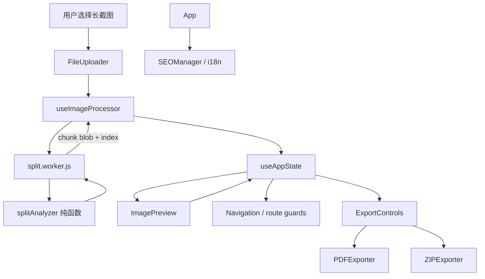

# Long_screenshot_splitting_tool 架构分析报告

> 本报告按 `repo-analyzer` 技能重新生成，分析对象为 `/tmp/Long_screenshot_splitting_tool`。所有确定性架构判断均附源码锚点；未能从源码确认的内容写为观察、风险或开放问题。

## 1. 项目全景

`Long_screenshot_splitting_tool` 是一个基于 React + TypeScript + Vite 的长截图分割工具，README 明确写出它支持按指定高度分割长截图，并导出 PDF 或 ZIP（`README.md:1-14`）。它解决的不是普通裁剪问题，而是“把网页长图、聊天长图、移动端长截图拆成可分享和可归档的多个片段”。

这个工具的核心约束有三个：

- 截图可能包含隐私信息，所以最好在浏览器本地处理。
- 长图切割不能只按固定高度，否则容易切断文字、气泡或图片。
- 用户需要的是一次性工作流：上传、等待、预览、选择、导出。

项目文档把架构定义为扁平化单仓库，理由是项目规模适中、开发效率优先、单一构建配置更易维护（`README.md:16-24`、`docs/ARCHITECTURE.md:17-34`）。这个判断基本符合源码现实：核心运行时集中在 `src`，共享组件、配置和构建脚本作为外围支撑。

## 2. 架构总览

这个架构的主线很清楚：UI 不直接做像素计算，Worker 不直接管 React 状态，算法不依赖 DOM，导出器不关心页面布局。项目最健康的地方，就是切分算法、Worker 胶水、React 状态和导出格式之间有基本边界。

## 3. 核心流水线：从固定硬切到内容感知

项目的核心创新点是内容感知切割。设计文档明确指出旧方案按 `splitHeight` 固定硬切会割裂语义单元（`docs/superpowers/specs/2026-06-25-content-aware-split-design.md:10-18`）。新方案在 Worker 解码图片后，先读取像素数据交给 `splitAnalyzer` 找切点，再按切点切片（`src/workers/split.worker.js:111-140`）。

`splitAnalyzer` 的边界设计值得肯定：文件头明确说算法与 I/O 分离，本模块是纯函数，无 DOM、canvas、Worker 依赖（`src/utils/splitAnalyzer.ts:1-13`）。它的流程是：

1. 计算每一行的水平灰度变化率（`src/utils/splitAnalyzer.ts:88-113`）。
2. 用滑动平均去噪（`src/utils/splitAnalyzer.ts:122-144`）。
3. 找连续低变化水平带（`src/utils/splitAnalyzer.ts:156-181`）。
4. 围绕目标页高选择最近空白带作为切点（`src/utils/splitAnalyzer.ts:194-235`）。
5. 封装入口 `analyzeSplitPoints` 串起全流程（`src/utils/splitAnalyzer.ts:250-278`）。

选择“行级变化率”而不是背景色识别，是合理取舍：它不依赖白底假设，对网页、聊天记录、灰底和多背景更稳。代价是它仍是启发式算法，源码也承认 `thresholdRatio`、`minBandHeight`、`smoothingWindow` 是起始经验值，需要真实截图校准（`src/utils/splitAnalyzer.ts:12-13`、`src/utils/splitAnalyzer.ts:49-59`）。

Worker 侧有一个很重要的安全策略：内容分析失败时清空切点，随后 `computeSliceBounds` 对空切点回退固定高度等分（`src/workers/split.worker.js:125-129`、`src/workers/split.worker.js:241-249`）。这让新算法是增强而不是破坏性替换。

主要风险也在 Worker 边界：

- 当前实现读取全图 `getImageData`，大图会有明显内存峰值；代码注释也把大图分块读取列为未来优化（`src/workers/split.worker.js:111-117`）。
- `useImageProcessor` 创建 Worker 后固定等 200ms 再发送任务，没有 ready 握手（`src/hooks/useImageProcessor.ts:121-128`、`src/hooks/useWorker.ts:96-97`）。
- Worker 发 `done` 时，主线程 `handleChunk` 里的临时图片 `onload` 可能还没把切片写进状态（`src/workers/split.worker.js:175-205`、`src/hooks/useImageProcessor.ts:40-59`、`src/hooks/useImageProcessor.ts:68-71`）。

## 4. 状态与导航：轻框架，强守卫

`useAppState` 集中管理 Worker、Blob、Object URL、原图、切片、选中切片、处理状态、切分高度和文件名（`src/hooks/useAppState.ts:17-27`）。这个集中点很必要：切割结果要给预览用，选择状态要给导出用，路由守卫也要判断当前页面是否有前置数据。

状态层最关键的实现是按 `index` 写入切片：`ADD_IMAGE_SLICE` 不 push，而是 `newImageSlices[action.payload.index] = action.payload`，用来避免异步图片加载顺序打乱切片顺序（`src/hooks/useAppState.ts:47-59`）。这解决了真实问题，但也引入稀疏数组风险：如果高 index 先到，数组 length 会被撑大，中间为空；而选择和预览代码部分地方使用数组下标。

资源生命周期也被集中处理：`CLEANUP_SESSION` revoke 所有 Object URL、终止 Worker，并保留用户的切分高度和文件名（`src/hooks/useAppState.ts:89-112`）。问题是这些副作用发生在 reducer 内，降低了 reducer 的纯函数可测试性。

路由实现很轻：`useRouter` 从 `window.location.hash` 读取当前路径，跳转就是写 hash（`src/hooks/useRouter.ts:15-20`、`src/hooks/useRouter.ts:36-41`）。对静态部署友好，也避免 React Router 的重量。但路由能力很薄，`params` 和 `query` 当前只是空对象（`src/hooks/useRouter.ts:7-12`）。

导航守卫分两层：

- App 渲染前调用 `validateNavigation(currentPath, state)`，失败则清理、提示并重定向（`src/App.tsx:137-182`）。
- 页面分支内部还做软守卫，缺切片或缺选择时给用户回退按钮（`src/App.tsx:305-349`、`src/App.tsx:375-430`）。

这里最大的风险是规则重复：`useNavigationState`、`navigationErrorHandler`、App 页面分支和 `utils/navigationState.ts` 都有访问条件判断，且已经出现不一致。例如 `/split` 在 `useNavigationState` 里主要看原图和处理状态，而错误处理器还要求 `imageSlices.length > 0`（`src/hooks/useNavigationState.ts:118-120`、`src/utils/navigationErrorHandler.ts:61-79`）。

## 5. 用户工作台：上传、预览、导出

工作台拆得比较清楚：`FileUploader` 负责文件输入和校验，`ImagePreview` 负责切片展示和选择，`ExportControls` 负责导出意图收集（`src/components/FileUploader.tsx:11-20`、`src/components/ImagePreview.tsx:21-29`、`src/components/ExportControls.tsx:18-26`）。

上传入口支持拖拽、点击隐藏 input、移动端触摸和相机 capture（`src/components/FileUploader.tsx:101-122`、`src/components/FileUploader.tsx:247-257`）。校验只做大小和 MIME 类型检查（`src/components/FileUploader.tsx:50-64`），这是足够轻的前置过滤，但不是安全文件头校验。

预览区用 `LazyImage` 延迟加载切片，前三张优先加载（`src/components/ImagePreview.tsx:207-276`、`src/components/LazyImage.tsx:49-126`）。对长截图切出几十张图的场景，这个设计很实际。

导出层用 `PDFExporter` 和 `ZIPExporter` 封装格式逻辑。PDF 会过滤选中切片、按 `index` 排序、转 base64 后加入 jsPDF（`src/utils/pdfExporter.ts:51-65`、`src/utils/pdfExporter.ts:67-132`）。ZIP 会过滤选中切片、按 `index` 排序、逐个加入 JSZip 并生成下载 Blob（`src/utils/zipExporter.ts:44-57`、`src/utils/zipExporter.ts:59-96`）。

工作台最大的问题是“界面承诺”和“实际执行”不完全一致：`ExportControls` 收集质量、PDF 页面参数、ZIP 压缩和图片格式，但 App 调用导出器时只使用 `options.filename`，没有把这些选项传下去（`src/components/ExportControls.tsx:66-79`、`src/components/ExportControls.tsx:293-328`、`src/App.tsx:233-255`）。这会让用户以为配置生效，实际没有生效。

## 6. SEO、i18n 与工程化：支撑能力强，但有分叉

App 会把当前路由映射成 `home/upload/split/export` 页面类型，并把切片数、选中数、处理状态传给 `SEOManager`（`src/App.tsx:270-282`、`src/App.tsx:539-553`）。`SEOManager` 负责生成 title、description、canonical、hreflang、OG、Twitter Card 和 JSON-LD（`src/components/SEOManager.tsx:620-792`）。

i18n 的主链路相对直接：`useI18n` 支持 `zh-CN/en`，动态 import 语言 JSON，并缓存资源（`src/hooks/useI18n.ts:5-10`、`src/hooks/useI18n.ts:66-94`）。但 SEO 语言状态和 UI 语言状态没有完全打通：App 给 `SEOManager` 固定传 `language="zh-CN"`（`src/App.tsx:539-542`），即使用户切换 UI 语言，SEO meta 也不会自然跟随（`src/hooks/useI18n.ts:123-158`）。

构建期 SEO 由 `scripts/generate-seo-files.js` 生成 robots、sitemap 和 seo-metadata，`npm run build` 会在 Vite build 后执行它（`package.json:21-24`、`scripts/generate-seo-files.js:17-27`、`scripts/generate-seo-files.js:60-62`、`scripts/generate-seo-files.js:113-137`）。这对静态工具站有价值，但它不等于 SSR 或预渲染；当前没有证据显示每个路由会生成独立 HTML（`src/main.tsx:1-5`）。

支撑层的主要问题是事实源分叉：`metadataGenerator` 仍直接依赖 legacy `SEO_CONFIG`，`SEOManager` 同时依赖 `seoConfigManager` 和 fallback，项目里还存在 `EnhancedSEOManager`、`SEOIntegration` 等增强实现但未接入主 App（`src/utils/seo/metadataGenerator.ts:6-49`、`src/components/SEOManager.tsx:178-230`、`src/App.tsx:24`、`src/App.tsx:539-553`、`src/components/EnhancedSEOManager.tsx:144-186`、`src/components/seo/SEOIntegration.tsx:58-123`）。

## 7. 评价与改进建议

这个项目最值得学习的是：它没有把所有逻辑塞进组件，而是把算法、Worker、状态、UI 和导出格式基本拆开。`splitAnalyzer` 的纯函数边界尤其好，适合继续演进和测试。

但它的风险也很典型：一个小工具在快速工程化过程中，外围能力增长得比核心业务更快。SEO、导航、构建、移动端、调试、共享组件都在扩张，生产路径却没有完全收敛。

建议按以下顺序改：

1. 增加 Worker `ready` 和 `allChunksCommitted` 协议，替代 200ms 等待与 done 竞态。
2. 把导航访问条件收敛成一个纯函数，App、Navigation、错误恢复共用。
3. 统一选择语义，只使用业务 `slice.index`，避免数组下标和 index 混用。
4. 让导出高级选项真正传入 `PDFExporter/ZIPExporter`，或隐藏未生效设置。
5. 收敛 SEO 到一个生产入口、一份配置事实源、一套语言状态。
6. 对大图做分块行信号分析或降采样预分析，降低全图 `ImageData` 内存峰值。

## 8. 运行成本：Token 与时间消耗

本次运行没有可读取的精确 API token 账单。`get_goal` 未返回 token 预算或消耗统计，因此以下 token 数据是基于会话可见上下文、工具输出规模、4 个子代理摘要和最终落盘产物的估算，不能当作计费凭证。

| 项目 | 结果 |
|---|---|
| 可观测开始时间 | 2026-07-09 18:31:19 CST，来自本轮任务启动检查点 |
| 成本统计写入时间 | 2026-07-09 18:40:53 CST，来自本机 `date` |
| 总耗时估算 | 约 9 分 34 秒，包含源码读取、4 个子代理并行分析、报告融合、graphify 更新和成本补写 |
| 并行子代理 | 4 个：切分流水线、状态/导航、上传预览导出、SEO/i18n/工程化 |
| 精确 token | 不可得，当前工具未暴露本轮 API token 账单 |
| token 粗估 | 主代理约 60k-90k tokens；4 个子代理合计约 35k-60k tokens；总量约 95k-150k tokens |
| 主要消耗来源 | 源码片段读取、子代理模块摘要、v1.1/v1.2 结果对比、最终报告与草稿融合 |

成本解读：这次运行的时间成本被并行子代理显著压缩，4 个模块没有串行等待完整分析。token 成本主要来自两类内容：一是核心源码行号抽取与子代理返回的长摘要，二是读取 v1.1/v1.2 测试结果做横向对比。相比机械铺读 5 万行源码，本次仍是“核心锚点优先”的方式；但因为用户要求严格执行技能流程并输出完整草稿，整体 token 消耗高于只写单份最终报告。

## 9. 结论

`Long_screenshot_splitting_tool` 的核心业务架构是健康的：本地处理保护隐私，Worker 避免主线程阻塞，内容感知算法提升切割质量，PDF/ZIP 导出完成了闭环。它不是一个算法炫技项目，而是一个围绕“用户拿到可用切片”组织起来的浏览器工具。

当前最需要治理的不是“能不能分割长截图”，而是边界一致性：Worker 协议、导航守卫、选择索引、导出选项、SEO 配置都需要单一事实源。把这些收紧后，这个项目会从“功能能跑的工具”进一步变成“长期可维护的前端产品”。
