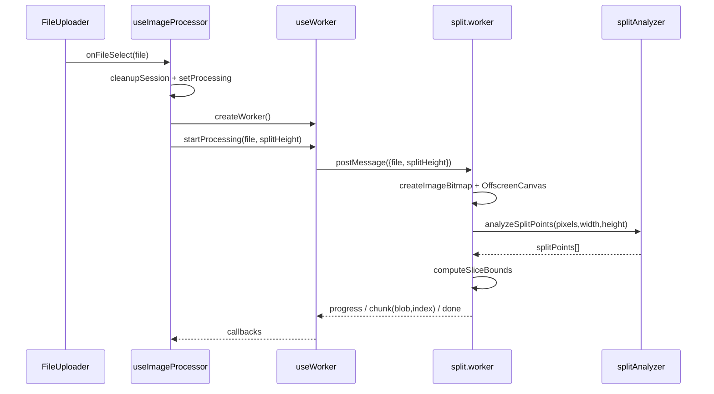
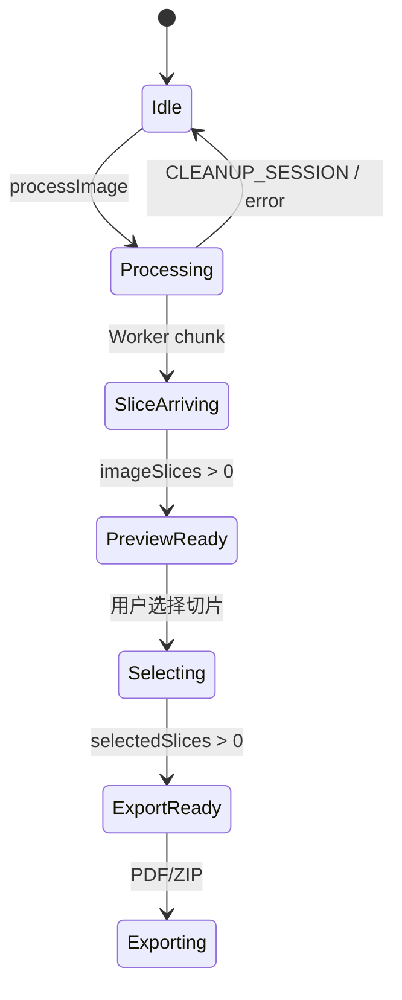

# Long_screenshot_splitting_tool 架构分析报告 v1.2

> 仓库：`yuanyuanyuan/Long_screenshot_splitting_tool`
> 本地源码：`/tmp/Long_screenshot_splitting_tool`
> 分析模式：标准分析，Evidence Anchor First
> 日期：2026-07-09

## 1. 项目全景

这个项目不是截图捕获器，而是一个**纯前端长截图分割与交付工具**：用户上传已有长图，浏览器内完成解码、内容感知切割、预览选择，并导出 PDF 或 ZIP。核心技术栈是 React 19、TypeScript、Vite、Web Worker、OffscreenCanvas、jsPDF 和 JSZip，依赖信息见 `/tmp/Long_screenshot_splitting_tool/package.json`。

它的主链路很清楚：

项目的核心哲学是：**纯前端、低依赖、自造关键胶水、用状态守卫保护任务流程**。路由没有引入 React Router，而是用 hash Hook；状态没有引入 Redux/Zustand，而是用局部 `useReducer`；算法层也没有塞进 Worker，而是抽成纯函数模块。

## 2. 业务问题：为什么它不只是“按高度裁图”

长截图的真实痛点是交付：聊天窗口、文档归档、打印和二次编辑都不适合直接处理一张超长图。项目把问题拆成四步：

- 上传：`FileUploader` 校验图片格式和大小，再交出单个 `File`（`/tmp/Long_screenshot_splitting_tool/src/components/FileUploader.tsx:11`、`:25-26`、`:51-80`）。
- 切割：Worker 后台执行解码、分析和裁切，避免主线程卡顿（`/tmp/Long_screenshot_splitting_tool/src/hooks/useWorker.ts:39-47`、`/tmp/Long_screenshot_splitting_tool/src/workers/split.worker.js:75-180`）。
- 选择：状态层保存切片和选中集合，预览页消费这些状态（`/tmp/Long_screenshot_splitting_tool/src/types/index.ts:11-28`、`/tmp/Long_screenshot_splitting_tool/src/App.tsx:359-367`）。
- 导出：PDF/ZIP 导出器把选中切片转成可下载文件（`/tmp/Long_screenshot_splitting_tool/src/App.tsx:224-263`、`/tmp/Long_screenshot_splitting_tool/src/utils/pdfExporter.ts:51-139`、`/tmp/Long_screenshot_splitting_tool/src/utils/zipExporter.ts:44-107`）。

## 3. 路由与导航守卫：单页工具的流程保险

运行时路由很轻：`useRouter` 从 `window.location.hash.slice(1) || '/'` 初始化路径，监听 `hashchange` 更新状态，`push` 直接写入 `window.location.hash`（`/tmp/Long_screenshot_splitting_tool/src/hooks/useRouter.ts:15-41`）。这比 React Router 少很多能力，但适合 GitHub Pages 这类静态部署；配置文件也明确写出 SPA 模式兼容 GitHub Pages 使用 hash（`/tmp/Long_screenshot_splitting_tool/src/router/index.ts:60-68`）。

更值得注意的是导航守卫。App 在渲染前调用 `validateNavigation(currentPath, state)`，不满足前置条件时由 `navigationErrorHandler` 生成恢复策略，并重定向到 `/upload`、`/split` 或 `/`（`/tmp/Long_screenshot_splitting_tool/src/App.tsx:137-182`、`/tmp/Long_screenshot_splitting_tool/src/utils/navigationErrorHandler.ts:55-105`、`:235-281`）。同时 `/split` 和 `/export` 分支内部还有页面级兜底 UI，避免状态异常时白屏（`/tmp/Long_screenshot_splitting_tool/src/App.tsx:305-349`、`:375-430`）。

关键设计是：上传后不立即跳转。App 等 `imageSlices.length` 从 0 变成大于 0 后才 `push('/split')`，源码注释明确说这是为了避免 Worker 尚未产出切片时被 `/split` 守卫踢回上传页（`/tmp/Long_screenshot_splitting_tool/src/App.tsx:121-135`、`:196-201`）。这是“状态驱动导航”的好例子。

问题也明显：`src/router/index.ts` 有较完整的配置层和匹配工具，但当前 App 实际用 `switch(currentPath)` 分发页面（`/tmp/Long_screenshot_splitting_tool/src/router/index.ts:66-178`、`/tmp/Long_screenshot_splitting_tool/src/App.tsx:284-430`）。配置层、错误守卫、导航禁用和页面内兜底存在规则重复，后续新增步骤时容易不同步。

## 4. 切割流水线：项目最核心的设计

切割流水线分成四层：

`useImageProcessor` 是协调层：清理旧会话、设置处理状态、加载原图、创建 Worker、发送文件、把 Worker 回传 Blob 转成 `ImageSlice`（`/tmp/Long_screenshot_splitting_tool/src/hooks/useImageProcessor.ts:91-130`）。`useWorker` 是传输层：创建 module worker，分发 `progress/chunk/done/error`，并提供终止能力（`/tmp/Long_screenshot_splitting_tool/src/hooks/useWorker.ts:29-47`、`:50-77`、`:106-149`）。

Worker 负责图像 I/O：`createImageBitmap` 解码，`OffscreenCanvas` 绘制全图，`getImageData` 读取像素，再把每段裁成 JPEG Blob（`/tmp/Long_screenshot_splitting_tool/src/workers/split.worker.js:85-116`、`:140-180`、`:259-263`）。算法层 `splitAnalyzer` 是纯函数：文件头明确声明无 DOM/canvas/Worker 依赖，并按“行变化率 → 平滑 → 低变化带 → 页高驱动选点 → 防碎页/末页合并”的流程返回切割点（`/tmp/Long_screenshot_splitting_tool/src/utils/splitAnalyzer.ts:6-13`、`:88-113`、`:122-180`、`:194-235`、`:250-270`）。

最重要的权衡是**内容感知 + 安全回退**。Worker 调用 `analyzeSplitPoints`，如果分析异常会 catch 并把 `splitPoints` 置空；`computeSliceBounds` 对空切点走固定高度等分（`/tmp/Long_screenshot_splitting_tool/src/workers/split.worker.js:111-129`、`:218-249`）。这意味着“智能切割”失败不会让用户任务失败。

主要风险：

- `useImageProcessor` 用 `await new Promise(resolve => setTimeout(resolve, 200))` 等 Worker 创建完成，这是一种脆弱的时序补偿（`/tmp/Long_screenshot_splitting_tool/src/hooks/useImageProcessor.ts:121-128`）。
- Worker 全图 `getImageData`，内存规模与 `width * height * 4` 成正比，源码也标注大图分块读取为未来优化（`/tmp/Long_screenshot_splitting_tool/src/workers/split.worker.js:111-117`）。
- 当前候选源码中没有看到 OffscreenCanvas/createImageBitmap 的兼容性探测，Worker 创建失败只能进入错误回调（`/tmp/Long_screenshot_splitting_tool/src/hooks/useWorker.ts:80-103`）。

## 5. 状态管理：异步流水线的承接层

状态层定义了一个小型会话状态机：Worker、Blob、Object URL、原图、切片、选中集合、处理状态、切割高度和文件名都集中在 `AppState`（`/tmp/Long_screenshot_splitting_tool/src/types/index.ts:11-28`）。Action 覆盖写入切片、选择、处理态、清理、完成等动作（`/tmp/Long_screenshot_splitting_tool/src/types/index.ts:30-42`）。

选择 `useReducer` 是合理的：状态不大，但状态之间强耦合。切片、对象 URL、Worker 生命周期和选择集合必须作为一次会话来处理。`CLEANUP_SESSION` 集中释放 `objectUrls`、尝试终止 Worker，并保留用户的 `splitHeight` 与 `fileName`（`/tmp/Long_screenshot_splitting_tool/src/hooks/useAppState.ts:89-112`）。新上传和错误恢复都复用这个入口（`/tmp/Long_screenshot_splitting_tool/src/hooks/useImageProcessor.ts:96-101`、`/tmp/Long_screenshot_splitting_tool/src/App.tsx:211-214`）。

切片写入是状态层的核心：`ADD_IMAGE_SLICE` 按 `action.payload.index` 写入数组，而不是 push，源码注释说明这是为修复 `img.onload` 回调导致的乱序（`/tmp/Long_screenshot_splitting_tool/src/hooks/useAppState.ts:47-55`）。这个设计与导出层按 index 排序共同构成页序契约。

代价是 sparse array 风险。如果高 index 先到，数组 length 会被撑大，中间可能有空洞；`SELECT_ALL_SLICES` 直接 `state.imageSlices.map(slice => slice.index)`，预览侧也混用了数组下标和 `slice.index`（`/tmp/Long_screenshot_splitting_tool/src/hooks/useAppState.ts:72-74`、`/tmp/Long_screenshot_splitting_tool/src/components/ImagePreview.tsx:210-222`）。这不是已复现 bug，但它是异步回填数组的真实演进风险。

另一个边界问题是 Worker 所有权：`AppState` 有 `worker` 和 `SET_WORKER`，但 `useImageProcessor` 当前只调用 `createWorker()`，没有看到把 `useWorker` 的 Worker 写入 AppState；实际生命周期更依赖 `useWorker` 的 ref 和卸载清理（`/tmp/Long_screenshot_splitting_tool/src/hooks/useImageProcessor.ts:83-89`、`:121-128`、`/tmp/Long_screenshot_splitting_tool/src/hooks/useWorker.ts:30-37`、`:145-149`、`/tmp/Long_screenshot_splitting_tool/src/hooks/useAppState.ts:35-36`、`:100-106`）。

## 6. 导出系统：简单格式导出器优于过早统一引擎

导出系统的主数据是 `imageSlices + selectedSlices`。PDF 和 ZIP 导出器都先执行同一个关键规则：按 `selectedIndices.has(slice.index)` 过滤，再按 `a.index - b.index` 排序（`/tmp/Long_screenshot_splitting_tool/src/utils/pdfExporter.ts:59-61`、`/tmp/Long_screenshot_splitting_tool/src/utils/zipExporter.ts:51-53`）。这让最终页序不依赖用户点击顺序，也不依赖异步 chunk 到达顺序。

PDF 与 ZIP 分开实现是合理的。PDF 需要 jsPDF 页面尺寸、图片缩放和 addImage/save（`/tmp/Long_screenshot_splitting_tool/src/utils/pdfExporter.ts:68-76`、`:98-115`、`:131-132`）；ZIP 需要 JSZip 文件命名、压缩、Blob 下载（`/tmp/Long_screenshot_splitting_tool/src/utils/zipExporter.ts:59-67`、`:83-96`、`:188-196`）。当前阶段不需要一个大而全的 ExportEngine，最多应该抽出 `normalizeSelectedSlices` 复用过滤排序与空选校验。

防御上有三层：页面层不满足导出前置条件时给恢复 UI，ExportControls 遇到 disabled/空选直接返回，导出器内部过滤为空则抛错（`/tmp/Long_screenshot_splitting_tool/src/App.tsx:375-430`、`/tmp/Long_screenshot_splitting_tool/src/components/ExportControls.tsx:82-90`、`/tmp/Long_screenshot_splitting_tool/src/utils/pdfExporter.ts:63-65`、`/tmp/Long_screenshot_splitting_tool/src/utils/zipExporter.ts:55-57`）。这有点保守，但对用户操作和未来 API 调用都安全。

导出系统的问题更具体：

- `ExportControls` 本地重复声明 `ImageSlice`，而项目已有共享类型（`/tmp/Long_screenshot_splitting_tool/src/types/index.ts:3-8`、`/tmp/Long_screenshot_splitting_tool/src/components/ExportControls.tsx:10-16`）。
- `App` 和 `ExportControls` 都维护 `isExporting`，存在状态来源不唯一（`/tmp/Long_screenshot_splitting_tool/src/App.tsx:40`、`:230-263`、`/tmp/Long_screenshot_splitting_tool/src/components/ExportControls.tsx:56`、`:86-96`）。
- ExportControls 提供质量、PDF、ZIP 高级配置，但 `App.handleExport` 只读取 `options?.filename`，没有把这些配置传给格式导出器（`/tmp/Long_screenshot_splitting_tool/src/components/ExportControls.tsx:66-89`、`/tmp/Long_screenshot_splitting_tool/src/App.tsx:233-249`）。

## 7. 次要模块：支撑层与过度工程边界

i18n 是合理的横切 UI 文案层：它负责语言检测、动态导入、缓存、插值和偏好保存，App 与 ExportControls 通过 `t(...)` 使用文案（`/tmp/Long_screenshot_splitting_tool/src/hooks/useI18n.ts:67-103`、`/tmp/Long_screenshot_splitting_tool/src/App.tsx:37`、`/tmp/Long_screenshot_splitting_tool/src/components/ExportControls.tsx:52`）。

SEO 是获客必要能力，但当前复杂度偏高。App 实际挂载 `SEOManager`（`/tmp/Long_screenshot_splitting_tool/src/App.tsx:24`、`:539-552`），同时项目还有 `EnhancedSEOManager`，包含 web-vitals 动态导入、结构化数据 lazy load、memo 化导出等逻辑（`/tmp/Long_screenshot_splitting_tool/src/components/EnhancedSEOManager.tsx:18-49`、`:144`、`:326-341`）。对一个工具型 SPA 来说，两套增强 SEO 管理器并存是复杂度风险。

shared-components 的实际使用很窄：App 只引入 `CopyrightInfo` 并渲染版权信息（`/tmp/Long_screenshot_splitting_tool/src/App.tsx:21`、`:561-567`）。但 shared-components 暴露了组件注册、消息、事件、生命周期、共享状态等一套通用协议（`/tmp/Long_screenshot_splitting_tool/shared-components/interfaces/ComponentInterface.ts:6-61`、`:123-195`）。这更像未来微内核扩展，而不是当前长截图工具的核心架构。

## 8. 总体评价

### 亮点

- 核心流水线边界清晰：协调层、传输层、图像 I/O、算法层分离。
- `splitAnalyzer` 纯函数化，是全项目最值得学习的设计。
- 内容感知失败回退等分，体现了产品稳定性优先。
- 状态驱动导航避免异步处理未完成时错页。
- `slice.index` 贯穿切割、状态、导出，保证异步环境下的页序稳定。

### 问题

- `setTimeout(200)` 等 Worker 就绪是脆弱时序补偿。
- `imageSlices` 按 index 回填数组可能形成 sparse array。
- Worker 生命周期所有权在 `useWorker` 与 `AppState.worker` 之间不清。
- 导出高级配置 UI 与实际导出器选项链路未闭合。
- SEO/shared-components 复杂度超过当前核心工具需求。

## 9. 如果重新设计

我会保留“纯前端 + Worker + 内容感知 + 回退”的主架构，只调整边界：

1. 用 Worker ready/handshake 替换 `setTimeout(200)`。
2. 用 `Map<number, ImageSlice>` 或 `{ byIndex, orderedIndices }` 表示切片集合，渲染/导出前生成 dense sorted array。
3. 为处理会话加 `sessionId`，防止旧 Worker 消息写入新会话。
4. 明确 Worker 所有权：要么删除 `AppState.worker`，要么把 Worker 实例真实写入状态。
5. 抽出 `normalizeSelectedSlices`，复用导出过滤排序规则。
6. 收敛 SEO 为一套实现，把 shared-components 的微内核能力标注为未来扩展。

## 10. 结论

v1.2 的判断是：这个项目的核心业务架构是健康的，尤其是切割流水线和回退策略；主要风险不在“能不能完成长截图分割”，而在长期维护时外围复杂度、状态表示和时序补偿会逐渐放大。

一句话总结：**它是一个完成度较高的纯前端长截图处理工具，最值得学习的是 Worker + 纯函数算法 + 状态守卫的组合，最需要收敛的是外围过度工程和异步状态边界。**
