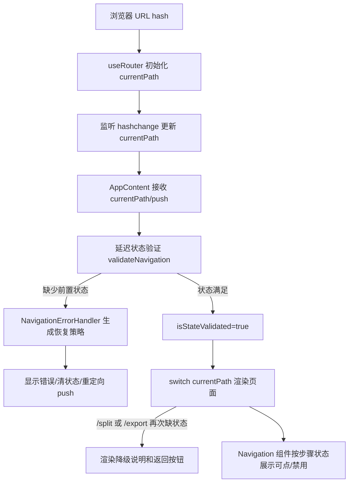

# 06 路由与导航守卫模块

## 1. 模块角色

「路由与导航守卫」模块在这个纯前端长截图分割工具中承担两件事：第一，把浏览器地址栏的 hash 转成当前页面状态；第二，在用户直接访问、刷新或处理流程尚未完成时，阻止应用渲染到不满足前置条件的页面。它服务的是一个典型 GitHub Pages/SPA 场景：页面需要能被 URL 定位和浏览器前进后退驱动，但不能依赖服务端 rewrite。`useRouter` 直接从 `window.location.hash` 初始化 `currentPath`，并通过 `hashchange` 监听同步状态，说明运行时实际选择的是浏览器 hash 作为单一 URL 状态来源（/tmp/Long_screenshot_splitting_tool/src/hooks/useRouter.ts:15-34）。

去掉这层模块后，应用仍可以在单页内靠 React state 切换 UI，但会失去刷新后定位页面、浏览器导航、以及缺失图片/切片状态时的恢复路径。App 入口把 `currentPath` 和 `push` 从 `useRouter` 注入到页面分发、自动跳转、导航组件和错误恢复中，说明路由状态是 UI 分发与业务状态守卫之间的连接点（/tmp/Long_screenshot_splitting_tool/src/App.tsx:38-44, /tmp/Long_screenshot_splitting_tool/src/App.tsx:121-135, /tmp/Long_screenshot_splitting_tool/src/App.tsx:137-182, /tmp/Long_screenshot_splitting_tool/src/App.tsx:582-589）。

## 2. 解决的问题

这个模块解决的不是「复杂路由」问题，而是「多步骤前端工作流在静态部署下如何不白屏、不错页」的问题。长截图分割流程天然有顺序：上传图片后才能切割，有切片并选择后才能导出。源码把 `/split` 的前置条件定义为存在原图和切片，把 `/export` 的前置条件定义为存在原图、切片和已选切片；不满足条件时会生成导航错误（/tmp/Long_screenshot_splitting_tool/src/utils/navigationErrorHandler.ts:55-105）。App 在渲染前延迟 100ms 执行验证，发现错误后根据恢复策略清状态、显示错误提示并重定向，避免刷新到 `/split` 或 `/export` 时直接进入空数据页面（/tmp/Long_screenshot_splitting_tool/src/App.tsx:137-182）。

## 3. 设计思路

### 3.1 自定义 hash 路由优先于 React Router

当前运行时没有接入 React Router，而是用一个极小的 `useRouter` Hook 维护 `currentPath`、`params`、`query` 和 `push/replace`。`push` 的实现只是写入 `window.location.hash`，`replace` 则拼接当前 pathname/search 后替换 hash URL（/tmp/Long_screenshot_splitting_tool/src/hooks/useRouter.ts:16-50）。这个选择降低了依赖和配置成本，也自然适配 GitHub Pages 这类静态托管：hash 片段不会参与服务端路径解析，刷新深层页面不会要求服务器返回对应路由资源。

源码中也存在更完整的路由配置模型：`RouterConfig` 支持 `hash/history`、`fallback` 和 routes，且注释明确说明 SPA 模式兼容 GitHub Pages 使用 hash，singlefile 模式使用 history（/tmp/Long_screenshot_splitting_tool/src/router/index.ts:20-25, /tmp/Long_screenshot_splitting_tool/src/router/index.ts:60-68）。但从全仓 `rg` 结果看，`routerConfig`、`matchRoute`、`parseParams`、`parseQuery` 和 `buildUrl` 只在 `src/router/index.ts` 内定义，未被 App 运行时导入；实际分发由 `App.tsx` 的 `switch(currentPath)` 完成（/tmp/Long_screenshot_splitting_tool/src/router/index.ts:66-178, /tmp/Long_screenshot_splitting_tool/src/App.tsx:284-430）。因此更准确的判断是：项目保留了配置化 Router 的雏形，但当前运行路径是「Hook 读 hash + App 手写 switch」。

### 3.2 守卫分为硬守卫与软守卫

硬守卫发生在 App 渲染前：`validateNavigation(currentPath, state)` 检查当前路径是否满足业务状态，不满足时通过 `navigationErrorHandler.handleNavigationError` 生成恢复策略，随后 `push(strategy.redirectTo)`（/tmp/Long_screenshot_splitting_tool/src/App.tsx:137-182）。软守卫发生在具体页面渲染分支内：即使已经进入 `/split` 或 `/export` 分支，App 仍会检查数据是否存在，并渲染带按钮的降级界面，而不是渲染空白预览或导出控件（/tmp/Long_screenshot_splitting_tool/src/App.tsx:305-349, /tmp/Long_screenshot_splitting_tool/src/App.tsx:375-430）。

这个双层设计有实际价值：硬守卫负责 URL 与全局状态一致性，软守卫负责最终 UI 安全兜底。代价是同一前置条件被多处表达，未来如果业务步骤变化，`navigationErrorHandler`、`App.tsx` 分支守卫和 `useNavigationState` 的禁用规则需要同步修改（/tmp/Long_screenshot_splitting_tool/src/utils/navigationErrorHandler.ts:55-105, /tmp/Long_screenshot_splitting_tool/src/App.tsx:305-430, /tmp/Long_screenshot_splitting_tool/src/hooks/useNavigationState.ts:105-134）。

## 4. 核心数据结构

```ts
interface SimpleRouterState {
  currentPath: string;
  params: Record<string, string>;
  query: Record<string, string>;
}
```

运行时 `useRouter` 的核心状态很小，只保留当前路径、参数和查询对象；但当前实现没有解析 params/query，初始化和 `hashchange` 更新时都把它们置为空对象（/tmp/Long_screenshot_splitting_tool/src/hooks/useRouter.ts:7-20, /tmp/Long_screenshot_splitting_tool/src/hooks/useRouter.ts:22-34）。

```ts
interface NavigationError {
  type: NavigationErrorType;
  message: string;
  currentPath: string;
  expectedState?: Partial<AppState>;
  actualState?: Partial<AppState>;
  timestamp: number;
  recoveryAction?: string;
}

interface RecoveryStrategy {
  redirectTo: string;
  clearState?: boolean;
  showMessage?: boolean;
  messageKey?: string;
}
```

导航错误把「当前路径」「期望状态」「实际状态」和「恢复动作」统一建模，恢复策略则把错误处理结果压缩成重定向、是否清状态、是否提示用户三类动作（/tmp/Long_screenshot_splitting_tool/src/utils/navigationErrorHandler.ts:18-35）。这让 App 不需要知道每种错误的细节，只要执行策略即可（/tmp/Long_screenshot_splitting_tool/src/App.tsx:148-170）。

```ts
interface NavigationState {
  currentStep: string;
  availableSteps: string[];
  completedSteps: string[];
  blockedSteps: string[];
}
```

`useNavigationState` 把业务状态映射成导航 UI 状态：哪些步骤可用、已完成、被阻塞。默认步骤固定为 `/`、`/upload`、`/split`、`/export`，并以 `originalImage`、`imageSlices`、`selectedSlices`、`isProcessing` 推导禁用状态（/tmp/Long_screenshot_splitting_tool/src/hooks/useNavigationState.ts:17-48, /tmp/Long_screenshot_splitting_tool/src/hooks/useNavigationState.ts:82-134）。

## 5. 核心业务流程



### 5.1 URL 到页面分发

`useRouter` 在首次渲染时从 `window.location.hash.slice(1) || '/'` 得到当前路径，并在浏览器 `hashchange` 时重复读取 hash 写入 React state（/tmp/Long_screenshot_splitting_tool/src/hooks/useRouter.ts:15-34）。App 读取 `currentPath` 后直接用 `switch` 渲染 `/upload`、`/split`、`/export`，默认路径归入首页/其他页面逻辑；SEO 页面类型也用同一个 `currentPath` switch 推导（/tmp/Long_screenshot_splitting_tool/src/App.tsx:270-286）。

### 5.2 上传完成后的安全跳转

上传处理完成后并不立即跳转。App 用 `prevSliceCountRef` 监听 `imageSlices` 从 0 变为大于 0，且当前仍在 `/upload` 或 `/` 时才 `push('/split')`（/tmp/Long_screenshot_splitting_tool/src/App.tsx:121-135）。注释解释了动机：如果在 `handleFileSelect` 中处理完就跳，worker 尚未产出切片时 `/split` 守卫会因为 `imageSlices` 为空判定 `MISSING_SLICES` 并踢回 `/upload`（/tmp/Long_screenshot_splitting_tool/src/App.tsx:121-123, /tmp/Long_screenshot_splitting_tool/src/App.tsx:196-201）。

### 5.3 刷新与缺失状态恢复

页面刷新到 `/split` 或 `/export` 时，内存态可能丢失。App 的状态验证 effect 会在 100ms 后调用 `validateNavigation(currentPath, state)`，验证通过后才设置 `isStateValidated=true`；验证完成前统一渲染 loading，避免页面内容在不确定状态下闪现或白屏（/tmp/Long_screenshot_splitting_tool/src/App.tsx:137-194）。如果缺少原图、切片或选择项，错误处理器会按错误类型返回 `/upload`、`/split` 或 `/` 等恢复路径（/tmp/Long_screenshot_splitting_tool/src/utils/navigationErrorHandler.ts:235-281）。

### 5.4 导航 UI 的可访问性提示

导航 UI 的可点击状态由 `useNavigationState` 推导：`/split` 在没有原图或正在处理时禁用，`/export` 在没有选中切片或正在处理时禁用，首页和上传页在处理中禁用（/tmp/Long_screenshot_splitting_tool/src/hooks/useNavigationState.ts:105-134）。Hook 还提供 `isStepAccessible`、`getStepStatus`、下一步/上一步等查询方法，使导航组件能展示流程进度和禁用态（/tmp/Long_screenshot_splitting_tool/src/hooks/useNavigationState.ts:233-280, /tmp/Long_screenshot_splitting_tool/src/hooks/useNavigationState.ts:312-334）。

## 6. 与其他模块的设计协同

这个模块与状态管理模块的契约非常直接：它不拥有业务数据，只读取 `AppState` 中的 `originalImage`、`imageSlices`、`selectedSlices`、`isProcessing` 来判断路径是否可访问（/tmp/Long_screenshot_splitting_tool/src/utils/navigationErrorHandler.ts:55-59, /tmp/Long_screenshot_splitting_tool/src/hooks/useNavigationState.ts:82-102）。当恢复策略要求清理状态时，App 调用状态模块暴露的 `actions.cleanupSession()`，路由模块本身不直接修改业务状态（/tmp/Long_screenshot_splitting_tool/src/App.tsx:163-170, /tmp/Long_screenshot_splitting_tool/src/App.tsx:211-219）。

与图像处理模块的协同体现在「产出切片后再导航」。App 等到 `state.imageSlices.length` 从 0 变为大于 0 才跳转 `/split`，把异步 worker 产出作为页面切换的事实依据，而不是把 `processImage(file)` 的 Promise 结束当作页面可用的依据（/tmp/Long_screenshot_splitting_tool/src/App.tsx:121-135, /tmp/Long_screenshot_splitting_tool/src/App.tsx:196-201）。这符合项目整体的状态驱动风格：页面状态由业务状态推导，而不是由事件顺序乐观假设。

与导航组件的契约是 `App` 提供当前路径和跳转函数，导航组件提供用户入口。App 在渲染导航时传入 `appState`、`currentPath` 和 `onNavigate={(path) => push(path)}`（/tmp/Long_screenshot_splitting_tool/src/App.tsx:582-589）。由于本次边界未分析 `src/components/Navigation.tsx`，导航组件内部如何处理 disabled 点击只作为开放问题，不写成确定性结论。

## 7. 关键设计决策

### 决策 1：使用 hash 作为运行时路由源

源码证据显示运行时路径来自 `window.location.hash`，跳转也通过写 hash 完成（/tmp/Long_screenshot_splitting_tool/src/hooks/useRouter.ts:15-41）。这比 React Router 更轻，且避免 GitHub Pages 刷新深层路径 404 的常见问题；配置文件也明确把 SPA 模式与 GitHub Pages/hash 兼容联系在一起（/tmp/Long_screenshot_splitting_tool/src/router/index.ts:60-68）。代价是当前没有嵌套路由、懒加载、loader/action、统一 route object 分发等能力；但对四步本地工具而言，这个代价可接受。

### 决策 2：把导航守卫做成状态校验 + 恢复策略，而不是只禁用按钮

仅禁用导航按钮无法处理刷新、手动改 hash、浏览器前进后退等入口。项目把守卫放在 App effect 中，每次 `currentPath` 或 `state` 变化都验证，并根据错误恢复策略重定向（/tmp/Long_screenshot_splitting_tool/src/App.tsx:137-182）。这让系统覆盖了 URL 直达路径，而不只是 UI 点击路径。

### 决策 3：保留页面内降级 UI 作为第二道防线

`/split` 和 `/export` 分支内部仍检查业务状态，不满足时渲染「去上传」「回首页」「去选择切片」等按钮（/tmp/Long_screenshot_splitting_tool/src/App.tsx:305-349, /tmp/Long_screenshot_splitting_tool/src/App.tsx:375-430）。这是一种务实的防御式 UI：即使全局验证因为时序、未来改动或 bug 没有拦住，用户仍不会看到空白页面或错误组件。

## 8. Deep Research 洞察

如果这个项目使用 React Router，理论上可以把 routes、loader、redirect 和 error boundary 统一起来，减少 `router/index.ts` 配置与 `App.tsx` switch 的分裂。但 React Router 的 history 模式在 GitHub Pages 需要额外 404 fallback 或 HashRouter；而当前项目只有四个固定步骤，hash Hook 的复杂度更低。源码中的 `routerConfig` 已经表达了未来走配置化路由的方向，但它当前没有参与运行时，这是架构演进中的半成品状态（/tmp/Long_screenshot_splitting_tool/src/router/index.ts:66-178, /tmp/Long_screenshot_splitting_tool/src/App.tsx:284-430）。

如果重新设计，我会把「步骤定义」收敛为一个单一 route/step registry：路径、标题、前置条件、恢复路径、导航禁用规则、页面组件都从同一个结构派生。这样可以消除 `navigationErrorHandler`、`useNavigationState`、`App.tsx` 页面分支之间的规则重复。这个建议基于当前源码中三处规则重复的观察：错误验证规则（/tmp/Long_screenshot_splitting_tool/src/utils/navigationErrorHandler.ts:55-105）、导航禁用规则（/tmp/Long_screenshot_splitting_tool/src/hooks/useNavigationState.ts:105-134）、页面内降级规则（/tmp/Long_screenshot_splitting_tool/src/App.tsx:305-430）。

## 9. 问题、风险与改进

1. **配置层未真实接入运行时**：`routerConfig`、`matchRoute`、`parseParams`、`parseQuery`、`buildUrl` 目前只在 `src/router/index.ts` 中定义，App 的实际分发不使用这些工具（/tmp/Long_screenshot_splitting_tool/src/router/index.ts:66-178, /tmp/Long_screenshot_splitting_tool/src/App.tsx:284-430）。风险是维护者以为改配置即可新增页面，但实际还要改 App switch、导航状态和错误守卫。

2. **守卫逻辑重复，存在不同步风险**：`/split` 和 `/export` 的访问条件分别出现在错误处理器、导航状态 Hook、App 页面分支中（/tmp/Long_screenshot_splitting_tool/src/utils/navigationErrorHandler.ts:55-105, /tmp/Long_screenshot_splitting_tool/src/hooks/useNavigationState.ts:105-134, /tmp/Long_screenshot_splitting_tool/src/App.tsx:305-430）。例如 `useNavigationState` 对 `/export` 的禁用只看 `hasSelectedSlices`，而错误处理器还要求原图和切片存在；两者在状态损坏场景下可能给出不同判断（/tmp/Long_screenshot_splitting_tool/src/hooks/useNavigationState.ts:121-123, /tmp/Long_screenshot_splitting_tool/src/utils/navigationErrorHandler.ts:82-100）。

3. **`isStateValidated` 只设置为 true，未在路径变化时显式重置**：App 在验证通过后设置 `setIsStateValidated(true)`，但 effect 依赖 `currentPath` 和 `state` 变化时没有先重置为 false（/tmp/Long_screenshot_splitting_tool/src/App.tsx:137-182）。这不一定导致 bug，因为页面分支还有软守卫；但它削弱了「验证完成前不渲染内容」这一设计在后续导航中的一致性。

4. **路由参数和 query 是预留能力而非当前能力**：`useRouter` 暴露 `params/query`，但更新时始终置为空对象；真正的解析工具在 `router/index.ts` 中，未接入运行时（/tmp/Long_screenshot_splitting_tool/src/hooks/useRouter.ts:16-34, /tmp/Long_screenshot_splitting_tool/src/router/index.ts:138-166）。如果未来需要分享带参数的导出设置 URL，需要先统一这两套实现。

## 10. 假设与开放问题

- **假设**：项目选择自定义 hash 路由的主要原因是静态部署兼容和减少依赖。源码能证明 hash 来源、GitHub Pages 注释和未使用 React Router，但没有 ADR 或提交记录直接说明「为什么不用 React Router」（/tmp/Long_screenshot_splitting_tool/src/hooks/useRouter.ts:15-41, /tmp/Long_screenshot_splitting_tool/src/router/index.ts:60-68）。
- **开放问题**：`src/router/index.ts` 是早期遗留、未来规划，还是构建模式的一部分？当前候选文件和 `rg` 证据只能证明它未被当前 App 运行时导入，不能证明作者意图（/tmp/Long_screenshot_splitting_tool/src/router/index.ts:66-178）。
- **开放问题**：导航组件是否会阻止 disabled 项点击？本次边界未分析 `src/components/Navigation.tsx`，只能确认 App 把 `appState/currentPath/onNavigate` 传给导航组件（/tmp/Long_screenshot_splitting_tool/src/App.tsx:582-589）。

## 11. 源码锚点清单

| 结论 | 锚点位置 | 锚点类型 |
|---|---|---|
| 当前运行时路径来源是 hash | /tmp/Long_screenshot_splitting_tool/src/hooks/useRouter.ts:15-34 | 状态来源 |
| 跳转通过写入 hash 实现 | /tmp/Long_screenshot_splitting_tool/src/hooks/useRouter.ts:36-41 | 导航动作 |
| 配置层声明 SPA 模式使用 hash 兼容 GitHub Pages | /tmp/Long_screenshot_splitting_tool/src/router/index.ts:60-68 | 设计意图 |
| 路由配置和工具存在但未接入 App 分发 | /tmp/Long_screenshot_splitting_tool/src/router/index.ts:66-178, /tmp/Long_screenshot_splitting_tool/src/App.tsx:284-430 | 风险 |
| App 用 switch(currentPath) 实际渲染页面 | /tmp/Long_screenshot_splitting_tool/src/App.tsx:284-430 | 执行流程 |
| 刷新/直达路径通过状态验证恢复 | /tmp/Long_screenshot_splitting_tool/src/App.tsx:137-182 | 守卫流程 |
| 验证完成前渲染 loading | /tmp/Long_screenshot_splitting_tool/src/App.tsx:184-194 | 白屏/错页防护 |
| `/split` 和 `/export` 前置条件由错误处理器定义 | /tmp/Long_screenshot_splitting_tool/src/utils/navigationErrorHandler.ts:55-105 | 守卫规则 |
| 恢复策略将错误映射为重定向和清状态 | /tmp/Long_screenshot_splitting_tool/src/utils/navigationErrorHandler.ts:235-281 | 错误恢复 |
| 上传完成后等待切片到达再跳转 | /tmp/Long_screenshot_splitting_tool/src/App.tsx:121-135 | 时序防护 |
| 导航 UI 状态从 AppState 推导 | /tmp/Long_screenshot_splitting_tool/src/hooks/useNavigationState.ts:82-134 | UI 守卫 |
