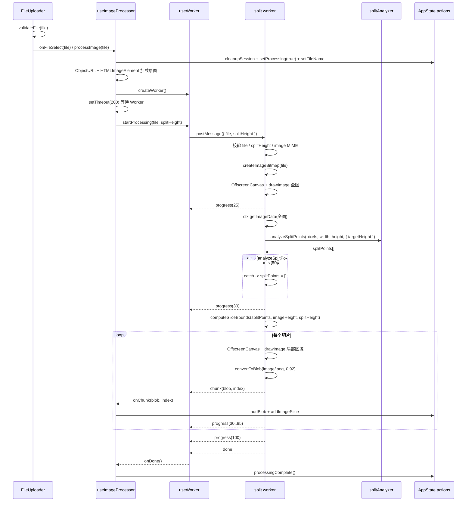

# 切割流水线模块（Split Pipeline）

本模块分析范围限定为「上传后到切片产出」：从 `FileUploader` 交出合法图片文件开始，到 Worker 逐个产出 `chunk`、主线程生成 `ImageSlice` 为止。导出、路由跳转、全局 reducer 的完整行为不在本次证据范围内；如需引用，只能作为开放问题。

---

## 1. 在项目中的角色

切割流水线是长截图分割工具的核心生产链路：它把上传组件交出的 `File` 转换为一组带 `blob/url/index/width/height` 的切片数据。输入契约由上传组件限制为单个图片文件，且默认限制格式和大小；处理结果的数据形态由 `ImageSlice` 定义。证据：`/tmp/Long_screenshot_splitting_tool/src/components/FileUploader.tsx:11`、`/tmp/Long_screenshot_splitting_tool/src/components/FileUploader.tsx:25`、`/tmp/Long_screenshot_splitting_tool/src/components/FileUploader.tsx:26`、`/tmp/Long_screenshot_splitting_tool/src/components/FileUploader.tsx:67`、`/tmp/Long_screenshot_splitting_tool/src/types/index.ts:3`。

去掉这条流水线，上传后的文件不会被解码、分析、切片，也不会形成后续 UI 或导出可消费的 `ImageSlice[]`。这是基于 `useImageProcessor.processImage(file)` 是处理入口、`handleChunk` 是切片入库路径的确定性结论。证据：`/tmp/Long_screenshot_splitting_tool/src/hooks/useImageProcessor.ts:92`、`/tmp/Long_screenshot_splitting_tool/src/hooks/useImageProcessor.ts:30`、`/tmp/Long_screenshot_splitting_tool/src/hooks/useImageProcessor.ts:50`、`/tmp/Long_screenshot_splitting_tool/src/hooks/useImageProcessor.ts:58`。

---

## 2. 解决什么问题

业务问题不是“把图片裁成固定高度”这么简单，而是要在浏览器内完成三件事：

- 主线程保持响应：Worker 负责图像解码、像素读取、切片编码等重活，主线程只做状态协调和结果接收。证据：`/tmp/Long_screenshot_splitting_tool/src/hooks/useWorker.ts:19`、`/tmp/Long_screenshot_splitting_tool/src/hooks/useWorker.ts:42`、`/tmp/Long_screenshot_splitting_tool/src/workers/split.worker.js:14`。
- 避免硬切内容：Worker 在解码后调用 `analyzeSplitPoints` 寻找内容空白带，再决定切片边界。证据：`/tmp/Long_screenshot_splitting_tool/src/workers/split.worker.js:111`、`/tmp/Long_screenshot_splitting_tool/src/workers/split.worker.js:116`、`/tmp/Long_screenshot_splitting_tool/src/workers/split.worker.js:117`。
- 内容感知失败时仍完成用户任务：分析异常被捕获并设置 `splitPoints = []`，后续 `computeSliceBounds` 会走固定高度等分回退。证据：`/tmp/Long_screenshot_splitting_tool/src/workers/split.worker.js:125`、`/tmp/Long_screenshot_splitting_tool/src/workers/split.worker.js:128`、`/tmp/Long_screenshot_splitting_tool/src/workers/split.worker.js:140`、`/tmp/Long_screenshot_splitting_tool/src/workers/split.worker.js:228`、`/tmp/Long_screenshot_splitting_tool/src/workers/split.worker.js:241`。

---

## 3. 设计思路：四层分离的处理管道

这个模块按职责分成四层，而不是按文件机械分层：

1. 输入契约层：`FileUploader` 只负责交出一个已通过大小和 MIME 校验的 `File`，不关心切割算法。证据：`/tmp/Long_screenshot_splitting_tool/src/components/FileUploader.tsx:51`、`/tmp/Long_screenshot_splitting_tool/src/components/FileUploader.tsx:72`、`/tmp/Long_screenshot_splitting_tool/src/components/FileUploader.tsx:80`。
2. 协调层：`useImageProcessor` 清理旧会话、设置处理状态、加载原图预览、创建 Worker、发送文件，并把 Worker 回传的 blob 转为可渲染切片。证据：`/tmp/Long_screenshot_splitting_tool/src/hooks/useImageProcessor.ts:96`、`/tmp/Long_screenshot_splitting_tool/src/hooks/useImageProcessor.ts:101`、`/tmp/Long_screenshot_splitting_tool/src/hooks/useImageProcessor.ts:105`、`/tmp/Long_screenshot_splitting_tool/src/hooks/useImageProcessor.ts:122`、`/tmp/Long_screenshot_splitting_tool/src/hooks/useImageProcessor.ts:128`。
3. 传输层：`useWorker` 管 Worker 生命周期和 `progress/chunk/done/error` 消息分发，不碰图像像素。证据：`/tmp/Long_screenshot_splitting_tool/src/hooks/useWorker.ts:23`、`/tmp/Long_screenshot_splitting_tool/src/hooks/useWorker.ts:47`、`/tmp/Long_screenshot_splitting_tool/src/hooks/useWorker.ts:50`、`/tmp/Long_screenshot_splitting_tool/src/hooks/useWorker.ts:121`。
4. I/O 与算法层：`split.worker` 做 `createImageBitmap`、`OffscreenCanvas`、`getImageData`、`convertToBlob` 等浏览器图像 I/O；`splitAnalyzer` 只接收像素数组和尺寸，返回切割点。证据：`/tmp/Long_screenshot_splitting_tool/src/workers/split.worker.js:87`、`/tmp/Long_screenshot_splitting_tool/src/workers/split.worker.js:94`、`/tmp/Long_screenshot_splitting_tool/src/workers/split.worker.js:116`、`/tmp/Long_screenshot_splitting_tool/src/workers/split.worker.js:171`、`/tmp/Long_screenshot_splitting_tool/src/utils/splitAnalyzer.ts:6`、`/tmp/Long_screenshot_splitting_tool/src/utils/splitAnalyzer.ts:250`。

关键架构模式可以概括为：Pipeline + Worker 隔离 + 纯函数算法 + Fallback Strategy。每一项都有代码落点：流水线阶段写在 Worker 的 `processImage` 注释和实现中，Worker 隔离由 `new Worker(..., { type: 'module' })` 承担，纯函数边界由 `splitAnalyzer` 文件头声明，回退由 `catch` 和 `computeSliceBounds` 承担。证据：`/tmp/Long_screenshot_splitting_tool/src/workers/split.worker.js:71`、`/tmp/Long_screenshot_splitting_tool/src/workers/split.worker.js:75`、`/tmp/Long_screenshot_splitting_tool/src/hooks/useWorker.ts:42`、`/tmp/Long_screenshot_splitting_tool/src/hooks/useWorker.ts:43`、`/tmp/Long_screenshot_splitting_tool/src/utils/splitAnalyzer.ts:6`、`/tmp/Long_screenshot_splitting_tool/src/workers/split.worker.js:125`、`/tmp/Long_screenshot_splitting_tool/src/workers/split.worker.js:228`。

---

## 4. 核心数据结构

### 4.1 输入契约：FileUploaderProps

理解本模块只需要关注 `onFileSelect`、禁用态、大小限制和格式限制：

```typescript
interface FileUploaderProps {
  onFileSelect: (file: File) => void;
  disabled?: boolean;
  maxFileSize?: number;
  supportedFormats?: string[];
  isProcessing?: boolean;
  progress?: number;
}
```

源码锚点：`/tmp/Long_screenshot_splitting_tool/src/components/FileUploader.tsx:11`。默认最大文件为 30MB，默认格式为 PNG/JPEG/JPG/WebP；校验失败不会调用 `onFileSelect`。证据：`/tmp/Long_screenshot_splitting_tool/src/components/FileUploader.tsx:25`、`/tmp/Long_screenshot_splitting_tool/src/components/FileUploader.tsx:26`、`/tmp/Long_screenshot_splitting_tool/src/components/FileUploader.tsx:53`、`/tmp/Long_screenshot_splitting_tool/src/components/FileUploader.tsx:57`、`/tmp/Long_screenshot_splitting_tool/src/components/FileUploader.tsx:72`、`/tmp/Long_screenshot_splitting_tool/src/components/FileUploader.tsx:76`、`/tmp/Long_screenshot_splitting_tool/src/components/FileUploader.tsx:80`。

### 4.2 WorkerMessage：主线程与 Worker 的返回消息契约

```typescript
export interface WorkerMessage {
  type: 'progress' | 'chunk' | 'done' | 'error';
  progress?: number;
  blob?: Blob;
  index?: number;
  message?: string;
}
```

源码锚点：`/tmp/Long_screenshot_splitting_tool/src/types/index.ts:44`。Worker 文件头还补充了双向契约：主线程发送 `{ file: File, splitHeight: number }`，Worker 返回 `progress/chunk/done/error`，并约定进度分段为 0-25 解码、25-30 分析、30-95 切片、100 完成。证据：`/tmp/Long_screenshot_splitting_tool/src/workers/split.worker.js:1`、`/tmp/Long_screenshot_splitting_tool/src/workers/split.worker.js:2`、`/tmp/Long_screenshot_splitting_tool/src/workers/split.worker.js:3`、`/tmp/Long_screenshot_splitting_tool/src/workers/split.worker.js:4`、`/tmp/Long_screenshot_splitting_tool/src/workers/split.worker.js:5`、`/tmp/Long_screenshot_splitting_tool/src/workers/split.worker.js:6`、`/tmp/Long_screenshot_splitting_tool/src/workers/split.worker.js:7`。

### 4.3 ImageSlice：切片产物

```typescript
export interface ImageSlice {
  blob: Blob;
  url: string;
  index: number;
  width: number;
  height: number;
}
```

源码锚点：`/tmp/Long_screenshot_splitting_tool/src/types/index.ts:3`。`blob` 来自 Worker 的 `chunk` 消息，`url/width/height` 在主线程通过 `URL.createObjectURL` 和临时 `Image` 补齐。证据：`/tmp/Long_screenshot_splitting_tool/src/hooks/useImageProcessor.ts:30`、`/tmp/Long_screenshot_splitting_tool/src/hooks/useImageProcessor.ts:37`、`/tmp/Long_screenshot_splitting_tool/src/hooks/useImageProcessor.ts:41`、`/tmp/Long_screenshot_splitting_tool/src/hooks/useImageProcessor.ts:50`、`/tmp/Long_screenshot_splitting_tool/src/hooks/useImageProcessor.ts:58`。

### 4.4 Band 与 SplitOptions：内容感知算法内部结构

`Band` 表示低变化水平带，`center` 是切割点候选；`SplitOptions` 把目标高度、采样步长、阈值、搜索窗口、最小页高等参数集中为算法配置。证据：`/tmp/Long_screenshot_splitting_tool/src/utils/splitAnalyzer.ts:16`、`/tmp/Long_screenshot_splitting_tool/src/utils/splitAnalyzer.ts:17`、`/tmp/Long_screenshot_splitting_tool/src/utils/splitAnalyzer.ts:22`、`/tmp/Long_screenshot_splitting_tool/src/utils/splitAnalyzer.ts:30`、`/tmp/Long_screenshot_splitting_tool/src/utils/splitAnalyzer.ts:49`。

---

## 5. 核心业务流程



自然语言解读：

- 上传组件只选择第一张文件并交给 `onFileSelect`；拖拽和 input change 都复用同一条 `handleFileSelect` 路径。证据：`/tmp/Long_screenshot_splitting_tool/src/components/FileUploader.tsx:101`、`/tmp/Long_screenshot_splitting_tool/src/components/FileUploader.tsx:108`、`/tmp/Long_screenshot_splitting_tool/src/components/FileUploader.tsx:110`、`/tmp/Long_screenshot_splitting_tool/src/components/FileUploader.tsx:136`、`/tmp/Long_screenshot_splitting_tool/src/components/FileUploader.tsx:140`。
- `processImage` 是主线程协调入口：先清理会话和进度，再设置处理态与文件名，然后用 `ObjectURL + Image` 保存原图预览。证据：`/tmp/Long_screenshot_splitting_tool/src/hooks/useImageProcessor.ts:92`、`/tmp/Long_screenshot_splitting_tool/src/hooks/useImageProcessor.ts:97`、`/tmp/Long_screenshot_splitting_tool/src/hooks/useImageProcessor.ts:98`、`/tmp/Long_screenshot_splitting_tool/src/hooks/useImageProcessor.ts:101`、`/tmp/Long_screenshot_splitting_tool/src/hooks/useImageProcessor.ts:102`、`/tmp/Long_screenshot_splitting_tool/src/hooks/useImageProcessor.ts:105`、`/tmp/Long_screenshot_splitting_tool/src/hooks/useImageProcessor.ts:106`、`/tmp/Long_screenshot_splitting_tool/src/hooks/useImageProcessor.ts:110`。
- Worker 创建采用 `new Worker(new URL(...), { type: 'module' })`，源码注释说明 `type: 'module'` 是为了让 Worker 能用 ESM import `splitAnalyzer`。证据：`/tmp/Long_screenshot_splitting_tool/src/hooks/useWorker.ts:39`、`/tmp/Long_screenshot_splitting_tool/src/hooks/useWorker.ts:40`、`/tmp/Long_screenshot_splitting_tool/src/hooks/useWorker.ts:42`、`/tmp/Long_screenshot_splitting_tool/src/hooks/useWorker.ts:43`、`/tmp/Long_screenshot_splitting_tool/src/workers/split.worker.js:12`。
- 主线程到 Worker 的处理请求只包含 `file` 和 `splitHeight`；如果 Worker ref 未就绪，`startProcessing` 直接报错回调，不会静默丢消息。证据：`/tmp/Long_screenshot_splitting_tool/src/hooks/useWorker.ts:121`、`/tmp/Long_screenshot_splitting_tool/src/hooks/useWorker.ts:123`、`/tmp/Long_screenshot_splitting_tool/src/hooks/useWorker.ts:124`、`/tmp/Long_screenshot_splitting_tool/src/hooks/useWorker.ts:127`、`/tmp/Long_screenshot_splitting_tool/src/hooks/useWorker.ts:133`。
- Worker 内部先校验文件、类型和切割高度，再执行 `createImageBitmap -> OffscreenCanvas -> drawImage -> getImageData -> analyzeSplitPoints -> computeSliceBounds -> convertToBlob`。证据：`/tmp/Long_screenshot_splitting_tool/src/workers/split.worker.js:21`、`/tmp/Long_screenshot_splitting_tool/src/workers/split.worker.js:24`、`/tmp/Long_screenshot_splitting_tool/src/workers/split.worker.js:41`、`/tmp/Long_screenshot_splitting_tool/src/workers/split.worker.js:50`、`/tmp/Long_screenshot_splitting_tool/src/workers/split.worker.js:87`、`/tmp/Long_screenshot_splitting_tool/src/workers/split.worker.js:94`、`/tmp/Long_screenshot_splitting_tool/src/workers/split.worker.js:100`、`/tmp/Long_screenshot_splitting_tool/src/workers/split.worker.js:116`、`/tmp/Long_screenshot_splitting_tool/src/workers/split.worker.js:117`、`/tmp/Long_screenshot_splitting_tool/src/workers/split.worker.js:140`、`/tmp/Long_screenshot_splitting_tool/src/workers/split.worker.js:171`。
- `chunk/done/progress` 的产出路径明确：初始进度 0，解码绘制后 25，分析后 30，每个切片后发 `chunk` 和 30-95 的进度，最后发 100 和 `done`。证据：`/tmp/Long_screenshot_splitting_tool/src/workers/split.worker.js:77`、`/tmp/Long_screenshot_splitting_tool/src/workers/split.worker.js:103`、`/tmp/Long_screenshot_splitting_tool/src/workers/split.worker.js:131`、`/tmp/Long_screenshot_splitting_tool/src/workers/split.worker.js:175`、`/tmp/Long_screenshot_splitting_tool/src/workers/split.worker.js:176`、`/tmp/Long_screenshot_splitting_tool/src/workers/split.worker.js:182`、`/tmp/Long_screenshot_splitting_tool/src/workers/split.worker.js:184`、`/tmp/Long_screenshot_splitting_tool/src/workers/split.worker.js:198`、`/tmp/Long_screenshot_splitting_tool/src/workers/split.worker.js:204`。
- 主线程接收 `chunk` 后并不是直接写入 UI，而是先存 `Blob`，再生成 Object URL，等临时图片加载出尺寸后组装 `ImageSlice`。证据：`/tmp/Long_screenshot_splitting_tool/src/hooks/useImageProcessor.ts:30`、`/tmp/Long_screenshot_splitting_tool/src/hooks/useImageProcessor.ts:34`、`/tmp/Long_screenshot_splitting_tool/src/hooks/useImageProcessor.ts:37`、`/tmp/Long_screenshot_splitting_tool/src/hooks/useImageProcessor.ts:41`、`/tmp/Long_screenshot_splitting_tool/src/hooks/useImageProcessor.ts:42`、`/tmp/Long_screenshot_splitting_tool/src/hooks/useImageProcessor.ts:50`、`/tmp/Long_screenshot_splitting_tool/src/hooks/useImageProcessor.ts:58`。

---

## 6. 与其他模块的设计协同

### 依赖谁

- 依赖上传模块提供单个合法图片 `File`。上传模块通过 `maxFileSize`、`supportedFormats` 和 `validateFile` 提前过滤明显非法输入。证据：`/tmp/Long_screenshot_splitting_tool/src/components/FileUploader.tsx:25`、`/tmp/Long_screenshot_splitting_tool/src/components/FileUploader.tsx:26`、`/tmp/Long_screenshot_splitting_tool/src/components/FileUploader.tsx:51`。
- 依赖状态动作集合保存流水线阶段结果：`addBlob`、`addImageSlice`、`cleanupSession`、`setProcessing`、`setFileName`、`setOriginalImage`、`processingComplete` 都由 `useImageProcessor` 的入参注入。证据：`/tmp/Long_screenshot_splitting_tool/src/hooks/useImageProcessor.ts:5`、`/tmp/Long_screenshot_splitting_tool/src/hooks/useImageProcessor.ts:7`、`/tmp/Long_screenshot_splitting_tool/src/hooks/useImageProcessor.ts:8`、`/tmp/Long_screenshot_splitting_tool/src/hooks/useImageProcessor.ts:15`。
- 依赖 Worker 消息契约保持主线程与后台线程解耦。主线程只看 `type` 分发，不理解 Worker 内部阶段。证据：`/tmp/Long_screenshot_splitting_tool/src/hooks/useWorker.ts:47`、`/tmp/Long_screenshot_splitting_tool/src/hooks/useWorker.ts:50`、`/tmp/Long_screenshot_splitting_tool/src/types/index.ts:44`。

### 谁依赖它

- 在本次候选文件范围内，可以确定 `AppState.imageSlices` 是切片结果的共享状态字段，`AppAction.ADD_IMAGE_SLICE` 是追加入口。证据：`/tmp/Long_screenshot_splitting_tool/src/types/index.ts:19`、`/tmp/Long_screenshot_splitting_tool/src/types/index.ts:34`。
- 开放问题：导出模块、预览模块、路由守卫如何消费 `imageSlices` 不在本次候选文件范围内，不能在本草稿中写成确定性结论。

### 共享状态

- `splitHeight` 是切割高度配置，存在 `AppState`，由 `processImage` 读出后传给 Worker。证据：`/tmp/Long_screenshot_splitting_tool/src/types/index.ts:26`、`/tmp/Long_screenshot_splitting_tool/src/hooks/useImageProcessor.ts:128`。
- `progress` 在 `useImageProcessor` 内部维护，并由 Worker 的 `progress` 消息驱动更新。证据：`/tmp/Long_screenshot_splitting_tool/src/hooks/useImageProcessor.ts:23`、`/tmp/Long_screenshot_splitting_tool/src/hooks/useImageProcessor.ts:26`、`/tmp/Long_screenshot_splitting_tool/src/hooks/useImageProcessor.ts:27`、`/tmp/Long_screenshot_splitting_tool/src/hooks/useWorker.ts:51`、`/tmp/Long_screenshot_splitting_tool/src/hooks/useWorker.ts:53`。
- `originalImage`、`blobs`、`imageSlices` 是处理链路的主产物状态。证据：`/tmp/Long_screenshot_splitting_tool/src/types/index.ts:14`、`/tmp/Long_screenshot_splitting_tool/src/types/index.ts:18`、`/tmp/Long_screenshot_splitting_tool/src/types/index.ts:19`。

---

## 7. 关键设计决策

### 7.1 Worker + module worker：把重计算移出主线程，同时允许算法模块化

Worker 创建使用 `type: 'module'`，源码注释明确说明原因是 Worker 通过 ESM import `splitAnalyzer`，classic worker 不支持顶层 import。证据：`/tmp/Long_screenshot_splitting_tool/src/hooks/useWorker.ts:40`、`/tmp/Long_screenshot_splitting_tool/src/hooks/useWorker.ts:42`、`/tmp/Long_screenshot_splitting_tool/src/hooks/useWorker.ts:43`、`/tmp/Long_screenshot_splitting_tool/src/workers/split.worker.js:12`。

这个决策的取舍是：获得后台线程和模块化算法边界，但浏览器兼容性边界更窄，因为它同时依赖 module worker、`createImageBitmap`、`OffscreenCanvas` 和 `OffscreenCanvas.convertToBlob`。这些 API 的使用点都在源码中可见；兼容性矩阵未在候选文件中出现，因此“具体支持哪些浏览器版本”只能列为开放问题。证据：`/tmp/Long_screenshot_splitting_tool/src/workers/split.worker.js:87`、`/tmp/Long_screenshot_splitting_tool/src/workers/split.worker.js:94`、`/tmp/Long_screenshot_splitting_tool/src/workers/split.worker.js:259`。

### 7.2 splitAnalyzer 做成纯函数：算法可测，Worker 只做 I/O 胶水

`splitAnalyzer` 文件头直接声明“算法与 I/O 分离”“全部为纯函数”“无 DOM/canvas/Worker 依赖”“可独立单测”。证据：`/tmp/Long_screenshot_splitting_tool/src/utils/splitAnalyzer.ts:6`、`/tmp/Long_screenshot_splitting_tool/src/utils/splitAnalyzer.ts:7`。

这个设计让 Worker 只负责浏览器 I/O：解码、绘制、取像素、裁切和转 blob；内容感知逻辑则被压缩成 `analyzeSplitPoints(pixels, width, height, options) -> number[]`。证据：`/tmp/Long_screenshot_splitting_tool/src/workers/split.worker.js:85`、`/tmp/Long_screenshot_splitting_tool/src/workers/split.worker.js:93`、`/tmp/Long_screenshot_splitting_tool/src/workers/split.worker.js:111`、`/tmp/Long_screenshot_splitting_tool/src/workers/split.worker.js:117`、`/tmp/Long_screenshot_splitting_tool/src/utils/splitAnalyzer.ts:250`、`/tmp/Long_screenshot_splitting_tool/src/utils/splitAnalyzer.ts:255`。

算法内部的流水线也是纯数据转换：行变化率、平滑、低变化带、页高驱动选点。证据：`/tmp/Long_screenshot_splitting_tool/src/utils/splitAnalyzer.ts:9`、`/tmp/Long_screenshot_splitting_tool/src/utils/splitAnalyzer.ts:263`、`/tmp/Long_screenshot_splitting_tool/src/utils/splitAnalyzer.ts:266`、`/tmp/Long_screenshot_splitting_tool/src/utils/splitAnalyzer.ts:270`、`/tmp/Long_screenshot_splitting_tool/src/utils/splitAnalyzer.ts:272`。

### 7.3 内容感知 + 安全回退：优化体验但不牺牲任务完成率

Worker 文件头定义了内容感知策略：解码后插入分析阶段，有切割点则按点切，无切割点则固定高度等分，目标是“绝不切得比现状差”。证据：`/tmp/Long_screenshot_splitting_tool/src/workers/split.worker.js:9`、`/tmp/Long_screenshot_splitting_tool/src/workers/split.worker.js:10`。

实现上有两层回退：

- 分析异常回退：`ctx.getImageData` 或 `analyzeSplitPoints` 任一异常都会进入 `catch`，把 `splitPoints` 清空。证据：`/tmp/Long_screenshot_splitting_tool/src/workers/split.worker.js:115`、`/tmp/Long_screenshot_splitting_tool/src/workers/split.worker.js:116`、`/tmp/Long_screenshot_splitting_tool/src/workers/split.worker.js:117`、`/tmp/Long_screenshot_splitting_tool/src/workers/split.worker.js:125`、`/tmp/Long_screenshot_splitting_tool/src/workers/split.worker.js:128`。
- 无切割点回退：`computeSliceBounds` 在 `splitPoints.length === 0` 时按 `splitHeight` 计算固定分段。证据：`/tmp/Long_screenshot_splitting_tool/src/workers/split.worker.js:228`、`/tmp/Long_screenshot_splitting_tool/src/workers/split.worker.js:230`、`/tmp/Long_screenshot_splitting_tool/src/workers/split.worker.js:241`、`/tmp/Long_screenshot_splitting_tool/src/workers/split.worker.js:243`、`/tmp/Long_screenshot_splitting_tool/src/workers/split.worker.js:245`、`/tmp/Long_screenshot_splitting_tool/src/workers/split.worker.js:247`。

算法本身也包含保护：图片短于目标页高返回空数组，相邻候选间距过近则丢弃，末页太短则合并。证据：`/tmp/Long_screenshot_splitting_tool/src/utils/splitAnalyzer.ts:198`、`/tmp/Long_screenshot_splitting_tool/src/utils/splitAnalyzer.ts:199`、`/tmp/Long_screenshot_splitting_tool/src/utils/splitAnalyzer.ts:222`、`/tmp/Long_screenshot_splitting_tool/src/utils/splitAnalyzer.ts:223`、`/tmp/Long_screenshot_splitting_tool/src/utils/splitAnalyzer.ts:229`、`/tmp/Long_screenshot_splitting_tool/src/utils/splitAnalyzer.ts:230`。

### 7.4 渐进式交付：每个 chunk 单独返回，而不是一次性返回数组

Worker 每完成一个切片就发送 `{ type: 'chunk', blob, index }`，随后发送当前进度；最后才发送 `done`。证据：`/tmp/Long_screenshot_splitting_tool/src/workers/split.worker.js:145`、`/tmp/Long_screenshot_splitting_tool/src/workers/split.worker.js:171`、`/tmp/Long_screenshot_splitting_tool/src/workers/split.worker.js:176`、`/tmp/Long_screenshot_splitting_tool/src/workers/split.worker.js:182`、`/tmp/Long_screenshot_splitting_tool/src/workers/split.worker.js:204`。

这让主线程能逐片入库并更新 UI，而不需要等全部切片完成。确定性证据是 `useWorker` 对 `chunk` 立即调用 `onChunk`，`useImageProcessor` 的 `handleChunk` 立即 `addBlob` 并创建 URL。证据：`/tmp/Long_screenshot_splitting_tool/src/hooks/useWorker.ts:57`、`/tmp/Long_screenshot_splitting_tool/src/hooks/useWorker.ts:59`、`/tmp/Long_screenshot_splitting_tool/src/hooks/useImageProcessor.ts:30`、`/tmp/Long_screenshot_splitting_tool/src/hooks/useImageProcessor.ts:34`、`/tmp/Long_screenshot_splitting_tool/src/hooks/useImageProcessor.ts:37`。

---

## 8. 风险路径与改进建议

### 8.1 `setTimeout(200)` 是脆弱的 Worker 时序补偿

`processImage` 在 `createWorker()` 后固定等待 200ms，再调用 `startProcessing`。证据：`/tmp/Long_screenshot_splitting_tool/src/hooks/useImageProcessor.ts:121`、`/tmp/Long_screenshot_splitting_tool/src/hooks/useImageProcessor.ts:122`、`/tmp/Long_screenshot_splitting_tool/src/hooks/useImageProcessor.ts:124`、`/tmp/Long_screenshot_splitting_tool/src/hooks/useImageProcessor.ts:125`、`/tmp/Long_screenshot_splitting_tool/src/hooks/useImageProcessor.ts:128`。

问题是 `useWorker.createWorker` 同步把 `isWorkerReadyRef.current = true`，但这只能证明主线程已创建 Worker 对象和监听器，不能证明 Worker 脚本已完成加载或已准备接收业务消息。证据：`/tmp/Long_screenshot_splitting_tool/src/hooks/useWorker.ts:42`、`/tmp/Long_screenshot_splitting_tool/src/hooks/useWorker.ts:47`、`/tmp/Long_screenshot_splitting_tool/src/hooks/useWorker.ts:96`。

改进建议：由 Worker 启动后发送 `ready` 消息，主线程收到后再 `postMessage({ file, splitHeight })`；或把创建和首次发送封装为一个 Promise，消除硬编码时间。`WorkerMessage` 当前没有 `ready` 类型，因此这是需要扩展契约的建议，不是现状。证据：`/tmp/Long_screenshot_splitting_tool/src/types/index.ts:44`。

### 8.2 全图 `getImageData` 带来内存峰值压力

Worker 当前对整张图一次性执行 `ctx.getImageData(0, 0, canvas.width, canvas.height)`，随后把 `imageData.data` 交给分析器。证据：`/tmp/Long_screenshot_splitting_tool/src/workers/split.worker.js:111`、`/tmp/Long_screenshot_splitting_tool/src/workers/split.worker.js:112`、`/tmp/Long_screenshot_splitting_tool/src/workers/split.worker.js:116`、`/tmp/Long_screenshot_splitting_tool/src/workers/split.worker.js:117`。

风险是像素数组按 RGBA 存储，内存规模与 `width * height * 4` 成正比；这条公式来自 Canvas ImageData 的通用模型，本候选源码只证明了全图读取行为，未给出实际上限测试数据。因此该风险的存在有源码锚点，具体阈值需要压测补证。开放问题：30MB 输入文件在最坏分辨率下是否会触发移动端内存回收或 Worker 崩溃？

改进建议：按水平条带分块读取，只计算行变化率，不保留全图像素；或在 Worker 内先按宽高阈值降采样分析，再用原图切片。源码注释已经把“大图分块读取”列为未来优化项。证据：`/tmp/Long_screenshot_splitting_tool/src/workers/split.worker.js:112`。

### 8.3 浏览器兼容性边界集中在 Worker 图像 I/O

当前实现依赖 `createImageBitmap`、`OffscreenCanvas`、`OffscreenCanvas.convertToBlob` 和 module worker。证据：`/tmp/Long_screenshot_splitting_tool/src/workers/split.worker.js:87`、`/tmp/Long_screenshot_splitting_tool/src/workers/split.worker.js:94`、`/tmp/Long_screenshot_splitting_tool/src/workers/split.worker.js:259`、`/tmp/Long_screenshot_splitting_tool/src/hooks/useWorker.ts:42`、`/tmp/Long_screenshot_splitting_tool/src/hooks/useWorker.ts:43`。

候选文件中没有能力探测或降级分支，例如没有看到 `typeof OffscreenCanvas`、`typeof createImageBitmap` 检查；因此可确定的风险是“源码中未体现兼容性探测”，但不能确定项目其他文件是否有浏览器支持声明。开放问题：是否需要在上传前或 Worker 创建失败时给出“浏览器不支持”的用户可读错误？

### 8.4 Worker 返回值中的 `worker` / `isWorkerReady` 可能不是响应式状态

`useWorker` 返回 `workerRef.current` 和 `isWorkerReadyRef.current`，它们是 ref 当前值，不会自动触发 React 重渲染。证据：`/tmp/Long_screenshot_splitting_tool/src/hooks/useWorker.ts:24`、`/tmp/Long_screenshot_splitting_tool/src/hooks/useWorker.ts:25`、`/tmp/Long_screenshot_splitting_tool/src/hooks/useWorker.ts:152`、`/tmp/Long_screenshot_splitting_tool/src/hooks/useWorker.ts:153`、`/tmp/Long_screenshot_splitting_tool/src/hooks/useWorker.ts:154`。

在本次候选范围内，`useImageProcessor` 只解构 `createWorker` 和 `startProcessing`，没有使用这两个返回值，所以它们暂不影响切割流水线主路径。证据：`/tmp/Long_screenshot_splitting_tool/src/hooks/useImageProcessor.ts:83`、`/tmp/Long_screenshot_splitting_tool/src/hooks/useImageProcessor.ts:84`。

---

## 9. 扩展点

- 给 Worker 消息契约增加 `ready` 或 `stage` 类型：`ready` 消除 `setTimeout(200)`，`stage` 让 UI 能展示 decode/analyze/slice 的语义阶段。现有契约只有四类返回消息。证据：`/tmp/Long_screenshot_splitting_tool/src/types/index.ts:44`、`/tmp/Long_screenshot_splitting_tool/src/workers/split.worker.js:1`。
- 暴露 `SplitOptions` 的可调参数：当前 `SplitOptions` 已经把 `columnStep`、`thresholdRatio`、`smoothingWindow`、`minBandHeight` 等参数集中定义，且注释说明部分经验值需要真实长截图校准。证据：`/tmp/Long_screenshot_splitting_tool/src/utils/splitAnalyzer.ts:12`、`/tmp/Long_screenshot_splitting_tool/src/utils/splitAnalyzer.ts:30`、`/tmp/Long_screenshot_splitting_tool/src/utils/splitAnalyzer.ts:49`。
- 为超大图建立分块分析路径：当前源码注释已把大图分块读取标为未来优化项，但实现仍是全图 `getImageData`。证据：`/tmp/Long_screenshot_splitting_tool/src/workers/split.worker.js:112`、`/tmp/Long_screenshot_splitting_tool/src/workers/split.worker.js:116`。

---

## 10. 亮点与问题

亮点：

- 分层清晰：上传校验、主线程协调、Worker 通信、图像 I/O、内容感知算法各自有边界。证据：`/tmp/Long_screenshot_splitting_tool/src/components/FileUploader.tsx:51`、`/tmp/Long_screenshot_splitting_tool/src/hooks/useImageProcessor.ts:92`、`/tmp/Long_screenshot_splitting_tool/src/hooks/useWorker.ts:23`、`/tmp/Long_screenshot_splitting_tool/src/workers/split.worker.js:75`、`/tmp/Long_screenshot_splitting_tool/src/utils/splitAnalyzer.ts:6`。
- 安全回退做在 Worker 内部，内容感知失败不会直接中断切片任务。证据：`/tmp/Long_screenshot_splitting_tool/src/workers/split.worker.js:125`、`/tmp/Long_screenshot_splitting_tool/src/workers/split.worker.js:128`、`/tmp/Long_screenshot_splitting_tool/src/workers/split.worker.js:241`。
- 渐进式切片交付降低等待感，`chunk` 和 `progress` 在循环内持续发送。证据：`/tmp/Long_screenshot_splitting_tool/src/workers/split.worker.js:175`、`/tmp/Long_screenshot_splitting_tool/src/workers/split.worker.js:184`。
- `splitAnalyzer` 是纯函数集合，算法可以脱离浏览器 I/O 单独测试和调参。证据：`/tmp/Long_screenshot_splitting_tool/src/utils/splitAnalyzer.ts:6`、`/tmp/Long_screenshot_splitting_tool/src/utils/splitAnalyzer.ts:88`、`/tmp/Long_screenshot_splitting_tool/src/utils/splitAnalyzer.ts:122`、`/tmp/Long_screenshot_splitting_tool/src/utils/splitAnalyzer.ts:156`、`/tmp/Long_screenshot_splitting_tool/src/utils/splitAnalyzer.ts:194`、`/tmp/Long_screenshot_splitting_tool/src/utils/splitAnalyzer.ts:250`。

问题与改进：

- `setTimeout(200)` 是时序补偿，不是协议保证；建议改为 Worker ready handshake。证据：`/tmp/Long_screenshot_splitting_tool/src/hooks/useImageProcessor.ts:125`、`/tmp/Long_screenshot_splitting_tool/src/types/index.ts:44`。
- 全图 `getImageData` 对超大图有内存峰值风险；建议分块读取行信号或先降采样分析。证据：`/tmp/Long_screenshot_splitting_tool/src/workers/split.worker.js:112`、`/tmp/Long_screenshot_splitting_tool/src/workers/split.worker.js:116`。
- 浏览器兼容性依赖集中在现代图像 API；候选文件未体现能力探测或用户可读降级。证据：`/tmp/Long_screenshot_splitting_tool/src/workers/split.worker.js:87`、`/tmp/Long_screenshot_splitting_tool/src/workers/split.worker.js:94`、`/tmp/Long_screenshot_splitting_tool/src/workers/split.worker.js:259`、`/tmp/Long_screenshot_splitting_tool/src/hooks/useWorker.ts:42`。

---

## 11. 源码锚点清单（自检）

| 结论 | 锚点位置 | 锚点类型 |
|---|---|---|
| 上传输入契约只交出合法 `File` | `/tmp/Long_screenshot_splitting_tool/src/components/FileUploader.tsx:11`、`:25`、`:26`、`:51`、`:80` | 输入契约 |
| 切片产物为 `ImageSlice` | `/tmp/Long_screenshot_splitting_tool/src/types/index.ts:3` | 数据结构 |
| Worker 返回消息为 `progress/chunk/done/error` | `/tmp/Long_screenshot_splitting_tool/src/types/index.ts:44` | 消息契约 |
| 主线程发送 `{ file, splitHeight }` | `/tmp/Long_screenshot_splitting_tool/src/hooks/useWorker.ts:133`、`/tmp/Long_screenshot_splitting_tool/src/workers/split.worker.js:1` | 消息契约 |
| Worker 使用 module worker | `/tmp/Long_screenshot_splitting_tool/src/hooks/useWorker.ts:42`、`:43` | Worker 创建 |
| `setTimeout(200)` 是当前时序补偿 | `/tmp/Long_screenshot_splitting_tool/src/hooks/useImageProcessor.ts:124`、`:125` | 风险路径 |
| Worker 使用 `createImageBitmap` 解码 | `/tmp/Long_screenshot_splitting_tool/src/workers/split.worker.js:87` | 图像 I/O |
| Worker 使用 `OffscreenCanvas` 绘制全图与切片 | `/tmp/Long_screenshot_splitting_tool/src/workers/split.worker.js:94`、`:154` | 图像 I/O |
| 内容感知通过全图 `getImageData` 输入算法 | `/tmp/Long_screenshot_splitting_tool/src/workers/split.worker.js:116`、`:117` | 算法输入 |
| `analyzeSplitPoints` 是纯函数入口 | `/tmp/Long_screenshot_splitting_tool/src/utils/splitAnalyzer.ts:6`、`:250` | 算法边界 |
| 分析异常回退到 `splitPoints=[]` | `/tmp/Long_screenshot_splitting_tool/src/workers/split.worker.js:125`、`:128` | 安全回退 |
| 空切割点按固定高度等分 | `/tmp/Long_screenshot_splitting_tool/src/workers/split.worker.js:228`、`:241`、`:243` | 回退策略 |
| Worker 循环内产出 `chunk` 和 `progress` | `/tmp/Long_screenshot_splitting_tool/src/workers/split.worker.js:176`、`:184` | 渐进交付 |
| Worker 最后产出 `progress=100` 和 `done` | `/tmp/Long_screenshot_splitting_tool/src/workers/split.worker.js:198`、`:204` | 完成信号 |
| 主线程把 `chunk` 转成 `ImageSlice` | `/tmp/Long_screenshot_splitting_tool/src/hooks/useImageProcessor.ts:30`、`:37`、`:50`、`:58` | 结果入库 |

---

本模块的确定性结论全部来自候选文件。导出模块、路由守卫、状态 reducer 的完整协作关系未纳入本次边界，保留为后续模块分析的交叉验证问题。
