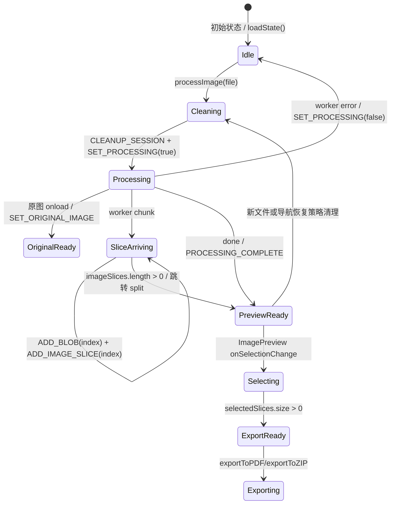

# 06. 状态管理与资源生命周期

## 6.1 在项目中的角色

本模块是长截图分割工具的会话控制层：它把 Worker、Blob、Object URL、原图、切片、选择集、处理状态和用户配置收敛到一个 `AppState`，由 `useAppState` 暴露统一的 `state/actions` 给处理流水线、预览界面和导出界面使用（`/tmp/Long_screenshot_splitting_tool/src/types/index.ts:11`，`/tmp/Long_screenshot_splitting_tool/src/hooks/useAppState.ts:122`，`/tmp/Long_screenshot_splitting_tool/src/App.tsx:29`）。

如果去掉这个模块，切割、预览、导出会各自维护资源引用和选择状态：上传新文件前无法可靠释放旧 Object URL/Worker，预览和导出也无法共享同一组切片与选择集（`/tmp/Long_screenshot_splitting_tool/src/hooks/useImageProcessor.ts:96`，`/tmp/Long_screenshot_splitting_tool/src/App.tsx:359`，`/tmp/Long_screenshot_splitting_tool/src/App.tsx:450`）。

## 6.2 解决什么问题

状态管理模块解决的是“单页工具中的一次图片处理会话”问题：一次会话从上传文件开始，经历 Worker 切割、切片预览、用户选择、PDF/ZIP 导出，最后在新上传或错误恢复时清理资源（`/tmp/Long_screenshot_splitting_tool/src/hooks/useImageProcessor.ts:92`，`/tmp/Long_screenshot_splitting_tool/src/hooks/useImageProcessor.ts:128`，`/tmp/Long_screenshot_splitting_tool/src/App.tsx:224`）。

它还把可持久化状态限定为 `splitHeight`、`fileName` 和可选 `language`，而不是持久化 Blob、Object URL、Worker 或 DOM 图片对象；这些运行时资源只存在于当前会话，避免刷新后恢复不可序列化或已失效的浏览器资源（`/tmp/Long_screenshot_splitting_tool/src/utils/persistence.ts:3`，`/tmp/Long_screenshot_splitting_tool/src/hooks/useAppState.ts:125`）。

## 6.3 核心数据结构

理解本模块只需要两组类型：会话状态 `AppState` 和状态变更协议 `AppAction`。

```ts
export interface AppState {
  worker: Worker | null;
  blobs: Blob[];
  objectUrls: string[];
  originalImage: HTMLImageElement | null;
  imageSlices: ImageSlice[];
  selectedSlices: Set<number>;
  isProcessing: boolean;
  splitHeight: number;
  fileName: string;
}
```

锚点：`AppState` 把资源状态、图片处理状态、处理开关和元数据放在同一个状态对象中（`/tmp/Long_screenshot_splitting_tool/src/types/index.ts:11`）。

```ts
export type AppAction =
  | { type: 'SET_WORKER'; payload: Worker | null }
  | { type: 'ADD_BLOB'; payload: { blob: Blob; index: number } }
  | { type: 'SET_ORIGINAL_IMAGE'; payload: HTMLImageElement | null }
  | { type: 'ADD_IMAGE_SLICE'; payload: ImageSlice }
  | { type: 'TOGGLE_SLICE_SELECTION'; payload: number }
  | { type: 'SELECT_ALL_SLICES' }
  | { type: 'DESELECT_ALL_SLICES' }
  | { type: 'SET_PROCESSING'; payload: boolean }
  | { type: 'SET_SPLIT_HEIGHT'; payload: number }
  | { type: 'SET_FILE_NAME'; payload: string }
  | { type: 'CLEANUP_SESSION' }
  | { type: 'PROCESSING_COMPLETE' };
```

锚点：`AppAction` 的粒度基本等于工具会话的用户动作和异步事件：Worker 设置、Blob 到达、切片到达、选择变化、处理状态变化和会话清理（`/tmp/Long_screenshot_splitting_tool/src/types/index.ts:30`）。

## 6.4 核心业务流程



源码级流程：

1. `useAppState` 初始化时从 localStorage 只恢复 `splitHeight` 和 `fileName`，运行时资源从空值开始（`/tmp/Long_screenshot_splitting_tool/src/hooks/useAppState.ts:14`，`/tmp/Long_screenshot_splitting_tool/src/hooks/useAppState.ts:17`）。
2. 用户选择文件后，`App` 调用 `processImage(file)`；异常恢复路径会根据策略调用 `actions.cleanupSession()`（`/tmp/Long_screenshot_splitting_tool/src/App.tsx:196`，`/tmp/Long_screenshot_splitting_tool/src/App.tsx:212`）。
3. `processImage` 先派发 `CLEANUP_SESSION` 清理上一会话，再置 `isProcessing=true`、更新文件名、创建原图临时 Object URL，并把文件发送给 Worker（`/tmp/Long_screenshot_splitting_tool/src/hooks/useImageProcessor.ts:96`，`/tmp/Long_screenshot_splitting_tool/src/hooks/useImageProcessor.ts:100`，`/tmp/Long_screenshot_splitting_tool/src/hooks/useImageProcessor.ts:106`，`/tmp/Long_screenshot_splitting_tool/src/hooks/useImageProcessor.ts:128`）。
4. Worker 产出 chunk 后，`handleChunk` 先按 `index` 写入 Blob，再为 Blob 创建 Object URL，等待 `img.onload` 得到尺寸后派发 `ADD_IMAGE_SLICE`（`/tmp/Long_screenshot_splitting_tool/src/hooks/useImageProcessor.ts:30`，`/tmp/Long_screenshot_splitting_tool/src/hooks/useImageProcessor.ts:34`，`/tmp/Long_screenshot_splitting_tool/src/hooks/useImageProcessor.ts:37`，`/tmp/Long_screenshot_splitting_tool/src/hooks/useImageProcessor.ts:42`，`/tmp/Long_screenshot_splitting_tool/src/hooks/useImageProcessor.ts:58`）。
5. `ADD_IMAGE_SLICE` 不用 `push`，而是 `newImageSlices[action.payload.index] = action.payload`，随后把 URL 纳入 `objectUrls`，让清理动作能统一释放（`/tmp/Long_screenshot_splitting_tool/src/hooks/useAppState.ts:47`，`/tmp/Long_screenshot_splitting_tool/src/hooks/useAppState.ts:50`，`/tmp/Long_screenshot_splitting_tool/src/hooks/useAppState.ts:55`）。
6. 首个切片到达后，`App` 通过 `imageSlices.length` 的 0→>0 变化跳转到 `/split`，避免上传后立即跳转被状态守卫踢回上传页（`/tmp/Long_screenshot_splitting_tool/src/App.tsx:121`，`/tmp/Long_screenshot_splitting_tool/src/App.tsx:128`，`/tmp/Long_screenshot_splitting_tool/src/App.tsx:133`）。
7. 预览页消费 `originalImage`、`imageSlices` 和 `selectedSlices`；选择变化先 `DESELECT_ALL_SLICES`，再逐个 `TOGGLE_SLICE_SELECTION` 同步回 reducer（`/tmp/Long_screenshot_splitting_tool/src/App.tsx:359`，`/tmp/Long_screenshot_splitting_tool/src/App.tsx:363`，`/tmp/Long_screenshot_splitting_tool/src/App.tsx:365`，`/tmp/Long_screenshot_splitting_tool/src/App.tsx:367`）。
8. 导出页只在有原图、有切片、有选择集时渲染导出控件，真正导出时把 `state.imageSlices` 和 `state.selectedSlices` 传给 PDF/ZIP 导出器（`/tmp/Long_screenshot_splitting_tool/src/App.tsx:375`，`/tmp/Long_screenshot_splitting_tool/src/App.tsx:405`，`/tmp/Long_screenshot_splitting_tool/src/App.tsx:450`，`/tmp/Long_screenshot_splitting_tool/src/App.tsx:237`，`/tmp/Long_screenshot_splitting_tool/src/App.tsx:248`）。

## 6.5 设计思路与架构模式

本模块采用“局部 reducer + action creators”的模式，而不是 Redux/Zustand。确定性证据是：状态只在 `AppContent` 内通过 `useAppState()` 创建，再下传给 `useImageProcessor`、预览和导出组件；没有跨页面全局 store、外部订阅者或复杂派生缓存（`/tmp/Long_screenshot_splitting_tool/src/App.tsx:28`，`/tmp/Long_screenshot_splitting_tool/src/App.tsx:29`，`/tmp/Long_screenshot_splitting_tool/src/App.tsx:30`，`/tmp/Long_screenshot_splitting_tool/src/App.tsx:359`，`/tmp/Long_screenshot_splitting_tool/src/App.tsx:450`）。

`useReducer` 足够的原因是状态变更都可表达为小型同步 action：`ADD_BLOB`、`ADD_IMAGE_SLICE`、`TOGGLE_SLICE_SELECTION`、`SET_PROCESSING`、`CLEANUP_SESSION` 等 reducer 分支覆盖了会话生命周期；异步复杂性被隔离在 Worker hook 和图片 onload 回调里（`/tmp/Long_screenshot_splitting_tool/src/hooks/useAppState.ts:33`，`/tmp/Long_screenshot_splitting_tool/src/hooks/useAppState.ts:38`，`/tmp/Long_screenshot_splitting_tool/src/hooks/useAppState.ts:47`，`/tmp/Long_screenshot_splitting_tool/src/hooks/useAppState.ts:62`，`/tmp/Long_screenshot_splitting_tool/src/hooks/useAppState.ts:80`，`/tmp/Long_screenshot_splitting_tool/src/hooks/useAppState.ts:89`）。

Redux/Zustand 的收益在此项目中不明显：当前证据显示状态消费者集中在顶层 `App` 和其子组件 props，状态持久化也只有两个字段通过防抖写入 localStorage；引入全局 store 会增加 action/store 边界和资源清理分散风险。该判断基于当前候选文件证据，若项目存在未抽样的独立页面直接读写同一状态，应作为开放问题复核（`/tmp/Long_screenshot_splitting_tool/src/hooks/useAppState.ts:125`，`/tmp/Long_screenshot_splitting_tool/src/utils/persistence.ts:67`）。

## 6.6 与其他模块的设计协同

上游切割流水线依赖状态层提供会话清理和写入协议：`useImageProcessor` 通过 actions 调用 `cleanupSession`、`setProcessing`、`setFileName`、`setOriginalImage`、`addBlob`、`addImageSlice` 和 `processingComplete`，但不直接操作 `AppState` 的内部结构（`/tmp/Long_screenshot_splitting_tool/src/hooks/useImageProcessor.ts:5`，`/tmp/Long_screenshot_splitting_tool/src/hooks/useImageProcessor.ts:34`，`/tmp/Long_screenshot_splitting_tool/src/hooks/useImageProcessor.ts:58`，`/tmp/Long_screenshot_splitting_tool/src/hooks/useImageProcessor.ts:70`，`/tmp/Long_screenshot_splitting_tool/src/hooks/useImageProcessor.ts:97`，`/tmp/Long_screenshot_splitting_tool/src/hooks/useImageProcessor.ts:101`）。

下游预览模块依赖 `imageSlices` 和 `selectedSlices` 的契约：`ImagePreview` 接收数组形式的 `selectedSlices`，回调返回新的选中下标集合，顶层再转回 Set action（`/tmp/Long_screenshot_splitting_tool/src/App.tsx:359`，`/tmp/Long_screenshot_splitting_tool/src/App.tsx:362`，`/tmp/Long_screenshot_splitting_tool/src/App.tsx:363`）。

下游导出模块依赖 `selectedSlices` 是切片 `index` 集合，而不是数组位置集合：`App` 向 PDF/ZIP 导出器传入 `state.imageSlices` 和 `state.selectedSlices`，导出器用 `slice.index` 过滤并排序（`/tmp/Long_screenshot_splitting_tool/src/App.tsx:237`，`/tmp/Long_screenshot_splitting_tool/src/App.tsx:248`，`/tmp/Long_screenshot_splitting_tool/src/utils/pdfExporter.ts:59`，`/tmp/Long_screenshot_splitting_tool/src/utils/zipExporter.ts:51`）。

路由守卫依赖状态层的最小事实：是否有原图、是否有切片、是否有选择集。`App` 在 `/split` 和 `/export` 分支直接用这些状态决定渲染验证提示或业务界面（`/tmp/Long_screenshot_splitting_tool/src/App.tsx:305`，`/tmp/Long_screenshot_splitting_tool/src/App.tsx:307`，`/tmp/Long_screenshot_splitting_tool/src/App.tsx:375`，`/tmp/Long_screenshot_splitting_tool/src/App.tsx:377`，`/tmp/Long_screenshot_splitting_tool/src/App.tsx:405`）。

## 6.7 关键设计决策

### 决策一：用 `useReducer` 做会话状态机

该设计把状态变化集中到 `appStateReducer`，并通过 action creators 屏蔽组件层对 action 字符串的直接依赖（`/tmp/Long_screenshot_splitting_tool/src/hooks/useAppState.ts:33`，`/tmp/Long_screenshot_splitting_tool/src/hooks/useAppState.ts:151`，`/tmp/Long_screenshot_splitting_tool/src/hooks/useAppState.ts:215`）。

权衡：它牺牲了 Redux DevTools、跨树订阅和中间件能力，但换来更小依赖面和更直观的资源生命周期边界。这个权衡适合当前“单入口顶层状态 + 子组件 props 消费”的工具形态（`/tmp/Long_screenshot_splitting_tool/src/App.tsx:29`，`/tmp/Long_screenshot_splitting_tool/src/App.tsx:297`，`/tmp/Long_screenshot_splitting_tool/src/App.tsx:359`，`/tmp/Long_screenshot_splitting_tool/src/App.tsx:450`）。

### 决策二：资源清理集中在 `CLEANUP_SESSION`

`CLEANUP_SESSION` 遍历 `state.objectUrls` 调用 `URL.revokeObjectURL`，再尝试 `state.worker.terminate()`，最后重置会话态但保留 `splitHeight` 和 `fileName`（`/tmp/Long_screenshot_splitting_tool/src/hooks/useAppState.ts:89`，`/tmp/Long_screenshot_splitting_tool/src/hooks/useAppState.ts:91`，`/tmp/Long_screenshot_splitting_tool/src/hooks/useAppState.ts:100`，`/tmp/Long_screenshot_splitting_tool/src/hooks/useAppState.ts:108`）。

权衡：集中清理降低了 Object URL 泄漏概率，并让新上传、导航错误恢复共用同一入口；但清理可靠性依赖所有长期 Object URL 都被登记进 `objectUrls`，而原图临时 URL 走 `img.onload/onerror` 的局部释放路径，不进入 `objectUrls`（`/tmp/Long_screenshot_splitting_tool/src/hooks/useImageProcessor.ts:106`，`/tmp/Long_screenshot_splitting_tool/src/hooks/useImageProcessor.ts:111`，`/tmp/Long_screenshot_splitting_tool/src/hooks/useImageProcessor.ts:116`）。

### 决策三：切片按 `index` 写入数组

`ADD_IMAGE_SLICE` 按 `action.payload.index` 写入，而不是按异步到达顺序追加；源码注释明确这是为修复 `img.onload` 回调导致的切片乱序（`/tmp/Long_screenshot_splitting_tool/src/hooks/useAppState.ts:47`，`/tmp/Long_screenshot_splitting_tool/src/hooks/useAppState.ts:49`，`/tmp/Long_screenshot_splitting_tool/src/hooks/useAppState.ts:51`）。

权衡：按 index 写入保证数组位置与原始切片序号一致，简化预览顺序和导出排序；代价是如果后续 chunk 先到达，`imageSlices.length` 会被高 index 撑大，中间形成 sparse array，消费方必须能处理空洞（`/tmp/Long_screenshot_splitting_tool/src/hooks/useAppState.ts:50`，`/tmp/Long_screenshot_splitting_tool/src/hooks/useAppState.ts:57`）。

## 6.8 风险路径与问题

### Object URL 释放覆盖面

长期切片 URL 覆盖较好：每次 `ADD_IMAGE_SLICE` 都把切片 URL 追加到 `objectUrls`，`CLEANUP_SESSION` 会统一 revoke（`/tmp/Long_screenshot_splitting_tool/src/hooks/useAppState.ts:55`，`/tmp/Long_screenshot_splitting_tool/src/hooks/useAppState.ts:91`）。

原图临时 URL 释放是局部路径：`imageUrl` 在 `img.onload` 和 `img.onerror` 中 revoke；如果组件卸载或新上传发生在原图加载回调之前，当前候选文件没有看到 abort 或统一登记机制。这是基于源码路径的风险推断，不是已复现 bug（`/tmp/Long_screenshot_splitting_tool/src/hooks/useImageProcessor.ts:106`，`/tmp/Long_screenshot_splitting_tool/src/hooks/useImageProcessor.ts:108`，`/tmp/Long_screenshot_splitting_tool/src/hooks/useImageProcessor.ts:114`）。

### Worker terminate 竞态

`CLEANUP_SESSION` 会终止 `state.worker`，但当前 `useImageProcessor` 只调用 `createWorker()`，没有把 `useWorker` 返回的 worker 通过 `actions.setWorker` 写入 `AppState`；因此 `state.worker` 可能一直是 `null`，`CLEANUP_SESSION` 的 Worker 清理分支可能无法覆盖实际 Worker（`/tmp/Long_screenshot_splitting_tool/src/hooks/useImageProcessor.ts:83`，`/tmp/Long_screenshot_splitting_tool/src/hooks/useImageProcessor.ts:121`，`/tmp/Long_screenshot_splitting_tool/src/hooks/useAppState.ts:100`）。

相邻证据显示 `useWorker` 自己在 `createWorker` 前会终止旧 Worker，组件卸载时也会 `terminateWorker()`；因此 Worker 清理实际更依赖 `useWorker` 的 ref 生命周期，而不是 `AppState.worker` 字段。这里的开放问题是：`SET_WORKER` 分支和 `setWorker` action 是否已经成为遗留设计（`/tmp/Long_screenshot_splitting_tool/src/hooks/useWorker.ts:30`，`/tmp/Long_screenshot_splitting_tool/src/hooks/useWorker.ts:33`，`/tmp/Long_screenshot_splitting_tool/src/hooks/useWorker.ts:145`，`/tmp/Long_screenshot_splitting_tool/src/hooks/useAppState.ts:35`，`/tmp/Long_screenshot_splitting_tool/src/hooks/useAppState.ts:152`）。

竞态风险：`processImage` 在 `cleanupSession()` 后立即 `setProcessing(true)` 并创建新 Worker；如果旧 Worker 的消息回调在终止前后仍触发，当前 `handleChunk` 没有 session id 校验，理论上可能把旧 chunk 写入新会话。该判断基于缺少会话令牌的源码观察，应作为待测试风险（`/tmp/Long_screenshot_splitting_tool/src/hooks/useImageProcessor.ts:96`，`/tmp/Long_screenshot_splitting_tool/src/hooks/useImageProcessor.ts:101`，`/tmp/Long_screenshot_splitting_tool/src/hooks/useImageProcessor.ts:30`，`/tmp/Long_screenshot_splitting_tool/src/hooks/useImageProcessor.ts:58`）。

### 稀疏数组风险

按 index 写入解决异步乱序，但会引入 sparse array 风险：`SELECT_ALL_SLICES` 直接 `state.imageSlices.map(slice => slice.index)`，如果数组存在空洞，`map` 会保留空洞，`new Set(allIndices)` 的内容可能少于 `imageSlices.length`，全选状态与 UI 计数可能不一致（`/tmp/Long_screenshot_splitting_tool/src/hooks/useAppState.ts:72`，`/tmp/Long_screenshot_splitting_tool/src/hooks/useAppState.ts:73`）。

预览侧也有下标契约不一致：`ImagePreview` 渲染时 `slices.map((slice, index) => ...)`，选择判断和点击回调用数组下标 `index`，而 key 使用 `slice.index`；这要求 `array index === slice.index` 始终成立，稀疏数组或过滤后的数组都会放大错选风险（`/tmp/Long_screenshot_splitting_tool/src/components/ImagePreview.tsx:210`，`/tmp/Long_screenshot_splitting_tool/src/components/ImagePreview.tsx:212`，`/tmp/Long_screenshot_splitting_tool/src/components/ImagePreview.tsx:217`，`/tmp/Long_screenshot_splitting_tool/src/components/ImagePreview.tsx:222`）。

导出侧使用 `filter(slice => selectedIndices.has(slice.index))`，如果 `imageSlices` 存在空洞，`filter` 会跳过空洞；如果存在 `undefined` 元素而非空洞，则会访问 `slice.index` 抛错。当前 reducer 产生的是空洞风险，不是显式 `undefined` 写入；但类型 `ImageSlice[]` 没有表达空洞，后续维护者容易误判数组总是 dense（`/tmp/Long_screenshot_splitting_tool/src/utils/pdfExporter.ts:59`，`/tmp/Long_screenshot_splitting_tool/src/utils/zipExporter.ts:51`，`/tmp/Long_screenshot_splitting_tool/src/types/index.ts:19`）。

## 6.9 改进建议

1. 把 `imageSlices` 的内部表示改为 `Map<number, ImageSlice>` 或 `{ byIndex, orderedIndices }`，渲染/导出前统一生成 dense sorted array；这样可以保留乱序到达能力，同时消除 sparse array 与数组下标混用风险（问题锚点：`/tmp/Long_screenshot_splitting_tool/src/hooks/useAppState.ts:51`，消费锚点：`/tmp/Long_screenshot_splitting_tool/src/components/ImagePreview.tsx:210`）。
2. 若继续使用数组，应在 `ADD_IMAGE_SLICE` 后维护 `receivedCount`，并在 `SELECT_ALL_SLICES` 使用 `filter(Boolean)` 或显式类型守卫后再读取 `slice.index`；同时 UI 计数不要直接等同于 `imageSlices.length`（问题锚点：`/tmp/Long_screenshot_splitting_tool/src/hooks/useAppState.ts:57`，`/tmp/Long_screenshot_splitting_tool/src/hooks/useAppState.ts:73`，`/tmp/Long_screenshot_splitting_tool/src/App.tsx:543`）。
3. 明确 Worker 所有权：要么删除 `AppState.worker/SET_WORKER`，让 `useWorker` 成为唯一生命周期所有者；要么在 `createWorker` 后把 Worker 写入 AppState，使 `CLEANUP_SESSION` 的 `terminate` 分支真实生效（问题锚点：`/tmp/Long_screenshot_splitting_tool/src/types/index.ts:13`，`/tmp/Long_screenshot_splitting_tool/src/hooks/useAppState.ts:35`，`/tmp/Long_screenshot_splitting_tool/src/hooks/useWorker.ts:42`）。
4. 为处理会话增加 `sessionId` 或 `generation`，`handleChunk/handleDone/handleError` 在派发前校验当前会话，降低新旧 Worker 消息交叉写入的风险（问题锚点：`/tmp/Long_screenshot_splitting_tool/src/hooks/useImageProcessor.ts:30`，`/tmp/Long_screenshot_splitting_tool/src/hooks/useImageProcessor.ts:68`，`/tmp/Long_screenshot_splitting_tool/src/hooks/useImageProcessor.ts:74`）。
5. 原图临时 Object URL 可以登记到一个局部 ref，并在新处理开始或 hook 卸载时兜底 revoke；当前只有 `onload/onerror` 两条释放路径（问题锚点：`/tmp/Long_screenshot_splitting_tool/src/hooks/useImageProcessor.ts:106`，`/tmp/Long_screenshot_splitting_tool/src/hooks/useImageProcessor.ts:111`，`/tmp/Long_screenshot_splitting_tool/src/hooks/useImageProcessor.ts:116`）。

## 6.10 亮点与限制

亮点：

- 状态类型将资源、图片、选择和元数据分区清楚，读者能直接看出会话边界（`/tmp/Long_screenshot_splitting_tool/src/types/index.ts:11`）。
- `CLEANUP_SESSION` 提供了统一清理入口，并被上传前清理和错误恢复路径复用（`/tmp/Long_screenshot_splitting_tool/src/hooks/useAppState.ts:89`，`/tmp/Long_screenshot_splitting_tool/src/hooks/useImageProcessor.ts:97`，`/tmp/Long_screenshot_splitting_tool/src/App.tsx:212`）。
- 按 index 写入切片是对异步图片加载乱序的直接修复，设计意图在源码注释中明确（`/tmp/Long_screenshot_splitting_tool/src/hooks/useAppState.ts:49`）。

限制与开放问题：

- 当前分析按用户边界聚焦状态、资源回收、处理状态协同；导出器、导航状态和预览组件只为验证状态消费与稀疏数组风险做最小抽样。
- `AppState.worker` 是否实际被写入没有在候选调用点中找到证据；如果其他未抽样组件调用 `actions.setWorker`，需要补充验证（`/tmp/Long_screenshot_splitting_tool/src/hooks/useAppState.ts:152`）。
- 稀疏数组风险是基于 reducer 写入方式和 JS 数组语义的风险判断；本草稿没有运行端到端复现测试。

## 6.11 源码锚点清单

| 结论 | 锚点 | 类型 |
| --- | --- | --- |
| 会话状态集中在 `AppState` | `/tmp/Long_screenshot_splitting_tool/src/types/index.ts:11` | 类型定义 |
| 状态协议由 `AppAction` 枚举 | `/tmp/Long_screenshot_splitting_tool/src/types/index.ts:30` | 类型定义 |
| reducer 是状态变化中心 | `/tmp/Long_screenshot_splitting_tool/src/hooks/useAppState.ts:33` | reducer |
| 切片按 index 写入 | `/tmp/Long_screenshot_splitting_tool/src/hooks/useAppState.ts:47` | reducer 分支 |
| 全选读取 `slice.index` | `/tmp/Long_screenshot_splitting_tool/src/hooks/useAppState.ts:72` | reducer 分支 |
| 会话清理释放 Object URL 与 Worker | `/tmp/Long_screenshot_splitting_tool/src/hooks/useAppState.ts:89` | reducer 分支 |
| 上传前触发清理 | `/tmp/Long_screenshot_splitting_tool/src/hooks/useImageProcessor.ts:96` | 调用点 |
| Worker chunk 写入 Blob/切片 | `/tmp/Long_screenshot_splitting_tool/src/hooks/useImageProcessor.ts:30` | 调用点 |
| 处理完成关闭 processing | `/tmp/Long_screenshot_splitting_tool/src/hooks/useImageProcessor.ts:68` | 调用点 |
| App 消费状态进行预览 | `/tmp/Long_screenshot_splitting_tool/src/App.tsx:359` | 状态消费 |
| App 消费状态进行导出 | `/tmp/Long_screenshot_splitting_tool/src/App.tsx:224` | 状态消费 |
| 持久化只保存配置子集 | `/tmp/Long_screenshot_splitting_tool/src/utils/persistence.ts:3` | 持久化 |
