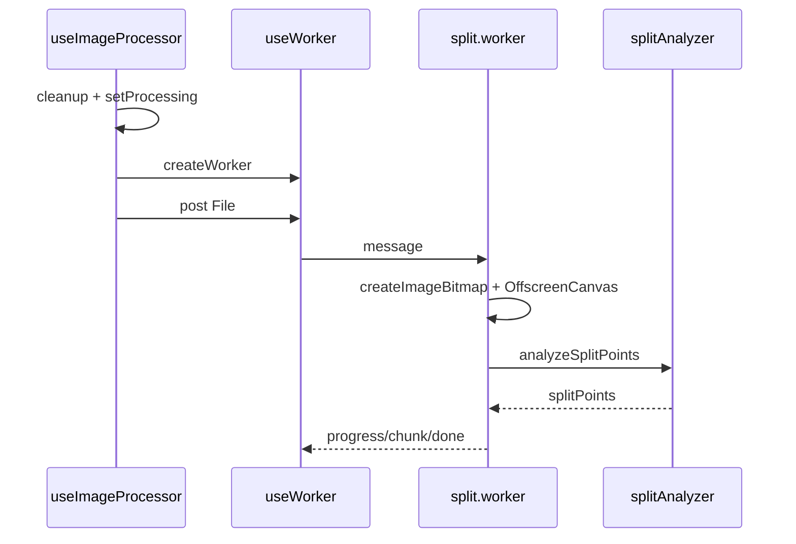

# 06 切割流水线模块

## Evidence Matrix

| 字段 | 内容 |
|------|------|
| Module Role | 把上传得到的单个图片 `File` 转成带 `blob/url/index/width/height` 的有序切片集合；是长截图工具的核心生产能力。回应 Evidence Plan：文件输入、Worker 传输、图像 I/O、内容感知算法分层；`splitAnalyzer` 为纯函数。 |
| Entry Points | `FileUploader` 校验后 `onFileSelect`；`useImageProcessor.processImage`；`useWorker.createWorker` + postMessage；Worker `onmessage` 产出 progress/chunk/done（`/tmp/Long_screenshot_splitting_tool/src/components/FileUploader.tsx:51-67`，`/tmp/Long_screenshot_splitting_tool/src/hooks/useImageProcessor.ts:91-130`，`/tmp/Long_screenshot_splitting_tool/src/hooks/useWorker.ts:29-77`）。 |
| Core Data Structures | 输入 `File`；Worker 消息契约 progress/chunk/done/error；产出 `ImageSlice`（`/tmp/Long_screenshot_splitting_tool/src/types/index.ts:3-8`，`/tmp/Long_screenshot_splitting_tool/src/types/index.ts:44`，`/tmp/Long_screenshot_splitting_tool/src/hooks/useWorker.ts:47-77`）。 |
| Main Flow | cleanupSession → setProcessing → load original → createWorker → send file → Worker decode/draw/getImageData → analyzeSplitPoints → computeSliceBounds → 逐段 convertToBlob chunk → 主线程生成 ImageSlice（`/tmp/Long_screenshot_splitting_tool/src/hooks/useImageProcessor.ts:91-130`，`/tmp/Long_screenshot_splitting_tool/src/workers/split.worker.js:85-180`，`/tmp/Long_screenshot_splitting_tool/src/utils/splitAnalyzer.ts:250-270`）。分析失败则 `splitPoints=[]` 回退等分（`/tmp/Long_screenshot_splitting_tool/src/workers/split.worker.js:125-129`，`:218-249`）。 |
| Cross-Module Dependencies | 依赖上传模块过滤输入；依赖状态层 actions 写入切片/清理会话；向预览/导出/路由提供 imageSlices。【待主 agent 验证】消费侧完整契约（`/tmp/Long_screenshot_splitting_tool/src/hooks/useImageProcessor.ts:5-15`，`/tmp/Long_screenshot_splitting_tool/src/components/FileUploader.tsx:25-51`）。 |
| Key Design Decisions | 1) 协调层/传输层/I/O/算法分层，Worker 不做算法主体。2) `splitAnalyzer` 纯函数、可单测、无 DOM/canvas/Worker 依赖（`/tmp/Long_screenshot_splitting_tool/src/utils/splitAnalyzer.ts:6-13`）。3) 内容感知失败安全回退等分，任务不中断（`/tmp/Long_screenshot_splitting_tool/src/workers/split.worker.js:125-129`）。 |
| Risk Areas | `setTimeout(200)` 等待 Worker 就绪（`/tmp/Long_screenshot_splitting_tool/src/hooks/useImageProcessor.ts:124-125`）。全图 `getImageData` 内存峰值（`/tmp/Long_screenshot_splitting_tool/src/workers/split.worker.js:112-116`）。OffscreenCanvas/createImageBitmap/module worker 无能力探测（`/tmp/Long_screenshot_splitting_tool/src/workers/split.worker.js:87-94`，`:259`，`/tmp/Long_screenshot_splitting_tool/src/hooks/useWorker.ts:42-43`）。 |
| Source Evidence | `/tmp/Long_screenshot_splitting_tool/src/hooks/useImageProcessor.ts:91-130`；`/tmp/Long_screenshot_splitting_tool/src/hooks/useWorker.ts:29-77`；`/tmp/Long_screenshot_splitting_tool/src/workers/split.worker.js:85-129`，`:218-249`；`/tmp/Long_screenshot_splitting_tool/src/utils/splitAnalyzer.ts:6-13`，`:250-270`。 |
| Open Questions | 1) 浏览器版本兼容矩阵未在候选文件声明。2) 30MB 最坏分辨率是否会 OOM/崩溃需压测。3) 导出/预览/路由如何完整消费 imageSlices 超出本模块候选边界。 |

## 叙事分析

本模块范围限定为「上传后到切片产出」。它解释项目为什么不是“按高度裁图脚本”，而是可回退的内容感知流水线。

### 1. 分层与主流程

`useImageProcessor` 协调会话；`useWorker` 只做传输；Worker 做图像 I/O；`splitAnalyzer` 只做纯算法（`/tmp/Long_screenshot_splitting_tool/src/hooks/useImageProcessor.ts:91-130`，`/tmp/Long_screenshot_splitting_tool/src/utils/splitAnalyzer.ts:6-13`）。

### 2. 关键设计决策

算法与 I/O 分离让单测与演进边界清晰。内容感知失败回退等分，体现产品稳定性优先于“永远智能”（`/tmp/Long_screenshot_splitting_tool/src/workers/split.worker.js:125-129`）。代价是兼容面更窄、内存峰值更高。

### 3. 风险

`setTimeout(200)` 是脆弱时序补偿；全图像素读取缺少分块/能力探测。这些应在最终报告保留为风险，而非已验证故障。

### 4. 铺垫

切片产出后需要状态层承接异步 chunk、Object URL 与会话清理。
