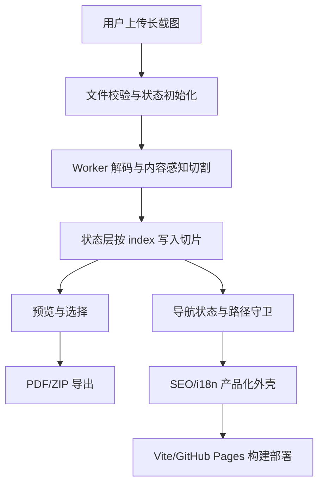

# Long_screenshot_splitting_tool 架构分析报告（v1.6 测试证据）

分析对象：`/tmp/Long_screenshot_splitting_tool`
模式：标准分析
技能：`repo-analyzer`
日期：2026-07-09

## 1. 总体结论

`Long_screenshot_splitting_tool` 是一个浏览器端长截图分割工具。README 明确描述它基于 React + TypeScript + Vite，支持按指定高度分割长截图并导出 PDF/ZIP（`README.md:1-14`）。项目文档将架构定位为“扁平化单仓库”，选择理由是项目规模适中、开发效率优先、维护成本较低（`docs/ARCHITECTURE.md:11-35`）。

这不是一个纯算法库，而是一个完整前端工具应用：上传、切割、预览、选择、导出、导航、SEO、i18n、构建部署都在同一个单仓库内完成。它的设计主线可以概括为：

整体评价：核心业务路径清晰，切割算法与 Worker I/O 分离较好，状态层对异步乱序有专门防线；但工程边界还存在明显未收口点，包括 Worker 任务取消、导出配置闭环、SEO/i18n 语言同步、部署质量门和遗留构建脚本漂移。

## 2. 仓库地图与边界

Repo Map 见 `drafts/02-repo-map.md`。关键候选信号：

- `src/components/`：上传、预览、导出、导航、SEO 等 UI 与业务组件。
- `src/hooks/`：状态、Worker、图片处理、i18n、导航状态等业务逻辑。
- `src/utils/`：切割算法、PDF/ZIP 导出、持久化、导航错误处理。
- `src/workers/`：图片切割 Worker。
- `config/`、`tools/build-scripts/`、`.github/`：构建部署和环境配置。
- `shared-components/`：共享组件、组件通信和共享状态基础设施。

规模参考：使用系统命令统计，排除 lock 后 `.ts/.tsx/.js/.css/.json/.md` 约 `67974` 行；该数字只作规模参考，不作为质量门。

## 3. 截图切割核心流水线

截图切割流水线负责把用户上传文件转成可预览、可导出的 `ImageSlice[]`。主路径是 `FileUploader` / App 上传入口 → `useImageProcessor` → `useWorker` → `split.worker.js` → `splitAnalyzer` → 状态层与预览组件。

核心设计是“内容感知增强 + 固定高度安全回退”。Worker 先 `createImageBitmap` 解码图片，再用 OffscreenCanvas 绘制全图并调用 `getImageData`，随后把像素数据交给 `analyzeSplitPoints`（`src/workers/split.worker.js:85-117`）。算法侧的 `splitAnalyzer` 是纯函数模块，不依赖 DOM、canvas 或 Worker，便于单独测试（`src/utils/splitAnalyzer.ts:6`）。当内容感知分析失败或没有合适切割点时，Worker 回退到固定高度等分（`src/workers/split.worker.js:125-128`、`src/workers/split.worker.js:228-241`）。

这个设计的取舍很务实：智能切割改善用户体验，但不会让算法失败阻断用户产出。问题在于大图路径仍一次性读取全图像素，Worker 避免了主线程阻塞，却没有消除内存峰值（`src/workers/split.worker.js:111-116`）。此外，Worker 消息协议缺少 task id/cancel，连续上传或旧任务晚到时缺少强一致防线。

## 4. 状态管理与导出

状态层的价值不是保存普通 UI state，而是把异步切割结果沉淀为稳定会话模型。`AppState` 同时保存 `blobs`、`objectUrls`、`originalImage`、`imageSlices`、`selectedSlices`、`isProcessing`、`splitHeight`、`fileName`（`src/types/index.ts:11-28`）。其中 `ImageSlice` 既包含预览 URL，也包含导出需要的 Blob 和尺寸信息（`src/types/index.ts:3-9`）。

最关键的正确性设计是按 `slice.index` 写入数组，而不是按 `img.onload` 到达顺序 push。源码注释和 reducer 都体现这一点（`src/hooks/useAppState.ts:47-59`），单测也模拟了乱序到达（`src/hooks/__tests__/useAppState.test.ts:18-49`）。这说明项目意识到了浏览器异步加载会破坏切片顺序，并把防线放在状态写入层。

导出链路主路径在 `App.tsx` 中完成：`ExportControls` 收集导出意图，`App.handleExport` 调用 `exportToPDF` 或 `exportToZIP`（`src/App.tsx:224-264`）。PDF/ZIP 工具都会按 `selectedSlices` 过滤并排序（`src/utils/pdfExporter.ts:59-61`、`src/utils/zipExporter.ts:51-53`）。

风险在于配置闭环不完整：`ExportControls` 维护 quality、PDF、ZIP 选项，但 App 主路径只读取 `options?.filename`（`src/App.tsx:233-255`）。因此高级导出选项目前不能被写成“完整生效”的确定结论。

## 5. SEO、国际化与导航

该模块把图片处理工具包装成可导航、可索引、可多语言展示的产品体验。运行时中枢是 `App.tsx`：它使用 `useRouter` 管 hash 路径，使用 `SEOManager` 注入 head 元数据，使用 `Navigation` 展示步骤导航，并通过 `validateNavigation` / `navigationErrorHandler` 做非法路径恢复（`src/App.tsx:4-24`、`src/App.tsx:137-170`、`src/App.tsx:539-583`）。

导航策略很适合四步工具型 SPA：hash router 很轻，状态守卫承担业务前置条件。上传完成后，App 等 `imageSlices` 从 0 变为大于 0 才跳 `/split`，避免过早跳转被守卫踢回上传页（`src/App.tsx:121-135`）。这是一处细节不错的 UX 修复。

但页面模型和语言模型没有收敛。当前 App 给 `SEOManager` 固定传 `language="zh-CN"`（`src/App.tsx:539-542`），而导航内语言切换会更新 i18n 当前语言（`src/components/LanguageSwitcher.tsx:151-154`）。这意味着 UI 切英文后，head 元数据仍可能保持中文。这是主路径中的确定性跨模块缺口。

## 6. 构建部署与共享组件基础设施

构建主线是 `package.json` 的 scripts：`build` 串联 `tsc -b && vite build && node scripts/generate-seo-files.js`（`package.json:21-54`）。Vite 读取部署配置决定资源 base，适配 GitHub Pages/CDN/绝对资源路径等场景。共享组件通过 `shared-components/index.ts` 暴露组件、通信管理器和共享状态管理器。

这条主线服务于扁平单仓库目标：不搞真正 workspace 包边界，而用 Vite/TS/Vitest alias 让 `shared-components` 像一等模块一样被导入。它对当前项目规模合理。

主要问题是基础设施存在漂移。部分 `tools/build-scripts` 仍假设 `packages/*` 结构，而当前仓库没有真实 `packages` 目录；这说明这些脚本更像迁移残留或未接入工具。另一个风险是部署 workflow 中 type-check、lint、test 失败被 `|| echo` 降级为日志（`.github/workflows/deploy.yml:43-50`），质量门偏软。

## 7. 工程成熟度评价

优点：

- 核心切割算法与浏览器 I/O 分离，测试边界清楚。
- 状态层处理异步乱序有明确设计和单测。
- App 对导航状态恢复有专门逻辑，不只依赖按钮禁用。
- 文档对扁平单仓库的决策有 ADR 支撑。

缺点：

- Worker 缺少 task id/cancel，旧任务结果可能污染新会话。
- 大图内存策略还停留在全图像素读取。
- 导出高级选项 UI 与 exporter 参数未闭环。
- SEO/i18n 语言源不统一。
- 构建部署辅助脚本存在 monorepo 遗留假设。
- 部署质量门不够严格。

## 8. 重新设计建议

1. Worker 消息增加 `taskId`，主线程只接收当前任务结果，并支持取消。
2. 将 `getImageData` 改为分块统计行级 variation，降低极长图内存峰值。
3. 让 `ExportControls` 的质量、PDF、ZIP 选项完整传入 exporter，或删掉暂未生效的选项。
4. 把路由、导航、SEO、i18n 页面定义收敛成单一页面表。
5. 清理或接入 `tools/build-scripts` 的 `packages/*` 旧路径假设。
6. 部署 workflow 中 type-check/test/lint 失败应阻断发布。

## 9. 限制说明

- 本次未执行 npm/pnpm 生态命令，未验证 build/test 实际通过。
- 本次未联网调研 GitHub issue、star、fork 或竞品。
- v1.6 预算档只运行标准模式，未额外运行快速和深度模式。
- 真实长截图视觉质量、浏览器兼容性和线上 SEO 效果未做运行验证。
