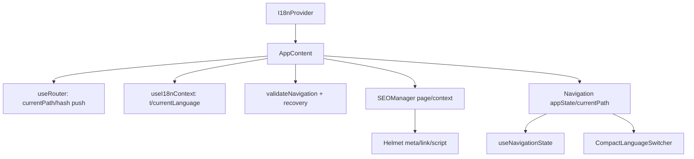

# SEO、国际化与导航模块分析草稿

## Evidence Matrix

| 字段 | 证据化判断 |
|---|---|
| Module Role | 该模块把“单页截图处理流程”包装成可被用户、浏览器和搜索引擎理解的产品体验：SEO 负责 head 元数据与结构化数据，i18n 负责 UI 文案和语言偏好，导航负责按上传、分割、导出状态约束用户路径。实际运行入口在 `App.tsx`：应用由 `HelmetProvider` 和 `I18nProvider` 包裹，并在页面主体中挂载 `SEOManager` 与 `Navigation`（`/tmp/Long_screenshot_splitting_tool/src/App.tsx:734`, `/tmp/Long_screenshot_splitting_tool/src/App.tsx:737`, `/tmp/Long_screenshot_splitting_tool/src/App.tsx:539`, `/tmp/Long_screenshot_splitting_tool/src/App.tsx:583`）。 |
| Entry Points | SEO 入口是 `SEOManager`，由 `AppContent` 根据当前步骤和截图状态传入 `page/context`（`/tmp/Long_screenshot_splitting_tool/src/App.tsx:539`, `/tmp/Long_screenshot_splitting_tool/src/App.tsx:540`, `/tmp/Long_screenshot_splitting_tool/src/App.tsx:542`）。i18n 入口是 `I18nProvider -> useI18n -> useI18nContext`（`/tmp/Long_screenshot_splitting_tool/src/hooks/useI18nContext.tsx:10`, `/tmp/Long_screenshot_splitting_tool/src/hooks/useI18nContext.tsx:17`）。导航入口是 `Navigation` 组件调用 `useNavigationState(appState,currentPath)`，再把可用状态绑定到按钮、快捷键和移动端触摸导航（`/tmp/Long_screenshot_splitting_tool/src/components/Navigation.tsx:208`, `/tmp/Long_screenshot_splitting_tool/src/components/Navigation.tsx:216`, `/tmp/Long_screenshot_splitting_tool/src/components/Navigation.tsx:292`）。 |
| Core Data Structures | SEO 的核心结构是 `SEOMetadata`、`SEOConfig`、`SEOManagerProps`：分别描述最终 head 内容、JSON 配置形状、组件输入契约（`/tmp/Long_screenshot_splitting_tool/src/types/seo.types.ts:6`, `/tmp/Long_screenshot_splitting_tool/src/types/seo.types.ts:190`, `/tmp/Long_screenshot_splitting_tool/src/types/seo.types.ts:456`）。i18n 的核心结构是 `SUPPORTED_LANGUAGES`、`languageCache` 和扁平 JSON key-value 资源（`/tmp/Long_screenshot_splitting_tool/src/hooks/useI18n.ts:6`, `/tmp/Long_screenshot_splitting_tool/src/hooks/useI18n.ts:10`, `/tmp/Long_screenshot_splitting_tool/src/locales/zh-CN.json:1`）。导航的核心结构是 `NavigationState/NavigationItem/NavigationMetrics` 以及 `DEFAULT_NAVIGATION_ITEMS`（`/tmp/Long_screenshot_splitting_tool/src/hooks/useNavigationState.ts:18`, `/tmp/Long_screenshot_splitting_tool/src/hooks/useNavigationState.ts:26`, `/tmp/Long_screenshot_splitting_tool/src/hooks/useNavigationState.ts:35`, `/tmp/Long_screenshot_splitting_tool/src/hooks/useNavigationState.ts:43`）。 |
| Main Flow | 主流程是：`useRouter` 从 hash 得到 `currentPath`，`AppContent` 用应用状态校验/恢复导航，再渲染 SEO 和导航。导航按钮只发起 `push(path)`，真正的状态合法性由 `validateNavigation` 和错误恢复策略兜底（`/tmp/Long_screenshot_splitting_tool/src/hooks/useRouter.ts:16`, `/tmp/Long_screenshot_splitting_tool/src/hooks/useRouter.ts:36`, `/tmp/Long_screenshot_splitting_tool/src/App.tsx:137`, `/tmp/Long_screenshot_splitting_tool/src/App.tsx:143`, `/tmp/Long_screenshot_splitting_tool/src/App.tsx:170`, `/tmp/Long_screenshot_splitting_tool/src/components/Navigation.tsx:219`）。SEO 流程是配置加载/回退生成 `metadata`，再通过 Helmet 写入 title、description、canonical、hreflang、OG、Twitter、结构化数据（`/tmp/Long_screenshot_splitting_tool/src/components/SEOManager.tsx:142`, `/tmp/Long_screenshot_splitting_tool/src/components/SEOManager.tsx:178`, `/tmp/Long_screenshot_splitting_tool/src/components/SEOManager.tsx:450`, `/tmp/Long_screenshot_splitting_tool/src/components/SEOManager.tsx:621`）。 |
| Cross-Module Dependencies | `App.tsx` 同时依赖 `useRouter`、`useI18nContext`、`SEOManager`、`Navigation` 和 `navigationErrorHandler`，因此它是该模块实际编排点（`/tmp/Long_screenshot_splitting_tool/src/App.tsx:4`, `/tmp/Long_screenshot_splitting_tool/src/App.tsx:5`, `/tmp/Long_screenshot_splitting_tool/src/App.tsx:15`, `/tmp/Long_screenshot_splitting_tool/src/App.tsx:24`）。SEO 依赖截图流程上下文 `sliceCount/selectedCount/isProcessing/hasImage`（`/tmp/Long_screenshot_splitting_tool/src/App.tsx:542`）；导航依赖图片状态 `originalImage/imageSlices/selectedSlices/isProcessing`（`/tmp/Long_screenshot_splitting_tool/src/hooks/useNavigationState.ts:83`）；UI 文案依赖 i18n 的 `t()`（`/tmp/Long_screenshot_splitting_tool/src/components/Navigation.tsx:196`, `/tmp/Long_screenshot_splitting_tool/src/App.tsx:575`）。 |
| Key Design Decisions | 设计上选择“轻量 hash router + 业务状态守卫”，而不是完整路由框架或 route guard：`useRouter` 只操作 `window.location.hash`（`/tmp/Long_screenshot_splitting_tool/src/hooks/useRouter.ts:16`, `/tmp/Long_screenshot_splitting_tool/src/hooks/useRouter.ts:36`），访问约束放到 `useNavigationState` 和 `navigationErrorHandler`（`/tmp/Long_screenshot_splitting_tool/src/hooks/useNavigationState.ts:112`, `/tmp/Long_screenshot_splitting_tool/src/utils/navigationErrorHandler.ts:55`）。SEO 选择“JSON 配置 + legacy getter 回退”的桥接方案，降低迁移成本但带来双路径一致性成本（`/tmp/Long_screenshot_splitting_tool/src/config/seo.config.ts:1`, `/tmp/Long_screenshot_splitting_tool/src/config/seo.config.ts:24`, `/tmp/Long_screenshot_splitting_tool/src/config/seo.config.ts:170`）。 |
| Risk Areas | 已抽样风险路径 1：语言切换后 UI 语言和 SEO 语言可能不一致。`App.tsx` 固定传 `language="zh-CN"` 给 `SEOManager`，但导航内的 `CompactLanguageSwitcher` 会切换 i18n 当前语言（`/tmp/Long_screenshot_splitting_tool/src/App.tsx:541`, `/tmp/Long_screenshot_splitting_tool/src/components/LanguageSwitcher.tsx:151`, `/tmp/Long_screenshot_splitting_tool/src/components/LanguageSwitcher.tsx:154`）。已抽样风险路径 2：`useSEOI18n` 按 `pageConfig[language]` 读取，但 JSON 配置实际是 `pageConfig.title[language]` / `description[language]`，该 hook 若被接入会走 fallback（`/tmp/Long_screenshot_splitting_tool/src/hooks/useSEOI18n.tsx:74`, `/tmp/Long_screenshot_splitting_tool/src/hooks/useSEOI18n.tsx:77`, `/tmp/Long_screenshot_splitting_tool/src/config/seo.config.json:70`, `/tmp/Long_screenshot_splitting_tool/src/config/seo.config.json:72`）。不适用说明：并发风险不是该模块主风险，前端单用户状态主要由 React state 驱动；但配置加载存在并发等待与缓存语义，已在配置加载风险中覆盖（`/tmp/Long_screenshot_splitting_tool/src/config/seo/configLoader.ts:136`, `/tmp/Long_screenshot_splitting_tool/src/config/seo/configLoader.ts:273`）。 |
| Source Evidence | 主要证据来自候选入口和相邻调用链：`App.tsx`、`SEOManager.tsx`、`seo.config.ts/json`、`SEOConfigManager.ts`、`useI18n.ts`、`useI18nContext.tsx`、`LanguageSwitcher.tsx`、`useNavigationState.ts`、`useRouter.ts`、`Navigation.tsx`、`navigationErrorHandler.ts`、中英文 locale 文件。目标仓库不存在 `graphify-out/graph.json`，`graphify query "SEO、国际化与导航模块入口、依赖和风险" --budget 1000` 返回 graph file not found，因此本草稿使用源码锚点作为一手证据。 |
| Open Questions | 【待主 agent 验证】`src/router/index.ts` 定义的 `routerConfig` 是否仍被计划使用；当前 `rg` 未发现运行时调用，实际运行路由来自 `useRouter`（`/tmp/Long_screenshot_splitting_tool/src/router/index.ts:66`, `/tmp/Long_screenshot_splitting_tool/src/hooks/useRouter.ts:15`）。【待主 agent 验证】是否存在外部构建流程生成 `/manifest.json`、`/sw.js`、字体和图标资源；SEOManager 直接声明这些资源，但本模块范围未读取构建产物（`/tmp/Long_screenshot_splitting_tool/src/components/SEOManager.tsx:657`, `/tmp/Long_screenshot_splitting_tool/src/components/SEOManager.tsx:776`, `/tmp/Long_screenshot_splitting_tool/src/components/SEOManager.tsx:791`）。 |

## 叙事分析

### 模块角色：把工具状态翻译成“可导航、可理解、可索引”的体验

这个项目的核心业务不是多页面内容站，而是一个在浏览器里完成上传、分割、导出的单页工具。SEO、国际化与导航模块存在的价值，是把内部处理状态暴露成三类外部契约：

- 给用户的契约：当前步骤、下一步是否可走、错误时该回到哪里，由 `Navigation`、`useNavigationState` 和 `navigationErrorHandler` 完成（`/tmp/Long_screenshot_splitting_tool/src/components/Navigation.tsx:183`, `/tmp/Long_screenshot_splitting_tool/src/hooks/useNavigationState.ts:53`, `/tmp/Long_screenshot_splitting_tool/src/utils/navigationErrorHandler.ts:55`）。
- 给不同语言用户的契约：文案 key 通过 `t()` 转换为当前语言，语言偏好写入本地存储（`/tmp/Long_screenshot_splitting_tool/src/hooks/useI18n.ts:109`, `/tmp/Long_screenshot_splitting_tool/src/hooks/useI18n.ts:123`, `/tmp/Long_screenshot_splitting_tool/src/hooks/useI18n.ts:52`）。
- 给搜索引擎和分享平台的契约：页面状态生成 title、description、canonical、hreflang、OG、Twitter 和 JSON-LD（`/tmp/Long_screenshot_splitting_tool/src/components/SEOManager.tsx:364`, `/tmp/Long_screenshot_splitting_tool/src/components/SEOManager.tsx:620`, `/tmp/Long_screenshot_splitting_tool/src/components/SEOManager.tsx:666`, `/tmp/Long_screenshot_splitting_tool/src/components/SEOManager.tsx:757`）。

如果去掉这个模块，截图切割核心仍可运行，但用户会失去步骤引导、错误恢复和语言切换，外部搜索/分享平台也只能看到弱语义的单页应用。这是典型“产品化外壳”模块：不直接切图，却决定工具是否像一个完整产品。

### 入口点与运行时编排

实际运行时不是 `src/router/index.ts` 里的 `routerConfig` 驱动。`routerConfig` 定义了 `home/upload/split/export` 路由和 meta key（`/tmp/Long_screenshot_splitting_tool/src/router/index.ts:66`, `/tmp/Long_screenshot_splitting_tool/src/router/index.ts:70`），但应用入口使用的是 `useRouter` 的简化 hash 状态：初始化读 `window.location.hash.slice(1)`，`push` 直接写 hash（`/tmp/Long_screenshot_splitting_tool/src/hooks/useRouter.ts:16`, `/tmp/Long_screenshot_splitting_tool/src/hooks/useRouter.ts:36`）。因此本模块的真实编排点是 `AppContent`：

这个设计的 Why 很清楚：项目是工具型 SPA，路径只有四步，不需要引入重型路由框架。How 是把路径存到 hash，把业务前置条件放在状态守卫里。Trade-off 是路由配置、导航状态、SEO 页面类型出现三份相近但不完全统一的“页面模型”：`routerConfig.routes`（`/tmp/Long_screenshot_splitting_tool/src/router/index.ts:70`）、`DEFAULT_NAVIGATION_ITEMS`（`/tmp/Long_screenshot_splitting_tool/src/hooks/useNavigationState.ts:43`）、`PageType`（`/tmp/Long_screenshot_splitting_tool/src/types/seo.types.ts:65`）。页面少时可接受，页面增多后会增加同步成本。

### 核心数据结构

SEO 侧核心结构是 `SEOMetadata`，它覆盖传统 meta、Open Graph、Twitter、canonical、hreflang 和可选发布时间（`/tmp/Long_screenshot_splitting_tool/src/types/seo.types.ts:6`）。`SEOConfig` 则把站点信息、关键词、页面配置、结构化数据、robots/sitemap 等集中到配置层（`/tmp/Long_screenshot_splitting_tool/src/types/seo.types.ts:190`）。`SEOManagerProps` 是运行时桥梁：它只要求 `page`，其余语言、上下文、自定义元数据和开关均可选（`/tmp/Long_screenshot_splitting_tool/src/types/seo.types.ts:456`）。

i18n 侧选择扁平 key-value JSON，而不是嵌套命名空间。`useI18n` 动态导入 `../locales/${language}.json` 并缓存到 `languageCache`（`/tmp/Long_screenshot_splitting_tool/src/hooks/useI18n.ts:67`, `/tmp/Long_screenshot_splitting_tool/src/hooks/useI18n.ts:75`, `/tmp/Long_screenshot_splitting_tool/src/hooks/useI18n.ts:79`）。这种方案简单、查找快，适合中小型工具；代价是重复 key 和缺失 key 更依赖人工检查。例如 `zh-CN.json` 中 `upload.fileTypeError` 出现两次，JSON 解析时前一个会被后一个覆盖（`/tmp/Long_screenshot_splitting_tool/src/locales/zh-CN.json:16`, `/tmp/Long_screenshot_splitting_tool/src/locales/zh-CN.json:18`）。

导航侧的数据结构更偏工作流状态机：`NavigationState` 记录 current/available/completed/blocked，`NavigationMetrics` 派生进度，`DEFAULT_NAVIGATION_ITEMS` 定义四个步骤（`/tmp/Long_screenshot_splitting_tool/src/hooks/useNavigationState.ts:18`, `/tmp/Long_screenshot_splitting_tool/src/hooks/useNavigationState.ts:35`, `/tmp/Long_screenshot_splitting_tool/src/hooks/useNavigationState.ts:43`）。它没有独立持久化，而是由 `appState.originalImage/imageSlices/selectedSlices/isProcessing` 现场推导（`/tmp/Long_screenshot_splitting_tool/src/hooks/useNavigationState.ts:83`）。

### 主流程：状态守卫优先于路由声明

用户路径流转的核心不是 route match，而是业务状态：

1. `useRouter` 从 hash 建立 `currentPath`，`push` 写入新 hash（`/tmp/Long_screenshot_splitting_tool/src/hooks/useRouter.ts:16`, `/tmp/Long_screenshot_splitting_tool/src/hooks/useRouter.ts:36`）。
2. 上传处理完成后，`AppContent` 监听 `imageSlices` 从 0 变为大于 0，再跳到 `/split`，避免 worker 尚未产出切片时提前跳转（`/tmp/Long_screenshot_splitting_tool/src/App.tsx:121`, `/tmp/Long_screenshot_splitting_tool/src/App.tsx:129`, `/tmp/Long_screenshot_splitting_tool/src/App.tsx:133`）。
3. 每次路径或状态变化后，`validateNavigation(currentPath,state)` 检查当前路径是否满足前置条件；若失败，错误处理器给出重定向路径，`AppContent` 执行 `push(strategy.redirectTo)`（`/tmp/Long_screenshot_splitting_tool/src/App.tsx:137`, `/tmp/Long_screenshot_splitting_tool/src/App.tsx:143`, `/tmp/Long_screenshot_splitting_tool/src/App.tsx:149`, `/tmp/Long_screenshot_splitting_tool/src/App.tsx:170`）。
4. `Navigation` 展示层只根据 `useNavigationState` 的禁用状态阻止按钮点击；它不是唯一安全边界（`/tmp/Long_screenshot_splitting_tool/src/components/Navigation.tsx:62`, `/tmp/Long_screenshot_splitting_tool/src/components/Navigation.tsx:72`, `/tmp/Long_screenshot_splitting_tool/src/components/Navigation.tsx:208`）。

这个分层的好处是刷新、手动改 hash、按钮点击都走同一套恢复逻辑。代价是状态守卫散布在 `useNavigationState` 和 `navigationErrorHandler` 两处：前者决定按钮是否可点（`/tmp/Long_screenshot_splitting_tool/src/hooks/useNavigationState.ts:112`），后者决定非法路径如何恢复（`/tmp/Long_screenshot_splitting_tool/src/utils/navigationErrorHandler.ts:55`）。目前规则基本一致，但未来若增加步骤，二者需要同步维护。

### SEO 主流程：配置桥接、动态上下文和 Helmet 注入

SEOManager 有两层生成策略。第一层尝试加载 `seoConfigManager` 的 JSON 配置：`useDynamicMetadata` 调用 `seoConfigManager.loadConfig()`，成功后用 `getPageConfig(page,language)` 生成标题、描述、关键词、canonical、hreflang（`/tmp/Long_screenshot_splitting_tool/src/components/SEOManager.tsx:142`, `/tmp/Long_screenshot_splitting_tool/src/components/SEOManager.tsx:146`, `/tmp/Long_screenshot_splitting_tool/src/components/SEOManager.tsx:182`, `/tmp/Long_screenshot_splitting_tool/src/components/SEOManager.tsx:184`）。第二层是 fallback：若配置未加载或生成失败，则用 `generatePageMetadata` 和 `SEO_CONFIG` legacy getter 生成元数据（`/tmp/Long_screenshot_splitting_tool/src/components/SEOManager.tsx:229`, `/tmp/Long_screenshot_splitting_tool/src/components/SEOManager.tsx:381`, `/tmp/Long_screenshot_splitting_tool/src/utils/seo/metadataGenerator.ts:17`）。

这套桥接方案的 Why 是迁移友好：`seo.config.ts` 明确说实际配置迁移到 `seo.config.json`，但保留 legacy getter 兼容旧调用（`/tmp/Long_screenshot_splitting_tool/src/config/seo.config.ts:1`, `/tmp/Long_screenshot_splitting_tool/src/config/seo.config.ts:4`, `/tmp/Long_screenshot_splitting_tool/src/config/seo.config.ts:46`）。How 是 `getConfigValue(path,fallback)` 从当前 manager 配置里按路径读取，失败就返回 fallback（`/tmp/Long_screenshot_splitting_tool/src/config/seo.config.ts:24`, `/tmp/Long_screenshot_splitting_tool/src/config/seo.config.ts:29`, `/tmp/Long_screenshot_splitting_tool/src/config/seo.config.ts:40`）。Trade-off 是调试更复杂：同一 title 可能来自 JSON、legacy getter、metadataGenerator 或组件级 fallback，问题定位需要追踪当前 config 是否 loaded（`/tmp/Long_screenshot_splitting_tool/src/utils/seo/SEOConfigManager.ts:560`, `/tmp/Long_screenshot_splitting_tool/src/components/SEOManager.tsx:459`）。

最终注入由 Helmet 完成：基础 meta 在 `title/description/keywords/robots/language`，多语言在 `hreflang`，社交分享在 OG/Twitter，结构化数据以 JSON-LD script 输出（`/tmp/Long_screenshot_splitting_tool/src/components/SEOManager.tsx:621`, `/tmp/Long_screenshot_splitting_tool/src/components/SEOManager.tsx:666`, `/tmp/Long_screenshot_splitting_tool/src/components/SEOManager.tsx:672`, `/tmp/Long_screenshot_splitting_tool/src/components/SEOManager.tsx:723`, `/tmp/Long_screenshot_splitting_tool/src/components/SEOManager.tsx:757`）。

### 国际化主流程：UI 文案有效，SEO 语言协同不足

UI 国际化链路相对直接。`I18nProvider` 调用 `useI18n` 生成上下文（`/tmp/Long_screenshot_splitting_tool/src/hooks/useI18nContext.tsx:10`），`useI18n` 先从持久化状态或旧 key 读取语言（`/tmp/Long_screenshot_splitting_tool/src/hooks/useI18n.ts:29`, `/tmp/Long_screenshot_splitting_tool/src/hooks/useI18n.ts:32`, `/tmp/Long_screenshot_splitting_tool/src/hooks/useI18n.ts:41`），再动态导入对应 JSON（`/tmp/Long_screenshot_splitting_tool/src/hooks/useI18n.ts:75`）。组件通过 `t(key,params)` 获取文案；缺失 key 时返回 key 本身，避免白屏（`/tmp/Long_screenshot_splitting_tool/src/hooks/useI18n.ts:109`, `/tmp/Long_screenshot_splitting_tool/src/hooks/useI18n.ts:113`, `/tmp/Long_screenshot_splitting_tool/src/hooks/useI18n.ts:115`）。

导航 UI 已接入该上下文：导航按钮文本 `t(item.name)`，进度条 `t('navigation.progress.completed')`，可访问性 label 也来自 locale（`/tmp/Long_screenshot_splitting_tool/src/components/Navigation.tsx:171`, `/tmp/Long_screenshot_splitting_tool/src/components/Navigation.tsx:321`, `/tmp/Long_screenshot_splitting_tool/src/components/Navigation.tsx:344`）。语言切换入口位于导航快捷区，`CompactLanguageSwitcher` 在中英文之间 toggle 并调用 `changeLanguage`（`/tmp/Long_screenshot_splitting_tool/src/components/Navigation.tsx:435`, `/tmp/Long_screenshot_splitting_tool/src/components/LanguageSwitcher.tsx:151`, `/tmp/Long_screenshot_splitting_tool/src/components/LanguageSwitcher.tsx:154`）。

关键问题是 SEO 没有跟随这个语言状态。`AppContent` 已经从 `useI18nContext` 取出 `t` 和 loading 状态，但没有取 `currentLanguage`；传给 `SEOManager` 的语言固定是 `"zh-CN"`（`/tmp/Long_screenshot_splitting_tool/src/App.tsx:37`, `/tmp/Long_screenshot_splitting_tool/src/App.tsx:541`）。因此用户切到英文后，正文和导航会变英文，但 `meta name="language"`、OG locale、title/description 仍按中文路径生成。这个结论有源码锚点支持，但是否影响最终部署 SEO 需要主 agent 结合实际构建和页面抓取再验证。

### 跨模块依赖与协同评价

这个模块的协同模式是“App 作为中枢，hook 做状态推导，组件只做绑定”。它与工具型 SPA 的整体设计相符：核心处理模块维护图片状态，导航和 SEO 只消费这些状态，不反向控制切图流程。`SEOManager` 消费 `sliceCount/selectedCount/isProcessing/hasImage` 来生成动态上下文（`/tmp/Long_screenshot_splitting_tool/src/App.tsx:542`），`Navigation` 消费同一份 `state` 决定步骤可访问性（`/tmp/Long_screenshot_splitting_tool/src/App.tsx:583`, `/tmp/Long_screenshot_splitting_tool/src/hooks/useNavigationState.ts:83`）。

但协同边界还不够统一：

- 页面模型重复：`PageType`、`routerConfig.routes`、`DEFAULT_NAVIGATION_ITEMS`、`getCurrentPageType()` 的映射【待主 agent 验证该函数定义所在片段】需要保持一致；当前已确认前三者存在分散定义（`/tmp/Long_screenshot_splitting_tool/src/types/seo.types.ts:65`, `/tmp/Long_screenshot_splitting_tool/src/router/index.ts:70`, `/tmp/Long_screenshot_splitting_tool/src/hooks/useNavigationState.ts:43`）。
- 语言模型重复：UI locale、SEO JSON 配置和 `SEO_CONFIG` legacy getter 都持有中英文内容（`/tmp/Long_screenshot_splitting_tool/src/locales/en.json:1`, `/tmp/Long_screenshot_splitting_tool/src/config/seo.config.json:3`, `/tmp/Long_screenshot_splitting_tool/src/config/seo.config.ts:48`）。
- 运行路由与声明路由分离：`routerConfig` 的 meta key 目前未形成运行时 SEO/i18n 来源，更多像保留设计或未来扩展点（`/tmp/Long_screenshot_splitting_tool/src/router/index.ts:75`, `/tmp/Long_screenshot_splitting_tool/src/router/index.ts:84`）。

### 关键设计决策与权衡

1. 轻量 hash router，而不是 React Router。

Why：四步工具流程，用 hash 能兼容静态部署和 GitHub Pages 风格路径；`routerConfig` 中也写明 SPA 模式偏 hash（`/tmp/Long_screenshot_splitting_tool/src/router/index.ts:66`, `/tmp/Long_screenshot_splitting_tool/src/router/index.ts:67`）。How：实际 `useRouter` 只监听 `hashchange` 并写 `window.location.hash`（`/tmp/Long_screenshot_splitting_tool/src/hooks/useRouter.ts:22`, `/tmp/Long_screenshot_splitting_tool/src/hooks/useRouter.ts:32`, `/tmp/Long_screenshot_splitting_tool/src/hooks/useRouter.ts:36`）。Trade-off：少依赖、易部署，但无法天然获得嵌套路由、loader、route guard、meta 合并等能力。

2. 状态守卫分离到导航 hook 和错误处理器。

Why：按钮禁用是用户体验，非法路径恢复是安全兜底，二者职责不同。How：`useNavigationState` 根据 appState 禁用 `/split` 与 `/export`（`/tmp/Long_screenshot_splitting_tool/src/hooks/useNavigationState.ts:118`, `/tmp/Long_screenshot_splitting_tool/src/hooks/useNavigationState.ts:121`）；`navigationErrorHandler` 对直接进入非法路径返回错误并给出重定向（`/tmp/Long_screenshot_splitting_tool/src/utils/navigationErrorHandler.ts:60`, `/tmp/Long_screenshot_splitting_tool/src/utils/navigationErrorHandler.ts:235`）。Trade-off：体验层和恢复层解耦，但规则重复，需要测试覆盖防止漂移。

3. SEO 配置桥接层，而不是一次性替换旧配置。

Why：避免所有调用方同时迁移到 JSON schema。How：`SEO_CONFIG` 通过 getter 读取 `seoConfigManager.getCurrentConfig()`，失败返回硬编码 fallback（`/tmp/Long_screenshot_splitting_tool/src/config/seo.config.ts:24`, `/tmp/Long_screenshot_splitting_tool/src/config/seo.config.ts:26`, `/tmp/Long_screenshot_splitting_tool/src/config/seo.config.ts:40`）。Trade-off：向后兼容强，但来源多、状态多，容易出现“测试时用 fallback、生产时用 JSON”的差异。

### 风险路径抽样

| 抽样对象 | 源码锚点 | 发现结果 | 对架构评价的影响 |
|---|---|---|---|
| 语言切换后 SEO 元数据是否同步 | `/tmp/Long_screenshot_splitting_tool/src/App.tsx:541`, `/tmp/Long_screenshot_splitting_tool/src/components/LanguageSwitcher.tsx:151`, `/tmp/Long_screenshot_splitting_tool/src/components/LanguageSwitcher.tsx:154`, `/tmp/Long_screenshot_splitting_tool/src/components/SEOManager.tsx:631`, `/tmp/Long_screenshot_splitting_tool/src/components/SEOManager.tsx:693` | UI 语言由 `CompactLanguageSwitcher` 切换，但 `SEOManager` 的 `language` prop 固定为 `zh-CN`。因此英文 UI 下 head 的 `language`、`og:locale`、title/description 很可能仍为中文。 | 这是跨模块契约缺口：i18n 已作为 UI 上下文存在，但未成为 SEO 的单一语言来源。架构上说明当前国际化是“界面国际化优先”，尚未完成“页面语义国际化”。 |
| SEO 配置加载失败/未初始化路径 | `/tmp/Long_screenshot_splitting_tool/src/components/SEOManager.tsx:142`, `/tmp/Long_screenshot_splitting_tool/src/components/SEOManager.tsx:146`, `/tmp/Long_screenshot_splitting_tool/src/components/SEOManager.tsx:150`, `/tmp/Long_screenshot_splitting_tool/src/utils/seo/SEOConfigManager.ts:217`, `/tmp/Long_screenshot_splitting_tool/src/utils/seo/SEOConfigManager.ts:230` | 配置通过浏览器 `fetch('/src/config/seo.config.json')` 加载；失败时 `SEOManager` 回退到 `getCurrentSEOConfig()` 或 `generatePageMetadata()`。该设计避免白屏，但配置路径和部署产物关系需要验证。 | 正面影响是容错好；负面影响是 SEO 结果可能悄悄退回硬编码默认值，造成运营配置未生效却不易被用户发现。 |
| 非法直接访问 `/export` | `/tmp/Long_screenshot_splitting_tool/src/utils/navigationErrorHandler.ts:82`, `/tmp/Long_screenshot_splitting_tool/src/utils/navigationErrorHandler.ts:92`, `/tmp/Long_screenshot_splitting_tool/src/utils/navigationErrorHandler.ts:244`, `/tmp/Long_screenshot_splitting_tool/src/App.tsx:143`, `/tmp/Long_screenshot_splitting_tool/src/App.tsx:170` | 若没有图片、切片或选中切片，错误处理器会生成错误并重定向到 `/upload` 或 `/split`。 | 导航风险处理较成熟：按钮禁用之外还有路径级恢复。但这套保护在 `AppContent` effect 中延迟 100ms 执行，刷新瞬间会先显示加载态；这是 UX 取舍，不是安全漏洞。 |

不适用风险类别说明：

- 插件/扩展点：本模块没有开放第三方插件 API；`StructuredDataProvider` 是内部懒加载组件，不构成外部插件边界（`/tmp/Long_screenshot_splitting_tool/src/components/EnhancedSEOManager.tsx:18`）。
- 权限与认证：`RouteConfig.meta.requiresAuth` 存在类型字段，但当前四个路由配置未启用认证，截图工具也没有用户登录边界（`/tmp/Long_screenshot_splitting_tool/src/router/index.ts:12`, `/tmp/Long_screenshot_splitting_tool/src/router/index.ts:70`）。
- generated/vendor/test 边界：本次候选文件均为源码与 locale 资源；未发现 generated/vendor 文件参与该模块。测试文件未纳入深读，相关测试覆盖结论保留为开放问题。
- 并发：浏览器单用户交互下导航状态由 React state 推导；配置加载存在并发等待，但 `ConfigLoader.waitForLoad()` 和 `SEOConfigManager.loadPromise` 已提供基本串行化语义（`/tmp/Long_screenshot_splitting_tool/src/config/seo/configLoader.ts:136`, `/tmp/Long_screenshot_splitting_tool/src/utils/seo/SEOConfigManager.ts:153`）。

### 开放问题与限制

1. `src/router/index.ts` 是否是遗留设计、未来扩展，还是某些构建模式会使用，当前证据不足。已确认 `App.tsx` 实际使用 `useRouter`，但未做全仓库构建链路验证（`/tmp/Long_screenshot_splitting_tool/src/App.tsx:5`, `/tmp/Long_screenshot_splitting_tool/src/hooks/useRouter.ts:15`, `/tmp/Long_screenshot_splitting_tool/src/router/index.ts:66`）。
2. `useSEOI18n` 当前读取形状与 `seo.config.json` 不一致：hook 读取 `pageConfig[language]`，JSON 是 `pageConfig.title[language]` 和 `pageConfig.description[language]`。由于 `rg` 未发现该 hook 被运行时页面调用，本草稿只把它列为“潜在接入风险”，不写成现网缺陷（`/tmp/Long_screenshot_splitting_tool/src/hooks/useSEOI18n.tsx:74`, `/tmp/Long_screenshot_splitting_tool/src/config/seo.config.json:72`）。
3. SEOManager 声明的 `/manifest.json`、`/browserconfig.xml`、`/fonts/main.woff2`、`/api/health`、`/sw.js` 是否存在于部署产物，本模块没有证据确认；只能标为资源引用开放问题（`/tmp/Long_screenshot_splitting_tool/src/components/SEOManager.tsx:657`, `/tmp/Long_screenshot_splitting_tool/src/components/SEOManager.tsx:783`, `/tmp/Long_screenshot_splitting_tool/src/components/SEOManager.tsx:791`）。
4. locale 缺失 key 风险需要自动化校验。证据显示 `LanguageSwitcher` 使用 `lang.description`，但 `rg` 未在中英文 locale 中找到该 key（`/tmp/Long_screenshot_splitting_tool/src/components/LanguageSwitcher.tsx:128`）。这会退回显示 key 文本；是否在当前 UI 可见取决于是否使用完整 `LanguageSwitcher` 而非紧凑版。

### 小结

该模块的整体思路务实：用轻量 hash 路由承载四步工具流程，用状态守卫保护用户路径，用扁平 locale 快速完成 UI 国际化，用 SEO 配置桥接层逐步迁移到 JSON 化配置。它适合当前项目规模，避免了过早引入重框架。

主要架构问题也很明确：页面、语言、SEO 配置三套模型尚未收敛为单一来源。短期看，这会表现为语言切换后 SEO 不同步、未使用的路由配置和潜在 locale key 缺失；长期看，页面数或语言数增加时，同步成本会快速上升。若重新设计，优先级最高的改进不是换路由框架，而是把 `currentLanguage`、`PageType`、导航步骤和 SEO meta 来源收敛到一个可验证的页面定义表，再由 UI、SEO、导航共同消费。
