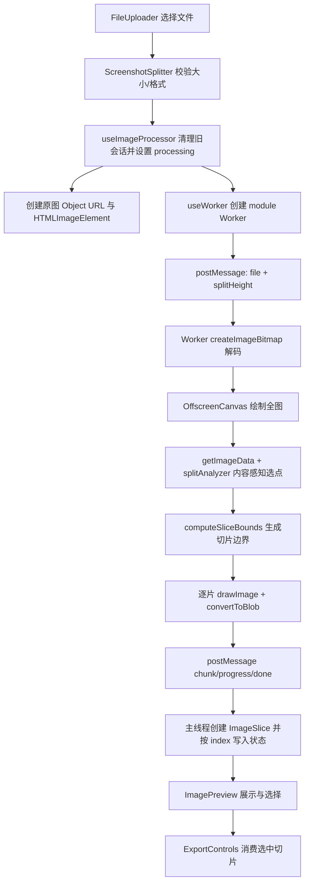

# Markdown Evidence Matrix

| 维度 | 证据与判断 | 源码锚点 |
| --- | --- | --- |
| 模块角色 | 「截图切割核心流水线」负责把用户上传的图片文件转成可预览、可选择、可导出的切片集合。它不是单一算法函数，而是一条跨 React 组件、状态 hook、Worker、纯算法模块和预览组件的端到端流水线。 | `/tmp/Long_screenshot_splitting_tool/src/components/ScreenshotSplitter.tsx:35`, `/tmp/Long_screenshot_splitting_tool/src/hooks/useImageProcessor.ts:83`, `/tmp/Long_screenshot_splitting_tool/src/workers/split.worker.js:71`, `/tmp/Long_screenshot_splitting_tool/src/components/ImagePreview.tsx:21` |
| 入口点 | 用户入口是 `ScreenshotSplitter` 内的 `FileUploader` 回调；组件先做文件大小和格式校验，再调用 `processImage(file)`。`FileUploader` 自身也有一层输入校验，形成 UI 层双重防线。 | `/tmp/Long_screenshot_splitting_tool/src/components/ScreenshotSplitter.tsx:59`, `/tmp/Long_screenshot_splitting_tool/src/components/ScreenshotSplitter.tsx:67`, `/tmp/Long_screenshot_splitting_tool/src/components/ScreenshotSplitter.tsx:72`, `/tmp/Long_screenshot_splitting_tool/src/components/ScreenshotSplitter.tsx:77`, `/tmp/Long_screenshot_splitting_tool/src/components/FileUploader.tsx:50` |
| 核心数据结构 | 主数据结构是 `AppState`：`originalImage` 保存原图对象，`imageSlices` 保存带 `blob/url/index/width/height` 的切片，`selectedSlices` 保存用户选择，`splitHeight` 是切割目标高度。Worker 消息协议只传 `progress/chunk/done/error` 四类消息。 | `/tmp/Long_screenshot_splitting_tool/src/types/index.ts:3`, `/tmp/Long_screenshot_splitting_tool/src/types/index.ts:11`, `/tmp/Long_screenshot_splitting_tool/src/types/index.ts:44`, `/tmp/Long_screenshot_splitting_tool/src/workers/split.worker.js:1` |
| 主流程 | 主流程是：上传文件 -> 清理旧会话 -> 设置处理状态和文件名 -> 创建原图 Object URL -> 创建 Worker -> postMessage(file, splitHeight) -> Worker 解码、全图绘制、内容感知分析、按边界切片、回传 blob -> 主线程创建切片 URL 并写入状态 -> 预览组件消费 `imageSlices`。 | `/tmp/Long_screenshot_splitting_tool/src/hooks/useImageProcessor.ts:91`, `/tmp/Long_screenshot_splitting_tool/src/hooks/useImageProcessor.ts:96`, `/tmp/Long_screenshot_splitting_tool/src/hooks/useImageProcessor.ts:121`, `/tmp/Long_screenshot_splitting_tool/src/hooks/useWorker.ts:121`, `/tmp/Long_screenshot_splitting_tool/src/workers/split.worker.js:85`, `/tmp/Long_screenshot_splitting_tool/src/workers/split.worker.js:111`, `/tmp/Long_screenshot_splitting_tool/src/workers/split.worker.js:140`, `/tmp/Long_screenshot_splitting_tool/src/hooks/useImageProcessor.ts:30`, `/tmp/Long_screenshot_splitting_tool/src/components/ImagePreview.tsx:207` |
| 跨模块依赖 | 组件层依赖 `useAppState` 和 `useImageProcessor`；处理 hook 依赖 `useWorker`；Worker 依赖纯函数 `analyzeSplitPoints`；状态 reducer 负责按 index 写入切片并管理 Object URL；预览和导出只消费已有切片，不参与切割决策。 | `/tmp/Long_screenshot_splitting_tool/src/components/ScreenshotSplitter.tsx:11`, `/tmp/Long_screenshot_splitting_tool/src/components/ScreenshotSplitter.tsx:12`, `/tmp/Long_screenshot_splitting_tool/src/hooks/useImageProcessor.ts:3`, `/tmp/Long_screenshot_splitting_tool/src/workers/split.worker.js:12`, `/tmp/Long_screenshot_splitting_tool/src/hooks/useAppState.ts:47`, `/tmp/Long_screenshot_splitting_tool/src/components/ExportControls.tsx:81` |
| 关键设计决策 | 算法与 I/O 分离：`splitAnalyzer` 是无 DOM/canvas/Worker 依赖的纯函数，Worker 只做解码、像素读取、绘制和 Blob 转换。这个切分降低了算法测试成本，但也让浏览器能力和内存风险集中在 Worker 胶水层。 | `/tmp/Long_screenshot_splitting_tool/src/utils/splitAnalyzer.ts:6`, `/tmp/Long_screenshot_splitting_tool/src/utils/splitAnalyzer.ts:75`, `/tmp/Long_screenshot_splitting_tool/src/workers/split.worker.js:71`, `/tmp/Long_screenshot_splitting_tool/src/workers/split.worker.js:93`, `/tmp/Long_screenshot_splitting_tool/src/workers/split.worker.js:116` |
| 关键设计决策 | 内容感知是增强层，不是硬依赖：算法先找低变化水平带，再按目标页高附近选点；如果分析异常或没有合格切割点，则回退固定高度边界，保证用户仍能得到结果。 | `/tmp/Long_screenshot_splitting_tool/src/utils/splitAnalyzer.ts:9`, `/tmp/Long_screenshot_splitting_tool/src/utils/splitAnalyzer.ts:194`, `/tmp/Long_screenshot_splitting_tool/src/utils/splitAnalyzer.ts:250`, `/tmp/Long_screenshot_splitting_tool/src/workers/split.worker.js:125`, `/tmp/Long_screenshot_splitting_tool/src/workers/split.worker.js:218` |
| 风险点 | 大图路径仍采用全图 `getImageData`，代码注释承认大图分块是未来优化项；这意味着 Worker 避免了主线程阻塞，但没有消除内存峰值风险。 | `/tmp/Long_screenshot_splitting_tool/src/workers/split.worker.js:111`, `/tmp/Long_screenshot_splitting_tool/src/workers/split.worker.js:116`, `/tmp/Long_screenshot_splitting_tool/docs/superpowers/specs/2026-06-25-content-aware-split-design.md:125` |
| 测试证据 | `splitAnalyzer` 有纯函数和合成图集成测试，覆盖空白带选点、无空白回退、密集内容回退、短图不切等关键算法路径；但 `ScreenshotSplitter` 测试大量 mock hook/子组件，无法验证真实 Worker 到预览的端到端链路。 | `/tmp/Long_screenshot_splitting_tool/src/utils/__tests__/splitAnalyzer.test.ts:57`, `/tmp/Long_screenshot_splitting_tool/src/utils/__tests__/splitAnalyzer.test.ts:224`, `/tmp/Long_screenshot_splitting_tool/src/utils/__tests__/splitAnalyzer.test.ts:244`, `/tmp/Long_screenshot_splitting_tool/src/components/__tests__/ScreenshotSplitter.test.tsx:5`, `/tmp/Long_screenshot_splitting_tool/src/components/__tests__/ScreenshotSplitter.test.tsx:44` |
| 开放问题 | 代码中没有看到真实长截图校准数据或 Worker 浏览器集成测试；因此只能确定算法有合成数据测试，不能确定在聊天记录、网页长截图、超大图片上的体验质量。 | `/tmp/Long_screenshot_splitting_tool/docs/superpowers/specs/2026-06-25-content-aware-split-design.md:102`, `/tmp/Long_screenshot_splitting_tool/docs/superpowers/specs/2026-06-25-content-aware-split-design.md:140`, `/tmp/Long_screenshot_splitting_tool/src/utils/__tests__/splitAnalyzer.test.ts:20` |

## 模块角色

这个模块的核心价值不是“把图片按高度裁开”这么简单，而是在浏览器内把一张可能很长、很大的截图变成一组用户可检查、可选择、可导出的切片。它承担三件事：

1. 把用户输入从 UI 事件转成受控的处理任务：`ScreenshotSplitter` 维护当前文件、错误态、处理态，并把 `FileUploader` 的文件选择接到 `processImage(file)`（`/tmp/Long_screenshot_splitting_tool/src/components/ScreenshotSplitter.tsx:32`, `/tmp/Long_screenshot_splitting_tool/src/components/ScreenshotSplitter.tsx:59`, `/tmp/Long_screenshot_splitting_tool/src/components/ScreenshotSplitter.tsx:77`）。
2. 把 CPU/内存密集型图片处理移出主线程：`useWorker` 以 module worker 创建 `split.worker.js`，并用消息协议接收进度、切片、完成和错误（`/tmp/Long_screenshot_splitting_tool/src/hooks/useWorker.ts:39`, `/tmp/Long_screenshot_splitting_tool/src/hooks/useWorker.ts:47`, `/tmp/Long_screenshot_splitting_tool/src/workers/split.worker.js:1`）。
3. 把切割结果重新变成 UI 可消费的状态：每个 Worker 返回的 `Blob` 被转成 Object URL 和 `ImageSlice`，然后写入 `imageSlices`，由 `ImagePreview` 展示和选择（`/tmp/Long_screenshot_splitting_tool/src/hooks/useImageProcessor.ts:30`, `/tmp/Long_screenshot_splitting_tool/src/hooks/useImageProcessor.ts:37`, `/tmp/Long_screenshot_splitting_tool/src/hooks/useImageProcessor.ts:50`, `/tmp/Long_screenshot_splitting_tool/src/components/ImagePreview.tsx:207`）。

Why：长截图处理天然容易卡 UI。这个模块把用户体验敏感的上传、错误提示、选择和导出留在 React 主线程，把解码、像素读取、切片编码放进 Worker，是符合浏览器前端图片工具的常见分工。Trade-off 是状态与生命周期被拆散：React reducer 管对象 URL，`useWorker` 管 Worker 引用，Worker 内部管 canvas 和 blob，一旦边界没有严密协同，就容易出现内存泄漏、旧任务回写或测试覆盖断层。

## 入口点与边界

入口点有两层。

第一层是 `FileUploader`。它负责拖拽、点击、移动端触摸和隐藏文件输入；在把文件交给上层前，会验证大小与 MIME 类型（`/tmp/Long_screenshot_splitting_tool/src/components/FileUploader.tsx:50`, `/tmp/Long_screenshot_splitting_tool/src/components/FileUploader.tsx:67`, `/tmp/Long_screenshot_splitting_tool/src/components/FileUploader.tsx:136`, `/tmp/Long_screenshot_splitting_tool/src/components/FileUploader.tsx:248`）。

第二层是 `ScreenshotSplitter.handleFileUpload`。它再次检查文件大小和格式，然后调用 `processImage(file)`（`/tmp/Long_screenshot_splitting_tool/src/components/ScreenshotSplitter.tsx:60`, `/tmp/Long_screenshot_splitting_tool/src/components/ScreenshotSplitter.tsx:67`, `/tmp/Long_screenshot_splitting_tool/src/components/ScreenshotSplitter.tsx:72`, `/tmp/Long_screenshot_splitting_tool/src/components/ScreenshotSplitter.tsx:77`）。这是一种偏保守的边界设计：子组件保证交互即时反馈，容器组件保证业务入口不被绕过。

模块出口则是两个消费端：

- `ImagePreview` 读取 `slices`、`selectedSlices`，负责网格预览、全选、单选和移动端模态查看（`/tmp/Long_screenshot_splitting_tool/src/components/ImagePreview.tsx:21`, `/tmp/Long_screenshot_splitting_tool/src/components/ImagePreview.tsx:110`, `/tmp/Long_screenshot_splitting_tool/src/components/ImagePreview.tsx:210`, `/tmp/Long_screenshot_splitting_tool/src/components/ImagePreview.tsx:328`）。
- `ExportControls` 只在已有选择时把 `selectedSlices.map(index => slices[index])` 传给导出回调（`/tmp/Long_screenshot_splitting_tool/src/components/ScreenshotSplitter.tsx:237`, `/tmp/Long_screenshot_splitting_tool/src/components/ExportControls.tsx:81`, `/tmp/Long_screenshot_splitting_tool/src/components/ExportControls.tsx:88`）。

这里的边界值得肯定：预览/导出没有反向参与切割算法，切割流水线对外暴露的是稳定的 `ImageSlice[]`。但这也带来一个隐含约束：`selectedSlices` 必须和 `imageSlices` 的数组下标语义一致。当前 `ImagePreview` 选择时传的是 map 下标 `index`，而 reducer 按 `slice.index` 写入数组，正常顺序下两者一致（`/tmp/Long_screenshot_splitting_tool/src/components/ImagePreview.tsx:210`, `/tmp/Long_screenshot_splitting_tool/src/components/ImagePreview.tsx:217`, `/tmp/Long_screenshot_splitting_tool/src/hooks/useAppState.ts:47`）。

## 核心数据结构

`ImageSlice` 是流水线的最小产品单元：它同时保存原始 `Blob`、预览 URL、切片序号和尺寸（`/tmp/Long_screenshot_splitting_tool/src/types/index.ts:3`）。这个结构服务两个下游：预览需要 `url/width/height`，导出需要 `blob`。

`AppState` 把切割会话拆成四类状态：

- Worker 与资源：`worker`、`blobs`、`objectUrls`（`/tmp/Long_screenshot_splitting_tool/src/types/index.ts:11`）。
- 图片结果：`originalImage`、`imageSlices`、`selectedSlices`（`/tmp/Long_screenshot_splitting_tool/src/types/index.ts:17`）。
- 处理状态：`isProcessing`（`/tmp/Long_screenshot_splitting_tool/src/types/index.ts:22`）。
- 切割参数与文件名：`splitHeight`、`fileName`（`/tmp/Long_screenshot_splitting_tool/src/types/index.ts:25`）。

Worker 消息是另一个关键结构。源码把主线程到 Worker 的消息固定为 `{ file, splitHeight }`，Worker 到主线程的消息固定为 `progress/chunk/done/error`（`/tmp/Long_screenshot_splitting_tool/src/workers/split.worker.js:1`, `/tmp/Long_screenshot_splitting_tool/src/types/index.ts:44`）。How：这个协议足够小，降低了跨线程传输复杂度；Trade-off 是它缺少 task id 或 cancellation token，因此后文提到的并发/旧任务回写风险没有协议层防线。

算法内部的核心数据结构是 `Band` 和切割点数组。`Band` 表示连续低变化水平带，包含 `top/bottom/center`；`chooseSplitPoints` 输出 y 坐标数组，Worker 再把它转成 `[startY,endY]` 边界（`/tmp/Long_screenshot_splitting_tool/src/utils/splitAnalyzer.ts:16`, `/tmp/Long_screenshot_splitting_tool/src/utils/splitAnalyzer.ts:194`, `/tmp/Long_screenshot_splitting_tool/src/workers/split.worker.js:218`）。

## 主流程

流程中最有价值的设计，是把“内容感知”插在解码绘制之后、实际切片之前。Worker 先 `createImageBitmap(file)`，再用与原图等大的 `OffscreenCanvas` 绘制全图（`/tmp/Long_screenshot_splitting_tool/src/workers/split.worker.js:85`, `/tmp/Long_screenshot_splitting_tool/src/workers/split.worker.js:93`, `/tmp/Long_screenshot_splitting_tool/src/workers/split.worker.js:99`）。随后通过 `ctx.getImageData` 读取全图像素，调用 `analyzeSplitPoints`（`/tmp/Long_screenshot_splitting_tool/src/workers/split.worker.js:111`, `/tmp/Long_screenshot_splitting_tool/src/workers/split.worker.js:116`, `/tmp/Long_screenshot_splitting_tool/src/workers/split.worker.js:117`）。

`splitAnalyzer` 的算法链路是：行级水平变化率 -> 平滑 -> 找低变化带 -> 在目标页高附近选点（`/tmp/Long_screenshot_splitting_tool/src/utils/splitAnalyzer.ts:9`, `/tmp/Long_screenshot_splitting_tool/src/utils/splitAnalyzer.ts:88`, `/tmp/Long_screenshot_splitting_tool/src/utils/splitAnalyzer.ts:122`, `/tmp/Long_screenshot_splitting_tool/src/utils/splitAnalyzer.ts:156`, `/tmp/Long_screenshot_splitting_tool/src/utils/splitAnalyzer.ts:194`）。Why：长截图切割的痛点不是像素边界丢失，而是刀口切断文字、气泡或语义块；用“低变化水平带”作为候选，比固定高度硬切更接近用户感知的完整性。

Worker 最后用 `computeSliceBounds` 将切割点变成边界。若有切割点，按点分段；若无切割点，按 `splitHeight` 等分（`/tmp/Long_screenshot_splitting_tool/src/workers/split.worker.js:140`, `/tmp/Long_screenshot_splitting_tool/src/workers/split.worker.js:228`, `/tmp/Long_screenshot_splitting_tool/src/workers/split.worker.js:241`）。每个边界再被绘制到临时 `OffscreenCanvas`，并转换成 JPEG Blob 回传主线程（`/tmp/Long_screenshot_splitting_tool/src/workers/split.worker.js:153`, `/tmp/Long_screenshot_splitting_tool/src/workers/split.worker.js:170`, `/tmp/Long_screenshot_splitting_tool/src/workers/split.worker.js:175`）。

## 跨模块依赖

这个模块的依赖方向整体是单向的：

- UI 容器 `ScreenshotSplitter` 依赖 `FileUploader`、`ImagePreview`、`ExportControls` 和状态/处理 hooks（`/tmp/Long_screenshot_splitting_tool/src/components/ScreenshotSplitter.tsx:7`, `/tmp/Long_screenshot_splitting_tool/src/components/ScreenshotSplitter.tsx:8`, `/tmp/Long_screenshot_splitting_tool/src/components/ScreenshotSplitter.tsx:9`, `/tmp/Long_screenshot_splitting_tool/src/components/ScreenshotSplitter.tsx:10`, `/tmp/Long_screenshot_splitting_tool/src/components/ScreenshotSplitter.tsx:11`）。
- `useImageProcessor` 依赖 `useWorker`，并通过 action 写入全局应用状态（`/tmp/Long_screenshot_splitting_tool/src/hooks/useImageProcessor.ts:2`, `/tmp/Long_screenshot_splitting_tool/src/hooks/useImageProcessor.ts:3`, `/tmp/Long_screenshot_splitting_tool/src/hooks/useImageProcessor.ts:5`）。
- `useWorker` 直接实例化 `src/workers/split.worker.js`，并把 Worker 消息适配为 hook 回调（`/tmp/Long_screenshot_splitting_tool/src/hooks/useWorker.ts:42`, `/tmp/Long_screenshot_splitting_tool/src/hooks/useWorker.ts:47`）。
- Worker 依赖 `splitAnalyzer`，但 `splitAnalyzer` 不依赖 Worker 或 DOM（`/tmp/Long_screenshot_splitting_tool/src/workers/split.worker.js:12`, `/tmp/Long_screenshot_splitting_tool/src/utils/splitAnalyzer.ts:6`）。

这条依赖链体现了一个清晰的分层：UI 编排 -> 处理编排 -> 跨线程通信 -> 图像 I/O -> 纯算法。How：算法纯函数的测试可以在 Vitest 中独立运行，不需要浏览器 Worker 环境；源码测试确实用合成像素图覆盖了算法入口（`/tmp/Long_screenshot_splitting_tool/src/utils/__tests__/splitAnalyzer.test.ts:20`, `/tmp/Long_screenshot_splitting_tool/src/utils/__tests__/splitAnalyzer.test.ts:224`）。Trade-off：真正端到端路径横跨 DOM、Worker、OffscreenCanvas、Object URL 和 React 状态，现有组件测试 mock 掉了 hooks 和子组件，因此对集成断裂的发现能力有限（`/tmp/Long_screenshot_splitting_tool/src/components/__tests__/ScreenshotSplitter.test.tsx:5`, `/tmp/Long_screenshot_splitting_tool/src/components/__tests__/ScreenshotSplitter.test.tsx:44`）。

## 关键设计决策

### 1. Worker + OffscreenCanvas：优先保护交互线程

`useWorker` 使用 `new Worker(new URL(...), { type: 'module' })` 创建 module worker，注释明确说明这是为了让 worker 使用 ESM import `splitAnalyzer`（`/tmp/Long_screenshot_splitting_tool/src/hooks/useWorker.ts:39`, `/tmp/Long_screenshot_splitting_tool/src/hooks/useWorker.ts:42`）。图片解码、全图 canvas、像素读取和切片编码都发生在 worker 内（`/tmp/Long_screenshot_splitting_tool/src/workers/split.worker.js:85`, `/tmp/Long_screenshot_splitting_tool/src/workers/split.worker.js:93`, `/tmp/Long_screenshot_splitting_tool/src/workers/split.worker.js:116`, `/tmp/Long_screenshot_splitting_tool/src/workers/split.worker.js:171`）。

Why：长截图尺寸通常远超首屏，`getImageData` 和多次 `convertToBlob` 放主线程会直接破坏交互。Trade-off：Worker 隔离减少了 UI 卡顿，但浏览器 API 兼容性、Worker 打包方式、消息协议和资源释放都变成架构边界。代码有 worker 创建失败、消息错误和处理错误回调（`/tmp/Long_screenshot_splitting_tool/src/hooks/useWorker.ts:80`, `/tmp/Long_screenshot_splitting_tool/src/hooks/useWorker.ts:88`, `/tmp/Long_screenshot_splitting_tool/src/workers/split.worker.js:209`），但没有看到针对 Worker 浏览器环境的集成测试。

### 2. 算法与 I/O 分离：让“聪明切割”可测试

`splitAnalyzer` 顶部注释明确说明全部为纯函数、无 DOM/canvas/Worker 依赖，Worker 仅负责 decode/getImageData/drawImage 胶水（`/tmp/Long_screenshot_splitting_tool/src/utils/splitAnalyzer.ts:6`）。这不是装饰性拆分，而是实实在在影响测试边界：测试文件对 `computeVariationProfile`、`smooth`、`findLowVariationBands`、`chooseSplitPoints` 和 `analyzeSplitPoints` 分层断言（`/tmp/Long_screenshot_splitting_tool/src/utils/__tests__/splitAnalyzer.test.ts:57`, `/tmp/Long_screenshot_splitting_tool/src/utils/__tests__/splitAnalyzer.test.ts:105`, `/tmp/Long_screenshot_splitting_tool/src/utils/__tests__/splitAnalyzer.test.ts:130`, `/tmp/Long_screenshot_splitting_tool/src/utils/__tests__/splitAnalyzer.test.ts:163`, `/tmp/Long_screenshot_splitting_tool/src/utils/__tests__/splitAnalyzer.test.ts:224`）。

Why：内容感知切割需要调参和回归验证，如果算法混在 Worker I/O 里，每次调试都要跑浏览器环境，反馈慢且脆弱。Trade-off：纯函数测试能验证“合成图里的数学行为”，但不能证明真实长截图体验。设计文档也把阈值和空白带高度标为待真实截图校准项（`/tmp/Long_screenshot_splitting_tool/docs/superpowers/specs/2026-06-25-content-aware-split-design.md:102`）。

### 3. 安全回退：内容感知失败时不阻断产出

Worker 在分析阶段捕获异常，把 `splitPoints` 置空并继续走等分逻辑（`/tmp/Long_screenshot_splitting_tool/src/workers/split.worker.js:125`, `/tmp/Long_screenshot_splitting_tool/src/workers/split.worker.js:126`, `/tmp/Long_screenshot_splitting_tool/src/workers/split.worker.js:128`）。`computeSliceBounds` 也把“有切割点”和“无切割点”分成两条路径，后者使用 `Math.ceil(imageHeight / splitHeight)` 生成固定高度边界（`/tmp/Long_screenshot_splitting_tool/src/workers/split.worker.js:228`, `/tmp/Long_screenshot_splitting_tool/src/workers/split.worker.js:241`）。

Why：对截图工具而言，可用性优先于算法优雅。内容感知如果判断错或崩溃，用户至少还应得到和旧方案相当的切片。Trade-off：空数组同时表示“不需要切”“无合格空白带需等分回退”，调用方只能靠图片高度和 `computeSliceBounds` 决定实际结果；这个语义简化降低协议复杂度，但不利于 UI 展示“本次是智能切割还是回退切割”。

### 4. 按 index 写入：修复异步图片加载乱序

主线程收到 chunk 后不是立即把 `Blob` 作为完整切片写入状态，而是先创建 Object URL，再创建临时 `Image` 读取宽高；真正 `addImageSlice` 发生在 `img.onload`（`/tmp/Long_screenshot_splitting_tool/src/hooks/useImageProcessor.ts:36`, `/tmp/Long_screenshot_splitting_tool/src/hooks/useImageProcessor.ts:41`, `/tmp/Long_screenshot_splitting_tool/src/hooks/useImageProcessor.ts:42`, `/tmp/Long_screenshot_splitting_tool/src/hooks/useImageProcessor.ts:58`）。由于多个切片图片加载完成顺序不一定等于 Worker 回传顺序，reducer 选择按 `index` 写入数组，而不是 push（`/tmp/Long_screenshot_splitting_tool/src/hooks/useAppState.ts:47`, `/tmp/Long_screenshot_splitting_tool/src/hooks/useAppState.ts:49`, `/tmp/Long_screenshot_splitting_tool/src/hooks/useAppState.ts:50`）。

Why：这是一个非常具体的异步边界修复。没有这个设计，预览顺序和导出顺序可能被浏览器图片加载时序打乱。Trade-off：数组可能短暂稀疏；`ImagePreview` 用 `slices.map` 渲染，正常情况下 React 只遍历已有元素，但如果未来出现 chunk 丢失或某个 `img.onload` 失败，缺口如何展示与导出没有明确策略（`/tmp/Long_screenshot_splitting_tool/src/hooks/useImageProcessor.ts:60`, `/tmp/Long_screenshot_splitting_tool/src/components/ImagePreview.tsx:210`）。

## 风险路径抽样

| 风险类别 | 抽样对象 | 源码锚点 | 发现结果 | 对架构评价的影响 |
| --- | --- | --- | --- | --- |
| 错误处理 | Worker 参数校验、分析异常和处理异常 | `/tmp/Long_screenshot_splitting_tool/src/workers/split.worker.js:24`, `/tmp/Long_screenshot_splitting_tool/src/workers/split.worker.js:41`, `/tmp/Long_screenshot_splitting_tool/src/workers/split.worker.js:125`, `/tmp/Long_screenshot_splitting_tool/src/workers/split.worker.js:209` | 基础输入错误会返回 `error`；内容分析异常会降级为等分；整体处理异常会返回 `Image processing error`。这是“尽量完成任务”的错误策略。 | 架构韧性较好，核心算法失败不会直接导致用户无结果；但错误消息只回调到 hook 并重置 processing，没有模块级错误状态传给 UI，用户可见反馈依赖上层是否捕获。 |
| 并发/生命周期 | `processImage` 清理旧会话、创建 Worker、等待 200ms 后启动处理 | `/tmp/Long_screenshot_splitting_tool/src/hooks/useImageProcessor.ts:96`, `/tmp/Long_screenshot_splitting_tool/src/hooks/useImageProcessor.ts:121`, `/tmp/Long_screenshot_splitting_tool/src/hooks/useImageProcessor.ts:124`, `/tmp/Long_screenshot_splitting_tool/src/hooks/useWorker.ts:30`, `/tmp/Long_screenshot_splitting_tool/src/hooks/useWorker.ts:121` | Worker readiness 由 ref 同步置位，但 `processImage` 仍用固定 200ms 等待；协议没有 task id。若连续上传或旧 Worker 消息晚到，源码没有看到任务身份校验。 | 这是当前流水线最值得补强的边界：模块适合单任务线性处理，但对快速连续上传、取消任务、旧任务回写的防御不足。 |
| 缓存/资源释放 | Object URL 创建、收集和清理 | `/tmp/Long_screenshot_splitting_tool/src/hooks/useImageProcessor.ts:37`, `/tmp/Long_screenshot_splitting_tool/src/hooks/useAppState.ts:55`, `/tmp/Long_screenshot_splitting_tool/src/hooks/useAppState.ts:89`, `/tmp/Long_screenshot_splitting_tool/src/hooks/useAppState.ts:91`, `/tmp/Long_screenshot_splitting_tool/src/hooks/useImageProcessor.ts:60` | 成功加载的切片 URL 会进入 `objectUrls` 并在 `CLEANUP_SESSION` revoke；原图临时 URL 在 load/error 后 revoke。若切片 `img.onerror`，当前只打印错误，没有 revoke 该 URL，也不会写入 `objectUrls`。 | 正常路径资源管理明确；失败路径存在 Object URL 泄漏和切片缺失风险，说明状态资源管理还没有覆盖所有边缘路径。 |
| 性能/大图内存 | Worker 全图 `getImageData` | `/tmp/Long_screenshot_splitting_tool/src/workers/split.worker.js:111`, `/tmp/Long_screenshot_splitting_tool/src/workers/split.worker.js:116`, `/tmp/Long_screenshot_splitting_tool/docs/superpowers/specs/2026-06-25-content-aware-split-design.md:125` | 当前实现一次读取整图像素；代码注释和设计文档都承认大图分块是未来优化项。 | Worker 保护了主线程，但没有解决内存峰值。对于超长截图，这是架构成熟度上的主要限制。 |
| generated/vendor/test 边界 | 核心模块测试边界 | `/tmp/Long_screenshot_splitting_tool/src/utils/__tests__/splitAnalyzer.test.ts:224`, `/tmp/Long_screenshot_splitting_tool/src/components/__tests__/ScreenshotSplitter.test.tsx:44` | 算法测试有效，组件测试通过 mock 避开真实 worker 和 canvas。未发现 generated/vendor 代码参与本模块。 | 不适用 generated/vendor 风险；测试风险适用：当前证据更能证明算法函数，而不是完整浏览器流水线。 |
| 权限与安全边界 | 本地图片文件处理 | `/tmp/Long_screenshot_splitting_tool/src/components/FileUploader.tsx:50`, `/tmp/Long_screenshot_splitting_tool/src/workers/split.worker.js:49`, `/tmp/Long_screenshot_splitting_tool/package.json:55` | 模块只处理用户选择的本地图片文件，依赖浏览器 File API；没有看到上传服务器或远程执行路径。 | 传统权限风险不突出；更实际的安全边界是文件类型/大小校验和浏览器资源消耗。 |
| 配置加载/插件扩展点 | 切割参数与算法扩展 | `/tmp/Long_screenshot_splitting_tool/src/hooks/useAppState.ts:25`, `/tmp/Long_screenshot_splitting_tool/src/utils/splitAnalyzer.ts:49`, `/tmp/Long_screenshot_splitting_tool/src/utils/splitAnalyzer.ts:250` | `splitHeight` 来自持久化状态，算法参数有默认值但 UI 只透传 `targetHeight`；没有插件机制。 | 配置加载风险较低；扩展性取舍是“参数隐藏换简单 UI”，后续若要调阈值，需要新增可观测和配置入口。 |

## 风险点与改进建议

第一，Worker 生命周期目前偏“够用”，但不是强一致。`createWorker` 会终止旧 Worker 并新建 Worker，`startProcessing` 会检查 `workerRef.current` 和 ready ref（`/tmp/Long_screenshot_splitting_tool/src/hooks/useWorker.ts:30`, `/tmp/Long_screenshot_splitting_tool/src/hooks/useWorker.ts:33`, `/tmp/Long_screenshot_splitting_tool/src/hooks/useWorker.ts:121`）。问题是 `processImage` 通过固定 200ms 等待 Worker 创建完成（`/tmp/Long_screenshot_splitting_tool/src/hooks/useImageProcessor.ts:124`），而消息协议没有 task id。建议后续把 `{ file, splitHeight }` 扩展为 `{ taskId, file, splitHeight }`，并在 `chunk/done/error` 中回传 taskId；主线程只接受当前 task 的结果。

第二，大图内存峰值仍是未完成项。Worker 一次性 `ctx.getImageData(0, 0, canvas.width, canvas.height)` 读取全图像素（`/tmp/Long_screenshot_splitting_tool/src/workers/split.worker.js:116`），设计文档提出了“大图分块 getImageData”，但当前源码没有实现（`/tmp/Long_screenshot_splitting_tool/docs/superpowers/specs/2026-06-25-content-aware-split-design.md:125`）。这意味着 1080x10000 级别长图还能接受，但更极端图片会产生显著内存压力。建议把行级 profile 的计算改成分块累计：每次读取固定高度窗口，累计每行 variation，避免持有整图像素数组。

第三，切片 URL 的失败路径需要补齐。正常路径下 URL 会写入 `objectUrls` 并在清理会话时 revoke（`/tmp/Long_screenshot_splitting_tool/src/hooks/useAppState.ts:55`, `/tmp/Long_screenshot_splitting_tool/src/hooks/useAppState.ts:89`）；但 `img.onerror` 只记录日志（`/tmp/Long_screenshot_splitting_tool/src/hooks/useImageProcessor.ts:60`）。如果某个 blob 无法被图片解码，URL 不会进入 `objectUrls`，也没有立刻 revoke。建议在 `img.onerror` 里 `URL.revokeObjectURL(url)`，同时向状态层报告该切片失败。

第四，端到端测试不足。`splitAnalyzer` 的测试质量不错，覆盖了算法核心不变量（`/tmp/Long_screenshot_splitting_tool/src/utils/__tests__/splitAnalyzer.test.ts:226`, `/tmp/Long_screenshot_splitting_tool/src/utils/__tests__/splitAnalyzer.test.ts:244`, `/tmp/Long_screenshot_splitting_tool/src/utils/__tests__/splitAnalyzer.test.ts:253`）。但 `ScreenshotSplitter` 测试 mock 掉 `useImageProcessor` 和子组件，只能证明容器渲染，不证明真实上传、Worker、预览链路（`/tmp/Long_screenshot_splitting_tool/src/components/__tests__/ScreenshotSplitter.test.tsx:44`, `/tmp/Long_screenshot_splitting_tool/src/components/__tests__/ScreenshotSplitter.test.tsx:53`）。建议增加 Playwright 或浏览器环境集成测试，至少覆盖合成图片上传后预览切片数、顺序和导出选择。

## 源码证据摘录

| 判断 | 证据 |
| --- | --- |
| 容器组件是流水线编排者 | `ScreenshotSplitter` 同时引入上传、预览、导出、处理 hook 和应用状态（`/tmp/Long_screenshot_splitting_tool/src/components/ScreenshotSplitter.tsx:7`）。 |
| 切割任务由 `processImage` 启动 | 文件校验通过后调用 `await processImage(file)`（`/tmp/Long_screenshot_splitting_tool/src/components/ScreenshotSplitter.tsx:77`）。 |
| Worker 是 module worker | `new Worker(new URL('../workers/split.worker.js', import.meta.url), { type: 'module' })`（`/tmp/Long_screenshot_splitting_tool/src/hooks/useWorker.ts:42`）。 |
| Worker 消息协议很小 | `WorkerMessage` 只有 `progress/chunk/done/error`（`/tmp/Long_screenshot_splitting_tool/src/types/index.ts:44`）。 |
| 内容感知在 worker 内执行 | `analyzeSplitPoints(imageData.data, canvas.width, canvas.height, { targetHeight: splitHeight })`（`/tmp/Long_screenshot_splitting_tool/src/workers/split.worker.js:117`）。 |
| 算法纯函数可测试 | `splitAnalyzer` 声明无 DOM/canvas/Worker 依赖（`/tmp/Long_screenshot_splitting_tool/src/utils/splitAnalyzer.ts:6`）。 |
| 回退策略明确存在 | 分析异常时 `splitPoints = []`，无切割点时固定高度等分（`/tmp/Long_screenshot_splitting_tool/src/workers/split.worker.js:125`, `/tmp/Long_screenshot_splitting_tool/src/workers/split.worker.js:241`）。 |
| reducer 处理异步乱序 | `ADD_IMAGE_SLICE` 按 `index` 写入 `newImageSlices[action.payload.index]`（`/tmp/Long_screenshot_splitting_tool/src/hooks/useAppState.ts:47`）。 |

## 开放问题与限制

1. 真实长截图校准证据不足。设计文档明确说 `thresholdRatio/minBandHeight` 需要真实长截图校准（`/tmp/Long_screenshot_splitting_tool/src/utils/splitAnalyzer.ts:12`, `/tmp/Long_screenshot_splitting_tool/docs/superpowers/specs/2026-06-25-content-aware-split-design.md:102`），但本次只看到合成图测试，未看到真实样本标注或视觉回归。
2. Worker 集成测试证据不足。源码有纯算法测试，也有容器渲染测试，但没有看到真实 Worker + OffscreenCanvas + React 状态回写的自动化测试。这个结论基于候选入口和 `src/utils/__tests__/splitAnalyzer.test.ts`、`src/components/__tests__/ScreenshotSplitter.test.tsx` 的抽样阅读；不排除其他 e2e 测试间接覆盖，但本次没有进一步验证。
3. UI 无法显示智能切割/回退模式。Worker 日志区分了 `content-aware` 和 `equal-split-fallback`（`/tmp/Long_screenshot_splitting_tool/src/workers/split.worker.js:120`），但消息协议没有把模式传回主线程（`/tmp/Long_screenshot_splitting_tool/src/types/index.ts:44`）。因此不能确定用户或调试面板能观察到算法是否真正命中空白带。
4. 浏览器兼容性未在本模块内显式降级。Worker 直接使用 `createImageBitmap` 和 `OffscreenCanvas`（`/tmp/Long_screenshot_splitting_tool/src/workers/split.worker.js:85`, `/tmp/Long_screenshot_splitting_tool/src/workers/split.worker.js:93`）。如果目标浏览器不支持这些 API，当前路径会进入错误处理；本次未看到替代主线程 canvas 或兼容 polyfill。

## 结论

截图切割核心流水线的设计方向是清晰的：用 React 组件管理交互，用 hook 管处理编排，用 module worker 隔离重计算，用纯函数承载内容感知算法，再把切片以 `ImageSlice[]` 回灌到预览与导出。它的最大亮点是“内容感知增强 + 固定高度安全回退”组合：用户获得更智能的切割机会，但算法失败时仍有可用结果（`/tmp/Long_screenshot_splitting_tool/src/workers/split.worker.js:125`, `/tmp/Long_screenshot_splitting_tool/src/workers/split.worker.js:241`）。

架构成熟度上的短板也很明确：Worker 任务缺少 task id/cancel 语义，全图 `getImageData` 带来大图内存峰值，切片 URL 错误路径资源释放不完整，端到端测试没有覆盖真实浏览器流水线。这些不是推翻当前设计的问题，而是下一步从“能跑的智能切割”走向“可长期维护的图片处理内核”必须补的边界。
