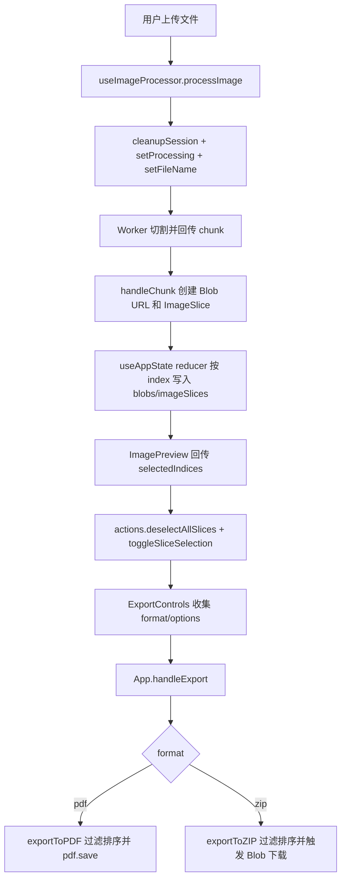

# Evidence Matrix

| 字段 | 证据与判断 |
|------|------------|
| Module Role | 「状态管理与导出」模块把长截图切割后的运行态数据沉淀为可预览、可选择、可导出的会话状态：`AppState` 同时保存 `blobs`、`objectUrls`、`originalImage`、`imageSlices`、`selectedSlices`、`isProcessing`、`splitHeight`、`fileName`，使上传处理、预览选择和导出之间共享同一份契约（`/tmp/Long_screenshot_splitting_tool/src/types/index.ts:11-28`）。去掉它，切片异步生成、选择集合、导出输入和资源清理会分散在组件中，难以保证顺序和生命周期一致性。 |
| Entry Points | 状态入口是 `useAppState()`，它通过 reducer 暴露 `state/actions/utils/getStateSnapshot`（`/tmp/Long_screenshot_splitting_tool/src/hooks/useAppState.ts:122-235`）。处理入口由 `useImageProcessor` 注入 actions，上传后清理旧会话、设置文件名、启动 worker，并在 chunk 回调中写入 blob 与 image slice（`/tmp/Long_screenshot_splitting_tool/src/hooks/useImageProcessor.ts:30-64`, `/tmp/Long_screenshot_splitting_tool/src/hooks/useImageProcessor.ts:91-130`）。导出入口在 `ExportControls` 收集格式、文件名、质量和所选切片后调用父级 `onExport`（`/tmp/Long_screenshot_splitting_tool/src/components/ExportControls.tsx:81-106`）。实际 App 路径中的父级 `handleExport` 调用 `exportToPDF/exportToZIP`（`/tmp/Long_screenshot_splitting_tool/src/App.tsx:224-264`）。 |
| Core Data Structures | 核心结构是 `ImageSlice { blob, url, index, width, height }` 与 `selectedSlices: Set<number>`：前者保留导出所需 Blob 和预览 URL，后者让选择语义以 index 集合表达，PDF/ZIP 工具再按 `slice.index` 过滤与排序（`/tmp/Long_screenshot_splitting_tool/src/types/index.ts:3-9`, `/tmp/Long_screenshot_splitting_tool/src/types/index.ts:19-20`, `/tmp/Long_screenshot_splitting_tool/src/utils/pdfExporter.ts:59-61`, `/tmp/Long_screenshot_splitting_tool/src/utils/zipExporter.ts:51-53`）。可持久化结构被有意收窄为 `splitHeight/fileName/language`，不持久化 Blob、URL 或 Worker（`/tmp/Long_screenshot_splitting_tool/src/utils/persistence.ts:3-7`）。 |
| Main Flow | 主流程是：上传文件 -> `useImageProcessor.processImage` 清理旧资源、设置 processing/fileName、启动 worker（`/tmp/Long_screenshot_splitting_tool/src/hooks/useImageProcessor.ts:91-130`）-> worker chunk 转为 Blob URL 和 `ImageSlice` 后写入 reducer（`/tmp/Long_screenshot_splitting_tool/src/hooks/useImageProcessor.ts:30-64`）-> reducer 按 index 写入 `blobs/imageSlices` 并维护 `objectUrls`（`/tmp/Long_screenshot_splitting_tool/src/hooks/useAppState.ts:38-60`）-> 预览组件回传选择数组，App/ScreenshotSplitter 转换为 `Set` 操作（`/tmp/Long_screenshot_splitting_tool/src/App.tsx:478-489`, `/tmp/Long_screenshot_splitting_tool/src/components/ScreenshotSplitter.tsx:92-105`）-> `ExportControls` 生成导出意图（`/tmp/Long_screenshot_splitting_tool/src/components/ExportControls.tsx:81-106`）-> `App.handleExport` 调用 PDF 或 ZIP exporter（`/tmp/Long_screenshot_splitting_tool/src/App.tsx:224-264`）。 |
| Cross-Module Dependencies | `useAppState` 依赖 `persistence` 读取和防抖保存用户偏好（`/tmp/Long_screenshot_splitting_tool/src/hooks/useAppState.ts:3-15`, `/tmp/Long_screenshot_splitting_tool/src/hooks/useAppState.ts:125-133`）；`useImageProcessor` 依赖状态 actions 作为图片处理到 UI/导出的写入端（`/tmp/Long_screenshot_splitting_tool/src/hooks/useImageProcessor.ts:5-16`）；`ExportControls` 依赖父组件传入 `selectedSlices/slices/onExport`，自身不直接依赖 exporter（`/tmp/Long_screenshot_splitting_tool/src/components/ExportControls.tsx:18-26`）；App 将 `state.imageSlices/state.selectedSlices` 传入 exporter，形成实际导出边界（`/tmp/Long_screenshot_splitting_tool/src/App.tsx:237-255`）。`ScreenshotSplitter` 的本地 `handleExport` 只记录日志，和 App 路径存在实现差异（`/tmp/Long_screenshot_splitting_tool/src/components/ScreenshotSplitter.tsx:107-115`）。 |
| Key Design Decisions | 决策 1：异步切片按 `index` 写入数组，而不是按 `img.onload` 到达顺序 push，避免预览和导出乱序；源码注释与测试都明确覆盖这个风险（`/tmp/Long_screenshot_splitting_tool/src/hooks/useAppState.ts:47-59`, `/tmp/Long_screenshot_splitting_tool/src/hooks/__tests__/useAppState.test.ts:18-49`）。决策 2：只持久化偏好，不持久化大对象，降低 localStorage 容量、序列化和隐私风险（`/tmp/Long_screenshot_splitting_tool/src/hooks/useAppState.ts:125-133`, `/tmp/Long_screenshot_splitting_tool/src/utils/persistence.ts:14-36`）。决策 3：导出 UI 与文件生成解耦，`ExportControls` 只表达意图，PDF/ZIP 由父级和工具类完成；这让 UI 可测试、导出器可复用，但也带来父级接线不一致风险（`/tmp/Long_screenshot_splitting_tool/src/components/ExportControls.tsx:81-106`, `/tmp/Long_screenshot_splitting_tool/src/App.tsx:224-264`, `/tmp/Long_screenshot_splitting_tool/src/components/ScreenshotSplitter.tsx:107-115`）。 |
| Risk Areas | 风险路径抽样见下表。核心风险不是 exporter 算法本身，而是状态索引、资源生命周期、父级接线和错误处理策略是否一致。 |
| Source Evidence | 主要源码锚点：`/tmp/Long_screenshot_splitting_tool/src/types/index.ts:3-42`、`/tmp/Long_screenshot_splitting_tool/src/hooks/useAppState.ts:14-235`、`/tmp/Long_screenshot_splitting_tool/src/hooks/useImageProcessor.ts:30-130`、`/tmp/Long_screenshot_splitting_tool/src/components/ExportControls.tsx:18-129`、`/tmp/Long_screenshot_splitting_tool/src/App.tsx:224-264`、`/tmp/Long_screenshot_splitting_tool/src/utils/pdfExporter.ts:51-138`、`/tmp/Long_screenshot_splitting_tool/src/utils/zipExporter.ts:44-106`、`/tmp/Long_screenshot_splitting_tool/src/utils/persistence.ts:3-79`。 |
| Open Questions | `ScreenshotSplitter` 是否仍是生产入口，还是历史/备用组件？它的 `onExport` 未接入 exporter，如果该组件仍被路由使用，导出按钮会只打日志不下载（`/tmp/Long_screenshot_splitting_tool/src/components/ScreenshotSplitter.tsx:107-115`）。`ExportControls` 传给父级的 `options.slices` 使用 `selectedSlices.map(index => slices[index])`，但 App 实际忽略该字段并直接使用 `state.imageSlices/state.selectedSlices`；若未来父级改用 `options.slices`，稀疏数组或 index 不等于数组下标时需要重新验证（`/tmp/Long_screenshot_splitting_tool/src/components/ExportControls.tsx:88-92`, `/tmp/Long_screenshot_splitting_tool/src/App.tsx:237-255`）。 |

## 风险路径抽样

| 风险类别 | 抽样对象 | 源码锚点 | 发现结果 | 对架构评价的影响 |
|----------|----------|----------|----------|------------------|
| 异步顺序/一致性 | `ADD_IMAGE_SLICE` 在 `img.onload` 异步回调后写入状态 | `/tmp/Long_screenshot_splitting_tool/src/hooks/useImageProcessor.ts:41-59`, `/tmp/Long_screenshot_splitting_tool/src/hooks/useAppState.ts:47-59`, `/tmp/Long_screenshot_splitting_tool/src/hooks/__tests__/useAppState.test.ts:18-49` | reducer 按 `slice.index` 写入数组，并有单测模拟先收到 index 1 再收到 index 0，验证数组下标与 `slice.index` 一致。 | 这是模块最关键的正确性设计：它承认浏览器图片加载回调可能乱序，用状态层保证导出与预览排序稳定。架构评价加分，因为该风险有源码注释和测试证据。 |
| 资源生命周期/缓存 | Blob URL 与 Worker 清理 | `/tmp/Long_screenshot_splitting_tool/src/hooks/useAppState.ts:89-112`, `/tmp/Long_screenshot_splitting_tool/src/hooks/useImageProcessor.ts:96-111`, `/tmp/Long_screenshot_splitting_tool/src/utils/zipExporter.ts:188-201` | `CLEANUP_SESSION` 遍历 `objectUrls` 并 revoke，同时终止 worker；原图临时 URL 在加载后 revoke；ZIP 下载 URL 延迟 revoke。 | 资源生命周期被集中在状态层和导出器内，减少泄漏概率。但 `ADD_BLOB` 只写 blob，不记录 URL；真正需要清理的是 `ADD_IMAGE_SLICE` 的 URL，这个契约依赖调用方最终一定触发 `addImageSlice`。 |
| 错误处理/部分失败 | PDF/ZIP 导出循环中的单切片失败 | `/tmp/Long_screenshot_splitting_tool/src/utils/pdfExporter.ts:96-127`, `/tmp/Long_screenshot_splitting_tool/src/utils/zipExporter.ts:61-77` | 单个切片处理失败只 `console.warn` 并 `continue`，最终仍保存 PDF/ZIP；只有无选择或外层异常才抛错。 | 这是偏可用性的取舍：用户可能拿到部分成功的文件，但 UI 没有反馈缺失了哪些切片。对架构评价的影响是“容错有了，结果完整性契约不足”。 |
| 父级接线一致性 | `ExportControls.onExport` 的不同父级实现 | `/tmp/Long_screenshot_splitting_tool/src/App.tsx:224-264`, `/tmp/Long_screenshot_splitting_tool/src/components/ScreenshotSplitter.tsx:107-115`, `/tmp/Long_screenshot_splitting_tool/src/components/ScreenshotSplitter.tsx:237-247` | App 路径会真实调用 exporter；ScreenshotSplitter 路径只记录 `Export requested`。 | 导出 UI 和导出实现解耦本身合理，但当前存在两个父级接线语义。若 `ScreenshotSplitter` 是有效入口，模块边界会从“解耦”退化为“未完成集成”。 |
| 配置加载/持久化 | localStorage 读取与写入 | `/tmp/Long_screenshot_splitting_tool/src/utils/persistence.ts:14-36`, `/tmp/Long_screenshot_splitting_tool/src/utils/persistence.ts:67-79`, `/tmp/Long_screenshot_splitting_tool/src/hooks/useAppState.ts:125-149` | `loadState/saveState` 捕获异常并降级为 null/警告；`splitHeight/fileName` 变化会防抖保存；语言偏好通过辅助函数合并保存。 | 偏好持久化不会阻断核心切割/导出流程，符合浏览器端工具“失败可降级”的设计。但没有 schema 校验，损坏或旧版本 JSON 只会按解析结果直接进入初始状态。 |
| 插件/扩展点 | PDF/ZIP 导出器配置对象 | `/tmp/Long_screenshot_splitting_tool/src/utils/pdfExporter.ts:7-32`, `/tmp/Long_screenshot_splitting_tool/src/utils/zipExporter.ts:7-29`, `/tmp/Long_screenshot_splitting_tool/src/utils/pdfExporter.ts:183-195`, `/tmp/Long_screenshot_splitting_tool/src/utils/zipExporter.ts:204-210` | exporter 支持构造时配置和 `updateOptions/getOptions`，但 App 快捷函数使用默认 exporter，未把 `ExportControls` 中的质量、PDF 页面选项、ZIP 压缩选项完整映射进去。 | 扩展点在工具层存在，但 UI 到工具的配置传递不完整，说明当前架构更像“先铺接口”，还不是完全闭环的导出配置系统。 |
| 权限与安全边界 | 浏览器下载与本地文件名 | `/tmp/Long_screenshot_splitting_tool/src/utils/zipExporter.ts:188-201`, `/tmp/Long_screenshot_splitting_tool/src/utils/pdfExporter.ts:130-132`, `/tmp/Long_screenshot_splitting_tool/src/App.tsx:233-251` | 导出通过浏览器 Blob URL 或 jsPDF `save` 触发下载，没有服务器上传路径；文件名来自 UI options，源码未看到额外清洗。 | 安全边界主要在浏览器沙箱内，权限风险低于后端导出；但文件名规范化不足可能带来跨平台文件名体验问题。 |
| generated/vendor/test 边界 | 本模块候选文件与测试 | `/tmp/Long_screenshot_splitting_tool/src/hooks/__tests__/useAppState.test.ts:1-49` | 没有读取 generated/vendor 目录作为核心证据；只抽样了与状态顺序强相关的单测。 | 对本模块来说 generated/vendor 不适用：导出依赖 `jsPDF/JSZip` 是第三方库调用边界，不需要展开 vendor 源码；测试边界适用且提供了关键风险验证。 |

## 叙事分析

### 1. 模块角色：把“异步切割结果”变成“可导出的稳定会话”

这个模块存在的原因，不是简单保存几个 React state，而是把浏览器端长截图工具最容易失控的三件事收敛到一个会话模型里：异步切片的到达顺序、用户选择集合、Blob URL/Worker 的生命周期。`AppState` 把处理态、图片态、选择态和元数据放在同一结构中（`/tmp/Long_screenshot_splitting_tool/src/types/index.ts:11-28`），`useAppState` 再通过 reducer 和 action creators 统一更新（`/tmp/Long_screenshot_splitting_tool/src/hooks/useAppState.ts:32-119`, `/tmp/Long_screenshot_splitting_tool/src/hooks/useAppState.ts:151-235`）。

Why：长截图切割是异步管线，worker 产出 blob、浏览器加载图片获取尺寸、用户再选择导出。如果每个组件各自维护局部状态，导出阶段很容易拿到乱序、过期或未清理的资源。集中状态的代价是 `AppState` 会变胖，并包含 Worker、Blob、HTMLImageElement 这类不可序列化对象；项目通过只持久化 `splitHeight/fileName/language` 来控制这个代价（`/tmp/Long_screenshot_splitting_tool/src/utils/persistence.ts:3-7`, `/tmp/Long_screenshot_splitting_tool/src/hooks/useAppState.ts:125-133`）。

### 2. 核心数据结构与边界

模块的核心契约是 `ImageSlice` 和 `selectedSlices`。`ImageSlice` 保存导出实际需要的 `blob`，也保存预览使用的 `url`、排序/选择使用的 `index`、PDF 排版使用的尺寸（`/tmp/Long_screenshot_splitting_tool/src/types/index.ts:3-9`）。`selectedSlices` 用 `Set<number>` 表达选择状态，避免重复选择，并让导出工具以 index 过滤目标切片（`/tmp/Long_screenshot_splitting_tool/src/types/index.ts:19-20`, `/tmp/Long_screenshot_splitting_tool/src/utils/pdfExporter.ts:59-61`, `/tmp/Long_screenshot_splitting_tool/src/utils/zipExporter.ts:51-53`）。

Trade-off：`Set<number>` 很适合 reducer 内部表达选择，但 React props 和 JSON 调试输出通常更偏向数组，所以 App/ScreenshotSplitter 多次在 `Set` 与 `Array` 之间转换（`/tmp/Long_screenshot_splitting_tool/src/App.tsx:450-455`, `/tmp/Long_screenshot_splitting_tool/src/App.tsx:478-489`, `/tmp/Long_screenshot_splitting_tool/src/components/ScreenshotSplitter.tsx:92-105`, `/tmp/Long_screenshot_splitting_tool/src/components/ScreenshotSplitter.tsx:237-247`）。这种设计保持了状态层的语义正确，但增加了边界处“index 是 slice.index 还是数组下标”的认知成本。

关键类型片段如下，只保留理解设计必需的字段：

```ts
export interface ImageSlice {
  blob: Blob;
  url: string;
  index: number;
  width: number;
  height: number;
}

export interface AppState {
  blobs: Blob[];
  objectUrls: string[];
  originalImage: HTMLImageElement | null;
  imageSlices: ImageSlice[];
  selectedSlices: Set<number>;
  isProcessing: boolean;
  splitHeight: number;
  fileName: string;
}
```

来源：`/tmp/Long_screenshot_splitting_tool/src/types/index.ts:3-28`。

### 3. 主流程：状态层托底，导出层消费



How：上传后，`processImage` 先清理旧会话，再设置处理状态和文件名，随后创建原图对象 URL、创建 worker 并按当前 `splitHeight` 开始处理（`/tmp/Long_screenshot_splitting_tool/src/hooks/useImageProcessor.ts:91-130`）。每个 chunk 到达后，`handleChunk` 将 blob 写入状态，创建 Object URL，再等 `img.onload` 拿到自然尺寸后构造 `ImageSlice`（`/tmp/Long_screenshot_splitting_tool/src/hooks/useImageProcessor.ts:30-64`）。状态 reducer 对 `ADD_BLOB` 和 `ADD_IMAGE_SLICE` 都按 index 写入数组，其中 `ADD_IMAGE_SLICE` 还记录 URL 供后续清理（`/tmp/Long_screenshot_splitting_tool/src/hooks/useAppState.ts:38-60`）。

导出阶段，`ExportControls` 并不生成文件，而是把 `format/exportOptions/selectedSlices/slices` 交给父组件（`/tmp/Long_screenshot_splitting_tool/src/components/ExportControls.tsx:81-106`）。实际 App 路径中的父组件再把 `state.imageSlices` 和 `state.selectedSlices` 交给 PDF/ZIP 工具（`/tmp/Long_screenshot_splitting_tool/src/App.tsx:224-264`）。PDF/ZIP 工具都先过滤并按 index 排序，再分别执行 PDF 排版保存或 ZIP 打包下载（`/tmp/Long_screenshot_splitting_tool/src/utils/pdfExporter.ts:51-138`, `/tmp/Long_screenshot_splitting_tool/src/utils/zipExporter.ts:44-106`）。

### 4. 跨模块依赖与协作方式

状态模块是图片处理、预览、导航和导出的共享契约。`useImageProcessor` 不直接操作 React 组件，而是通过注入的 actions 写入状态，这使 worker 管线和 UI 组件之间保持低耦合（`/tmp/Long_screenshot_splitting_tool/src/hooks/useImageProcessor.ts:5-16`）。`ImagePreview` 只处理数组形式的选择变化，App 再把它映射回 reducer 的 `Set` 操作（`/tmp/Long_screenshot_splitting_tool/src/App.tsx:478-489`）。`ExportControls` 只依赖 `selectedSlices/slices/onExport` props，不知道 AppState 的完整结构，也不知道 PDF/ZIP 的具体实现（`/tmp/Long_screenshot_splitting_tool/src/components/ExportControls.tsx:18-26`）。

Why：这种协作方式符合前端工具型应用常见的“状态中心 + 无状态业务控件 + 工具函数导出”架构。它的好处是各层可以分别测试：状态顺序测试在 `useAppState` 单测里完成（`/tmp/Long_screenshot_splitting_tool/src/hooks/__tests__/useAppState.test.ts:18-49`），导出 UI 测试可以 mock `onExport`（搜索结果显示 `src/components/__tests__/ExportControls.test.tsx` 覆盖该组件，未作为核心结论展开）。代价是父级接线成为架构关键点：App 接线完整，`ScreenshotSplitter` 接线未完成或仅用于调试（`/tmp/Long_screenshot_splitting_tool/src/App.tsx:224-264`, `/tmp/Long_screenshot_splitting_tool/src/components/ScreenshotSplitter.tsx:107-115`）。

### 5. 关键设计决策与权衡

**决策一：用 reducer 集中会话状态。**  
`useAppState` 把 worker、blob、URL、原图、切片、选择、处理状态和元数据放入一个 reducer 管理（`/tmp/Long_screenshot_splitting_tool/src/hooks/useAppState.ts:32-119`）。这比多个 `useState` 更适合该场景，因为每个 action 都对应一个业务事件：chunk 到达、选择切换、处理完成、会话清理。替代方案是把状态拆散到上传、预览、导出组件，但那会让资源清理和选择一致性跨组件传播。

**决策二：按 index 写入，抵抗异步乱序。**  
`ADD_IMAGE_SLICE` 明确注释“按 index 写入，而非按异步到达顺序 push”，并将 `newImageSlices[action.payload.index] = action.payload` 作为稳定排序机制（`/tmp/Long_screenshot_splitting_tool/src/hooks/useAppState.ts:47-59`）。单测用乱序到达验证这个设计（`/tmp/Long_screenshot_splitting_tool/src/hooks/__tests__/useAppState.test.ts:18-49`）。这是本模块最有价值的架构细节：排序不交给 UI 或 exporter 补救，而是在状态写入时保证数组位置语义。

**决策三：偏好持久化与会话资源分离。**  
初始状态从 localStorage 加载 `splitHeight/fileName`，但 `worker/blobs/objectUrls/originalImage/imageSlices/selectedSlices/isProcessing` 每次会话重建（`/tmp/Long_screenshot_splitting_tool/src/hooks/useAppState.ts:13-27`）。`useEffect` 只防抖保存 `splitHeight/fileName`（`/tmp/Long_screenshot_splitting_tool/src/hooks/useAppState.ts:125-133`）。这避免把 Blob 和 Object URL 这类浏览器运行态资源塞进 localStorage，也避免恢复后拿到失效 URL。代价是刷新页面后不会恢复已切割结果，用户需要重新上传。

**决策四：导出 UI 和导出实现解耦。**  
`ExportControls` 自己维护格式、质量、文件名等 UI 状态，并通过 `onExport` 交给父级（`/tmp/Long_screenshot_splitting_tool/src/components/ExportControls.tsx:55-79`, `/tmp/Long_screenshot_splitting_tool/src/components/ExportControls.tsx:81-106`）。这使组件可复用，也让 PDF/ZIP 逻辑集中在工具类（`/tmp/Long_screenshot_splitting_tool/src/utils/pdfExporter.ts:37-56`, `/tmp/Long_screenshot_splitting_tool/src/utils/zipExporter.ts:34-49`）。但当前 App 快捷导出没有把 `ExportControls` 的高级配置完整传入 exporter，只使用文件名和 format（`/tmp/Long_screenshot_splitting_tool/src/App.tsx:233-255`），所以“高级选项”在源码证据下只能算 UI 层能力，不能确定为完整导出能力。

### 6. PDF/ZIP 导出器的工程取舍

PDF exporter 的策略是把每个选中 slice 的 blob 转为 base64，再按页面内容区计算缩放尺寸，最后 `pdf.addImage` 和 `pdf.save`（`/tmp/Long_screenshot_splitting_tool/src/utils/pdfExporter.ts:96-132`, `/tmp/Long_screenshot_splitting_tool/src/utils/pdfExporter.ts:144-180`）。ZIP exporter 的策略是逐个生成文件名、可选格式转换、加入 JSZip，再生成 Blob 并触发下载（`/tmp/Long_screenshot_splitting_tool/src/utils/zipExporter.ts:61-106`, `/tmp/Long_screenshot_splitting_tool/src/utils/zipExporter.ts:140-201`）。

Trade-off：两个 exporter 都选择“单切片失败继续导出”的容错策略（`/tmp/Long_screenshot_splitting_tool/src/utils/pdfExporter.ts:124-127`, `/tmp/Long_screenshot_splitting_tool/src/utils/zipExporter.ts:73-76`）。这对普通用户友好，因为一个坏切片不会导致全部失败；但它没有把失败切片列表返回 UI，用户可能以为导出完整。若重新设计，我会让 exporter 返回结构化结果 `{saved: true, skipped: [...]}`，父级决定是否提示，而不是仅在 console 中记录。

### 7. 亮点、风险点与改进建议

亮点是状态层对异步乱序有明确防线，并且有测试覆盖；这是比“能跑通 happy path”更成熟的工程判断（`/tmp/Long_screenshot_splitting_tool/src/hooks/useAppState.ts:47-59`, `/tmp/Long_screenshot_splitting_tool/src/hooks/__tests__/useAppState.test.ts:18-49`）。资源生命周期也有集中清理：会话重置时 revoke 所有 Object URL 并 terminate worker（`/tmp/Long_screenshot_splitting_tool/src/hooks/useAppState.ts:89-112`）。

主要风险是导出链路存在两个父级语义：App 路径真实导出，ScreenshotSplitter 路径只日志（`/tmp/Long_screenshot_splitting_tool/src/App.tsx:224-264`, `/tmp/Long_screenshot_splitting_tool/src/components/ScreenshotSplitter.tsx:107-115`）。如果 `ScreenshotSplitter` 是旧入口，这只是技术债；如果它仍被使用，就是用户可见缺陷。第二个风险是 UI 配置没有完整映射到 exporter：`ExportControls` 维护 `quality/pdfOptions/zipOptions`（`/tmp/Long_screenshot_splitting_tool/src/components/ExportControls.tsx:66-79`），但 App 只读取 `options?.filename`（`/tmp/Long_screenshot_splitting_tool/src/App.tsx:233-255`）。第三个风险是持久化缺少 schema 校验，`JSON.parse` 后的对象直接进入初始状态（`/tmp/Long_screenshot_splitting_tool/src/utils/persistence.ts:26-36`, `/tmp/Long_screenshot_splitting_tool/src/hooks/useAppState.ts:25-26`）。

### 8. 开放问题与限制

1. `ScreenshotSplitter` 的入口地位需要主 agent 交叉验证。当前证据只能确认它包含一个未接入 exporter 的 `handleExport`，不能确定它是否处在生产路由中（`/tmp/Long_screenshot_splitting_tool/src/components/ScreenshotSplitter.tsx:107-115`, `/tmp/Long_screenshot_splitting_tool/src/components/ScreenshotSplitter.tsx:237-247`）。
2. `ExportControls` 的高级导出配置是否有后续计划或遗漏实现，当前源码不足以确定。证据显示 UI 保存了质量、PDF、ZIP 配置，但 App 实际只使用文件名（`/tmp/Long_screenshot_splitting_tool/src/components/ExportControls.tsx:66-79`, `/tmp/Long_screenshot_splitting_tool/src/App.tsx:233-255`）。
3. `loadState()` 没有结构校验，损坏 localStorage 的实际用户影响需要运行时验证；源码只能支持“存在降级 catch，但没有 schema 校验”的判断（`/tmp/Long_screenshot_splitting_tool/src/utils/persistence.ts:26-36`）。
4. 本草稿没有展开导航守卫、移动缓存、SEO、i18n 等相邻模块；它们只作为导出与状态的调用背景出现。若最终报告要评价完整应用架构，需要由主 agent 在交叉验证阶段补齐。

### 9. 源码锚点清单

| 结论 | 锚点位置 | 锚点类型 |
|------|----------|----------|
| AppState 是状态与导出的共享会话模型 | `/tmp/Long_screenshot_splitting_tool/src/types/index.ts:11-28` | 类型定义 |
| useAppState 通过 reducer/action creators 管理状态 | `/tmp/Long_screenshot_splitting_tool/src/hooks/useAppState.ts:32-119`, `/tmp/Long_screenshot_splitting_tool/src/hooks/useAppState.ts:151-235` | 状态实现 |
| 持久化只覆盖偏好，不覆盖 Blob/URL/Worker | `/tmp/Long_screenshot_splitting_tool/src/utils/persistence.ts:3-7`, `/tmp/Long_screenshot_splitting_tool/src/hooks/useAppState.ts:125-133` | 持久化实现 |
| 切片乱序通过按 index 写入修复 | `/tmp/Long_screenshot_splitting_tool/src/hooks/useAppState.ts:47-59`, `/tmp/Long_screenshot_splitting_tool/src/hooks/__tests__/useAppState.test.ts:18-49` | 核心逻辑 + 测试 |
| 图片处理管线向状态层写入 blob 和 ImageSlice | `/tmp/Long_screenshot_splitting_tool/src/hooks/useImageProcessor.ts:30-64`, `/tmp/Long_screenshot_splitting_tool/src/hooks/useImageProcessor.ts:91-130` | 跨模块调用 |
| ExportControls 是导出意图收集器 | `/tmp/Long_screenshot_splitting_tool/src/components/ExportControls.tsx:18-26`, `/tmp/Long_screenshot_splitting_tool/src/components/ExportControls.tsx:81-106` | UI 边界 |
| App 是实际 PDF/ZIP 导出的父级接线 | `/tmp/Long_screenshot_splitting_tool/src/App.tsx:224-264`, `/tmp/Long_screenshot_splitting_tool/src/App.tsx:450-455`, `/tmp/Long_screenshot_splitting_tool/src/App.tsx:519-525` | 应用集成 |
| ScreenshotSplitter 的导出处理未调用 exporter | `/tmp/Long_screenshot_splitting_tool/src/components/ScreenshotSplitter.tsx:107-115`, `/tmp/Long_screenshot_splitting_tool/src/components/ScreenshotSplitter.tsx:237-247` | 风险/开放问题 |
| PDF/ZIP exporter 都按选择集合过滤并按 index 排序 | `/tmp/Long_screenshot_splitting_tool/src/utils/pdfExporter.ts:59-61`, `/tmp/Long_screenshot_splitting_tool/src/utils/zipExporter.ts:51-53` | 导出实现 |
| 单切片导出失败会跳过并继续 | `/tmp/Long_screenshot_splitting_tool/src/utils/pdfExporter.ts:124-127`, `/tmp/Long_screenshot_splitting_tool/src/utils/zipExporter.ts:73-76` | 风险路径 |
