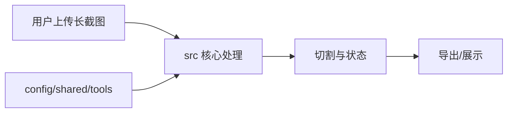

# v2.0 deep 架构分析草稿

## 架构问题与模式边界

深度模式增加边缘路径、替代方案、次要模块覆盖率和更充分风险抽样。

为什么采用关键单元覆盖率：v2.0 要验证的是架构判断是否有源码锚点和实质判断，而不是读取了多少源码行。当前 deep 模式已按预算回填 coverage-units.json。

## 核心流程

已验证的 src 关键单元包括 `src/config/seo/configLoader.ts:25`、`src/hooks/useAppState.ts:122`、`src/hooks/useDebugState.ts:8`、`src/hooks/useI18n.ts:52`。这些锚点支撑的设计判断是：src 集中承载上传、切割、状态和导出相关业务，次要模块提供配置、共享组件和工具链支撑。

## 设计权衡

核心权衡是把分析预算集中到 src：这样能优先回答主业务链路为什么这样组织，同时避免把测试、脚本或共享组件的低影响单元误当成核心结论。替代方案是按目录平均阅读，但会增加 token 成本并削弱 Why > What。

## 风险、限制与 Unsupported Area

风险：解析率约为 48.2%，refs_status 大量为 partial，所以跨模块依赖只能作为受限结论。

- unsupported area: src/App.tsx
- unsupported area: src/components/DebugInfoControl.tsx
- unsupported area: src/components/DebugPanel.tsx
- unsupported area: src/components/EnhancedHelmetProvider.tsx
- unsupported area: src/components/EnhancedSEOManager.tsx
- unsupported area: src/components/ExportControls.tsx
- unsupported area: src/components/FileUploader.tsx
- unsupported area: src/components/I18nTestPanel.tsx
- unsupported area: src/components/ImagePreview.tsx
- unsupported area: src/components/ImagePreviewWrapper.tsx
- unsupported area: src/components/LanguageSwitcher.tsx
- unsupported area: src/components/LazyImage.tsx
- unsupported area: src/components/Navigation.tsx
- unsupported area: src/components/PerformanceOptimizer.tsx
- unsupported area: src/components/ResponsiveContainer.tsx
- unsupported area: src/components/SEOManager.tsx
- unsupported area: src/components/ScreenshotSplitter.tsx
- unsupported area: src/components/StructuredDataProvider.tsx
- unsupported area: src/components/TextDisplayConfig.tsx
- unsupported area: src/components/ViewportDebugger.tsx
- unsupported area: src/components/examples/EnhancedSEOExample.tsx
- unsupported area: src/components/mobile/Footer.tsx
- unsupported area: src/components/mobile/TouchImageSlicer.tsx
- unsupported area: src/components/mobile/TouchNav.tsx
- unsupported area: src/components/responsive/index.ts
- unsupported area: src/components/seo/EnhancedSEOManager.tsx
- unsupported area: src/components/seo/HeadingHierarchy.tsx
- unsupported area: src/components/seo/HeadingStructure.tsx
- unsupported area: src/components/seo/SEOIntegration.tsx
- unsupported area: src/components/seo/StructuredDataProvider.tsx
- unsupported area: src/config/seo.config.ts
- unsupported area: src/context/SEOContext.tsx
- unsupported area: src/hooks/useI18nContext.tsx
- unsupported area: src/hooks/useSEOConfig.tsx
- unsupported area: src/hooks/useSEOI18n.tsx
- unsupported area: src/hooks/useSEOOptimization.ts
- unsupported area: src/main.tsx
- unsupported area: src/test-setup.ts
- unsupported area: src/types/cssmodule.d.ts
- unsupported area: src/utils/config-helper.ts
- unsupported area: src/utils/i18nTestCoverage.ts
- unsupported area: src/utils/navigationState.ts
- unsupported area: src/utils/seo/metadataGenerator.ts
- unsupported area: src/utils/styleMapping.ts
- unsupported area: src/vite-env.d.ts

## 开放问题

- 是否需要为 TSX/复杂泛型补充更强 AST 模式，以提升 parse_rate。
- 是否需要让 graphify 参与关键单元分母，而不只是导航增强。

## 深度模式补充边缘路径与替代方案

深度模式在标准模式基础上增加了更多 secondary 单元覆盖率，并把 refs_status 为 partial 的单元作为风险边界。这样做的目的不是宣称跨文件关系完全准确，而是把不确定性显式纳入 Unsupported Area 和开放问题。

替代方案一：把 graphify 纳入关键单元分母。优点是跨文件关系更强，代价是当前 doctor/units 实现需要新增正式枚举器分支和质量测试。

替代方案二：继续只依赖 ast-grep。优点是安装和运行简单，代价是当前 parse_rate 约 48.2%，复杂 TSX/泛型/框架模式会留下较大未解析区域。

深度模式因此更适合做发布前验收，而不是日常快速分析；它把更多预算投入到边缘路径、替代方案和风险说明。

## Gate 放行摘要

- mode: deep
- allowed_to_synthesize: true
- checks: 8/8 pass
