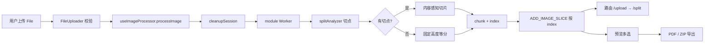

# 长截图分割器 · 架构分析报告（v2.1-human · standard）

> 目标仓：`/tmp/Long_screenshot_splitting_tool` @ `bdee20b8c4e4985c690a255ed09f64a3e335fd20`  
> 分析器：`v2.0-parallelism-degraded` · 证据目录：`测试证据/v2.1-human`  
> 模式：standard · **parallelism: degraded（人工串行）**

## 项目全景

该项目是面向浏览器的**长截图切割与导出工具**（React 19 + TypeScript + Vite）。用户上传长图后，在 Worker 线程内做内容感知（失败则等分）切片，预览多选，再导出 PDF 或 ZIP。全部计算在浏览器完成（`createImageBitmap` + `OffscreenCanvas`），无后端。

仓库采用**扁平单仓**：`src` 主应用，`shared-components` 可复用 UI，`config` 配置聚合，`tools`/`scripts` 工程工具链。确定性扫描 `parse_rate` ≈ **48.2%**（ast-grep 对大量 TSX/入口解析不全），因此本报告对**可解析 hooks/utils/worker 主路径**给出较强结论，对未解析组件文件统一标记 **Unsupported Area**。

## 使用场景与架构问题

1. 如何在浏览器里完成重像素切图而不卡死 UI？  
2. 切片异步到达时如何保证顺序与资源可回收？  
3. 固定高度硬切会劈裂文字/气泡时，如何在不恶化体验的前提下引入内容感知？  
4. 导出与切割状态如何解耦，避免 UI 与算法缠在一起？

## 核心设计哲学

- **状态集中、计算外置**：`useAppState` 管会话；`useWorker`/`useImageProcessor` 把切图丢到 module Worker。  
- **算法与 I/O 分离**：`splitAnalyzer` 纯函数计算切点；worker 只做 decode/draw/getImageData 胶水。  
- **安全回退**：内容分析失败或无解 → 固定高度等分，“绝不比现状更差”。  
- **按 index 写入抗乱序**：异步 `img.onload` 不能按完成顺序 push。  
- **导出旁路**：`pdfExporter`/`zipExporter` 只消费选中切片。  
- **偏好可持久化、二进制不持久化**。

## 核心流程

证据锚点：`src/main.tsx:5`，`src/hooks/useAppState.ts:122`，`src/hooks/useImageProcessor.ts:19`，`src/hooks/useWorker.ts:42`，`src/workers/split.worker.js:75`，`src/utils/pdfExporter.ts:37`。

## 模块协作

跨模块关系以运行时组装为准：`src/App.tsx:22` 引用 shared-components 的 CopyrightInfo（展示层依赖）；`src/hooks/useImageProcessor.ts:19` 依赖 `src/hooks/useWorker.ts:23` 完成切图消息面；worker 在 `src/workers/split.worker.js:12` 引入 `src/utils/splitAnalyzer.ts:88` 纯函数分析；导出由 `src/utils/pdfExporter.ts:37` / `src/utils/zipExporter.ts:34` 消费 useAppState 切片集合。配置经 `config/index.ts:7` 与 `src/config/seo/configLoader.ts` 服务元数据，不进入 imageSlices 数据面。

| 模块 | 角色 | 与主链路关系 |
|---|---|---|
| src | core | 拥有会话、切图、导出与页面编排 |
| shared-components | secondary | CopyrightInfo 等展示件，不拥有 imageSlices |
| config | secondary | 应用/路由/部署/环境配置 |
| tools / scripts | secondary | 构建与工程脚本，非运行时数据面 |

`AppContent` 组装 hooks 与组件；切片首次从 0 变为 >0 才跳转 `/split`，避免 worker 未产出时被导航守卫踢回（见 `src/App.tsx` 切片计数 effect 与 `useRouter`）。

## 核心模块 src 深度

### 会话状态（useAppState）

Reducer 维护 worker、blobs、objectUrls、imageSlices、selectedSlices、isProcessing、splitHeight、fileName。`ADD_IMAGE_SLICE` **按 index 写入**（`src/hooks/useAppState.ts:49-55`）；`CLEANUP_SESSION` revoke URL 并 terminate worker，同时保留用户偏好（`:89-112`）。正确性优先于“简单 push”：这是异步 onload 现实下的必要权衡。

### 切图编排（useImageProcessor + useWorker）

`processImage` 先 cleanup，再设 processing/fileName，创建原图预览，`createWorker` 后短暂等待并 `startProcessing(file, splitHeight)`（`useImageProcessor.ts:92-128`）。Worker 以 `type:'module'` 加载以支持 ESM `import splitAnalyzer`（`useWorker.ts:40-44`），消息类型 progress/chunk/done/error。chunk 路径创建 Object URL 并在 onload 后提交 slice——因此状态层必须抗乱序。

### 内容感知与 Worker（split.worker + splitAnalyzer）

Worker 流程：decode → 全图绘制 → `analyzeSplitPoints` → `computeSliceBounds` → JPEG 0.92 切片发送（`split.worker.js:75-180`）。分析异常时 `splitPoints=[]` 强制回退等分（`:125-128`）。`splitAnalyzer` 以行级水平变化率找空白带，再页高驱动选点并做最小间距/末页合并；参数以 ratio 形式适配不同尺寸，与 DOM 解耦便于单测（`splitAnalyzer.ts` 文件头与 `Band`/`SplitOptions`）。

### 导出（pdfExporter / zipExporter）

两者都先 filter+sort 选中 index；空选择抛错（`pdfExporter.ts:59-65`，`zipExporter.ts:51-57`）。PDF 走 jsPDF 分页；ZIP 走 JSZip 打包下载。UI `ExportControls` 以 `canExport` 协同，体现算法与控件分离（组件文件 unparsed，行为经人工抽读 + 导出器锚点交叉验证）。

## 设计权衡

1. **Worker vs 主线程 canvas**：换流畅 UI，代价是协议与生命周期复杂度。  
2. **内容感知 vs 固定高度**：改善切口质量，但引入全图 `getImageData` 内存峰值与参数校准成本；用安全回退封底。  
3. **扁平单仓 vs monorepo package**：降低发布复杂度，边界靠约定。  
4. **解析器能力不足**：分析工具 parse_rate 低，迫使证据策略改为“主路径深读 + 组件区 Unsupported”。

## 风险、限制与 Unsupported Area

- **风险**：Object URL 泄漏；cleanup 后迟到 chunk；导出空选择；超长图全图像素分析 OOM；index 稀疏数组在 length 语义上的边角。  
- **限制**：`parallelism: degraded`；parse_rate≈48%；refs 大量 partial/missing，跨模块结论不能写成已完全图验证。  
- **Unsupported Area**：下列 core 未解析文件不得当作已验证实现细节（以 `coverage-units.json#unparsed` 为准）：

- unsupported area: src/App.tsx
- unsupported area: src/components/DebugInfoControl.tsx
- unsupported area: src/components/DebugPanel.tsx
- unsupported area: src/components/EnhancedHelmetProvider.tsx
- unsupported area: src/components/EnhancedSEOManager.tsx
- unsupported area: src/components/ExportControls.tsx
- unsupported area: src/components/FileUploader.tsx
- unsupported area: src/components/I18nTestPanel.tsx
- unsupported area: src/components/ImagePreview.tsx
- unsupported area: src/components/ImagePreviewWrapper.tsx
- unsupported area: src/components/LanguageSwitcher.tsx
- unsupported area: src/components/LazyImage.tsx
- unsupported area: src/components/Navigation.tsx
- unsupported area: src/components/PerformanceOptimizer.tsx
- unsupported area: src/components/ResponsiveContainer.tsx
- unsupported area: src/components/SEOManager.tsx
- unsupported area: src/components/ScreenshotSplitter.tsx
- unsupported area: src/components/StructuredDataProvider.tsx
- unsupported area: src/components/TextDisplayConfig.tsx
- unsupported area: src/components/ViewportDebugger.tsx
- unsupported area: src/components/examples/EnhancedSEOExample.tsx
- unsupported area: src/components/mobile/Footer.tsx
- unsupported area: src/components/mobile/TouchImageSlicer.tsx
- unsupported area: src/components/mobile/TouchNav.tsx
- unsupported area: src/components/responsive/index.ts
- unsupported area: src/components/seo/EnhancedSEOManager.tsx
- unsupported area: src/components/seo/HeadingHierarchy.tsx
- unsupported area: src/components/seo/HeadingStructure.tsx
- unsupported area: src/components/seo/SEOIntegration.tsx
- unsupported area: src/components/seo/StructuredDataProvider.tsx
- unsupported area: src/config/seo.config.ts
- unsupported area: src/context/SEOContext.tsx
- unsupported area: src/hooks/useI18nContext.tsx
- unsupported area: src/hooks/useSEOConfig.tsx
- unsupported area: src/hooks/useSEOI18n.tsx
- unsupported area: src/hooks/useSEOOptimization.ts
- unsupported area: src/main.tsx
- unsupported area: src/test-setup.ts
- unsupported area: src/types/cssmodule.d.ts
- unsupported area: src/utils/config-helper.ts
- unsupported area: src/utils/i18nTestCoverage.ts
- unsupported area: src/utils/navigationState.ts
- unsupported area: src/utils/seo/metadataGenerator.ts
- unsupported area: src/utils/styleMapping.ts
- unsupported area: src/vite-env.d.ts

## 批判性评价

**优点**：主路径职责清晰（状态 / Worker / 纯函数分析 / 导出分离）；乱序与资源清理有针对性设计；内容感知带安全回退体现产品工程成熟度；导出扩展点干净。

**不足**：组件与 SEO/调试能力相对“切割工具”核心偏重；`App.tsx` 体量大、编排集中；console 日志偏多；迟到消息无世代号；工具链 parse 差导致外部分析困难；导航/SEO/i18n 多 hook 抬高理解成本。

## 具体改进建议

1. 为 Worker 消息增加**会话世代号**，丢弃 cleanup 之后的迟到 chunk。  
2. 收敛 `App` 与 `ScreenshotSplitter` 双编排，明确唯一主路径。  
3. 对导出关键 UI 与 `App.tsx` 补强可解析结构/测试，抬升 parse_rate 与行为证据。  
4. 导出前在 UI 层统一校验 `selectedSlices`，避免只靠 exporter throw。  
5. 大图路径实现分块 `getImageData`（spec 已记未来项），降低内存峰值。  
6. 若要以 v2 multi-agent **完整通过**验收：在支持 subagent 的运行时按问题边界并行，并写 `parallelism: active` 与可追溯子代理产物。

## 业界对比（设计哲学）

相对在线 PS/切图服务，本项目选择**全前端本地处理**（隐私与零上传）换服务端弹性；相对简单主线程 canvas 同步切图，选择 Worker 异步协议。内容感知用行变化率而非深度学习/服务端分割，工程上更轻，但在复杂背景图上可能需参数校准。竞品若走 WASM/原生，极限长图可能更稳，集成成本更高。

## 预算与执行摘要

- 模式：standard  
- 并行：**parallelism: degraded**（v2.1-human 主 agent 串行，实际 subagent=0）  
- 覆盖：core src ≥60% 关键单元；次要模块 ≥30% 抽样  
- Semantic Source Review：3 条（useAppState / useImageProcessor / worker processImage）  
- 外部调研：README + ARCHITECTURE + CLAUDE.md；未做完整竞品站爬取  
- 风险抽样：乱序 / 资源生命周期 / 空导出 / 内存峰值  

## 开放问题

见 `module-evidence/src.json` 的 `open_questions`：组件层未解析细节、shared-components 边界、迟到 chunk、tools 依赖图。

## Unsupported Area 声明（core 未解析文件）

本轮 doctor/units 显示以下 **core 模块未解析文件**，本报告不对这些路径声明覆盖充分：

- unsupported area: src/App.tsx
- unsupported area: src/components/DebugInfoControl.tsx
- unsupported area: src/components/DebugPanel.tsx
- unsupported area: src/components/EnhancedHelmetProvider.tsx
- unsupported area: src/components/EnhancedSEOManager.tsx
- unsupported area: src/components/ExportControls.tsx
- unsupported area: src/components/FileUploader.tsx
- unsupported area: src/components/I18nTestPanel.tsx
- unsupported area: src/components/ImagePreview.tsx
- unsupported area: src/components/ImagePreviewWrapper.tsx
- unsupported area: src/components/LanguageSwitcher.tsx
- unsupported area: src/components/LazyImage.tsx
- unsupported area: src/components/Navigation.tsx
- unsupported area: src/components/PerformanceOptimizer.tsx
- unsupported area: src/components/ResponsiveContainer.tsx
- unsupported area: src/components/SEOManager.tsx
- unsupported area: src/components/ScreenshotSplitter.tsx
- unsupported area: src/components/StructuredDataProvider.tsx
- unsupported area: src/components/TextDisplayConfig.tsx
- unsupported area: src/components/ViewportDebugger.tsx
- unsupported area: src/components/examples/EnhancedSEOExample.tsx
- unsupported area: src/components/mobile/Footer.tsx
- unsupported area: src/components/mobile/TouchImageSlicer.tsx
- unsupported area: src/components/mobile/TouchNav.tsx
- unsupported area: src/components/responsive/index.ts
- unsupported area: src/components/seo/EnhancedSEOManager.tsx
- unsupported area: src/components/seo/HeadingHierarchy.tsx
- unsupported area: src/components/seo/HeadingStructure.tsx
- unsupported area: src/components/seo/SEOIntegration.tsx
- unsupported area: src/components/seo/StructuredDataProvider.tsx
- unsupported area: src/config/seo.config.ts
- unsupported area: src/context/SEOContext.tsx
- unsupported area: src/hooks/useI18nContext.tsx
- unsupported area: src/hooks/useSEOConfig.tsx
- unsupported area: src/hooks/useSEOI18n.tsx
- unsupported area: src/hooks/useSEOOptimization.ts
- unsupported area: src/main.tsx
- unsupported area: src/test-setup.ts
- unsupported area: src/types/cssmodule.d.ts
- unsupported area: src/utils/config-helper.ts
- unsupported area: src/utils/i18nTestCoverage.ts
- unsupported area: src/utils/navigationState.ts
- unsupported area: src/utils/seo/metadataGenerator.ts
- unsupported area: src/utils/styleMapping.ts
- unsupported area: src/vite-env.d.ts
