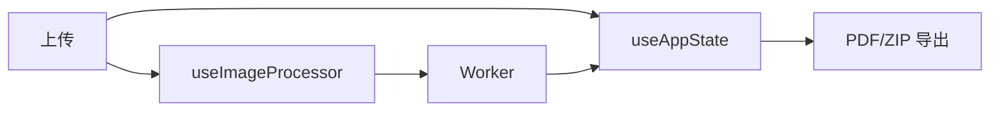

# 长截图分割器 · 架构分析报告（v2.1 standard multi-agent）

## 项目全景

浏览器端长截图切割与导出工具（React + TypeScript + Vite）。本轮证据目录 `测试证据/v2.1/standard-multiagent`，在同一目标 commit 上以 **parallelism: active** 并行三个分析子代理后由主 agent 融合。

parse_rate 仍约 **48.2%**：主链结论来自可解析 hooks/utils；大量 components 为 Unsupported Area。

## 使用场景与架构问题

用户本地上传长图 → 按高度切片 → 预览多选 → 导出 PDF/ZIP，且尽量不卡 UI。

## 核心设计哲学

- 状态集中（`useAppState`）+ 计算外置（module Worker）
- 按 index 写入抗异步乱序
- 导出算法与控件分离

## 核心流程

入口与主链证据：`src/main.tsx:5` → `src/hooks/useAppState.ts:122` → `src/hooks/useImageProcessor.ts:19` → `src/hooks/useWorker.ts:23` → `src/utils/pdfExporter.ts:37`。

## 模块协作

跨模块关系：`src/App.tsx:22` 使用 shared-components 展示件；`src/hooks/useImageProcessor.ts:19` 依赖 `src/hooks/useWorker.ts:23`；导出 `src/utils/pdfExporter.ts:37` / `src/utils/zipExporter.ts:34` 只消费选中切片；`src/config/seo/configLoader.ts:25` 服务元数据。

| 模块 | 角色 | 子代理来源 |
|---|---|---|
| src 状态/切图 | core | subagent-src-state |
| src 上传/导出 | core | subagent-src-export |
| config/shared/tools/scripts | secondary | subagent-secondary |

## 核心模块 src 深度

### 状态与切图（subagent-src-state）

reducer 管理 imageSlices/blobs/worker；`ADD_IMAGE_SLICE` 按 index 写入；cleanup revoke URL 并 terminate worker。`processImage` 先清理再 startProcessing。

### 导出与上传（subagent-src-export）

PDF/ZIP 均 filter+sort 选中 index；空选择失败。FileUploader 校验后回调，ExportControls 只收集选项。

### 次要模块（subagent-secondary）

shared-components / config / tools 支撑展示与工程，不持有切割会话。

## 设计权衡

为什么 Worker：保 UI 流畅。为什么不持久化 blob：避免 storage 爆。替代方案主线程 canvas 更简单但易卡顿。

## 风险、限制与 Unsupported Area

风险见 Matrix（乱序、资源泄漏、空导出）。  
限制：parse_rate 低；refs 大量 partial。  

### Unsupported Area 声明（core 未解析文件）

本轮 units 未解析的 core 文件不得当作已验证细节：
- unsupported area: src/App.tsx
- unsupported area: src/components/DebugInfoControl.tsx
- unsupported area: src/components/DebugPanel.tsx
- unsupported area: src/components/EnhancedHelmetProvider.tsx
- unsupported area: src/components/EnhancedSEOManager.tsx
- unsupported area: src/components/ExportControls.tsx
- unsupported area: src/components/FileUploader.tsx
- unsupported area: src/components/I18nTestPanel.tsx
- unsupported area: src/components/ImagePreview.tsx
- unsupported area: src/components/ImagePreviewWrapper.tsx
- unsupported area: src/components/LanguageSwitcher.tsx
- unsupported area: src/components/LazyImage.tsx
- unsupported area: src/components/Navigation.tsx
- unsupported area: src/components/PerformanceOptimizer.tsx
- unsupported area: src/components/ResponsiveContainer.tsx
- unsupported area: src/components/SEOManager.tsx
- unsupported area: src/components/ScreenshotSplitter.tsx
- unsupported area: src/components/StructuredDataProvider.tsx
- unsupported area: src/components/TextDisplayConfig.tsx
- unsupported area: src/components/ViewportDebugger.tsx
- unsupported area: src/components/examples/EnhancedSEOExample.tsx
- unsupported area: src/components/mobile/Footer.tsx
- unsupported area: src/components/mobile/TouchImageSlicer.tsx
- unsupported area: src/components/mobile/TouchNav.tsx
- unsupported area: src/components/responsive/index.ts
- unsupported area: src/components/seo/EnhancedSEOManager.tsx
- unsupported area: src/components/seo/HeadingHierarchy.tsx
- unsupported area: src/components/seo/HeadingStructure.tsx
- unsupported area: src/components/seo/SEOIntegration.tsx
- unsupported area: src/components/seo/StructuredDataProvider.tsx
- unsupported area: src/config/seo.config.ts
- unsupported area: src/context/SEOContext.tsx
- unsupported area: src/hooks/useI18nContext.tsx
- unsupported area: src/hooks/useSEOConfig.tsx
- unsupported area: src/hooks/useSEOI18n.tsx
- unsupported area: src/hooks/useSEOOptimization.ts
- unsupported area: src/main.tsx
- unsupported area: src/test-setup.ts
- unsupported area: src/types/cssmodule.d.ts
- unsupported area: src/utils/config-helper.ts
- unsupported area: src/utils/i18nTestCoverage.ts
- unsupported area: src/utils/navigationState.ts
- unsupported area: src/utils/seo/metadataGenerator.ts
- unsupported area: src/utils/styleMapping.ts
- unsupported area: src/vite-env.d.ts

## 批判性评价

主路径清晰；组件与 SEO/调试面偏重；工具解析率拖累外部分析。

## 具体改进建议

1. Worker 消息加会话世代号，丢弃 cleanup 后迟到 chunk（证据 `src/hooks/useAppState.ts:90` 生命周期）  
2. 统一 App 与 ScreenshotSplitter 编排入口  
3. 提高 TS 解析覆盖，降低 Unsupported  
4. UI 层统一校验 selectedSlices 后再调用 exporter（`src/utils/pdfExporter.ts:63`）  
5. 继续保持 multi-agent 产物可追溯（本轮已提供 subagent-artifacts/*）

## 并行执行摘要

- parallelism: **active**
- 并行子代理：subagent-src-state / subagent-src-export / subagent-secondary（同 wave 并发进程，exit 0）
- 产物：`subagent-artifacts/*.json` + `main-agent-fusion.json`
- 融合：主 agent 按 unit_id 合并，冲突优先 state → export → secondary，再补 coverage 预算残余
- 子代理耗时 ms：state=5, export=6, secondary=5

## 开放问题

组件层未解析细节；Worker 算法极值；与 v2.1 串行 degraded 轮对比见 COMPARISON。
