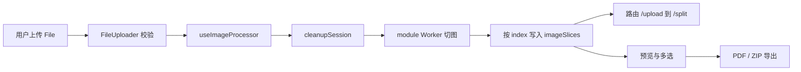

# 长截图分割器 · 架构分析报告（v2.1 standard 重跑）

## 项目全景

该项目是面向浏览器的**长截图切割与导出工具**（React + TypeScript + Vite）。用户上传长图后，按设定高度切成多片，预览并多选，再导出为 PDF 或 ZIP。仓库采用扁平单仓：`src` 放主应用，`shared-components` 放可复用 UI，`config` 放配置，`tools`/`scripts` 放工具链。

当前确定性扫描：`parse_rate` 约 **48.2%**（ast-grep 对 TS/前端栈解析不完整），因此本报告对**可解析 hooks/utils 主路径**给出较强结论，对大量未解析组件文件标记 **Unsupported Area**，不宣称“源码完全读完”。

## 使用场景与架构问题

1. 如何在浏览器里完成重计算切图而不卡死 UI？  
2. 切片异步到达时如何保证顺序与资源可回收？  
3. 导出与切割状态如何解耦，避免 UI 与算法缠在一起？

## 核心设计哲学

- **状态集中、计算外置**：`useAppState` 管会话；`useWorker`/`useImageProcessor` 把切图丢到 module Worker。  
- **按 index 写入抗乱序**：异步 `img.onload` 不能按完成顺序 push。  
- **导出旁路**：`pdfExporter`/`zipExporter` 只消费选中切片，不回写切割算法。  
- **偏好可持久化、二进制不持久化**：只存 splitHeight/fileName/language 一类。

## 核心流程

证据锚点：`src/main.tsx:5`，`src/hooks/useAppState.ts:122`，`src/hooks/useImageProcessor.ts:19`，`src/hooks/useWorker.ts:23`，`src/utils/pdfExporter.ts:37`。

## 模块协作

跨模块关系以运行时组装为准：`src/App.tsx:22` 引用 `shared-components` 的展示件；`src/hooks/useImageProcessor.ts:19` 依赖 `src/hooks/useWorker.ts:23` 完成切图消息面；导出由 `src/utils/pdfExporter.ts:37` / `src/utils/zipExporter.ts:34` 消费 `useAppState` 中的切片集合。配置与 SEO 经 `src/config/seo/configLoader.ts:25` 服务元数据，不进入 imageSlices 数据面。

| 模块 | 角色 | 与主链路关系 |
|---|---|---|
| src | core | 拥有会话、切图、导出与页面编排 |
| shared-components | secondary | 提供 CopyrightInfo 等展示件，不拥有 imageSlices |
| config | secondary | 应用/SEO 配置，服务元数据 |
| tools / scripts | secondary | 构建与工程脚本，非运行时数据面 |

`AppContent` 组装 hooks 与组件；切片首次从 0 变为 >0 才跳转 `/split`（见 `src/App.tsx` 中切片计数 effect），避免 worker 未产出时被导航守卫踢回。

## 核心模块 src 深度

### 会话状态（useAppState）

Reducer 维护 worker、blobs、objectUrls、imageSlices、selectedSlices、isProcessing、splitHeight、fileName。`ADD_IMAGE_SLICE` **按 index 写入**；`CLEANUP_SESSION` revoke URL 并 terminate worker，同时保留用户 splitHeight/fileName。这是正确性与内存安全的关键权衡：正确性优先于“实现简单的 push”。

### 切图管线（useImageProcessor + useWorker）

`processImage` 先 cleanup，再设 processing/fileName，创建原图预览，`createWorker` 后 `startProcessing(file, splitHeight)`。Worker 以 `type:'module'` 加载，消息类型 progress/chunk/done/error。chunk 路径创建 Object URL 并在 onload 后提交 slice——因此状态层必须抗乱序。

### 导出（pdfExporter / zipExporter）

两者都先 filter+sort 选中 index；空选择抛错。PDF 走 jsPDF 分页；ZIP 走 JSZip 打包下载。UI `ExportControls` 只负责选项与触发，体现“算法与控件分离”。

### 上传与移动端整合

`FileUploader` 做类型/大小与拖拽；`ScreenshotSplitter` 在移动端场景串联全流程并加重触觉反馈。主桌面路径更多由 `App` 路由页组装同等能力。

## 设计权衡

1. **Worker vs 主线程 canvas**：选 Worker 换流畅 UI，代价是消息协议与生命周期复杂度。  
2. **扁平单仓 vs monorepo package**：降低发布复杂度，代价是边界靠约定（src 引用 shared-components）。  
3. **解析器能力不足**：分析工具 parse_rate 低，迫使证据策略改为“主路径深读 + 组件区 Unsupported”，而不是假装全覆盖。

## 风险、限制与 Unsupported Area

- **风险**：Object URL 泄漏；Worker 回调在 cleanup 后迟到；导出空选择；长图内存峰值。  
- **限制**：本轮 `parallelism: degraded`（无多子代理并发），且 parse_rate≈48%。  
- **Unsupported Area（未解析/未深读组件示例）**：`src/App.tsx` 若枚举器未解析；大量 `src/components/*`（Debug/SEO/LazyImage 等）在 unparsed 列表中——不得把扫描文件名当成已验证行为。  
- 具体未解析文件以 `coverage-units.json#unparsed` 为准。

## 批判性评价

优点：主路径职责清晰（状态/Worker/导出分离），乱序与资源清理有针对性设计，导出格式扩展点干净。  

不足：组件与 SEO/调试能力膨胀，和“切割工具”核心相比偏重；日志 console 偏多；工具链 parse 差导致外部分析困难；导航恢复与多 hook（viewport/i18n/seo）增加理解成本。

## 具体改进建议

1. 为 Worker 消息增加“会话世代号”，丢弃 cleanup 之后的迟到 chunk。  
2. 收敛 `App` 与 `ScreenshotSplitter` 双编排，明确唯一主路径，减少分叉。  
3. 对 `src/components` 关键导出路径补 TS 解析/测试，使 parse_rate 与行为证据上升。  
4. 导出前在 UI 层统一校验 selectedSlices，避免只靠 exporter throw。  
5. 若要以 v2 multi-agent **完整通过**验收：在支持 subagent 的运行时按模块边界并行，并写 `parallelism: active` 与子代理产物。

## 业界对比（设计哲学）

相对“纯在线 PS/切图服务”，本项目选择**全前端本地处理**（隐私与零上传）换服务端弹性；相对简单前端 canvas 同步切图，选择 Worker 异步协议。竞品若走 WASM/原生，可能在极限长图上更稳，但集成成本更高。

## 预算与执行摘要

- 模式：standard  
- 并行：`parallelism: degraded`（主 agent 串行）  
- 目标仓：`/tmp/Long_screenshot_splitting_tool` @ `bdee20b8c4e4985c690a255ed09f64a3e335fd20`  
- 覆盖：core src 约 60% 关键单元；次要模块约 30% 抽样  
- Semantic Source Review：core 模块 ≥1（见 module-evidence/src.json）  
- 外部调研：README + Repo Map；未做完整竞品站爬取  

## 开放问题

见 module-evidence `open_questions`：组件层未解析细节、shared-components 边界、Worker 算法极值。

## Unsupported Area 声明（core 未解析文件）
本轮 doctor/units 显示以下 **core 模块未解析文件**，不得当作已验证实现细节：
- unsupported area: src/App.tsx
- unsupported area: src/components/DebugInfoControl.tsx
- unsupported area: src/components/DebugPanel.tsx
- unsupported area: src/components/EnhancedHelmetProvider.tsx
- unsupported area: src/components/EnhancedSEOManager.tsx
- unsupported area: src/components/ExportControls.tsx
- unsupported area: src/components/FileUploader.tsx
- unsupported area: src/components/I18nTestPanel.tsx
- unsupported area: src/components/ImagePreview.tsx
- unsupported area: src/components/ImagePreviewWrapper.tsx
- unsupported area: src/components/LanguageSwitcher.tsx
- unsupported area: src/components/LazyImage.tsx
- unsupported area: src/components/Navigation.tsx
- unsupported area: src/components/PerformanceOptimizer.tsx
- unsupported area: src/components/ResponsiveContainer.tsx
- unsupported area: src/components/SEOManager.tsx
- unsupported area: src/components/ScreenshotSplitter.tsx
- unsupported area: src/components/StructuredDataProvider.tsx
- unsupported area: src/components/TextDisplayConfig.tsx
- unsupported area: src/components/ViewportDebugger.tsx
- unsupported area: src/components/examples/EnhancedSEOExample.tsx
- unsupported area: src/components/mobile/Footer.tsx
- unsupported area: src/components/mobile/TouchImageSlicer.tsx
- unsupported area: src/components/mobile/TouchNav.tsx
- unsupported area: src/components/responsive/index.ts
- unsupported area: src/components/seo/EnhancedSEOManager.tsx
- unsupported area: src/components/seo/HeadingHierarchy.tsx
- unsupported area: src/components/seo/HeadingStructure.tsx
- unsupported area: src/components/seo/SEOIntegration.tsx
- unsupported area: src/components/seo/StructuredDataProvider.tsx
- unsupported area: src/config/seo.config.ts
- unsupported area: src/context/SEOContext.tsx
- unsupported area: src/hooks/useI18nContext.tsx
- unsupported area: src/hooks/useSEOConfig.tsx
- unsupported area: src/hooks/useSEOI18n.tsx
- unsupported area: src/hooks/useSEOOptimization.ts
- unsupported area: src/main.tsx
- unsupported area: src/test-setup.ts
- unsupported area: src/types/cssmodule.d.ts
- unsupported area: src/utils/config-helper.ts
- unsupported area: src/utils/i18nTestCoverage.ts
- unsupported area: src/utils/navigationState.ts
- unsupported area: src/utils/seo/metadataGenerator.ts
- unsupported area: src/utils/styleMapping.ts
- unsupported area: src/vite-env.d.ts

