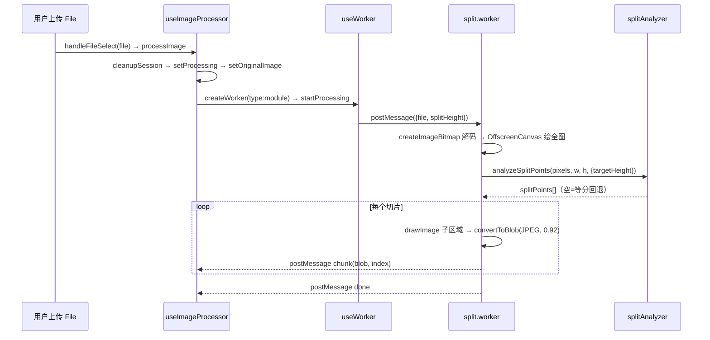
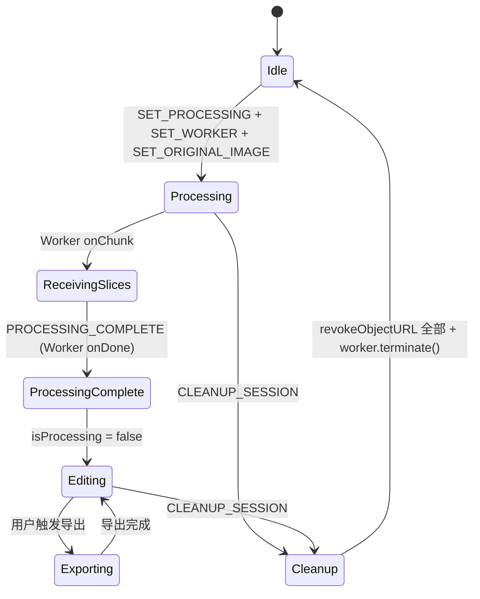

# 长截图分割器架构分析报告

> 仓库：yuanyuanyuan/Long_screenshot_splitting_tool | 分析模式：标准分析 | 日期：2026-07-09
> v1.1 Evidence Anchor First 验收运行

## 项目全景

长截图分割器是一个纯前端 React 19 + TypeScript + Vite SPA。用户上传长截图 → Web Worker 在后台按高度切片 → 预览/选择 → 导出 PDF 或 ZIP。全部计算在浏览器内完成（OffscreenCanvas + createImageBitmap），零后端、零服务端依赖。

项目采用**扁平化单仓库架构**，核心设计哲学是「自造而非引第三方」：路由自己写（非 React Router）、状态管理用 useReducer（非 Redux/Zustand）、i18n 自己实现（非 i18next）。唯一引入的运行时第三方库是 jsPDF 和 JSZip——两者都是纯工具函数，不涉及状态或路由。

> ⚠️ `docs/ARCHITECTURE.md` 是理想化文档，与真实代码多处不符（称 React 18 实为 19、提 Redux/微服务均为规划而非现状）。本报告**以源码为准**，所有关键判断均附源码锚点。

---

## 一、路由系统：自定义 hash 路由与状态守卫

路由是用户进入应用的导航骨架。项目自建了 hash 路由（`src/hooks/useRouter.ts:1-3`），而非引入 React Router——理由是零依赖哲学、GitHub Pages 兼容（hash 路由不需要服务端回退，`src/router/index.ts:67`）、以及流程控制需求强于路由匹配需求。

### 三层结构

路由系统由三层构成：
- **运行时层**（`src/hooks/useRouter.ts`，54 行）：监听 `hashchange` 事件（`:23`），提取 `window.location.hash.slice(1)` 作为当前路径（`:24`），通过 `setState` 驱动重渲染。
- **配置层**（`src/router/index.ts`，178 行）：定义 `RouteConfig`、`matchRoute` 等工具集，4 条路由的 `component` 均指向占位组件 `AppPlaceholder`（`:71-107`）——实际页面渲染由 `App.tsx` 的 `switch(currentPath)` 控制（`src/App.tsx:285-286`）。
- **分发层**（`src/App.tsx:286-531`）：switch 语句内嵌状态守卫，不满足前置条件时渲染降级 UI 而非白屏。

### 两个精妙设计

**延迟自动导航**（`src/App.tsx:124-135`）：不在上传回调中立即跳转 `/split`，而是用 `useRef` 记录上一次切片数量，在 `useEffect` 中检测 `imageSlices` 从 0→>0 的变化再跳。注释明确解释了原因（`App.tsx:122-124`）：此时 Worker 尚未产出切片，`/split` 的状态守卫会判定 `MISSING_SLICES` 踢回上传页。

**分级状态恢复**（`src/utils/navigationErrorHandler.ts:235-282`）：页面刷新时不是粗暴踢回首页，而是根据缺失条件分级处理——缺图片→`/upload`，缺切片→`/split`，状态损坏→清空回首页。

### 已知问题

路由守卫逻辑在 `App.tsx:307` 和 `navigationErrorHandler.ts:60-81` 各有一份独立实现，条件判断不完全同步，修改时需要两端同步。`router/index.ts` 的配置系统（含 `matchRoute`、`RouterEvent`）在运行时未被使用，是一种「声明式配置 + 命令式分发」的混合。

---

## 二、切割流水线：从文件到切片的完整数据流

这是整个项目的心脏。流水线采用**四层分离架构**，每一层职责清晰：

```
useImageProcessor（协调层）→ useWorker（传输层）→ split.worker（I/O 层）→ splitAnalyzer（算法层）
```

### 数据流



### 三个关键设计决策

**1. Web Worker + OffscreenCanvas 而非主线程 canvas**（`split.worker.js:87-100`）：长截图解码和像素遍历耗时可达数百毫秒，主线程执行会冻结 UI。`OffscreenCanvas` 是 Worker 线程可用的 canvas API，配合 `createImageBitmap` 实现全链路后台计算。Worker 创建使用 `type: 'module'`（`useWorker.ts:42-43`），因为 Worker 内通过 ESM import 引入 splitAnalyzer。

**2. splitAnalyzer 为纯 TS 函数而非 Worker 内嵌代码**（`splitAnalyzer.ts:1-14`）：算法与 I/O 完全分离——splitAnalyzer 是纯函数组，零 DOM/canvas/Worker 依赖，可独立单测。Worker 仅做胶水（decode → getImageData → 调用分析器 → drawImage → blob）。这种分离确保算法迭代时无需启动 Worker，Worker 重构时算法不受影响。

**3. 内容感知切割 + 安全回退**（`split.worker.js:116-129`、`splitAnalyzer.ts:191`）：先尝试内容感知（水平投影方差找空白带作为切割点），分析失败或无合格空白带则回退固定等分。catch 块（`split.worker.js:125-129`）明确注释「绝不因分析失败而中断或劣化」。算法还有多层保护：防碎页（`splitAnalyzer.ts:222-225`）、末页合并（`:230-232`）、图片过短不切（`:199-201`）。

### Worker 消息契约 v1.1

四类消息（progress/chunk/done/error）定义在 `src/types/index.ts:44-50`。分段进度含义（0-25 解码 / 25-30 分析 / 30-95 切片 / 100 完成）让 UI 展示阶段文案而非干巴巴的百分比。切片逐个 postMessage chunk（`split.worker.js:176-180`），主线程即刻可预览——渐进式交付。

### 已知问题

`useImageProcessor.ts:125` 的 `setTimeout(200)` 是脆弱的时序补偿——Worker 创建到就绪应事件驱动而非硬等。`split.worker.js:112` 全图 `getImageData` 对超大图（>4000px）内存压力大，注释标注为未来优化项但未实施。

---

## 三、状态管理：useReducer 全局编排

状态管理是切割流水线和导出系统之间的桥梁。项目选了 `useReducer` 而非 Redux/Zustand/Context——9 个字段（`src/types/index.ts:11-28`）、13 种 action（`:30-42`）的规模完全在 useReducer 的舒适区。引入 Redux 是过度设计，Context 分发会导致不必要的重新渲染（子组件已通过 props 接收状态）。

### 核心状态与生命周期



### 资源 RAII 式管理

`CLEANUP_SESSION`（`src/hooks/useAppState.ts:89-112`）将三个资源释放动作捆绑为单一 action：`revokeObjectURL` 释放所有 Object URL + `worker.terminate()` 终止 Worker 线程 + 重置运行时状态。每个释放操作都有 try-catch 保护，一个失败不影响其他。调用方（新会话开始时 `useImageProcessor.ts:97`、导航错误恢复时 `App.tsx:166`）只需 dispatch 一个 action，无需了解需要清理哪些资源。

### 乱序修复与文档矛盾

CLAUDE.md 标注「当前按异步到达顺序追加，潜在乱序」（`CLAUDE.md:114`），但源码中 `ADD_IMAGE_SLICE` 已使用 `newImageSlices[action.payload.index] = action.payload`（`useAppState.ts:51`），注释明确标注「修复 img.onload 回调导致的切片乱序（spec §5）」（`:49`）。推测 CLAUDE.md 的注释写于修复之前。

但按 index 赋值会产生稀疏数组——如果某些 index 永远不到达（Worker 异常中断只产出部分切片），`SELECT_ALL_SLICES` 中的 `map(slice => slice.index)` 会在 empty 元素上抛出 TypeError（`useAppState.ts:73`）。这是一个未处理的边界情况。

---

## 四、导出系统：从切片到文件

导出系统是数据流的终点。两个导出器（`pdfExporter.ts` + `zipExporter.ts`）结构对称——都是 class 持配置 + 便捷函数用默认配置的双层 API。

### 过滤排序

两个导出器内部执行相同的预处理（`pdfExporter.ts:59-61`、`zipExporter.ts:51-53`）：`imageSlices.filter(slice => selectedIndices.has(slice.index)).sort((a, b) => a.index - b.index)`。按 index 排序保证最终文件中切片按原图从上到下排列，不受 Worker 异步到达顺序干扰。

### 三层防御

选中为空的拦截存在三道防线：App 层 `handleExport` 中 `selectedSlices.size === 0` → alert + return；ExportControls 层 `canExport` 按钮灰化 + `handleExport` return（`ExportControls.tsx:83,129`）；导出器层 throw Error（`pdfExporter.ts:63`、`zipExporter.ts:55`）。导出器不知道谁在调用它，必须自保；App 层知道全流程，可以做更好的用户引导。

### 已知问题

`ExportControls.tsx:10-16` 重复声明了 `ImageSlice` 接口（应从 types/index.ts import）。ExportControls 和 App 层各自维护 `isExporting` 状态，存在双重管理风险。

---

## 五、次要模块速览

| 模块 | 职责 | 实现方式 | 特别之处 |
|------|------|---------|---------|
| **国际化** | 多语言翻译，`t(key, params)` | 自定义 Hook + 动态 import 加载 + Context 暴露（`useI18n.ts:67-94`） | 三层语言检测优先级（localStorage→navigator→默认）；自实现 `{param}` 插值非 i18next 语法 |
| **SEO 子系统** | 元数据/OG/Twitter Card/JSON-LD | 双 Manager 并存 + react-helmet-async 注入（`SEOManager.tsx:364`、`EnhancedSEOManager.tsx:144`） | **过度工程**：双 Manager 功能重叠、9 个 SEO 工具文件、硬编码评分数据（`structuredDataGenerator.ts:62-65`） |
| **共享组件库** | 可复用 UI + 通信基础设施 | 接口驱动设计（`ComponentInterface.ts:62-195`） | **微内核式抽象**远超工具实际需求；通信处理函数多为空壳 console.log（`ComponentCommunicationManager.ts:260-279`） |
| **配置与部署** | 统一配置入口 + GitHub Pages CI/CD | 5 层配置聚合（`config/index.ts:77-110`）+ Actions 双 Job | CI 路径感知测试设计合理；但 deploy.yml 步骤容错（`\|\| echo`）可能放过质量门禁 |

---

## 六、整体评价与启发

### 设计哲学

项目贯穿「自造而非引第三方」的哲学——路由、状态、i18n、SEO 全自己实现。这在 4 个页面的工具 SPA 场景下是合理的：自建 hash 路由仅 54 行，自建 i18n 仅一个 Hook，都处于「自建成本 < 引入成本」的甜区。

### 核心亮点

1. **算法与 I/O 分离**——splitAnalyzer 纯 TS 可单测，Worker 纯胶水，边界清晰（`splitAnalyzer.ts:1-14`、`split.worker.js:12`）。这是整个项目最值得学习的设计决策。
2. **安全回退双轨**——内容感知分析失败绝不中断或劣化，回退等分（`split.worker.js:125-129`）。
3. **渐进式交付**——切片逐个 postMessage，用户即刻可预览（`split.worker.js:176-180`）。
4. **资源 RAII 式管理**——CLEANUP_SESSION 捆绑 Object URL 释放 + Worker 终止，单一入口保证完备性（`useAppState.ts:89-112`）。

### 主要问题

1. **过度工程**：SEO 子系统（18+ 文件、双 Manager 并存）和 shared-components（微内核架构但空壳）远超工具实际需求。这是项目最大的设计失衡。
2. **时序补偿**：`setTimeout(200)` 等待 Worker 就绪是脆弱设计，应事件驱动（`useImageProcessor.ts:125`）。
3. **稀疏数组风险**：按 index 写入产生的 empty 元素在 `SELECT_ALL_SLICES` 时可能抛异常（`useAppState.ts:73`）。
4. **文档与代码不同步**：CLAUDE.md 标注的乱序问题已在源码修复（`useAppState.ts:51`），docs/ARCHITECTURE.md 多处与真实代码不符。

### 如果重新设计

- 用事件驱动替代 setTimeout 200ms：Worker 就绪后发 handshake 消息，主线程收到再发 file。
- 用 `Map<number, ImageSlice>` 替代稀疏数组，避免 empty 陷阱。
- 砍掉 SEO 子系统和 shared-components 的过度工程，回归工具本质——一个长截图分割器不需要微内核组件架构。
- 用 Transferable 传像素数据减少 Worker 通信拷贝开销。

---

*本报告所有核心结论均附源码锚点（文件:行号）。无锚点的内容已标注为假设、观察或开放问题。*
