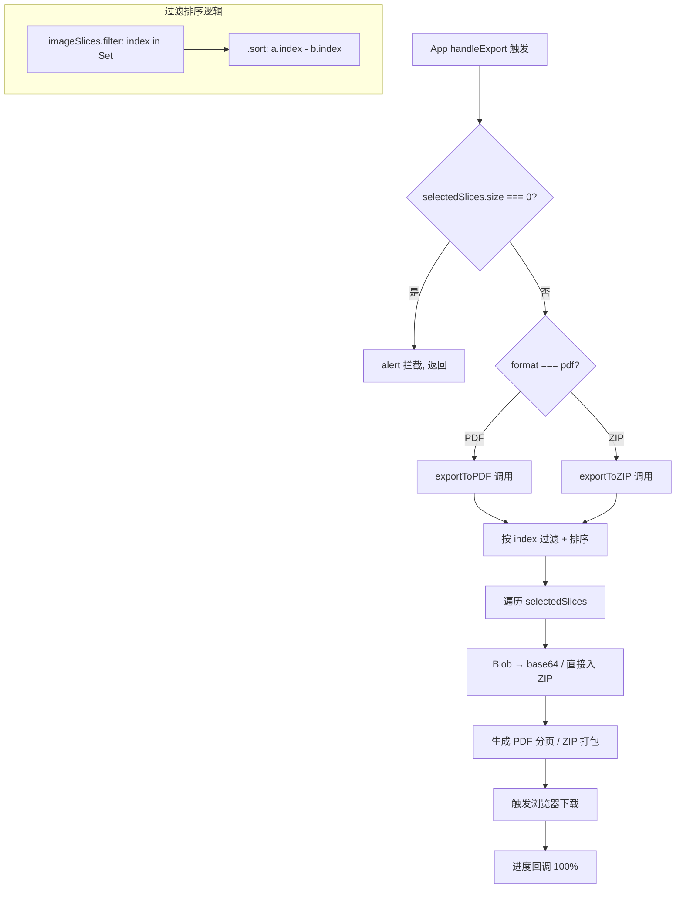

# 导出系统模块分析

上一模块讲了 useReducer 如何编排 imageSlices 与 selectedSlices——当这两个集合就绪后，数据流的终点就是导出系统：把选中的切片变成用户可下载的 PDF 或 ZIP 文件。

## 1. 在项目中的角色

导出系统是整个数据流的终点站。切割流水线产出 imageSlices，用户交互选定 selectedSlices，导出系统接收两者并生成最终产物。去掉它，前面的上传、切割、选择全部变成「看了没用」——用户无法拿到任何可保存的文件，整个工具失去核心价值。`src/utils/pdfExporter.ts` 和 `src/utils/zipExporter.ts` 是纯生成逻辑，`src/components/ExportControls.tsx` 是导出系统的 UI 入口。

## 2. 解决什么问题

业务背景：长截图被切割后，用户需要两种形态的输出——合成为一份 PDF（连续翻页阅读）或打散为独立图片打包下载 ZIP（按需取用）。没有导出系统，切片只能停留在浏览器内存，关页面即丢失。导出系统把内存中的 Blob 数据转化为浏览器可触发的文件下载，完成从「数据」到「资产」的跨越。

## 3. 设计思路

**方案**：jsPDF + JSzip 两个独立导出器，各自封装为 class + 便捷函数，UI 组件 ExportControls 统一调度。

**核心理由**：
- 纯前端零后端——jsPDF 和 JSZip 都是纯 JS 库，在浏览器内完成 PDF 合成和 ZIP 打包，无需服务器参与，完全契合项目哲学。
- 两个导出器结构对称——都采用「class 持配置 + 便捷函数用默认配置」的双层 API，降低使用门槛的同时保留高级定制能力。

**放弃的替代方案**：
- 后端渲染 PDF/ZIP——违背纯前端哲学，增加部署成本和隐私风险（用户截图上传到服务器）。
- Canvas 直接拼合导单图——无法满足「多切片多页」的 PDF 需求和「逐片独立」的 ZIP 需求。
- 单一导出器统一 PDF 和 ZIP——两者生成逻辑差异大（PDF 需页面尺寸计算、分页；ZIP 需文件命名、压缩级别），强行合并会导致抽象层过厚。

**核心设计模式**：Strategy 模式隐式体现——App.tsx 中 handleExport 根据 format 参数选择调用 exportToPDF 或 exportToZIP（`src/App.tsx`：format === 'pdf' 调 pdfExporter，format === 'zip' 调 zipExporter），但这个选择逻辑在 App 层而非导出器内部，保持了导出器的单一职责。

## 4. 核心数据结构

```typescript
// src/types/index.ts:17-22 — 切片的统一数据模型
interface ImageSlice {
  blob: Blob;      // 切片的图片二进制数据
  url: string;     // Blob 的 ObjectURL（展示用）
  index: number;   // 切片在原图中的序号（0 起）
  width: number;   // 原始像素宽
  height: number;  // 原始像素高
}

// src/utils/pdfExporter.ts:7-20 — PDF 导出配置
interface PDFExportOptions {
  orientation?: 'portrait' | 'landscape';
  format?: 'a4' | 'a3' | 'letter';
  quality?: number;       // 0-1
  margin?: number;        // mm
  autoResize?: boolean;
  imagesPerPage?: number;
}

// src/utils/zipExporter.ts:7-18 — ZIP 导出配置
interface ZIPExportOptions {
  compressionLevel?: number;     // 0-9
  fileNameFormat?: 'index' | 'sequence' | 'custom';
  fileNamePrefix?: string;
  imageFormat?: 'original' | 'jpeg' | 'png';
  jpegQuality?: number;
}
```

关键设计点：两个导出器接收的选中集合都是 `Set<number>`（`pdfExporter.ts:53`、`zipExporter.ts:46`），而非 `number[]`。Set 保证了去重，与 useReducer 中 selectedSlices 的类型一致。

## 5. 核心业务流程



**链路解读**：

1. **App 层拦截**：`App.tsx:handleExport` 先检查 `state.selectedSlices.size === 0`，为空则 alert 并 return——这是第一道防线（`src/App.tsx`）。

2. **格式分发**：根据 format 参数，分别调用 `exportToPDF` 或 `exportToZIP`（`src/App.tsx`），传入 `state.imageSlices`（全量切片）和 `state.selectedSlices`（选中索引集合）。

3. **过滤排序**：两个导出器内部执行完全相同的预处理（`pdfExporter.ts:59-61`、`zipExporter.ts:51-53`）：
   - `imageSlices.filter(slice => selectedIndices.has(slice.index))` — 按 index 过滤出选中切片
   - `.sort((a, b) => a.index - b.index)` — 按 index 升序排列

4. **文件生成**：PDF 路径逐片将 Blob 转 base64（`pdfExporter.ts:98`），计算尺寸后 addImage；ZIP 路径逐片直接将 Blob/处理后的 Blob 入 zip.file（`zipExporter.ts:67`）。

5. **浏览器下载**：PDF 用 jsPDF 的 `pdf.save()` 触发（`pdfExporter.ts:132`）；ZIP 用自建 `downloadBlob` 通过 `<a>` 标签 click 触发（`zipExporter.ts:188-202`）。

## 6. 与其他模块的设计协同

**依赖**：
- useAppState（上一模块）提供 `imageSlices` 和 `selectedSlices`——导出器不自己维护切片数据，纯消费。App.tsx 把 `state.imageSlices` 和 `Array.from(state.selectedSlices)` 传给 ExportControls（`src/App.tsx`）。
- ExportControls 的 props 中 selectedSlices 是 `number[]`（`ExportControls.tsx:19`），而导出器接收的是 `Set<number>`（`pdfExporter.ts:53`）。这个类型转换在 App 层完成——ExportControls 用数组便于 UI 渲染长度，导出器用 Set 便于 has 查询。

**协作方式**：
- ExportControls 通过 `onExport` 回调把格式和选项上报给 App（`ExportControls.tsx:88`），App 再调用导出器——导出 UI 和导出逻辑解耦。
- 导出器内部的进度回调 `onProgress` 通过 App 层的 debugLog 输出（`src/App.tsx`），导出器不直接操控 UI 状态。

**共享状态**：`isExporting` 状态在 App 层用 useState 管理（`src/App.tsx:setIsExporting`），传给 ExportControls 的 disabled prop——导出进行中按钮灰化，防止重复触发。

**【待主 agent 验证】**：ExportControls 内部也维护了 `isExporting`（`ExportControls.tsx:56`），与 App 层的 `isExporting` 可能存在双重管理——这是否是冗余需要验证。

## 7. 关键设计决策

### 为什么用 jsPDF + JSZip

- jsPDF 是浏览器端生成 PDF 的主流库，无需后端，API 直观（addImage + save 即可），支持分页和尺寸控制。替代方案如 pdf-lib 更偏底层，对本项目「图片进 PDF 出」的简单场景收益不大。
- JSZip 同理，浏览器端 ZIP 生成的事实标准，支持 DEFLATE 压缩和异步生成。两个库都是纯 JS、零服务端依赖，与项目哲学完全对齐。

### 按 index 过滤排序而非异步到达顺序

切割流水线（Web Worker）可能异步产出切片，到达顺序不一定等于原图顺序。导出器用 `filter + sort(a.index - b.index)` 保证最终文件中切片按原图从上到下排列（`pdfExporter.ts:59-61`、`zipExporter.ts:51-53`）。如果按到达顺序排，用户可能拿到顺序混乱的 PDF 或 ZIP。

### 选中为空时 App 层拦截而非导出层

选中为空的拦截存在三道防线：
1. **App 层**：`handleExport` 中 `state.selectedSlices.size === 0` → alert + return（`src/App.tsx`）
2. **ExportControls 层**：`canExport` 计算中 `selectedSlices.length > 0` 按钮灰化（`ExportControls.tsx:129`），`handleExport` 中 `selectedSlices.length === 0` 直接 return（`ExportControls.tsx:83`）
3. **导出器层**：`selectedSlices.length === 0` throw Error（`pdfExporter.ts:63`、`zipExporter.ts:55`）

设计考量：App 层拦截是主防线，因为它拥有全局状态和路由控制权，可以引导用户回到选择步骤。导出器层的 throw 是兜底——即使上层漏了，导出器也不会在空数据下生成空 PDF/ZIP（那将是用户困惑的产物）。三层防御并非冗余，而是不同抽象级的自我保护：导出器不知道谁在调用它，必须自保；App 层知道全流程，可以做更好的用户引导。

## 8. Deep Research 洞察

**替代方案代价**：
- 用 pdf-lib 替 jsPDF——pdf-lib 支持更精细的 PDF 操作（修改已有 PDF、嵌入字体），但本项目只需「图片进新 PDF 出」，jsPDF 的 addImage 足够。pdf-lib 更重、API 更复杂，收益不对等。
- 用 canvas + pdfmake 替 jsPDF——pdfmake 侧重文档排版（表格、列表），对「纯图片 PDF」场景反而更绕。
- 用 File API + Stream 替 JSZip——手动拼接 ZIP 格式在理论可行但工程代价极高（ZIP 格式头、目录、CRC32 校验），JSZip 已处理这些细节。

**业界对比**：浏览器端导出方案中，jsPDF + JSZip 组合是「图片切片工具」类项目的标配。Canva、Figma 的导出也走浏览器端 jsPDF 路径（更复杂场景）；简单切片工具几乎都选这对组合。

**如果重新设计**：
- ExportControls 内部重复定义了 ImageSlice 接口（`ExportControls.tsx:10-16`），应从 types/index.ts import 而非重复声明——当前这是 DRY 违规。
- ExportControls 和 App 层各自维护 isExporting——可能造成状态不一致，建议统一到 App 层。
- 进度回调的语义两路不对称：PDF 是 0→100 线性（`pdfExporter.ts:121`），ZIP 是 0→80（打包阶段）→85→95→100（压缩阶段分三步）（`zipExporter.ts:70-99`），用户体验上 ZIP 的进度更真实但差异未被 UI 层感知。

## 9. 扩展点

- **新增导出格式**：导出器是独立 class，新增（如 PNG 序列、WebP 包）只需新建 exporter 文件 + App 层 handleExport 加一个分支 + ExportControls 加一个 radio option。现有结构天然支持。
- **导出配置持久化**：PDFExporter/ZIPOExporter 的 updateOptions + getOptions（`pdfExporter.ts:186-195`、`zipExporter.ts:204-210`）暴露了配置读写接口，为 localStorage 持久化用户偏好预留了入口。
- **批量导出**：现有结构支持同时导出 PDF 和 ZIP（只需调用两次），但 UI 未提供这个选项——ExportControls 是单选格式。

## 10. 亮点与问题

**亮点**：
- 导出器与 UI 完全解耦——纯 class + 纯函数，可独立测试，不依赖 React。
- 按 index 排序保证了输出顺序与原图一致，不受异步到达干扰。
- 三层防御（App → ExportControls → 导出器）各层自保，健壮性好。
- ZIP 进度分阶段汇报（80/85/95/100），比单一线性进度更真实。

**问题**：
- ExportControls 重复声明 ImageSlice（`ExportControls.tsx:10-16`），违反 DRY。
- ExportControls 和 App 层各自维护 isExporting（`ExportControls.tsx:56` vs `src/App.tsx`），存在状态冗余风险。
- ExportControls 的 handleExport 中 `slices: selectedSlices.map(index => slices[index])`（`ExportControls.tsx:91`）直接用索引取数组元素，如果 selectedSlices 包含越界索引会 undefined——导出器内部已有自己的 filter+sort 逻辑，这里的预筛选实际上被导出器忽略（导出器重新从 imageSlices 过滤），存在逻辑冗余。
- PDF 路径中 `i === 0` 分支为空操作（`pdfExporter.ts:92-94`），无实际逻辑但占据了注释和代码行，可能是早期「跳过 addPage」意图的残留。

**涉及文件**：
- `src/utils/pdfExporter.ts`（216 行）
- `src/utils/zipExporter.ts`（225 行）
- `src/components/ExportControls.tsx`（387 行）
- `src/App.tsx`（handleExport 部分）
- `src/utils/navigationState.ts`（导出步骤可达性判断）
- `src/types/index.ts`（ImageSlice 定义）

---

至此，从上传到切割到选择到导出，数据流完成闭环——用户的截图在浏览器内存中走完了从像素到文件的完整旅程，全程零后端参与。

---

### 源码锚点清单（自检）

| 结论 | 锚点位置 | 锚点类型 |
|------|----------|----------|
| 导出器按 index 过滤排序 | `pdfExporter.ts:59-61`、`zipExporter.ts:51-53` | 代码逻辑 |
| 选中为空三层防御 | `App.tsx:handleExport`、`ExportControls.tsx:83,129`、`pdfExporter.ts:63`、`zipExporter.ts:55` | 代码逻辑 |
| App 层根据 format 分发 | `src/App.tsx:handleExport` | 代码逻辑 |
| ExportControls 重复声明 ImageSlice | `ExportControls.tsx:10-16` | 接口定义 |
| 导出器接收 Set<number> | `pdfExporter.ts:53`、`zipExporter.ts:46` | 参数类型 |
| ZIP 进度分阶段 | `zipExporter.ts:70-99` | 代码逻辑 |
| isExporting 双重维护 | `ExportControls.tsx:56`、`src/App.tsx:setIsExporting` | 状态管理 |
| 导出配置可更新接口 | `pdfExporter.ts:186-195`、`zipExporter.ts:204-210` | API 设计 |
| PDF 空 i===0 分支 | `pdfExporter.ts:92-94` | 代码逻辑 |
