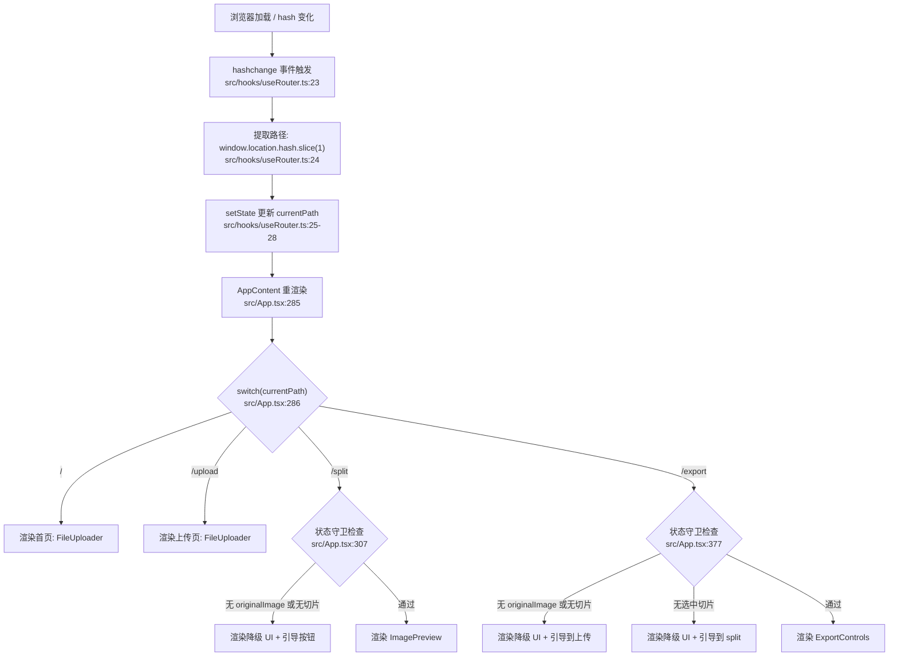
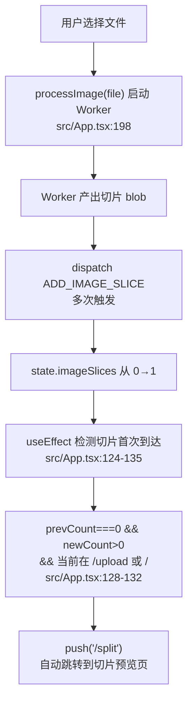
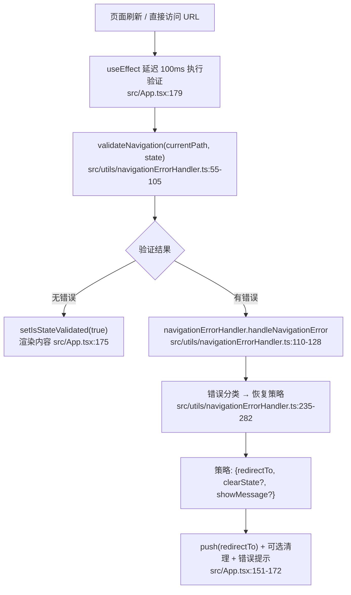

# 06 路由系统

> 路由系统是报告的第一个核心模块。它定义了用户进入应用后在 `/` → `/upload` → `/split` → `/export` 四个页面间导航的全部规则，并为下一个模块「切割流水线」设定入口条件——用户何时进入上传和切片流程完全由路由的状态守卫决定。

---

## 1. 在项目中的角色

路由系统是 SPA 的导航骨架。它承载三个职责：

- **入口分发**：根据 URL hash 决定渲染哪个页面；
- **流程守卫**：拒绝不具备前置条件时访问下游页面（如无切片时禁止进入 `/export`）；
- **自动流转**：在上传完成后自动从 `/upload` 推到 `/split`，减少用户手动导航。

如果去掉这个模块，系统退化为单页应用——用户无法通过 URL 进入特定页面，无法使用浏览器前进/后退，也无法保证多页面间的操作顺序。

---

## 2. 解决什么问题

长截图分割是一个线性业务流：上传 → 切片预览 → 选中 → 导出。没有路由，所有步骤堆在同一页面上，用户无法通过 URL 分享中间状态、无法用浏览器后退撤销操作、页面刷新后会丢失当前步骤。

路由模块让每个步骤拥有独立 URL（`#/upload`、`#/split`、`#/export`），同时通过状态守卫确保用户不会跳到无法正确渲染的页面（如直接访问 `#/export` 但没有上传图片）。

---

## 3. 设计思路

### 方案：自定义 hash 路由 + 状态守卫

项目选择了自建路由而非引入 React Router，理由有三：

1. **零依赖哲学**：项目定位是纯前端工具，不引入第三方库 `src/hooks/useRouter.ts:1-3`；
2. **GitHub Pages 兼容**：hash 路由不需要服务端配置回退 `src/router/index.ts:67`；
3. **流程控制强于路由匹配**：核心需求不是通用的路由匹配，而是按业务状态控制页面可访问性，自定义实现更轻。

### 放弃的替代方案

- **React Router v6**：引入了一个 ~12KB gzipped 的依赖，且其嵌套路由和 loader 机制对于四个页面的线性流程属于过度设计；
- **History API (pushState)**：需要服务端配合处理 `index.html` 回退，在 GitHub Pages 上部署会增加复杂度 `src/router/index.ts:62-67`；
- **纯状态驱动（无 URL）**：失去浏览器导航能力，无法分享链接，刷新丢状态。

### 核心设计模式

**状态守卫模式**：页面渲染前检查 `AppState` 前置条件，不满足则渲染降级 UI 而非白屏或报错 `src/App.tsx:307-348`。

**观察者驱动自动导航**：不直接在文件上传回调中跳转，而是用 `useRef` + `useEffect` 监听切片数组从 0 变为 >0 再跳转 `src/App.tsx:124-135`。

---

## 4. 核心数据结构

路由运行时的核心类型定义在 `src/hooks/useRouter.ts:8-12`：

```typescript
interface SimpleRouterState {
  currentPath: string;   // 当前 hash 路径，默认 "/"
  params: Record<string, string>;   // 预留，实际始终为 {}
  query: Record<string, string>;    // 预留，实际始终为 {}
}
```

路由配置类型定义在 `src/router/index.ts:8-18`：

```typescript
interface RouteConfig {
  path: string;
  name: string;
  component: React.ComponentType;
  meta?: { title?: string; description?: string; requiresAuth?: boolean; keepAlive?: boolean };
}
```

配置中 4 条路由的 `component` 均指向 `AppPlaceholder`（一个返回 `<div>Loading...</div>` 的占位组件），实际页面渲染由 `App.tsx` 中的 `switch(currentPath)` 控制 `src/router/index.ts:71-107`。这说明 `router/index.ts` 中的 `RouteConfig` 更多承担文档角色——描述有哪些路由及其元数据——而非运行时渲染调度。

导航错误类型 `src/utils/navigationErrorHandler.ts:9-16`：

```typescript
enum NavigationErrorType {
  MISSING_IMAGE, MISSING_SLICES, INVALID_STATE,
  PROCESSING_ERROR, NAVIGATION_FAILED, STATE_CORRUPTION,
}
```

---

## 5. 核心业务流程

### 5.1 路由匹配与页面渲染



**解读**：路由分发是全同步的 switch 语句（`src/App.tsx:286-531`）。每个分支内嵌状态守卫——不是独立的中间件，而是语义上等同于"只有满足条件才能渲染完整页面"，不满足时渲染降级 UI（带引导按钮），从不用 `push` 强制跳转（避免了重定向循环风险）。

### 5.2 上传完成自动导航



**关键设计**：注释明确解释了为什么不在 `handleFileSelect` 中直接 `push('/split')`——此时 Worker 尚未产出切片，`/split` 的状态守卫会因 `imageSlices` 为空判定 `MISSING_SLICES` 并渲染降级 UI（`src/App.tsx:122-124`）。用 `useRef` 记录上一次切片数量，在 `useEffect` 中检测 0→>0 的变化，是延迟异步回调的惯用技巧。

### 5.3 页面刷新状态恢复



**解读**：这是路由模块最精妙的设计之一。页面加载时，用户可能直接访问 `#/split` 但没有上下文状态。系统不是粗暴地全部踢回首页，而是根据缺失的条件分情况处理：缺图片→去 `/upload`，缺切片→分场景去 `/upload` 或 `/split`，状态损坏→清空状态回首页。`src/utils/navigationErrorHandler.ts:235-282` 的 `determineRecoveryStrategy` 是恢复决策的集中地。

---

## 6. 与其他模块的设计协同

### 依赖关系

```
useRouter (hash 监听)
  ↓ 提供 currentPath
App.tsx (switch 分发 + 状态守卫)
  ↓ 依赖
useAppState (全局状态) → 检查 originalImage/imageSlices/selectedSlices
  ↓ 间接依赖
useImageProcessor (Worker 切片) → 产出 imageSlices，触发自动导航
  ↑ 使用
Navigation 组件 → 调用 push() 触发导航
  ↑ 使用
useNavigationState → 根据 AppState 计算导航项禁用状态
navigationErrorHandler → 恢复策略中调用 push()
```

### 关键协作

- **与 AppState 的协作**：路由的每一个状态守卫（`src/App.tsx:307, 377`）都直接读取 `state.originalImage`、`state.imageSlices.length`、`state.selectedSlices.size`。这是紧耦合——不是通过事件总线或中间件解耦，而是直接在 switch 分支中内联检查。优点是逻辑一目了然，缺点是路由模块必须"知道"业务状态的字段名。【待主 agent 验证：若后续增加页面，状态守卫逻辑会进一步膨胀，可能需要抽离为独立的守卫注册机制】
- **与切割流水线的协作**：上传完成自动跳转的 `useEffect`（`src/App.tsx:124-135`）是路由与切割流程的唯一桥梁——它监听 `imageSlices` 的变化，这是流水线的输出。延迟跳转的设计确保了流水线完成后路由才推进。【待主 agent 验证：如果流水线失败（Worker 报错），当前设计会静默停留在当前页，没有失败后的降级路由处理】
- **Navigation 组件的协作**：`useNavigationState`（`src/hooks/useNavigationState.ts:105-134`）根据 `AppState` 动态计算每个导航按钮的 `disabled` 状态——处理中时禁用所有导航，无图片时禁用 `/split`，无选中时禁用 `/export`。这确保了 UI 导航按钮与路由守卫的逻辑一致性。

---

## 7. 关键设计决策

### 决策 1：hash 路由而非 History API

**理由**：项目有 `singlefile` 和 `spa` 两种构建模式。`spa` 模式部署到 GitHub Pages，需要 hash 路由避免 404（`src/router/index.ts:62-67`）。`singlefile` 模式（单文件构建）使用 history 模式。通过编译时常量 `__BUILD_MODE__` 在构建时切换。

**代价**：hash 路由使 URL 不美观（`/#/upload` vs `/upload`），且 SEO 友好度低。但项目本身是工具类 SPA，无需 SEO 爬取，该代价可忽略。

### 决策 2：内联状态守卫而非路由中间件

**理由**：在 switch 分支内直接检查 `state.originalImage`、`state.imageSlices.length` 等条件，代码位于紧邻渲染逻辑的位置，读者无需跳转到独立中间件文件即能理解"这个页面需要什么条件才能正常渲染"。【待主 agent 验证：但 `/split` 的守卫检查在 `src/App.tsx:307` 和 `src/utils/navigationErrorHandler.ts:60-81` 各有一份独立实现，存在重复逻辑风险】

**代价**：守卫逻辑与 UI 渲染耦合在同一个 switch 块中。如果有 10 个页面都需守卫，App.tsx 会膨胀到不可维护。对于当前 4 个页面的规模，这是可接受的取舍。

### 决策 3：router/index.ts 配置系统与运行时路由的分离

`src/router/index.ts` 定义了 `RouteConfig`、`RouterConfig`、`matchRoute` 等完整工具集，但运行时路由（`src/hooks/useRouter.ts`）完全没有使用它们。配置中的 `component` 字段全部指向 `AppPlaceholder` 占位符，实际渲染在 `App.tsx:285-531` 的 switch 语句中完成。是一种"声明式配置 + 命令式分发"的混合：配置提供文档价值（声明有哪些路由及元数据），switch 提供运行时价值（实际分发和守卫）。

**代价**：两套机制并存可能让新开发者困惑——修改路由时到底改配置还是改 switch？当前惯例是：加路由在 switch 中加分支，加元数据在配置中加条目。这条规则没有文档化，依赖团队隐式知识。【待主 agent 验证】

---

## 8. Deep Research 洞察

### 替代方案的代价

如果引入 React Router v6：
- 优点：声明式路由配置、嵌套路由支持、`loader` 数据预加载、`useParams`/`useSearchParams` 等便利 hooks；
- 代价：+12KB 包体积、学习曲线、route guard 需要用 `loader`/`action` 或自定义组件封装，复杂度上升；
- 对本项目而言：4 个页面 + 线性流程 + 状态守卫耦合 AppState，React Router 的优势无法发挥，反而引入不必要的抽象。

### 业界对比

| 维度 | 本项目 | React Router | Next.js App Router |
|------|--------|--------------|-------------------|
| 体积 | ~100 行代码 | ~12KB gzip | 全栈框架 |
| 匹配策略 | 精确 switch | 路径模式匹配 | 文件系统路由 |
| 状态守卫 | 内联 if 检查 | loader/route guard | middleware + layout |
| 服务端支持 | 无 | 需配置 | 内置 |
| 适用场景 | <10 页的工具 SPA | 中型 SPA | 大型全栈应用 |

本项目的方案处于"极简"一端，在 4 个页面的规模下是最优选择。如果页面数增长到 10+，可能需要引入 `matchRoute`（`src/router/index.ts:111-136`）实现更灵活的路径匹配，取代当前的 switch 枚举。

### 如果重新设计

- 将状态守卫从 switch 分支中抽离为独立的守卫函数数组，每个守卫返回 `{ pass: boolean, fallback: JSX.Element }`，让路由分发更扁平；
- 利用 `router/index.ts` 中已有的 `matchRoute` 和 `parseParams` 工具，实现运行时路由匹配层，将 switch 改为配置驱动的渲染循环；
- 统一两组错误处理：`src/App.tsx:307-348` 的 inline 检查和 `src/utils/navigationErrorHandler.ts:55-105` 的 validate 函数存在重复逻辑，应合并。

---

## 9. 扩展点

- **添加新页面**：在 `DEFAULT_NAVIGATION_ITEMS`（`src/hooks/useNavigationState.ts:43-48`）和 `routerConfig.routes`（`src/router/index.ts:70-107`）中添加条目，在 `switch(currentPath)`（`src/App.tsx:286`）中添加分支，在 `navigationErrorHandler`（`src/utils/navigationErrorHandler.ts:55-105`）中添加对应的验证逻辑；
- **参数化路由**：`matchRoute` 已支持 `:param` 语法（`src/router/index.ts:120-133`），当前未使用。如果需要支持 `/split/:imageId` 这类参数路由，可直接启用；
- **路由事件系统**：`src/router/index.ts:37-46` 定义了 `RouterEvent` 和 `RouterEventType`（`beforeRouteChange`/`afterRouteChange`/`routeError`），当前未被任何代码订阅。可用于未来的分析埋点或导航确认弹窗。

---

## 10. 亮点与问题

### 亮点

1. **延迟自动导航**：不在上传回调中立即跳转，而是等 Worker 产出切片后再跳转（`src/App.tsx:124-135`），避免了"路由先到但数据未到"的竞态条件；
2. **分级状态恢复**：页面刷新时不粗暴地踢回首页，而是根据缺失条件分级处理恢复策略（`src/utils/navigationErrorHandler.ts:235-282`）；
3. **降级 UI 而非报错**：状态守卫不满足时，渲染引导按钮而非白屏或错误页面（`src/App.tsx:308-348`），用户始终知道下一步该做什么；
4. **导航按钮与路由守卫逻辑一致**：`useNavigationState` 的 disabled 计算（`src/hooks/useNavigationState.ts:113-126`）与 App.tsx 的 switch 守卫使用了相同的前置条件判断，确保 UI 可点性与页面可访问性严格一致。

### 问题

1. **路由守卫逻辑重复**：`src/App.tsx:307` 和 `src/utils/navigationErrorHandler.ts:60-81` 各自实现了一套状态检查，条件判断不完全同步——App.tsx 检查 `!state.originalImage || state.imageSlices.length === 0`，而 `validateNavigationState` 对 `/split` 做了 `MISSING_IMAGE` 和 `MISSING_SLICES` 两级区分。修改时需要两端同步，容易遗漏；
2. **router/index.ts 的配置未被运行时使用**：`RouteConfig.component` 始终为 `AppPlaceholder`，`routerConfig.mode` 的 hash/history 切换逻辑在 `useRouter.ts` 中并未引用——所有页面渲染都走 `App.tsx` 的 switch；
3. **跨模块耦合紧**：`App.tsx` 直接导入并调用 `validateNavigation`（来自 `navigationErrorHandler`），同时内联了几乎同样的检查逻辑。路由模块与状态管理模块之间没有明确的接口边界。

### 涉及文件列表

| 文件 | 行数 | 角色 |
|------|------|------|
| `src/hooks/useRouter.ts` | 54 | 运行时 hash 路由 hook |
| `src/router/index.ts` | 178 | 路由配置、匹配工具、类型定义 |
| `src/App.tsx` | 745 | 路由分发（switch）、状态守卫、自动导航 |
| `src/components/Navigation.tsx` | 484 | 导航 UI 组件，使用 push() 触发路由 |
| `src/hooks/useNavigationState.ts` | 472 | 导航项状态计算（disabled/active/completed） |
| `src/utils/navigationErrorHandler.ts` | 303 | 导航错误分类与恢复策略 |
| `src/types/index.ts` | 131 | AppState、NavigationItem 等共享类型 |

---

*下一个模块将分析切割流水线——路由的状态守卫决定了用户何时进入 `/split` 页面，而切割流水线负责在此之前完成长截图的切片计算。*

---

### 源码锚点清单

| 结论 | 锚点位置 | 锚点类型 |
|------|----------|----------|
| 项目自建 hash 路由而非引入 React Router | `src/hooks/useRouter.ts:1-3` | 代码注释 |
| hash 路由兼容 GitHub Pages | `src/router/index.ts:67` | 代码注释 |
| singlefile 模式使用 history 模式 | `src/router/index.ts:62-67` | 代码逻辑 |
| 路由由 hashchange 事件驱动 | `src/hooks/useRouter.ts:23-33` | 代码逻辑 |
| push 通过 window.location.hash 实现 | `src/hooks/useRouter.ts:36-38` | 代码逻辑 |
| 4 条路由的 component 均为 AppPlaceholder | `src/router/index.ts:71-107` | 代码逻辑 |
| 实际页面分发由 switch(currentPath) 控制 | `src/App.tsx:285-286` | 代码逻辑 |
| /split 状态守卫检查 originalImage 和 imageSlices | `src/App.tsx:307` | 代码逻辑 |
| /export 状态守卫三级检查 | `src/App.tsx:377,405` | 代码逻辑 |
| 上传完成自动跳转监听切片首次到达 | `src/App.tsx:124-135` | 代码逻辑 |
| 为何不在 handleFileSelect 中直接跳转 | `src/App.tsx:122-124` | 代码注释 |
| 页面刷新状态恢复延迟 100ms 执行 | `src/App.tsx:179` | 代码逻辑 |
| validateNavigation 集中了状态验证逻辑 | `src/utils/navigationErrorHandler.ts:55-105` | 代码逻辑 |
| 错误恢复策略集中决策 | `src/utils/navigationErrorHandler.ts:235-282` | 代码逻辑 |
| useNavigationState 动态计算导航按钮 disabled | `src/hooks/useNavigationState.ts:105-134` | 代码逻辑 |
| matchRoute 支持 `:param` 语法但未使用 | `src/router/index.ts:120-133` | 代码逻辑 |
| RouterEvent 类型定义但未被订阅 | `src/router/index.ts:37-46` | 代码逻辑 |
| Default 分支渲染首页（含 FileUploader + ImagePreview + ExportControls 三合一） | `src/App.tsx:459-531` | 代码逻辑 |
